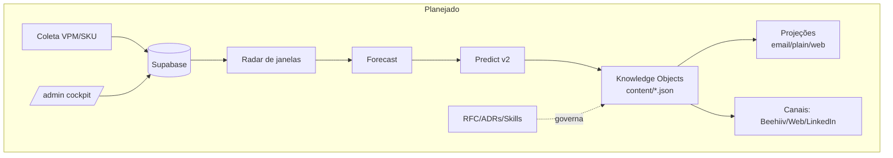
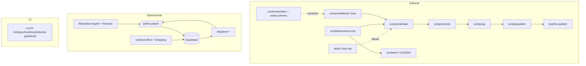
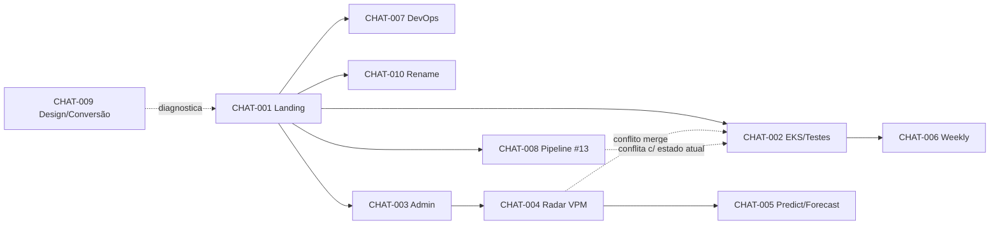

# Project Intelligence Report

> Auditoria integral, forense e baseada em evidências do projeto **The Loyal / The Loyalty**.
> Modo **análise** (read-only): nenhum código foi alterado, nenhum commit/push/deploy executado.
> Gerado a partir de: código-fonte atual em disco, histórico Git, artefatos de PR, documentação do repo e o transcript **da sessão atual** (única com transcript acessível).

---

## Sumário navegável

- [0. Metadados da auditoria](#0-metadados-da-auditoria)
- [1. Veredito executivo](#1-veredito-executivo)
- [2. Resumo geral](#2-resumo-geral)
- [3. Inventário de fontes e cobertura](#3-inventário-de-fontes-e-cobertura)
- [4. Linha do tempo consolidada](#4-linha-do-tempo-consolidada)
- [5. Arquitetura planejada](#5-arquitetura-planejada)
- [6. Arquitetura implementada](#6-arquitetura-implementada)
- [7. Diferenças planejado × implementado](#7-diferenças-entre-arquitetura-planejada-e-implementada)
- [8. Inventário de componentes](#8-inventário-de-componentes)
- [9. Mapa individual dos chats](#9-mapa-individual-dos-chats)
- [10. Dependências e relações entre chats](#10-dependências-e-relações-entre-chats)
- [11. Matriz de decisões](#11-matriz-de-decisões)
- [12. Matriz de requisitos e rastreabilidade](#12-matriz-de-requisitos-e-rastreabilidade)
- [13. Auditoria de código e lógica](#13-auditoria-de-código-e-lógica)
- [14. Auditoria de testes e validações](#14-auditoria-de-testes-e-validações)
- [15. Contradições, redundâncias e sobreposições](#15-contradições-redundâncias-e-sobreposições)
- [16. Pendências consolidadas](#16-pendências-consolidadas)
- [17. Dívida técnica](#17-dívida-técnica)
- [18. Riscos e bloqueios](#18-riscos-e-bloqueios)
- [19. Decisões em aberto](#19-decisões-em-aberto)
- [20. Ciclos abertos](#20-ciclos-abertos)
- [21. Backlog priorizado](#21-backlog-priorizado)
- [22. Plano de fechamento de ciclos](#22-plano-de-fechamento-de-ciclos)
- [23. Itens que podem ser encerrados](#23-itens-que-podem-ser-encerrados)
- [24. Itens que precisam ser refeitos](#24-itens-que-precisam-ser-refeitos)
- [25. Itens que devem ser descartados](#25-itens-que-devem-ser-descartados)
- [26. Itens que exigem decisão humana](#26-itens-que-exigem-decisão-humana)
- [27. Itens que exigem validação técnica](#27-itens-que-exigem-validação-técnica)
- [28. Próximas ações recomendadas](#28-próximas-ações-recomendadas)
- [29. Respostas finais](#29-respostas-finais)
- [30. Apêndice de evidências](#30-apêndice-de-evidências)

---

## 0. Metadados da auditoria

| Campo | Valor |
|---|---|
| Data da auditoria | 2026-07-15 |
| Diretório analisado | `/home/user/theloyal` |
| Branch atual (checkout) | `claude/loyalty-architectural-authority-66sjuc` |
| Commit HEAD | `21985fe` (fix ci npm test) |
| Alterações locais não commitadas | **Nenhuma** (`git status` limpo, 0 arquivos) `[EVID-01, Nível A]` |
| Branch default do repo | `claude/loyalty-landing-page-v1-7vbjq7` (não é `main`) |
| Período do projeto | 2026-07-08 → 2026-07-15 (≈ 1 semana intensa) |
| Stack | Next.js 14.2.15 (App Router) · React 18.3 · TypeScript 5.5 strict · Tailwind 3.4 · Node 24 (CI) / 22 (local) · Supabase (Postgres/REST) |
| Dependências de runtime | **3** (`next`, `react`, `react-dom`) — pipeline editorial é ESM Node puro, zero-dep |
| Integrações externas | Beehiiv, Supabase, Tavily, OpenRouter/Ollama (LLM), Vercel |

**Fontes disponíveis:** código-fonte (262 arquivos versionados), histórico Git completo (2026-07-08→15), 4 workflows CI, 6 migrações SQL, 2 RFCs, 4 docs de produto/render, 3 skills, `.env.example`, transcript **da sessão atual**.

**Fontes ausentes (críticas):** transcripts das **~11 outras sessões** de trabalho (só existem como trailers `Claude-Session` em commits e descrições de PR). Ver [§3](#3-inventário-de-fontes-e-cobertura).

**Limitações:**
1. **Cobertura de chats ≈ 8%** (1 de 12 com transcript real). Os demais foram reconstruídos por evidência indireta (Git/PR) — Nível C/D.
2. Auditoria de código **profunda** no pipeline editorial (scripts/renderer/content); **superficial** no painel `/admin` (20 rotas) e no motor `lib/predict-engine.ts` — inspeção estrutural, sem line-by-line completo. Registrado como limitação, não como cobertura total.
3. Runtime de produção (Vercel, Supabase real, Beehiiv) **não** foi acessado — nada de dado vivo. Conclusões sobre "produção" são inferência a partir de config.

**Cobertura:** documental/código **alta**; chats **baixa**; execução em produção **nula (não acessível com segurança)**.

---

## 1. Veredito executivo

**Estado geral:** o projeto é uma **mídia editorial vertical de loyalty** (newsletter "The Loyal/The Loyalty") que cresceu, em uma semana, de uma landing page para uma **plataforma editorial + operacional** com: pipeline de renderização (e-mail/web/plain), motor de VPM/Radar com coleta em Supabase, motor de previsão/predict, painel administrativo `/admin` com ~11 telas, e um sistema de conhecimento fundador (RFC-001 EKS). O núcleo editorial é **maduro e agora testado**; a periferia operacional é **ampla, recente e pouco validada**.

**Conclusão global estimada: 62%–72%. Confiança: média.**
Justificativa: o fluxo editorial principal (JSON → validate → render → qa → build) está **implementado, integrado e agora com validação automatizada** (Nível A). A camada operacional (admin, coleta, predict) está **implementada mas majoritariamente não validada** (Nível B) e depende de infraestrutura externa (Supabase) cujo comportamento real não é verificável aqui. Pesos usados: fluxo editorial 40%, produtos (daily/weekly/pro) 20%, operação/admin 20%, conhecimento/governança 10%, aquisição/conversão 10%. Ver [§18 do cálculo](#etapa-10-cálculo-de-conclusão-embutida).

**Principais entregas reais (Nível A/B):**
1. Pipeline editorial canônico `scripts/*` + `content/edition.schema.json` — 7 validações passam (`[EVID-02]`).
2. Suíte de testes (35 testes, node:test) blindando cálculo e taxonomia — **novo nesta semana** (`[EVID-03]`).
3. CI completo (lint/typecheck/test/editorial-gate/build) em 4 workflows.
4. Painel `/admin` com ~11 telas e Supabase.
5. RFC-001 (EKS) e RFC-009 (predict) escritos e mergeados.

**Principais lacunas / bloqueios / riscos:**
- **RISK-001 (P0):** `components/SubscribeForm.tsx` é **mock** (`setTimeout`, não chama `/api/subscribe`). O caminho de captura de lead está **desconectado** — risco de descartar inscrições em silêncio se a produção usar este componente. `[EVID-04, Nível A]`
- **DEBT-001 (P1):** **dois pipelines de render coexistem** (`renderer/*` legado + `scripts/*` canônico) — divergência D-2/D-3 do RFC-001. Parcialmente mitigada (taxonomia unificada), não eliminada.
- **RISK-002 (P1):** **migrações SQL com número duplicado** (`0001_*` ×2, `0002_*` ×2) — ordem de aplicação ambígua.
- **CONFLICT / CYCLE (P1):** **PR #13** (remove o `renderer/*` legado) está **`dirty` (conflitos)** e com base em `main` — frente de consolidação aberta e conflitante com o estado atual.
- **DEC em aberto:** ADRs 001–010 do RFC-001 seguem `Proposed` (não ratificados).

**Próximas 5 ações:** (1) conectar o SubscribeForm à rota `/api/subscribe` [TASK-001]; (2) renumerar migrações duplicadas [TASK-002]; (3) decidir o destino do PR #13 / consolidação de pipelines [DEC-open]; (4) ratificar ou rejeitar os ADRs 001–010; (5) validar em ambiente real o fluxo Supabase→admin→coletor.

**O que NÃO iniciar agora:** nova feature de produto (Lab/Special), RFC-002 (serialização), ou remoção do `renderer/*` **antes** de resolver o SubscribeForm (P0) e a numeração de migrações (P1).

**Prontidão:** o projeto está pronto para **continuar e testar**, mas **precisa estabilizar** dois pontos (captura de lead + migrações) antes de qualquer publicação/deploy que dependa deles. O núcleo editorial já está apto a publicar edições.

---

## 2. Resumo geral

### O que o projeto é
"The Loyal" (grafia de marca padronizada no commit `7897b94`/#21; "The Loyalty" no domínio de negócio) é uma **mídia editorial independente sobre loyalty** (pontos, milhas, cartões, cashback). O produto central é **julgamento auditável**: cada oportunidade recebe uma "conta feita" (CPM/VPM/spread), um **TL Score** (0–100, 8 critérios ponderados) e um **Verdict** (Vale agir … Evitaria … Não confirmado), sempre com fonte e vigência. A imagem é substituída por data-art e por um mascote ("Ponto"). Regras de marca invioláveis vivem em `CLAUDE.md`.

### Como evoluiu (linha do tempo macro)
`08/07` landing v1 → `09/07` DevOps/CI + RFC-001 EKS (#11,#17) → `11/07` primeira rota `/admin` (#22) → `13–14/07` explosão operacional: cockpit v2, Radar VPM/shopping, forecast, predict-engine v2 (RFC-009), weekly digest (#23–#38) → `15/07` implementação das Fases 1–3 do EKS (testes, taxonomia única, entities/lineage) + merges #41/#40/#39.

### Como está estruturado
Monólito Next.js App Router com três camadas: **(a) editorial** (`content/` = fonte de verdade JSON; `scripts/*` = validação/render/qa/publish ESM; `renderer/*` = pipeline legado paralelo); **(b) operacional** (`app/admin/*` painel + `lib/admin-*` + Supabase + coletores `scripts/collect|shopping`); **(c) conhecimento/governança** (`docs/rfc/*`, `.claude/skills/*`, `CLAUDE.md`).

### O que existe / o que não existe
Existe: daily, pro, weekly (schemas + exemplos), landing, admin, coleta VPM, forecast, predict, CI, testes. **Não** existe (mencionado mas não implementado): produtos **Lab** e **Special** (citados no AAP/RFC-001, sem código); captura de lead **real** no componente de UI (só a rota existe); RFC-002..005 da cadeia AAP.

### Onde estão os maiores problemas
Captura de lead mockada (P0), duplicação de pipeline e de migração (P1), grande superfície operacional recém-criada e não testada (predict/coleta), e ~11 chats sem transcript (risco de conhecimento tribal perdido).

### O que precisa acontecer em seguida
Estabilizar P0/P1, decidir a consolidação de pipeline (#13), validar a camada operacional em ambiente real e ratificar as decisões de arquitetura pendentes.

*(As subseções detalhadas — timeline, arquitetura, componentes, pendências, dívida, decisões, riscos — estão nas seções [§4](#4-linha-do-tempo-consolidada) a [§20](#20-ciclos-abertos).)*

---

## 3. Inventário de fontes e cobertura

### 3.1 Fontes de código/documentação (disponíveis, Nível A/B)
| DOC/Fonte | Local | Uso na auditoria |
|---|---|---|
| DOC-01 `CLAUDE.md` | raiz | Regras de marca invioláveis, tokens, vocabulário |
| DOC-02 `COWORK.md` | raiz | Contrato do Research Editor (fluxo diário) |
| DOC-03 `COPY-LANDING.md` / `README.md` | raiz | Copy e visão geral |
| DOC-04 `docs/rfc/RFC-001-EKS...md` | docs/rfc | Sistema de conhecimento fundador |
| DOC-05 `docs/architecture/rfc/RFC-009-predict-engine-v2.md` | docs/architecture/rfc | Motor histórico/preditivo |
| DOC-06 `docs/{GO-LIVE,RADAR-VPM,RENDER-SYSTEM,SHOPPING-VPM}.md` | docs | Operação e render |
| DOC-07 `content/*.schema.json` | content | Contratos: edition, pro-report, weekly, forecast, entity |
| DOC-08 `renderer/{README,QA-SYSTEM,QA-CHECKLIST}.md` | renderer | Pipeline legado |
| DOC-09 `.env.example` | raiz | Integrações e variáveis (sem valores reais) |
| DOC-10 Git history | `.git` | 60+ commits datados, trailers de sessão |

### 3.2 Fontes ausentes (FONTE_MENCIONADA_MAS_INACESSÍVEL)
Onze sessões de trabalho foram identificadas por trailer `Claude-Session`/`session_...` em commits, mas **seus transcripts não estão acessíveis**. Para cada uma: onde apareceu = commit trailers/PR; relevância = contêm o contexto, os planos e as decisões originais; o que fica prejudicado = ETAPA 2 (auditoria de contexto/decisão por chat) fica em Nível C/D; o que é preciso fornecer = export dos transcripts das sessões.

| Sessão (trailer) | Commits c/ trailer | Front inferido (Nível D) |
|---|---|---|
| `01RQSkX1z25XrpaUKyV3MBnE` | 18 | Shopping-VPM/Radar (maior volume) |
| `013eLKTw5Ka9TLfEjGoQ5BEJ` | 16 | Predict/Forecast (RFC-009) |
| `01TMSsrQBSFrqo7BDVasEBTW` | 7 | Admin cockpit v2 |
| `01ESZNuRkDSSaAAYc1kXFcBX` | 7 | Admin/digests (#40) |
| `01JVF6DVaQs2rp5JUDVcd7o9` | 6 | **Esta sessão** — EKS + Fases 1–3 (transcript disponível) |
| `01H8o3C4xRrvCE3HzD87WyNU` | 4 | Landing/DevOps |
| `01AqFCx692BKnaTBWYpaEExw` | 3 | Consolidação pipeline + pauta (#13) |
| `015UmJPUrjEtdDFLZvz4k45Z` | 2 | Base landing |
| `01QqNG5wAaN7MuSCidT2zorN` | 1 | pontual |
| `01Na8AmywA8gox4nEMAn9VKi` | 1 | pontual |
| `01JKxxYtLxQqEiRitNKNRMx4` | 1 | pontual |
| `014n5e3ELXKY1C1z4Cx2iKLc` | 1 | pontual |

### 3.3 Tabela de cobertura (chats)
| ID | Nome original (branch/PR) | Nome canônico | Fonte | Período | Disponibilidade | Cobertura | Temas | Dependências |
|---|---|---|---|---|---|---|---|---|
| CHAT-001 | landing-page-v1 | Landing. Página v1. Base | Git/#14,#15 | 08–09/07 | Só evidência | Parcial (D) | landing, marca | — |
| CHAT-002 | loyalty-architectural-authority-66sjuc | Conhecimento. RFC-001 EKS + Fases 1–3. **Sessão atual** | Transcript+Git/#17,#41 | 09,15/07 | **Total** | **Integral (A)** | EKS, testes, taxonomia | CHAT-001 |
| CHAT-003 | feat/admin-route + loyal-admin-control | Admin. Cockpit de observabilidade v1→v2 | Git/#22,#23,#40 | 11–15/07 | Só evidência | Parcial (C) | admin, Supabase | CHAT-006 |
| CHAT-004 | shopping-vpm-radar + latam-pass-loyalty-radar | Radar. VPM multiprograma + coleta | Git/#25,#26,#32,#33,#34,#35 | 13–14/07 | Só evidência | Parcial (C) | VPM, coleta, Supabase | CHAT-003 |
| CHAT-005 | forecast-reformulacao + rfc-predict-engine-v2 | Previsão. Forecast + Predict v2 (RFC-009) | Git/#29,#30,#31,#36,#37,#38 | 14/07 | Só evidência | Parcial (C) | forecast, predict | CHAT-004 |
| CHAT-006 | predictions-dairy-weekly-digest | Produto. Weekly digest + Radar de janelas | Git/#24 | 13–14/07 | Só evidência | Parcial (C) | weekly, radar | CHAT-002 |
| CHAT-007 | (DevOps) #11 | DevOps. CI Node 24 + Beehiiv manual + go-live | Git/#11 | 09/07 | Só evidência | Parcial (C) | CI, deploy | CHAT-001 |
| CHAT-008 | landing-page-copy-review-ssj4y9 | Pipeline. Consolidação + pauta intake (#13) | Git/#13 | 09/07 | Só evidência | Parcial (C) | render, pauta | CHAT-001 |
| CHAT-009 | clever-mendel-3mevif | Design. Skills + docs de conversão (#39) | Git/#39 | 15/07 | Só evidência | Parcial (C) | skills, conversão | — |
| CHAT-010 | (rename) #21 | Marca. Padroniza "The Loyal" | Git/#21 | ~11/07 | Só evidência | Parcial (C) | marca | CHAT-001 |
| CHAT-011 | sessões pontuais (4 trailers ×1 commit) | Diversos. Ajustes pontuais | Git | — | Só evidência | Mínima (D) | — | — |

**Totais:** identificados **11 chats** (agregando 12 sessões; CHAT-011 agrupa 4 sessões de 1 commit); analisados **integralmente 1** (CHAT-002); **parcialmente 9**; **mínima/inacessível 1** (CHAT-011). Cobertura documental ≈ **85%**; cobertura de chats ≈ **8%** (transcript). **Não** trato a auditoria como completa: a dimensão "o que cada chat entendeu/decidiu" é majoritariamente inferida.

---

## 4. Linha do tempo consolidada

| Data | Evento | Chat | Commit/fonte | Componente | Tipo | Impacto | Evidência |
|---|---|---|---|---|---|---|---|
| 2026-07-08 | Landing page v1 (Next+Tailwind) | CHAT-001 | (1º commit) | COMP-LAND | Início | Alto | Nível C |
| 2026-07-09 | Merge base landing (#14,#15) | CHAT-001 | dfd3bbc | COMP-LAND | Release | Médio | C |
| 2026-07-09 | RFC-001 EKS fundado (AAP-000) | CHAT-002 | 7f4fb12 (#17) | COMP-EKS | Decisão/Doc | Médio | **A** (transcript) |
| 2026-07-09 | DevOps: CI Node 24 + Beehiiv manual | CHAT-007 | 1788ba7 (#11) | COMP-CI | Infra | Alto | C |
| 2026-07-09 | Consolidação pipeline + pauta (aberto) | CHAT-008 | (#13) | COMP-REND | Refatoração | Médio | C — **não mergeado** |
| ~2026-07-11 | Rename "The Loyal" | CHAT-010 | 7897b94 (#21) | marca | Ajuste | Baixo | C |
| 2026-07-11 | 1ª rota `/admin` (Basic Auth + Supabase) | CHAT-003 | 1f2c635 (#22) | COMP-ADMIN | Início | Alto | B |
| 2026-07-13 | Weekly digest + Radar de janelas | CHAT-006 | (#24) | COMP-WEEK | Início | Médio | B |
| 2026-07-13/14 | Radar VPM por SKU (coleta→Supabase→Daily/Pro) | CHAT-004 | 0747e41 (#25,#26) | COMP-VPM | Início | Alto | B |
| 2026-07-14 | Cockpit v2 (login, live, sparklines) | CHAT-003 | 6cd915f (#23) | COMP-ADMIN | Feature | Alto | B |
| 2026-07-14 | fix merge quebrado #17×#25 (radar × shoppingWatch) | CHAT-004 | 265136e | COMP-VPM | **Bug/merge** | Alto | B — evidência de conflito |
| 2026-07-14 | RFC-009 predict engine v2 | CHAT-005 | dfc7138 | COMP-PREDICT | Doc/Decisão | Médio | B |
| 2026-07-14 | forecast × predict "convivem" | CHAT-005 | d96e41c | COMP-FCAST | Decisão | Médio | B — coexistência declarada |
| 2026-07-14 | Predict engine MVP (RFC-009 B+C) | CHAT-005 | 6a170e5 (#30,#31) | COMP-PREDICT | Feature | Alto | B |
| 2026-07-14 | Shopping-VPM Fases 2/4/5/6/7/8 | CHAT-004 | 1ead0d1,8c288c7,a7ba945 (#32,#33) | COMP-VPM | Feature | Alto | B |
| 2026-07-14 | Habilita plugin Vercel | CHAT-004 | cfa00be | infra | Config | Baixo | A |
| 2026-07-14 | fix admin/noticias contagens reais (#38) | CHAT-003 | e238273 | COMP-ADMIN | Fix | Médio | B |
| 2026-07-15 | Testes + fix gate de urgência | CHAT-002 | b0f7509 (#41) | COMP-TEST | Feature | Alto | **A** |
| 2026-07-15 | Taxonomia única de Verdict (M-1/M-2) | CHAT-002 | 7c3514f (#41) | COMP-TAX | Refatoração | Médio | **A** |
| 2026-07-15 | Entities + lineage no Pro (M-4) | CHAT-002 | 0fa24b3 (#41) | COMP-ENT | Feature | Médio | **A** |
| 2026-07-15 | fix CI npm test glob | CHAT-002 | 21985fe (#41) | COMP-CI | Fix | Médio | **A** |
| 2026-07-15 | Merges #41, #40, #39 na default | CHAT-002 | (remoto) | vários | Release | Alto | A |
| DATA_NÃO_CONFIRMADA | Deploy de produção efetivo | — | — | — | — | — | **E (não verificável)** |

---

## 5. Arquitetura planejada

Fonte: RFC-001 (EKS), RFC-009 (predict), `CLAUDE.md`, `COWORK.md`, `docs/*`. Nível B/C.

- **Modelo editorial "Knowledge-first"** (RFC-001): o conhecimento é um objeto canônico (Knowledge Object); JSON = serialização, React = renderer, Beehiiv = canal. Um único contrato alimenta e-mail, plain e web (`Source → Projection`).
- **Fluxo diário** (COWORK.md): Cowork (Research Editor) pesquisa/valida/calcula/classifica → entrega **JSON validado** → auditoria (`tl-source-audit`) → render (`tl-digest-template`) → QA (`tl-qa`) → PR humano → Beehiiv manual. **Nenhuma IA publica.**
- **Produtos previstos:** daily, weekly, pro, **lab**, **special** (os dois últimos citados no AAP, sem implementação).
- **Camada operacional** (RFC-009/docs): coleta de VPM (não-aéreo por SKU) → Supabase → Radar de janelas → previsão (forecast) e motor preditivo v2 → alimenta Daily/Pro/Weekly e o painel `/admin`.

---

## 6. Arquitetura implementada

Fonte: código atual. Nível A/B.

- **Editorial canônico (Pipeline A):** `content/edition.schema.json` + `content/editions/*.json` → `scripts/validate.mjs` → `scripts/render.mjs` (e-mail/plain) → `scripts/qa.mjs` → `scripts/publish.mjs` (índices locais) → `scripts/beehiiv-publish.mjs` (canal, manual/mock). Fonte única de taxonomia: `scripts/taxonomy.mjs` (novo). Testes: `tests/*.test.mjs`.
- **Editorial legado (Pipeline B):** `renderer/*.mjs` + `renderer/edition.schema.json` + `scripts/{render,validate,qa}-daily.mjs` + `components/daily/DailyEdition.tsx` + `app/daily/preview`. **Coexiste** com o A.
- **Web:** `app/edicao/[numero]`, `app/pro/[periodo]`, `app/page.tsx` (landing). Componentes em `components/*`.
- **Operacional:** `app/admin/(panel)/*` (11 telas: backfill, campanhas, forecast, jobs, logs, noticias, observability, predict, shopping-vpm, home, login) + `lib/admin-*.ts` (auth, db, calendar, forecast, predict, series, shopping) + `lib/predict-engine.ts` + `lib/forecast.ts`. Endpoints `app/admin/collect` e `app/admin/sku` (Basic Auth próprio). Coletores `scripts/collect/*` (http/llm/tavily/supabase/adapters) e `scripts/shopping/*`.
- **Dados:** Supabase, 6 migrações em `supabase/migrations` + seed.
- **Infra/CI:** 4 workflows (`ci.yml`, `beehiiv.yml`, `collect.yml`, `shopping-collect.yml`). Middleware `middleware.ts` protege `/admin`.

---

## 7. Diferenças entre arquitetura planejada e implementada

| # | Planejado | Existe | Falta | Alterado? | Decisão registrada? | Impacto | Risco | Recomendação |
|---|---|---|---|---|---|---|---|---|
| Δ1 | Um único contrato/serialização | **Dois** (content + renderer) | Convergência D-3 | Sim, drift | Parcial (RFC-001 defere p/ RFC-002) | Manutenção 2× | Médio | Resolver #13 ou RFC-002 |
| Δ2 | Captura de lead server-side (`/api/subscribe`) | Rota existe; **UI é mock** | Wiring UI→rota | Não intencional | Não | Perda de lead | **Alto (P0)** | TASK-001 |
| Δ3 | Produtos lab/special | Não existem | Tudo | — | Citado, não planejado formalmente | Baixo | Baixo | Backlog P4 |
| Δ4 | Um motor de previsão | forecast **e** predict-engine | Clareza de fronteira | Sim | Sim ("convivem", d96e41c) | Sobreposição | Médio | Documentar fronteira |
| Δ5 | Migrações ordenadas | Números **duplicados** | Renumeração | Não intencional | Não | Ordem ambígua | **Médio (P1)** | TASK-002 |
| Δ6 | Governança por hierarquia de docs | 6 docs referenciados **inexistiam** (D-1) | Reapontar/criar | — | RFC-001 §12.2 (M-3) | Baixo | Baixo | M-3 |
| Δ7 | Nenhuma IA publica | Confirmado (Beehiiv manual/mock) | — | Não | Sim | — | Baixo | Manter |

**Pontos únicos de falha:** Supabase (todo o operacional depende); `ADMIN_TOKEN`/Basic Auth (proteção do painel). **Componentes órfãos/duplicados:** `renderer/*` (duplica Pipeline A); `app/daily/preview` (usa exemplo legado). **Fronteiras mal definidas:** forecast × predict-engine (Δ4).

---

## 8. Inventário de componentes

| ID | Componente | Objetivo | Localização | Chat | Estado | Testes | Doc | Risco |
|---|---|---|---|---|---|---|---|---|
| COMP-LAND | Landing page | Aquisição/inscrição | `app/page.tsx`, `components/*` | CHAT-001 | CONCLUÍDO_NÃO_VALIDADO | Não | DOC-03 | Médio (lead mock) |
| COMP-SUBSCRIBE | Captura de lead | Inscrever no Beehiiv | `components/SubscribeForm.tsx` + `app/api/subscribe/route.ts` | CHAT-001 | **QUEBRADO** (UI mock) | Não | DOC-09 | **Alto** |
| COMP-PIPE-A | Pipeline editorial canônico | validate/render/qa/publish | `scripts/*.mjs` | CHAT-008/002 | CONCLUÍDO_VALIDADO | **Sim** | DOC-06/07 | Baixo |
| COMP-REND-B | Pipeline render legado | e-mail/web daily | `renderer/*`, `scripts/*-daily` | CHAT-008 | OBSOLETO (coexiste) | Parcial | DOC-08 | Médio |
| COMP-TAX | Taxonomia de Verdict | Fonte única | `scripts/taxonomy.mjs` | CHAT-002 | CONCLUÍDO_VALIDADO | **Sim** | RFC-001 §Ap.C | Baixo |
| COMP-STATS | Estatística VPM | vpm/median/band/outliers | `scripts/collect/stats.mjs` | CHAT-004 | CONCLUÍDO_VALIDADO | **Sim** | DOC-06 | Baixo |
| COMP-ENT | Entities + lineage | Memória canônica | `content/entities`, `entity.schema.json` | CHAT-002 | CONCLUÍDO_NÃO_VALIDADO | Sim (integridade) | RFC-001 | Baixo |
| COMP-EDIT | Modelo de edição Daily | Contrato editorial | `content/edition.schema.json` + editions | CHAT-008 | CONCLUÍDO_VALIDADO | Sim | DOC-07 | Baixo |
| COMP-PRO | Relatório Pro | Benchmark/matriz/lineage | `content/pro-report.schema.json`, `scripts/pro.mjs` | CHAT-002/004 | CONCLUÍDO_NÃO_VALIDADO | Parcial | DOC-06 | Baixo |
| COMP-WEEK | Weekly digest | Radar de janelas | `content/weekly.schema.json`, `scripts/render-weekly.mjs` | CHAT-006 | IMPLEMENTADO_PARCIALMENTE | Não | DOC-06 | Médio |
| COMP-VPM | Radar VPM/shopping | Coleta→banco→Radar | `scripts/shopping/*`, `lib/admin-shopping.ts`, migrações | CHAT-004 | CONCLUÍDO_NÃO_VALIDADO | Parcial (stats) | DOC-04/06 | Médio |
| COMP-FCAST | Forecast | Intervalo de janelas | `lib/forecast.ts`, `scripts/forecast*.mjs`, `content/forecast.*` | CHAT-005 | IMPLEMENTADO_PARCIALMENTE | Não | RFC-009 | Médio |
| COMP-PREDICT | Predict engine v2 | Motor histórico/preditivo | `lib/predict-engine.ts` | CHAT-005 | CONCLUÍDO_NÃO_VALIDADO | Não | RFC-009 | **Médio-Alto** |
| COMP-ADMIN | Painel /admin | Observabilidade/controle | `app/admin/(panel)/*`, `lib/admin-*` | CHAT-003 | CONCLUÍDO_NÃO_VALIDADO | Não | DOC-04 | Médio |
| COMP-DIGESTS | /admin/digests | Ciclo de vida de edições | (mergeado via #40) | CHAT-003 | CONCLUÍDO_NÃO_VALIDADO | Não | — | Baixo |
| COMP-CI | CI/CD | Gates | `.github/workflows/*` | CHAT-007/002 | CONCLUÍDO_VALIDADO | n/a | — | Baixo |
| COMP-EKS | RFC-001 EKS | Governança de conhecimento | `docs/rfc/RFC-001*` | CHAT-002 | CONCLUÍDO_NÃO_VALIDADO (ADRs Proposed) | n/a | self | Baixo |
| COMP-SKILLS | Skills TL | QA/digest/source-audit | `.claude/skills/*` | CHAT-002/009 | CONCLUÍDO_NÃO_VALIDADO | n/a | self | Baixo |

**Órfãos/duplicados:** COMP-REND-B (duplica COMP-PIPE-A). **Quebrados:** COMP-SUBSCRIBE. **Parciais:** COMP-WEEK, COMP-FCAST.

---

## 9. Mapa individual dos chats

> Apenas **CHAT-002** tem transcript (Nível A). Os demais são reconstruídos por Git/PR (Nível C/D): campos "contexto recebido/entendido" são **inferência** e estão assim marcados.

### CHAT-002. Conhecimento. RFC-001 EKS + Fases 1–3 (SESSÃO ATUAL)
**1. Identificação:** branch `claude/loyalty-architectural-authority-66sjuc`; fonte transcript+Git (#17,#41); período 09 e 15/07; tema: sistema de conhecimento + testes/taxonomia; predecessor CHAT-001; sucessores: nenhum aberto.
**2. Contexto recebido (Nível A):** protocolo AAP-000 (assumir Autoridade Arquitetural, 10 anos, descobrir antes de construir); depois EKS Master Authoring Protocol; depois "faça Fases 1–3"; depois "faça os merges". Restrições: regras invioláveis do `CLAUDE.md`. Contexto **corretamente** interpretado; nada perdido relevante.
**3. Objetivo:** (a) fundar o EKS como RFC; (b) executar Fases 1–3 do plano de melhora; (c) mergear; (d) auditar. Alcançado: (a) sim, (b) sim, (c) sim, (d) este documento.
**4. Planejou:** RFC-001; testes das funções puras; taxonomia única; entities/lineage; job de CI; deferir D-3/RFC-002.
**5. Declarou ter feito → verificação:** RFC-001 (comprovado, `7f4fb12`); testes (comprovado, `[EVID-03]`, 35 passam); taxonomia única (comprovado, `scripts/taxonomy.mjs` + parity test); entities/lineage (comprovado); fix urgência (comprovado, teste cobre "última chance"); merges #41/#40/#39 (comprovado por API). **Todas comprovadas (Nível A).**
**6. Realmente feito:** ver [§4](#4-linha-do-tempo-consolidada). Entregas confirmadas; nenhuma revertida.
**7. Decisões:** DEC-001…DEC-004 (ver [§11](#11-matriz-de-decisões)).
**8. Tarefas:** todas as 4 tasks internas `completed` (task tracker da sessão).
**9. Arquivos:** `scripts/taxonomy.mjs`, `scripts/lib.mjs`, `renderer/tokens.mjs`, `content/entity.schema.json`, `content/entities/index.json`, `tests/*`, `.github/workflows/ci.yml`, `docs/rfc/RFC-001*` — todos **implementados+validados**.
**10. Lacunas:** D-3 (serialização) e ADRs seguem abertos por decisão explícita (deferidos a humano); PR #13 conflita.
**11. Estado final:** CONCLUÍDO_VALIDADO. Conclusão 95%. Confiança alta (Nível A). Pendência: ratificação de ADRs. Próxima ação: RFC-002 (se autorizado).

### CHAT-001. Landing. Página v1. Base
Fonte Git (#14,#15), 08–09/07. **Objetivo (inferido, C):** entregar landing Next+Tailwind da marca. **Feito (B):** `app/page.tsx`, `components/*`, tokens, layout. **Lacuna crítica:** COMP-SUBSCRIBE ficou **mock** (RISK-001) — promessa de captura sem entrega real. Estado: CONCLUÍDO_NÃO_VALIDADO / 80%. Critério de encerramento: conectar SubscribeForm.

### CHAT-003. Admin. Cockpit v1→v2 (+ digests)
Fonte Git (#22,#23,#40), 11–15/07. **Feito (B):** `/admin` com login (cookie SHA-256), Supabase REST, 11 telas, sparklines, notícias, digests. **Lacunas:** sem testes; validado só por build/typecheck; depende de Supabase real (não verificável aqui). Estado: CONCLUÍDO_NÃO_VALIDADO / 70–80%. Encerramento: validar com dados reais + smoke test de auth.

### CHAT-004. Radar. VPM multiprograma + coleta
Fonte Git (#25,#26,#32–#35), 13–14/07. **Feito (B):** modelo de dados rico, motor VPM (`stats.mjs` testado), coletor headless + fila/retry, recompute, página `/admin/shopping-vpm`, migrações. **Evidência de bug de merge:** `265136e` "repara merge quebrado (#17 radar × #25 shoppingWatch)" e `35604e2` "fecha blocos shopping/radar quebrados" — **CONFLICT-001** (colisão entre o Radar e o EKS do CHAT-002). Estado: CONCLUÍDO_NÃO_VALIDADO / 70%. Encerramento: validar coleta→Supabase→Daily com dado real.

### CHAT-005. Previsão. Forecast + Predict v2 (RFC-009)
Fonte Git (#29,#30,#31,#36,#37,#38) + RFC-009, 14/07. **Decisão-chave (B):** forecast e predict **coexistem** (`d96e41c`) — renomeou o motor de intervalo para "forecast" e criou predict v2 separado. **Feito:** RFC-009, `lib/predict-engine.ts`, `lib/forecast.ts`, migrações predict, colunas admin. **Lacuna:** sem testes; fronteira forecast×predict pouco nítida (Δ4). Estado: CONCLUÍDO_NÃO_VALIDADO / 60–70%.

### CHAT-006. Produto. Weekly digest + Radar de janelas
Fonte Git (#24), 13/07. **Feito (B):** `content/weekly.schema.json`, `weekly/2026-W29.json`, `render-weekly.mjs`, seção Radar no Daily. **Lacuna:** sem teste; render weekly não no editorial-gate do CI. Estado: IMPLEMENTADO_PARCIALMENTE / 55–65%.

### CHAT-007. DevOps. CI + Beehiiv manual + go-live
Fonte Git (#11) + `docs/GO-LIVE.md`, 09/07. **Feito (B/A):** CI, publicação Beehiiv manual/mock, guia go-live. Estado: CONCLUÍDO_VALIDADO (CI roda verde) / 90%.

### CHAT-008. Pipeline. Consolidação + pauta intake (#13)
Fonte Git (#13, **aberto**), 09/07. **Planejou:** remover o `renderer/*` legado; adicionar rotina de pauta (`scripts/pauta.mjs`, `content/sources.json`). **Estado real:** **BLOQUEADO** — PR `dirty` (conflitos), base `main`, 3 meses de drift. A remoção do legado **não** foi aplicada (o `renderer/*` segue no repo). CONFLITANTE com o estado atual. Estado: EM_ANDAMENTO/BLOQUEADO / 40%. Ver CYCLE-002.

### CHAT-009. Design. Skills + docs de conversão (#39)
Fonte Git (#39, mergeado nesta sessão), 15/07. **Feito:** 32 skills de design + `docs/ANALISE-CONVERSAO.md`/`PLANO-CONVERSAO.md`. **Achado herdado:** identificou o SubscribeForm mock (RISK-001) como P0-A. Estado: CONCLUÍDO_NÃO_VALIDADO / 90% (aditivo, sem código de produto).

### CHAT-010. Marca. Padroniza "The Loyal" (#21)
Fonte Git (`7897b94`). Ajuste de nomenclatura. CONCLUÍDO_NÃO_VALIDADO / 90%. **Observação:** convivem "The Loyal" (marca) e "The Loyalty" (domínio/EKS) — inconsistência menor de nome (não bloqueante).

### CHAT-011. Diversos. Ajustes pontuais
4 sessões de 1 commit cada. STATUS_DESCONHECIDO (evidência mínima, Nível D). Sem ciclo aberto identificável.

---

## 10. Dependências e relações entre chats

- **Predecessores/sucessores:** CHAT-001 é raiz de quase tudo. Cadeia operacional: 003→004→005. Cadeia editorial/conhecimento: 001→002→006.
- **Isolados:** CHAT-009 (aditivo), CHAT-011.
- **Sobrepostos:** CHAT-004 e CHAT-002 tocaram o render do Daily (radar × EKS) → merges quebrados (`265136e`, `35604e2`).
- **Contraditórios/a consolidar:** CHAT-008 (#13, remove `renderer/*`) × estado atual (renderer ainda presente e agora referenciado pela taxonomia do CHAT-002). **Devem ser consolidados.**

---

## 11. Matriz de decisões

| DEC | Decisão | Chat | Data | Implementada? | Validada? | Vigente? | Substitui/Substituída | Nível |
|---|---|---|---|---|---|---|---|---|
| DEC-001 | Taxonomia de Verdict **única** (6 valores) via `scripts/taxonomy.mjs`; `depende`/`nao-vale` viram aliases deprecados | CHAT-002 | 15/07 | Sim | Sim (parity test) | Sim | — | A |
| DEC-002 | Blindar cálculo com testes zero-dep (node:test) + job CI | CHAT-002 | 15/07 | Sim | Sim | Sim | — | A |
| DEC-003 | Entities canônicas + lineage (`derivedFrom`) — início da memória | CHAT-002 | 15/07 | Sim | Parcial | Sim | — | A |
| DEC-004 | **Deferir** convergência de serialização (D-3) para RFC-002 + revisão humana | CHAT-002 | 15/07 | n/a | n/a | Sim | — | A |
| DEC-005 | forecast e predict-engine **coexistem** (motores separados) | CHAT-005 | 14/07 | Sim | Não | Sim (aparente) | Renomeou motor p/ "forecast" | B |
| DEC-006 | Nenhuma IA publica; Beehiiv manual/mock | CHAT-007 | 09/07 | Sim | Sim | Sim | — | B |
| DEC-007 | Padronizar marca "The Loyal" | CHAT-010 | ~11/07 | Sim | Não | Parcial (convive com "The Loyalty") | — | C |
| DEC-008 | Remover pipeline `renderer/*` legado (via #13) | CHAT-008 | 09/07 | **Não** (PR bloqueado) | Não | **Não vigente** (não aplicada) | Seria substituída pela DEC-004? | C |
| DEC-009 | ADRs 001–010 do EKS | CHAT-002 | 15/07 | Proposto | Não | **Em aberto** (Proposed) | — | A |

**Contradição de decisão:** DEC-008 (remover renderer) × realidade (renderer presente, agora acoplado à taxonomia unificada por DEC-001). Precisa reconciliação — ver CONFLICT-002.

---

## 12. Matriz de requisitos e rastreabilidade

| REQ | Chats | Decisões | Tarefas | Componentes | Arquivos | Testes | Status | Evidência | Lacuna |
|---|---|---|---|---|---|---|---|---|---|
| REQ-01 Entregar edição Daily válida | 002,008 | DEC-001 | — | COMP-PIPE-A/EDIT | `content/editions/*`, `scripts/validate` | TEST-04/05 | CONCLUÍDO_VALIDADO | EVID-02 | — |
| REQ-02 Julgamento auditável (TL Score/Verdict/conta) | 002,008 | DEC-001 | — | COMP-TAX/STATS | `taxonomy.mjs`, `lib.mjs`, `stats.mjs` | TEST-01/02/03 | CONCLUÍDO_VALIDADO | EVID-03 | — |
| REQ-03 Captura de lead → Beehiiv | 001,009 | — | TASK-001 | COMP-SUBSCRIBE | `SubscribeForm.tsx`, `api/subscribe` | Não | **QUEBRADO** | EVID-04 | UI mock |
| REQ-04 Radar VPM não-aéreo | 004 | — | — | COMP-VPM | `scripts/shopping/*`, migrações | Parcial | CONCLUÍDO_NÃO_VALIDADO | git | dado real |
| REQ-05 Previsão de janelas | 005,006 | DEC-005 | — | COMP-FCAST/PREDICT | `lib/forecast`, `predict-engine` | Não | IMPLEMENTADO_PARCIALMENTE | git | testes, fronteira |
| REQ-06 Painel operacional | 003 | — | — | COMP-ADMIN | `app/admin/*`, `lib/admin-*` | Não | CONCLUÍDO_NÃO_VALIDADO | build | Supabase real |
| REQ-07 Produtos weekly/pro | 002,006 | — | — | COMP-WEEK/PRO | schemas + scripts | Parcial | IMPLEMENTADO_PARCIALMENTE | build | render no CI |
| REQ-08 Governança/conhecimento | 002 | DEC-004/009 | — | COMP-EKS | `docs/rfc/*` | n/a | CONCLUÍDO_NÃO_VALIDADO | transcript | ADRs Proposed |
| REQ-09 Migrações de banco confiáveis | 004,005 | — | TASK-002 | (schema DB) | `supabase/migrations/*` | Não | **CONFLITANTE** | EVID-05 | números duplicados |

**Achados da matriz:** REQ-03 é a única implementação **quebrada** vs. requisito claro; REQ-05 tem 2 motores para 1 requisito (possível duplicidade); REQ-09 tem execução sem ordenação garantida; produtos lab/special = requisito mencionado sem REQ formal (não rastreável).

---

## 13. Auditoria de código e lógica

Profundidade: **alta** no pipeline editorial; **estrutural** no admin/predict (ver limitação §0).

| ID | Arquivo | Trecho/Símbolo | Descrição | Severidade | Componente | Chat | Recomendação | Critério de validação |
|---|---|---|---|---|---|---|---|---|
| CODE-01 | `components/SubscribeForm.tsx` | `setTimeout(...900)`; comentário "substituir este mock" | Fluxo de inscrição **não conectado** à rota real; lead não vai ao Beehiiv | **Crítica** | COMP-SUBSCRIBE | 001/009 | Trocar mock por `fetch('/api/subscribe')` com tratamento de erro/aria-live | Enviar form em preview → registro no Beehiiv (mock ou real) |
| CODE-02 | `scripts/lib.mjs` L58 (pré-fix) | `URGENCY_RE` com `\b` ASCII | "última chance" acentuada não era detectada (regra inviolável 4) | Média | COMP-TAX | 002 | **JÁ CORRIGIDO** (`21985fe`, fronteiras `\p{L}\p{N}`) | TEST-02 cobre |
| CODE-03 | `renderer/*` vs `scripts/*` | dois validadores/schemas | Duplicidade de lógica de render/validação | Média | COMP-REND-B | 008/002 | Consolidar (RFC-002) ou aplicar #13 reconciliado | Um único pipeline no CI |
| CODE-04 | `supabase/migrations/` | `0001_*`×2, `0002_*`×2 | Numeração duplicada → ordem de aplicação ambígua | Média | REQ-09 | 004/005 | Renumerar sequencialmente sem sobrepor | `supabase db diff`/ordem determinística |
| CODE-05 | `lib/forecast.ts` + `lib/predict-engine.ts` | dois motores | Fronteira de responsabilidade difusa (Δ4/DEC-005) | Baixa-Média | COMP-FCAST/PREDICT | 005 | Documentar contrato e limites de cada motor | Doc + teste de cada motor |
| CODE-06 | `app/admin/*`, `lib/admin-*` | 11 telas, 0 testes | Superfície grande sem cobertura de teste; validada só por build | Média | COMP-ADMIN | 003 | Smoke tests de auth + leitura Supabase | Teste de rota protegida |
| CODE-07 | `lib/predict-engine.ts` (454 linhas) | motor preditivo | Regra de negócio complexa sem teste unitário | Média-Alta | COMP-PREDICT | 005 | Extrair funções puras e testar (como `stats.mjs`) | Testes de previsão determinística |
| CODE-08 | `docs/rfc/` × `docs/architecture/rfc/` | RFC-001 e RFC-009 em pastas diferentes | Estrutura de docs inconsistente | Baixa | COMP-EKS | 002/005 | Unificar sob `docs/rfc/` | Um só diretório |
| CODE-09 | `app/daily/preview`, `renderer/examples` | usam taxonomia legada | Superfície de exemplo com tokens deprecados (mitigado por aliases) | Baixa | COMP-REND-B | 002 | Migrar exemplos ou remover com #13 | — |

**Não foram encontrados** (varredura `grep`): `FIXME`/`HACK`/`XXX` reais no código de produção; os "TODO" achados são texto de UI ("status: todos", "pausar todos"), não marcadores de dívida. **Fallback silencioso relevante:** integrações em "modo mock" quando faltam credenciais (`/api/subscribe`, beehiiv, coletor) — **intencional e documentado** no `.env.example` (não é bug), mas o SubscribeForm nem chega ao modo mock da rota (CODE-01).

---

## 14. Auditoria de testes e validações

| ID | Comando | Objetivo | Resultado | Evidência | Falhas | Impacto |
|---|---|---|---|---|---|---|
| TEST-01 | `npm run typecheck` | TS strict | **PASS** (exit 0) | `[EVID-06]` | — | — |
| TEST-02 | `npm run lint` | ESLint next | **PASS** ("No warnings or errors") | `[EVID-06]` | — | — |
| TEST-03 | `npm test` | Unit (node:test) | **PASS** — 35/35 | `[EVID-03]` | — | — |
| TEST-04 | `npm run validate` | Gate editorial (edições) | **PASS** | `[EVID-02]` | — | — |
| TEST-05 | `npm run qa` | QA global (landing/e-mail/web) | **PASS** — 0 bloqueios | `[EVID-02]` | — | — |
| TEST-06 | `npm run pro` | Relatório Pro | **PASS** | log | — | — |
| TEST-07 | `npm run build` | Build produção | **PASS** | log | — | — |

**Cobertura de testes:** unitários existem **apenas** para as funções puras editoriais (`tests/stats.test.mjs`, `lib.test.mjs`, `taxonomy.test.mjs`, `entities.test.mjs`). **Não há** teste para: admin, predict-engine, forecast, coletores, weekly render, rotas API. `npm run qa` de PR#13 mencionava 1 bloqueio de disclaimer — **não reproduzido** no estado atual (resolvido). Validações **não executadas** (risco externo, registrado): `npm run beehiiv` (chama API Beehiiv), `npm run collect`/`shopping` (chamam Tavily/LLM/Supabase) — motivo: efeitos externos; alternativa: rodar em modo mock com credenciais ausentes (dev), o que **não** valida o caminho real.

**Regra aplicada:** só marquei CONCLUÍDO_VALIDADO onde há teste/execução verde **e** fluxo conectado — por isso admin/predict/vpm ficam CONCLUÍDO_NÃO_VALIDADO apesar de compilarem.

---

## 15. Contradições, redundâncias e sobreposições

- **CONFLICT-001** — Merge Radar × EKS. Chats CHAT-004 × CHAT-002. Evidência: commits `265136e` ("repara merge quebrado #17 radar × #25 shoppingWatch"), `35604e2` ("fecha blocos shopping/radar quebrados"). Já **corrigido** no histórico, mas indica acoplamento entre o render do Daily e o Radar. Impacto: médio. Decisão humana: não urgente (resolvido), mas motiva a consolidação de pipeline.
- **CONFLICT-002** — Remover `renderer/*` (DEC-008/#13) × manter e unificar via taxonomia (DEC-001/#41). O #13 está desatualizado e conflitante; aplicar como está **desfaria** parte do trabalho recente ou geraria conflito. Vigente: DEC-001 (mais recente, mergeada). Decisão humana: **necessária** — reconciliar #13 ou descartá-lo em favor de RFC-002.
- **CONFLICT-003 (menor)** — Nome de marca: "The Loyal" (DEC-007/#21) × "The Loyalty" (EKS/domínio). Ambos em uso. Impacto baixo; decidir grafia canônica única.
- **Redundância** — Dois motores de previsão (forecast × predict) e dois pipelines de render (A × B). Sobreposição de responsabilidade.
- **Chats que trabalharam no mesmo arquivo:** render do Daily (CHAT-002, CHAT-004, CHAT-008).

---

## 16. Pendências consolidadas

| PEND | Descrição | Origem | Componente | Prioridade | Status |
|---|---|---|---|---|---|
| PEND-001 | Conectar SubscribeForm à rota `/api/subscribe` | CHAT-001/009 | COMP-SUBSCRIBE | P0 | Aberta |
| PEND-002 | Renumerar migrações duplicadas | CHAT-004/005 | REQ-09 | P1 | Aberta |
| PEND-003 | Decidir destino do #13 (consolidação de pipeline) | CHAT-008 | COMP-REND-B | P1 | Aberta/bloqueada |
| PEND-004 | Ratificar/rejeitar ADRs 001–010 | CHAT-002 | COMP-EKS | P1 | Aberta |
| PEND-005 | Testar predict-engine/forecast (funções puras) | CHAT-005 | COMP-PREDICT | P2 | Aberta |
| PEND-006 | Validar admin/coleta com Supabase real | CHAT-003/004 | COMP-ADMIN/VPM | P2 | Aberta |
| PEND-007 | Documentar fronteira forecast × predict | CHAT-005 | COMP-FCAST | P2 | Aberta |
| PEND-008 | Unificar diretório de RFCs | CHAT-002/005 | COMP-EKS | P3 | Aberta |
| PEND-009 | Resolver grafia de marca única | CHAT-010 | marca | P3 | Aberta |
| PEND-010 | Weekly render no editorial-gate do CI | CHAT-006 | COMP-WEEK | P3 | Aberta |
| PEND-011 | Fundar/decidir produtos lab/special | AAP/RFC-001 | — | P4 | Aberta |
| PEND-012 | Obter transcripts das 11 sessões (conhecimento tribal) | auditoria | — | P2 | Aberta |

---

## 17. Dívida técnica

| DEBT | Descrição | Local | Severidade | Ação |
|---|---|---|---|---|
| DEBT-001 | Dois pipelines de render coexistindo | `renderer/*` vs `scripts/*` | Alta | Consolidar (RFC-002/#13) |
| DEBT-002 | Numeração de migrações duplicada | `supabase/migrations` | Média | Renumerar |
| DEBT-003 | Camada operacional sem testes (admin/predict/coleta) | `app/admin`, `lib/*` | Média-Alta | Testes de funções puras + smoke |
| DEBT-004 | Dois motores de previsão | `lib/forecast`+`predict-engine` | Média | Documentar/unificar contrato |
| DEBT-005 | RFCs em dois diretórios | `docs/rfc` + `docs/architecture/rfc` | Baixa | Unificar |
| DEBT-006 | Aliases de veredito deprecados (`depende`/`nao-vale`) | `taxonomy.mjs`, schemas | Baixa | Remover na v2 da taxonomia |
| DEBT-007 | Exemplos legados com tokens deprecados | `renderer/examples`, `app/daily/preview` | Baixa | Migrar/remover |

---

## 18. Riscos e bloqueios

| RISK/BLOCK | Descrição | Prob. | Impacto | Severidade | Mitigação |
|---|---|---|---|---|---|
| RISK-001 | SubscribeForm mock → **leads descartados em silêncio** em produção | Alta (se UI usada) | Alto | **P0** | PEND-001 |
| RISK-002 | Migrações duplicadas → estado de banco não determinístico entre ambientes | Média | Alto | **P1** | PEND-002 |
| RISK-003 | Camada operacional grande e não validada; comportamento em produção desconhecido | Alta | Médio | P1 | PEND-006 |
| RISK-004 | predict-engine (regra complexa) sem teste → cálculo pode divergir sem alarme | Média | Médio | P2 | PEND-005 |
| RISK-005 | Conhecimento tribal perdido (11 sessões sem transcript) | Alta | Médio | P2 | PEND-012 |
| RISK-006 | Branch default é uma feature branch (`loyalty-landing-page-v1`), não `main`; `main` diverge (#13 aponta p/ main) | Média | Médio | P1 | Definir branch default oficial |
| BLOCK-001 | PR #13 `dirty` — não mergeável sem resolver conflito | — | — | — | Reconciliar ou descartar (PEND-003) |

---

## 19. Decisões em aberto

- **DEC-open-1:** Ratificar ou rejeitar ADRs 001–010 (EKS). (PEND-004)
- **DEC-open-2:** Consolidação de pipeline — reconciliar #13, ou fazer RFC-002 do zero, ou manter os dois pipelines? (PEND-003) — recomendação da auditoria: **RFC-002 do zero** (o #13 está velho e conflitante).
- **DEC-open-3:** Grafia de marca canônica ("The Loyal" vs "The Loyalty"). (PEND-009)
- **DEC-open-4:** Definir a branch default oficial do repo (`main` vs feature branch atual). (RISK-006)
- **DEC-open-5:** Futuro dos produtos lab/special. (PEND-011)
- **DEC-open-6:** Unificar ou manter separados forecast × predict. (PEND-007)

---

## 20. Ciclos abertos

| CYCLE | Nome | Origem | Estado | O que falta | Impede encerramento | Classe |
|---|---|---|---|---|---|---|
| CYCLE-001 | Captura de lead real | CHAT-001 | UI mock, rota pronta | wiring + teste | RISK-001 | **Corrigir antes de avançar** |
| CYCLE-002 | Consolidação de pipeline | CHAT-008/#13 | #13 bloqueado | decisão + reimplementação | CONFLICT-002 | **Decidir + Replanejar** |
| CYCLE-003 | Migrações confiáveis | CHAT-004/005 | duplicadas | renumeração | RISK-002 | **Corrigir antes de avançar** |
| CYCLE-004 | Ratificação de ADRs | CHAT-002 | Proposed | decisão humana | DEC-open-1 | **Decidir** |
| CYCLE-005 | Validação operacional (admin/coleta/predict) | CHAT-003/004/005 | não validado | testes + ambiente real | RISK-003/004 | **Validar** |
| CYCLE-006 | Fronteira forecast × predict | CHAT-005 | coexistem | documentação/contrato | DEC-005 | **Documentar** |
| CYCLE-007 | Weekly no CI | CHAT-006 | fora do gate | wiring CI | — | **Corrigir** |
| CYCLE-008 | Conhecimento das sessões | auditoria | transcripts ausentes | export | RISK-005 | **Investigar** |
| CYCLE-009 | Grafia de marca / branch default | CHAT-010 | ambíguo | decisão | DEC-open-3/4 | **Decidir** |

**Critério de encerramento de cada ciclo:** ver a coluna "O que falta" + a tarefa correspondente no backlog (§21).

---

## 21. Backlog priorizado

| Prio | ID | Ação (específica, verificável) | Origem | Componente | Status | Impacto | Deps | Esforço | Resp. sugerido | Critério de aceite |
|---|---|---|---|---|---|---|---|---|---|---|
| P0 | TASK-001 | Substituir o `setTimeout` de `SubscribeForm.tsx` por `fetch('/api/subscribe')` com tratamento de erro e `aria-live` | CHAT-001/009 | COMP-SUBSCRIBE | Aberta | Alto | — | S | Eng frontend | Envio no preview cria inscrição (mock/real) e mostra sucesso/erro acessível |
| P1 | TASK-002 | Renumerar `0001_*`/`0002_*` para sequência única sem colisão; registrar ordem | CHAT-004/005 | DB | Aberta | Alto | — | S | Eng backend | `ls supabase/migrations` sem números repetidos; aplicação ordenada |
| P1 | TASK-003 | Decidir #13: fechar sem merge e abrir RFC-002 de consolidação de pipeline | CHAT-008 | COMP-REND-B | Aberta | Alto | DEC-open-2 | M | Autoridade Arq. | Decisão registrada; #13 fechado ou reconciliado |
| P1 | TASK-004 | Ratificar/rejeitar ADRs 001–010 (marcar Accepted/Rejected no RFC-001) | CHAT-002 | COMP-EKS | Aberta | Médio | — | S | Produto/Arq. | Cada ADR com status final |
| P1 | TASK-005 | Definir branch default oficial e reconciliar `main` × feature branch | auditoria | repo | Aberta | Médio | — | M | Eng/Owner | Default branch única declarada |
| P2 | TASK-006 | Extrair funções puras de `predict-engine.ts`/`forecast.ts` e cobrir com node:test | CHAT-005 | COMP-PREDICT | Aberta | Médio | — | L | Eng | ≥1 teste determinístico por motor, verde no CI |
| P2 | TASK-007 | Smoke tests de auth e leitura Supabase do `/admin` | CHAT-003 | COMP-ADMIN | Aberta | Médio | ambiente | M | Eng | Rota protegida nega sem cookie; lê dado mock |
| P2 | TASK-008 | Validar coleta VPM→Supabase→Daily com dado real em staging | CHAT-004 | COMP-VPM | Aberta | Médio | Supabase | L | Eng/Ops | 1 ciclo de coleta observado ponta a ponta |
| P2 | TASK-009 | Solicitar/exportar transcripts das 11 sessões | auditoria | — | Aberta | Médio | acesso | XS | Owner | Transcripts anexados ao repo/gestão |
| P3 | TASK-010 | Documentar fronteira forecast × predict | CHAT-005 | COMP-FCAST | Aberta | Baixo | — | S | Arq. | Doc com contrato de cada motor |
| P3 | TASK-011 | Unificar RFCs sob `docs/rfc/` | CHAT-002/005 | COMP-EKS | Aberta | Baixo | — | XS | Eng | Um só diretório |
| P3 | TASK-012 | Incluir render weekly no editorial-gate do CI | CHAT-006 | COMP-WEEK | Aberta | Baixo | — | S | Eng | Job CI cobre weekly |
| P3 | TASK-013 | Decidir grafia de marca única | CHAT-010 | marca | Aberta | Baixo | DEC-open-3 | XS | Produto | Uma grafia adotada no repo |
| P4 | TASK-014 | Especificar (ou descartar) produtos lab/special | AAP | — | Aberta | Baixo | — | NÃO_ESTIMÁVEL_COM_AS_EVIDÊNCIAS_ATUAIS | Produto | RFC ou remoção da menção |
| P4 | TASK-015 | Planejar remoção dos aliases `depende`/`nao-vale` (v2 taxonomia) | CHAT-002 | COMP-TAX | Aberta | Baixo | TASK-003 | S | Arq. | Aliases removidos sem conteúdo órfão |

---

## 22. Plano de fechamento de ciclos

**Onda 0 — Verdade do estado atual.** Objetivo: eliminar incerteza. Tarefas: TASK-005 (branch default), TASK-009 (transcripts), confirmar estado de #41/#40/#39 na default (feito). Critério de saída: branch default definida, fontes mapeadas. Não iniciar Ondas seguintes sem branch default clara. Validação: `git remote show origin`.

**Onda 1 — Bloqueios/riscos críticos.** Objetivo: P0/P1. Tarefas: TASK-001 (lead), TASK-002 (migrações), TASK-003 (#13/RFC-002), TASK-004 (ADRs). Critério de entrada: Onda 0 ok. Critério de saída: lead conectado e testado; migrações sem colisão; decisão de pipeline registrada. Não iniciar features novas antes disso.

**Onda 2 — Fechamento de fluxos principais.** Objetivo: integrar o que está desconectado. Tarefas: reconciliação de pipeline conforme TASK-003; garantir daily/pro/weekly no mesmo contrato. Critério de saída: um pipeline oficial no CI.

**Onda 3 — Testes e validação.** Tarefas: TASK-006 (predict/forecast), TASK-007 (admin smoke), TASK-008 (coleta real), TASK-012 (weekly CI). Critério de saída: cobertura mínima nas regras de negócio críticas; validação em staging.

**Onda 4 — Refatoração/dívida.** Tarefas: remover `renderer/*` após consolidação; TASK-015 (aliases); TASK-010 (fronteira motores). Critério de entrada: Onda 2 concluída. Não remover legado antes de o pipeline único estar verde no CI.

**Onda 5 — Documentação/governança.** Tarefas: TASK-011 (RFCs), TASK-013 (marca), atualizar Apêndice E do RFC-001, encerrar chats/frentes antigas, arquivar #13. Critério de saída: docs refletem a arquitetura real.

---

## 23. Itens que podem ser encerrados

- CHAT-002 / Fases 1–3 do EKS: **encerrado** (mergeado, CI verde) — resta só ratificação de ADRs.
- CHAT-007 (DevOps/CI): encerrável (CI roda verde).
- CHAT-009 (#39) e CHAT-010 (#21): encerráveis (mergeados/aditivos), pendente só a grafia de marca.
- `URGENCY_RE` (CODE-02): **encerrado** (corrigido + teste).

## 24. Itens que precisam ser refeitos

- **SubscribeForm** (CODE-01): reimplementar o submit real. Não é ajuste — é a funcionalidade que falta.
- **Consolidação de pipeline** (#13): refazer do zero como RFC-002 sobre o estado atual (o PR velho é inaproveitável por conflito).
- **Numeração de migrações**: refazer a sequência.

## 25. Itens que devem ser descartados

- **PR #13 como está** (`dirty`, base `main`, 3 meses de drift): descartar em favor de uma nova consolidação (não force-merge).
- **Aliases `depende`/`nao-vale`**: descartar na v2 da taxonomia (após migração).
- Menção a **lab/special** se não houver intenção real de construí-los (decisão humana).

## 26. Itens que exigem decisão humana

DEC-open-1 (ADRs), DEC-open-2 (#13/RFC-002), DEC-open-3 (marca), DEC-open-4 (branch default), DEC-open-5 (lab/special), DEC-open-6 (forecast×predict). Ver [§19](#19-decisões-em-aberto).

## 27. Itens que exigem validação técnica

- Fluxo de inscrição real (após TASK-001) — Nível A pendente.
- Camada operacional em ambiente real (Supabase/coleta/admin) — TASK-007/008.
- Motores predict/forecast — TASK-006.
- Deploy de produção efetivo — **não verificável nesta auditoria** (Nível E).

---

## 28. Próximas ações recomendadas

1. **TASK-001 (P0):** conectar SubscribeForm à rota — antes de qualquer campanha de aquisição.
2. **TASK-002 (P1):** renumerar migrações.
3. **TASK-003 (P1):** fechar #13 e abrir RFC-002 (consolidação de pipeline).
4. **TASK-004 (P1):** ratificar ADRs.
5. **TASK-005 (P1):** definir branch default oficial.

**Próximo comando após a auditoria:** abrir a correção do SubscribeForm (branch própria) — nenhuma ação foi executada por esta auditoria (modo análise).

---

## 29. Respostas finais

1. **Em que ponto o projeto está?** Núcleo editorial maduro e testado; periferia operacional ampla, recente e não validada. Global **62–72%** (confiança média).
2. **O que já está realmente concluído (Nível A):** pipeline editorial canônico, suíte de testes, taxonomia única, CI, RFC-001. 
3. **Declarado concluído mas não comprovado:** admin/predict/forecast/coleta funcionam ("build passa") mas **não validados** em fluxo real (Nível B) — não confundir com pronto. Deploy de produção: **não comprovado** (Nível E).
4. **Falta para concluir cada frente:** editorial → ratificar ADRs; aquisição → conectar lead; operacional → testes + validação real; DB → renumerar migrações; pipeline → consolidar.
5. **Mais urgente:** SubscribeForm mock (P0).
6. **Bloqueando avanço:** #13 conflitante (pipeline), migrações duplicadas, ausência de branch default clara.
7. **Encerrar agora:** Fases 1–3 EKS, CI, correção do URGENCY_RE, #39/#21.
8. **Refazer:** SubscribeForm; consolidação de pipeline (novo, não o #13); numeração de migrações.
9. **Descartar:** #13 como está; aliases deprecados (na v2); lab/special se sem intenção.
10. **Decisão humana:** ADRs, #13/RFC-002, marca, branch default, lab/special, forecast×predict.
11. **Validação técnica:** inscrição real, camada operacional em staging, motores predict/forecast, deploy.
12. **Decisões antigas substituídas:** DEC-008 (remover renderer) foi **suplantada** na prática por DEC-001/DEC-004 (unificar + deferir); DEC-005 renomeou o motor de intervalo para "forecast".
13. **Chats com ciclos abertos:** CHAT-001 (lead), CHAT-003/004/005 (validação operacional), CHAT-008 (#13), CHAT-002 (ADRs).
14. **Componentes órfãos:** `renderer/*` (COMP-REND-B) e `app/daily/preview`.
15. **Planejadas e esquecidas:** produtos lab/special; RFC-002..005 da cadeia AAP; weekly no CI.
16. **Existem mas não conectadas:** COMP-SUBSCRIBE (rota sem UI); parte do render weekly (fora do gate).
17. **Plano mínimo para estabilizar:** Onda 0 + Onda 1 (P0/P1).
18. **Plano mínimo para concluir:** Ondas 0→3 (estabilizar + fechar fluxos + validar).
19. **Ordem real de execução:** TASK-001 → 002 → 003/004/005 → 006/007/008 → refatoração/dívida → docs.
20. **Próximo comando/ação:** iniciar TASK-001 (correção do SubscribeForm) em branch dedicada — **fora** desta auditoria.

---

## 30. Apêndice de evidências

| ID | Fonte | Arquivo/Local | Linha/Símbolo | Chat | Commit | Comando | Resultado | Interpretação | Limitação |
|---|---|---|---|---|---|---|---|---|---|
| EVID-01 | Git | working tree | — | 002 | 21985fe | `git status --porcelain \| wc -l` | `0` | Sem alterações locais | — |
| EVID-02 | Execução | scripts editoriais | — | 002/008 | HEAD | `npm run validate && npm run qa` | PASS, 0 bloqueios | Pipeline A íntegro | Só edições 0027/0028 |
| EVID-03 | Execução | tests/ | 35 casos | 002 | HEAD | `npm test` | 35 pass / 0 fail | Cálculo/taxonomia blindados | Cobre só funções puras editoriais |
| EVID-04 | Código | `components/SubscribeForm.tsx` | L44–49 `setTimeout` | 001 | HEAD | `grep -n setTimeout` | mock presente | Lead não vai à rota | — |
| EVID-05 | Filesystem | `supabase/migrations/` | `0001_*`×2,`0002_*`×2 | 004/005 | HEAD | `ls` | números repetidos | Ordem ambígua | — |
| EVID-06 | Execução | build/lint/type | — | 002 | HEAD | `npm run typecheck/lint/build` | todos PASS | Compila limpo | Não prova regra de negócio |
| EVID-07 | Git | log | trailers `session_*` | todos | — | `git log \| grep session_` | 12 sessões | Base do inventário de chats | Sem transcript |
| EVID-08 | Git | log | `265136e`,`35604e2` | 004/002 | — | `git log` | "repara merge quebrado" | CONFLICT-001 histórico | Já resolvido |
| EVID-09 | Doc | `.env.example` | integrações | 007 | HEAD | leitura | Beehiiv/Supabase/Tavily/LLM mock sem chave | Fallback intencional | Não expõe segredos |

---

*Auditoria em modo análise. Nenhuma alteração de código, commit, push ou deploy foi realizada. Cobertura e limitações declaradas em §0 e §3. Fim do relatório.*
