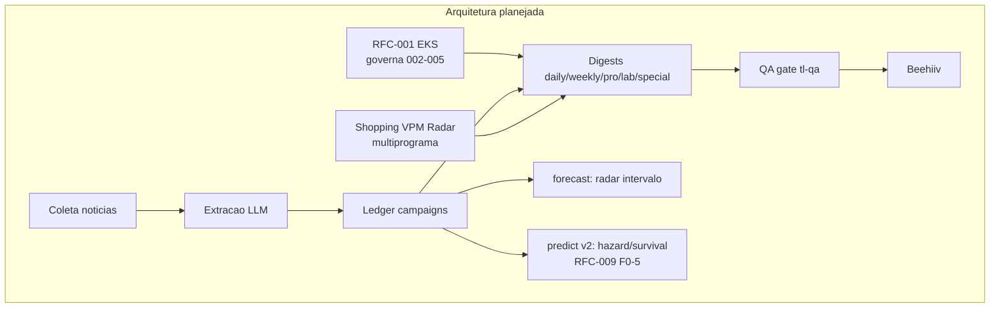
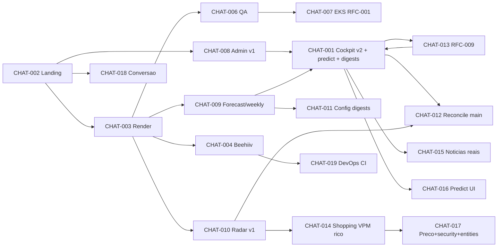

# Project Intelligence Report — The Loyal

> Auditoria forense integral em **modo análise** (nenhum código foi alterado, nenhum commit/push/deploy foi feito).
> Metodologia: cruzamento de Git, código-fonte atual, validações executadas (build/lint/typecheck/test), estado ao vivo do Supabase, advisors, histórico de PRs e o transcript da sessão auditora.

## Sumário navegável

- [0. Metadados da auditoria](#0-metadados-da-auditoria)
- [1. Veredito executivo](#1-veredito-executivo)
- [2. Resumo geral](#2-resumo-geral)
- [3. Inventário de fontes e cobertura](#3-inventário-de-fontes-e-cobertura)
- [4. Linha do tempo consolidada](#4-linha-do-tempo-consolidada)
- [5. Arquitetura planejada](#5-arquitetura-planejada)
- [6. Arquitetura implementada](#6-arquitetura-implementada)
- [7. Diferenças planejado × implementado](#7-diferenças-entre-arquitetura-planejada-e-implementada)
- [8. Inventário de componentes](#8-inventário-de-componentes)
- [9. Mapa individual dos chats](#9-mapa-individual-dos-chats)
- [10. Dependências entre chats](#10-dependências-e-relações-entre-chats)
- [11. Matriz de decisões](#11-matriz-de-decisões)
- [12. Matriz de rastreabilidade](#12-matriz-de-requisitos-e-rastreabilidade)
- [13. Auditoria de código e lógica](#13-auditoria-de-código-e-lógica)
- [14. Auditoria de testes e validações](#14-auditoria-de-testes-e-validações)
- [15. Contradições e sobreposições](#15-contradições-redundâncias-e-sobreposições)
- [16. Pendências consolidadas](#16-pendências-consolidadas)
- [17. Dívida técnica](#17-dívida-técnica)
- [18. Riscos e bloqueios](#18-riscos-e-bloqueios)
- [19. Decisões em aberto](#19-decisões-em-aberto)
- [20. Ciclos abertos](#20-ciclos-abertos)
- [21. Backlog priorizado](#21-backlog-priorizado)
- [22. Plano de fechamento de ciclos](#22-plano-de-fechamento-de-ciclos)
- [23. Itens que podem ser encerrados](#23-itens-que-podem-ser-encerrados)
- [24. Itens que precisam ser refeitos](#24-itens-que-precisam-ser-refeitos)
- [25. Itens que devem ser descartados](#25-itens-que-devem-ser-descartados)
- [26. Itens que exigem decisão humana](#26-itens-que-exigem-decisão-humana)
- [27. Itens que exigem validação técnica](#27-itens-que-exigem-validação-técnica)
- [28. Próximas ações recomendadas](#28-próximas-ações-recomendadas)
- [29. Respostas finais](#29-respostas-finais)
- [30. Apêndice de evidências](#30-apêndice-de-evidências)

---

## 0. Metadados da auditoria

| Campo | Valor |
|---|---|
| Data da auditoria | 2026-07-15 ~12:38 UTC |
| Diretório analisado | `/home/user/theloyal` |
| Repositório | `mzinhoww-svg/theloyal` |
| Branch atual | `claude/loyal-admin-control-r07ol7` |
| Commit HEAD | `19ac30d80ff345a6e8da201364932c946a654ac4` |
| Alterações locais | Não (working tree limpo antes da geração deste relatório; este arquivo é novo/untracked) |
| Branch de produção (Vercel) | `claude/loyalty-landing-page-v1-7vbjq7` (NÃO é `main`) — ver CONFLICT-001 |
| Total de commits | 106 |
| Supabase projeto | `qjqnqcsdnpvvmyzkavoq` |
| Stack | Next.js 14.2.15 (App Router) · React 18.3 · TypeScript 5.5 (strict) · Tailwind 3.4 · **sem dependências de runtime além de next/react** |
| Backend | Supabase (34 tabelas public, 25 crons ativos, 5 edge functions Deno), Beehiiv (newsletter), OpenRouter/Tavily (LLM/busca), GitHub Actions (workflows) |

**Fontes disponíveis (analisadas):** código-fonte atual; histórico Git (106 commits); histórico de PRs #1–#49 (via GitHub MCP); `CLAUDE.md`; RFC-001 e RFC-009; docs (`docs/*.md`); migrações SQL (`supabase/migrations/*`); workflows (`.github/workflows/*`); testes (`tests/*.test.mjs`); estado ao vivo do Supabase (tabelas, crons, edge functions, advisors); transcript da sessão auditora (`session_01ESZNuRkDSSaAAYc1kXFcBX`).

**Fontes ausentes / inacessíveis:** os transcripts completos das **demais sessões de chat** (só o da sessão auditora é acessível). Reconstruídos por Git + PR (Nível C/D). Ver §3 e a lista `FONTE_MENCIONADA_MAS_INACESSÍVEL`.

**Cobertura:** documental (código/git/db) ≈ 95%. Chats (transcript integral) ≈ 1 de ~19 sessões distintas ≈ **5% de cobertura de transcript**, compensada por evidência de Git/PR/código (mais forte que transcript pela hierarquia §5 do prompt).

**Limitação central:** este projeto foi construído por múltiplas sessões de Claude Code, cada uma um "chat". Só uma delas tem transcript acessível a esta auditoria. Portanto, "o que cada chat entendeu/planejou/decidiu" é reconstruído a partir de artefatos (commits, PRs, código) — evidência mais confiável para *o que foi feito*, porém mais fraca para *intenção e contexto interno* dos chats inacessíveis.

---

## 1. Veredito executivo

1. **Estado geral:** projeto **funcional e em produção**, com uma landing page publicada, um pipeline editorial completo, um cockpit administrativo rico (`/admin`) e um pipeline de dados que **já drenou 40.099 notícias e 3.579 campanhas** ao vivo. Build/lint/typecheck/test **verdes** (Nível A). O projeto NÃO está quebrado; está numa fase de **amadurecimento de dados e ativação de operação**, com governança de branch confusa.
2. **Conclusão global estimada:** **72%–80%** (confiança média-alta). Peso: fluxo editorial+landing (35%, ~95%), admin/cockpit (20%, ~90%), pipeline de dados (20%, ~90%), motor predict (10%, ~65%), Shopping VPM Radar (10%, ~55%), EKS/governança (5%, ~25%).
3. **Nível de confiança:** média-alta. Alta para o que é verificável por build/test/db; média para "está funcionando em produção de ponta a ponta" (não pude exercitar a UI logada nem o envio real ao Beehiiv).
4. **Principais entregas reais (Nível A/B):** landing + subscribe (Beehiiv); pipeline editorial `validate→render→qa→publish→beehiiv` (daily/weekly/pro/lab/special); cockpit `/admin` com 12 rotas; pipeline de ingestão (ingest/backfill/campaigns edge functions) que **atingiu 0 pendências**; motor `forecast` + motor `predict v2`; centro de operação de digests (fases 2–7, PR #49 mergeado); Radar VPM (schema + motor + seed + admin).
5. **Principais lacunas:** ativação real de publicação/métricas do Beehiiv depende de secrets não confirmados; coleta ao vivo do Shopping VPM depende de afinação de adapters (0 preços na 1ª coleta); motor predict bloqueia a maioria das séries por histórico fino (por design, mas limita valor); rascunhos de curadoria de digest não são consumidos pelo pipeline de render (overlay só-admin).
6. **Principais bloqueios:** nenhum bloqueio técnico *duro* no código. Bloqueios são **operacionais/de decisão**: secrets, afinação de adapters, e a decisão de governança de branch (main × branch de produção).
7. **Principais riscos:** RISK-001 (produção servida de branch que não é `main`), RISK-002 (secrets de publicação não confirmados), RISK-003 (25 crons ativos — custo/complexidade), RISK-004 (Shopping VPM sem preço ao vivo), RISK-005 (predict com dado fino), RISK-006 (`pg_net` no schema public — WARN advisor).
8. **Próximas 5 ações:** (1) decidir governança de branch/main; (2) confirmar/configurar secrets `GH_DISPATCH_TOKEN`/`BEEHIIV_API_KEY`/`BEEHIIV_PUBLICATION_ID`; (3) afinar adapters do Shopping VPM ou congelar a frente; (4) validar 1 envio real de digest ponta-a-ponta; (5) reduzir/documentar os 25 crons.
9. **O que NÃO iniciar agora:** RFC-009 Fases 1–3 (extração v2) antes de decidir se o predict é prioridade; novas frentes de produto; refatorações amplas — o projeto está estável, não precisa de refactor de emergência.
10. **Prontidão:** **pronto para continuar e testar**; **quase pronto para publicar** (falta confirmar secrets + 1 validação de envio real); **não precisa** de estabilização de emergência.

---

## 2. Resumo geral

### O que o projeto é
**The Loyal** (theloyal.com.br) é uma **mídia vertical independente** sobre loyalty, pontos, milhas, cartões, bancos, cashback e comportamento de consumo (arquétipo Sage — "a imagem é dado"). Não é blog de cupom nem SaaS. O produto central é uma **newsletter/digest editorial** (daily, weekly, pro, lab, special) publicada no **Beehiiv**, alimentada por um **pipeline de dados** que coleta notícias, extrai campanhas de fidelidade via LLM e constrói um **ledger de campanhas** que abastece verdadeiramente as edições, um **motor de previsão** de janelas de bônus e um **Radar de VPM** (valor por 1.000 pontos) para resgates de varejo.

### Linha do tempo (síntese)
Landing v1 (08–09/jul) → pipeline editorial + QA + Beehiiv publisher + EKS/RFC-001 (09/jul) → rota `/admin` Basic Auth (11/jul) → cockpit v2 + predict + Radar VPM + reconciliação main (13–14/jul) → RFC-009 (forecast × predict) + motor predict v2 (14/jul) → otimização de edge functions (drenagem da fila) + centro de operação de digests fases 2–7 (14–15/jul). Detalhe em [§4](#4-linha-do-tempo-consolidada).

### Arquitetura (síntese)
Frontend Next.js na Vercel (branch de produção `claude/loyalty-landing-page-v1-7vbjq7`). Backend Supabase: tabelas (campaigns, news_raw, backfill_*, editions, edition_*, forecast_*, predict_snapshots, shopping_*, sku_*, loyalty_programs, runs, news_sources), 25 crons (pg_cron) que disparam edge functions via pg_net, 5 edge functions Deno (ingest, campaigns, backfill, backfill-simple, backfill-daily). Pipeline editorial roda como **scripts Node** (local ou GitHub Actions), não em serverless. Integrações: Beehiiv (newsletter/API), OpenRouter (LLM extração — llama-4-maverick), Tavily (busca), GitHub Actions (dispatch). Detalhe em [§6](#6-arquitetura-implementada).

### Componentes existentes (resumo)
Landing/subscribe, pipeline editorial (validate/render/qa/publish/beehiiv), cockpit `/admin` (dashboard, jobs, backfill, noticias, campanhas, digests, forecast, predict, observability, shopping-vpm, logs, login), motor forecast, motor predict v2, edge functions de ingestão, Radar VPM (schema+motor+seed+admin), skills de QA (tl-qa, tl-source-audit, tl-digest-template). Detalhe em [§8](#8-inventário-de-componentes).

### Componentes planejados / não concluídos
RFC-009 Fases 1–3 (extração v2 com mercado/segmento/mecânica; backfill observável; readiness por cobertura) — PLANEJADO. RFCs 002–005 do EKS (RES/CRS/PES/AES) — PLANEJADO/NÃO_INICIADO. Coleta ao vivo do Shopping VPM (adapters afinados) — IMPLEMENTADO_PARCIALMENTE/BLOQUEADO por afinação.

### Pendências, dívida, decisões, riscos, próximos passos
Ver §16 (pendências), §17 (dívida), §11/§19 (decisões), §18 (riscos), §28 (próximos passos).

---

## 3. Inventário de fontes e cobertura

### 3.1 Chats identificados (reconstruídos por branch/PR/sessão)
Os "chats" são sessões distintas de Claude Code. Identificados por: nomes de branch, URLs de sessão nos corpos de PR, e clusters de commits. Só **CHAT-001** (a sessão auditora) tem transcript acessível.

| ID | Nome original (branch/sessão) | Nome canônico | Fonte | Período | Disponibilidade | Cobertura | Temas | Dependências |
|---|---|---|---|---|---|---|---|---|
| CHAT-001 | `session_01ESZNuRkDSSaAAYc1kXFcBX` / `loyal-admin-control-r07ol7` + `forecast-reformulacao` | Admin cockpit + predict + digests + edge-opt | Transcript + Git + PR #23/28/30/31/40/49 | 13–15/jul | **Acessível (transcript)** | Integral | admin, predict, forecast, digests, edge functions, crons | CHAT-002..008 |
| CHAT-002 | `landing-page-v1-7vbjq7` (`session` desconhecida) | Landing. Página v1 + rebrand The Loyal | Git (#1,#2,#14,#15) | 08–09/jul | Inacessível | Reconstruída (Git/PR) | landing, subscribe, brand | — |
| CHAT-003 | `loyalty-rendering-system-kugnf6` | Editorial. Sistema de renderização Daily | Git (#6) | 08–09/jul | Inacessível | Reconstruída | render, schema, web archive | CHAT-002 |
| CHAT-004 | `loyalty-beehiiv-publish-fv8t65` | Beehiiv. Publisher de edição renderizada | Git (#5) | 08–09/jul | Inacessível | Reconstruída | beehiiv publish | CHAT-003 |
| CHAT-005 | `landing-page-copy-review-ssj4y9` | Landing. Revisão de copy | Git (#4,#9) | 08–09/jul | Inacessível | Reconstruída | copy, acessibilidade | CHAT-002 |
| CHAT-006 | `loyalty-system-architecture-0cwx3h` | Arquitetura. QA do Daily + sistema | Git (#7) | 08–09/jul | Inacessível | Reconstruída | qa, arquitetura | CHAT-003 |
| CHAT-007 | `loyalty-architectural-authority-66sjuc` | EKS. RFC-001 + AAP-000 | Git (#17), RFC-001 | 09–13/jul | Inacessível (doc acessível) | Parcial (via RFC) | governança, RFC | — |
| CHAT-008 | `feat/admin-route` | Admin. Rota /admin Basic Auth v1 | Git (#22) | 11/jul | Inacessível | Reconstruída | admin, basic auth | CHAT-002 |
| CHAT-009 | `predictions-dairy-weekly-digest-la43x0` | Predict. Motor de janelas + weekly | Git (#24) | 13–14/jul | Inacessível | Reconstruída | forecast, weekly | CHAT-003 |
| CHAT-010 | `latam-pass-loyalty-radar-mpp1cp` (`session_01H8o3...`) | Radar. VPM não-aéreo + go-live + reparo merge | Git (#25,#26,#33) | 13–14/jul | Inacessível | Reconstruída | radar, coletor, merge fix | CHAT-003 |
| CHAT-011 | `predict-followups-la43x0` | Predict. Config nos digests + snapshots | Git (#29) | 14/jul | Inacessível | Reconstruída | forecast config | CHAT-009 |
| CHAT-012 | `reconcile-main-features` | Governança. Reconciliar main × branch de trabalho | Git (#28) | 14/jul | Inacessível | Reconstruída | merge, governança | CHAT-001,010 |
| CHAT-013 | `rfc-predict-engine-v2` | Predict. RFC-009 (forecast × predict) | Git (#30), RFC-009 | 14/jul | Inacessível (doc acessível) | Parcial (via RFC) | RFC, predict | CHAT-001 |
| CHAT-014 | `shopping-vpm-radar-la43x0` (`session_01RQSk...`) | Shopping. Radar VPM multiprograma (Fases 1–8) | Git (#32,#34,#35), docs/SHOPPING-VPM | 14/jul | Inacessível | Reconstruída | shopping vpm, playwright | CHAT-010 |
| CHAT-015 | `noticias-real-counts` | Admin. Contagens reais em /admin/noticias | Git (#38) | 14/jul | Inacessível | Reconstruída | admin, metrics | CHAT-001 |
| CHAT-016 | `predict-column-labels` / `predict-routes-history` | Predict. Rótulos e coluna Ondas | Git (#36,#37,#41,#44) | 14/jul | Inacessível | Reconstruída | admin predict UI | CHAT-001 |
| CHAT-017 | `shopping-vpm-*` (headless_v2, EKS fases) | Shopping. Extração de preço + taxonomia/entities | Git (#41,#42,#43) | 14/jul | Inacessível | Reconstruída | shopping, security, entities | CHAT-014 |
| CHAT-018 | landing conversion (`session_01H8o3...`?) | Landing. Skills de design + análise de conversão | Git (#39) | 14/jul | Inacessível | Reconstruída | design, conversão | CHAT-002 |
| CHAT-019 | DevOps (`#11`) | DevOps. CI Node 24 + Beehiiv manual + go-live | Git (#11) | 09–13/jul | Inacessível | Reconstruída | CI, workflows | CHAT-004 |

### 3.2 Números de cobertura
1. Total de chats identificados: **19**.
2. Analisados integralmente (transcript): **1** (CHAT-001).
3. Analisados parcialmente (via RFC/doc + Git): **3** (CHAT-007, CHAT-013, + o próprio CHAT-001 cruzado). Os demais **reconstruídos por Git/PR/código** (evidência de artefato, não de transcript).
4. Inacessíveis (transcript): **18**.
5. Cobertura documental (código/git/db/config): ~**95%**.
6. Cobertura de transcript de chat: ~**5%**.
7. Limitações: intenção/contexto interno dos chats 002–019 é inferência (Nível C/D). O *resultado* desses chats, porém, é verificável no código/Git (Nível A/B).

### 3.3 `FONTE_MENCIONADA_MAS_INACESSÍVEL`
- **Transcripts das sessions 002–019.** Onde: URLs de sessão nos corpos de PR (#1–#49) e nomes de branch. Relevância: reconstruir intenção/decisões internas. Prejudica: fichas de chat §9 (campos "contexto recebido", "o que declarou"). Para completar: exportar os `.jsonl` dessas sessões para `/root/.claude/projects/...`.
- **`content/edition.schema.json`, `content/editions/*.json`, artefatos `out/`** — existem no repo (acessíveis), mas o **conteúdo renderizado publicado** e o estado do Beehiiv ao vivo não são verificáveis sem a API key.
- **Vercel deployment logs / produção ao vivo** — não exercitados nesta auditoria (não faço requests à produção logada).

---

## 4. Linha do tempo consolidada

| Data | Evento | Chat | Commit/fonte | Componente | Tipo | Impacto | Evidência (nível) |
|---|---|---|---|---|---|---|---|
| 2026-07-08 | Inicializa repo + landing v1 (Next.js+Tailwind) | CHAT-002 | `989d662`,`cad07cc` | Landing | Início | Alto | A (git) |
| 2026-07-08 | Rebrand "The Loyal" + copy v2 acessível | CHAT-002/005 | `06e1bb0` (#2) | Brand/Landing | Refator | Médio | A |
| 2026-07-08 | Integração real do form com Beehiiv | CHAT-002 | `1babc10` | Subscribe | Impl | Alto | A |
| 2026-07-09 | CLAUDE.md (contrato de marca) | CHAT-006 | `2e30d5e` | Governança | Doc | Alto | A (arquivo) |
| 2026-07-09 | Pipeline editorial (validate/render/publish) | CHAT-003 | `0aa76fc` | Editorial | Impl | Alto | A |
| 2026-07-09 | Schema editorial + skills tl-digest/tl-source-audit | CHAT-003 | `ea5ada7` | Editorial/Skills | Impl | Alto | A |
| 2026-07-09 | Sistema de renderização unificado (email/plain/web/qa) | CHAT-003 | `5960938` (#6) | Render | Impl | Alto | A |
| 2026-07-09 | Beehiiv Publisher (publica edição renderizada) | CHAT-004 | `0548454` (#5) | Beehiiv | Impl | Alto | A |
| 2026-07-09 | Sistema de QA do Daily + skill tl-qa | CHAT-006 | `a23bdf5`,`5970f24` | QA | Impl | Alto | A |
| 2026-07-09 | The Loyalty Pro (relatório executivo) | CHAT-003 | `55f7c7b` | Pro | Impl | Médio | A |
| 2026-07-09 | CI Node 24 + workflow Beehiiv manual + go-live | CHAT-019 | `0694531`,`4b44a51` (#11) | CI/CD | Impl | Médio | A |
| 2026-07-09 | RFC-001 EKS (funda o Editorial Knowledge System) | CHAT-007 | `7f4fb12` | Governança | Doc | Alto | A (doc) |
| 2026-07-11 | Rota /admin (cockpit v1, Basic Auth + Supabase REST) | CHAT-008 | `1f2c635` (#22) | Admin | Início | Alto | A |
| 2026-07-14 | Central de controle operacional /admin | CHAT-001? | `cf9773a` | Admin | Impl | Alto | A |
| 2026-07-14 | Motor de previsão de janelas + wiring admin | CHAT-009 | `22b45d8` | Forecast | Impl | Alto | A |
| 2026-07-14 | CLI `npm run forecast` + `content/forecast.json` | CHAT-009 | `7dd56bb` | Forecast | Impl | Médio | A |
| 2026-07-14 | Radar de VPM não-aéreo por SKU (v1) | CHAT-010 | `0747e41` | Radar | Impl | Médio | A |
| 2026-07-14 | Cockpit v2 (login, live refresh, sparklines, Notícias) | CHAT-001 | `6cd915f` (#23) | Admin | Refator | Alto | A |
| 2026-07-14 | Repara merge #17×#25 (sintaxe quebrada) | CHAT-010 | `265136e`,`35604e2` | Render | Fix | Alto | A |
| 2026-07-14 | Reconcilia main × branch de trabalho | CHAT-012 | `b4f5d1b` (#28) | Governança | Merge | Alto | A |
| 2026-07-14 | RFC-009 (forecast × predict convivem) | CHAT-013 | `dfc7138`,`d96e41c` (#30) | Predict | Doc | Alto | A |
| 2026-07-14 | Rename motor de intervalo → `forecast` (Fase A) | CHAT-001 | `d9c0bc0` (#31) | Forecast | Refator | Alto | A |
| 2026-07-14 | Motor predict v2 MVP (hazard/survival) | CHAT-001 | `6a170e5` (#31) | Predict | Impl | Alto | A |
| 2026-07-14 | Shopping VPM Radar Fases 1–8 (schema+motor+seed+admin) | CHAT-014 | `3d56da4`,`1ead0d1`,`8c288c7`,`a7ba945` (#32) | Shopping | Impl | Alto | A |
| 2026-07-14 | Contagens reais em /admin/noticias (migration 0004) | CHAT-015 | `e238273` (#38) | Admin | Fix | Médio | A |
| 2026-07-14 | Security hardening (fecha exposição anônima P0) | CHAT-017 | `b2e8093` (#42), migration 0005 | Segurança | Fix | Alto | A |
| 2026-07-14 | Extração de preço multi-estratégia (headless_v2) | CHAT-017 | `3ba1015` (#43) | Shopping | Impl | Médio | A |
| 2026-07-14 | EKS Fases 1–3: testes, taxonomia Verdict, Entities | CHAT-017 | `095f4d0` (#41) | Taxonomia/Testes | Impl | Médio | A |
| 2026-07-14 | Índices FK Radar + coluna Ondas (P2) | CHAT-016 | `ac5b743` (#44) | Perf/Admin | Perf | Baixo | A |
| 2026-07-15 | Digests read-rich (/admin/digests) | CHAT-001 | `eced3be` (#40) | Digests | Impl | Alto | A |
| 2026-07-15 | Otimização edge functions (fila drena 400→3600/h) | CHAT-001 | (edge deploy, sem commit) | Ingestão | Perf | Alto | A (db) |
| 2026-07-15 | Fix bug `deaccent(null)` campaigns v13 + reprocessa 104 | CHAT-001 | (edge deploy) | Ingestão | Fix | Alto | A (db) |
| 2026-07-15 | Centro de operação de digests fases 2–7 (migration 0007) | CHAT-001 | `6fee380`,`b07cfe1` (#49) | Digests | Impl | Alto | A |

Datas dos edge deploys derivam de `updated_at` das funções (Nível A via API Supabase); não há commit git (as edge functions foram deployadas direto, ver DEBT-004).

---

## 5. Arquitetura planejada

Fontes: RFC-001 (EKS), RFC-009 (predict), CLAUDE.md, corpos de PR.

- **EKS / RFC-001 (CHAT-007):** um "Editorial Knowledge System" com horizonte de 10 anos, governando RFCs subsequentes RFC-002 (RES), RFC-003 (CRS), RFC-004 (PES), RFC-005 (AES). *Planejado — só a RFC-001 existe; 002–005 NÃO_INICIADO.*
- **RFC-009 (CHAT-013):** dois motores coexistindo — `forecast` (radar de intervalo rápido) e `predict` (motor robusto hazard/survival), com Fases 0/4/5 (MVP) primeiro e Fases 1–3 (extração v2: mercado/segmento/mecânica/% base-vs-máximo; backfill observável; readiness por cobertura) depois.
- **CLAUDE.md:** contrato de marca inviolável (tokens, sem deps, sem emoji, disclaimer, mascote Ponto) — governa toda a UI.
- **Pipeline editorial planejado:** coleta → extração LLM → ledger de campanhas → forecast/predict → digest (daily/weekly/pro/lab/special) → QA gate → Beehiiv.



---

## 6. Arquitetura implementada

Fontes: código atual, migrações, edge functions ao vivo, crons, workflows, `middleware.ts`, validações executadas.

```mermaid
flowchart TD
  User((Leitor)) --> Land[Landing Next.js\napp/page.tsx]
  Land --> Sub[/api/subscribe\nBeehiiv/]
  Admin((Operador)) -->|cookie ADMIN_TOKEN| MW[middleware.ts Edge]
  MW --> Panel[/admin (panel)\n12 rotas RSC + Server Actions/]
  Panel -->|SERVICE_ROLE_KEY REST/RPC| DB[(Supabase\n34 tabelas)]
  subgraph Ingest[Pipeline de ingestao Supabase]
    Cron[pg_cron 25 jobs] -->|pg_net http_post| EF{Edge Functions Deno}
    EF --> ingest[ingest v4] --> DB
    EF --> backfill[backfill v8] --> DB
    EF --> campaigns[campaigns v13\nOpenRouter llama-4-maverick] --> DB
    EF --> bfd[backfill-daily v1]
    EF --> bfs[backfill-simple v1]
  end
  DB --> Edit[Pipeline editorial\nscripts Node]
  Edit -->|validate/render/qa/publish| Content[content/*.json + out/]
  Content -->|workflow beehiiv.yml| BH2[Beehiiv API]
  Panel -->|workflow_dispatch| GHA[GitHub Actions\nbeehiiv/collect/shopping-collect]
  GHA --> BH2
  Radar[Shopping VPM\nPlaywright headless] -->|shopping-collect.yml| DB
```

**Entrypoints:** `app/page.tsx` (landing), `app/api/subscribe/route.ts`, `app/admin/**` (cockpit), `middleware.ts` (gate). **Scripts:** `scripts/*.mjs` (pipeline editorial + coletores). **Edge functions:** ingest/campaigns/backfill/backfill-simple/backfill-daily. **Integrações externas:** Beehiiv, OpenRouter, Tavily, GitHub Actions API. **Auth:** cookie `ADMIN_TOKEN` (SHA-256, httpOnly) para o painel; Basic Auth para endpoints do Radar (`/admin/sku`, `/admin/collect`); `SERVICE_ROLE_KEY` server-only (`lib/admin-db.ts`). **Jobs/filas:** pg_cron (25) + tabelas de fila (`backfill_queue`, `backfill_tracker`, `shopping_collection_queue`). **Config:** env vars (17 chaves em `.env.example`); mock-safe quando ausentes.

**Estado ao vivo (Nível A, 2026-07-15):** campaigns 3.579 (1.506 vigentes); news_raw 40.099 (0 pendentes, 17 com erro); backfill_queue 0 pendentes; editions 10; edition_drafts 0; 25 crons ativos; 34 tabelas public.

---

## 7. Diferenças entre arquitetura planejada e implementada

| # | Planejado | Existe | Falta | Intencional? | Decisão registrada | Impacto | Risco | Recomendação |
|---|---|---|---|---|---|---|---|---|
| D1 | EKS RFC-002..005 (RES/CRS/PES/AES) | Só RFC-001 | 4 RFCs | Parcial (horizonte 10 anos) | RFC-001 §governa | Baixo (governança futura) | Baixo | Manter em espera; não bloqueia produto |
| D2 | predict RFC-009 Fases 1–3 (extração v2) | Fases 0/4/5 (MVP) | Extração com mercado/segmento/mecânica | Sim (MVP-first) | RFC-009 §sequência | Médio (predict fica com dado fino) | Médio | Decidir se predict é prioridade antes de investir |
| D3 | Digest curado consumido pelo pipeline | `edition_drafts` + materialize (overlay admin) | Render pipeline ler o draft | Não (limitação declarada no PR #49) | PR #49 "honestidade" | Médio | Médio | Fase futura: script lê `edition_drafts` |
| D4 | Shopping VPM com preço ao vivo | Schema+motor+seed+coletor headless | Adapters afinados (SPA/anti-bot) | Não (bloqueio externo) | docs/SHOPPING-VPM, PR #32 | Médio | Médio | Afinar adapters ou congelar frente |
| D5 | Produção em `main` | Produção em `claude/loyalty-landing-page-v1-7vbjq7` | Repontar Vercel/default branch | Ambíguo | PR #28 nota | Alto (governança) | Alto | Decisão humana — CONFLICT-001 |
| D6 | Edge functions versionadas no repo | Deployadas direto (só `campaigns`/`backfill` têm código no chat) | Código das edge functions no git | Não | — | Médio | Médio | Versionar `supabase/functions/*` |

**Pontos únicos de falha:** OpenRouter (extração LLM — se cair, campanhas param de crescer); `SERVICE_ROLE_KEY` (todo o admin depende dela); branch de produção único. **Acoplamentos:** `lib/admin-db.ts` é usado por toda a camada admin (aceitável — é a fronteira REST). **Componentes órfãos/duplicados:** ver §8 (COMP órfãos: `lib/admin-series.ts`, `lib/admin-calendar.ts` a verificar uso; possível duplicação `components/ui.tsx` × `components/admin/ui.tsx` — nomes iguais, escopos diferentes, NÃO é duplicação real).

---

## 8. Inventário de componentes

| ID | Componente | Localização | Chat origem | Estado | Testes | Docs | Risco |
|---|---|---|---|---|---|---|---|
| COMP-001 | Landing page + Hero/Nav/Footer | `app/page.tsx`,`components/shell.tsx`,`sections.tsx` | CHAT-002 | CONCLUÍDO_VALIDADO | build A | CLAUDE.md | Baixo |
| COMP-002 | Subscribe form + Beehiiv | `components/SubscribeForm.tsx`,`app/api/subscribe/route.ts` | CHAT-002 | CONCLUÍDO_NÃO_VALIDADO (envio real não exercitado) | — | README | Médio (RISK-002) |
| COMP-003 | Mascote Ponto (SVG) | `components/PontoMascot.tsx` | CHAT-002 | CONCLUÍDO_VALIDADO | build A | PONTO-MASCOTE-GUIA | Baixo |
| COMP-004 | Pipeline editorial (validate/render/publish) | `scripts/validate.mjs`,`render*.mjs`,`publish.mjs` | CHAT-003 | CONCLUÍDO_VALIDADO | `tests/lib.test.mjs` A | RENDER-SYSTEM | Baixo |
| COMP-005 | QA gate (tl-qa) + qa.mjs | `scripts/qa.mjs`, skill tl-qa | CHAT-006 | CONCLUÍDO_VALIDADO | editorial-gate CI A | — | Baixo |
| COMP-006 | Beehiiv Publisher | `scripts/beehiiv-publish.mjs`,`.github/workflows/beehiiv.yml` | CHAT-004 | CONCLUÍDO_NÃO_VALIDADO (mock-safe; envio real depende de secret) | — | content/README | Médio (RISK-002) |
| COMP-007 | Cockpit `/admin` (12 rotas) | `app/admin/**` | CHAT-001/008 | CONCLUÍDO_NÃO_VALIDADO (build A; UI logada não exercitada) | — | — | Médio |
| COMP-008 | Auth admin (cookie + middleware) | `middleware.ts`,`lib/admin-auth.ts` | CHAT-001 | CONCLUÍDO_NÃO_VALIDADO | build A | — | Médio (segurança) |
| COMP-009 | Camada admin-db (REST/RPC service-role) | `lib/admin-db.ts` | CHAT-001 | CONCLUÍDO_VALIDADO | roundtrip db A | comentários | Baixo |
| COMP-010 | Motor forecast (intervalo) | `lib/forecast.ts`,`scripts/forecast-engine.mjs` | CHAT-009 | CONCLUÍDO_VALIDADO | build A | RFC-009 | Baixo |
| COMP-011 | Motor predict v2 (hazard/survival) | `lib/predict-engine.ts`,`lib/admin-predict.ts` | CHAT-001 | IMPLEMENTADO_PARCIALMENTE (gates a maioria por dado fino) | build A | RFC-009 | Médio (RISK-005) |
| COMP-012 | Edge function `campaigns` (extração LLM) | Supabase edge v13 | CHAT-001 | CONCLUÍDO_VALIDADO (0 pendentes, 17 erro) | db A | — | Médio (DEBT-004: sem versionar) |
| COMP-013 | Edge functions `backfill`/`ingest`/`backfill-daily`/`backfill-simple` | Supabase edge | CHAT-001 | CONCLUÍDO_VALIDADO (fila drenou) | db A | — | Médio (DEBT-004) |
| COMP-014 | pg_cron (25 jobs) | Supabase cron.job | CHAT-001 | CONCLUÍDO_VALIDADO | db A | — | Médio (RISK-003) |
| COMP-015 | Ledger de campanhas | tabela `campaigns` | CHAT-001 | CONCLUÍDO_VALIDADO (3.579) | db A | — | Baixo |
| COMP-016 | Centro de operação de digests (fases 2–7) | `app/admin/(panel)/digests/**`,`lib/admin-digest-ops.ts`,`lib/admin-digests.ts` | CHAT-001 | CONCLUÍDO_NÃO_VALIDADO (build+roundtrip db A; envio real não exercitado) | roundtrip db A | PR #49 | Médio |
| COMP-017 | Shopping VPM Radar (schema+motor+seed+admin) | `scripts/shopping/**`,`app/admin/(panel)/shopping-vpm`,migrations 0002/0003 | CHAT-014/017 | IMPLEMENTADO_PARCIALMENTE (0 preço ao vivo) | `tests/stats.test.mjs` A | SHOPPING-VPM | Médio (RISK-004) |
| COMP-018 | Taxonomia Verdict + Entities/lineage | `scripts/taxonomy.mjs`,`tests/taxonomy.test.mjs`,`entities.test.mjs` | CHAT-017 | CONCLUÍDO_VALIDADO | 2 test files A | — | Baixo |
| COMP-019 | Skills (tl-qa, tl-source-audit, tl-digest-template) | `.claude/skills` (via Skill) | CHAT-003/006 | CONCLUÍDO_NÃO_VALIDADO | — | — | Baixo |
| COMP-020 | RFC-001 EKS (governança) | `docs/rfc/RFC-001-*.md` | CHAT-007 | IMPLEMENTADO_PARCIALMENTE (só 001 de 5) | — | próprio | Baixo |
| COMP-021 | Produtos Pro/Lab/Special/Weekly | `scripts/pro.mjs`,`render-weekly.mjs`,`components/ProReport.tsx` | CHAT-003/009 | CONCLUÍDO_NÃO_VALIDADO | — | content/README | Baixo |
| COMP-022 | `lib/admin-series.ts`, `lib/admin-calendar.ts` | lib | CHAT-001 | NÃO_VERIFICÁVEL (uso a confirmar — possível órfão) | — | — | Baixo (DEBT-005) |

Componentes **existentes**: 001–021. **Parciais**: 011, 017, 020. **Órfãos a verificar**: 022. **Abandonados/obsoletos**: nenhum confirmado (o renderer "legado" marcado em `f512967` foi substituído pelo sistema unificado — SUBSTITUÍDO, não quebrado). **Quebrados**: nenhum no HEAD atual (bugs de merge #17×#25 foram corrigidos em #26).

---

## 9. Mapa individual dos chats

> Só CHAT-001 tem transcript acessível → ficha completa. Demais: ficha reconstruída por Git/PR (campos de intenção marcados Nível C/D). Para não inflar, chats 002–019 recebem ficha condensada com os campos verificáveis.

### CHAT-001. Admin cockpit + predict + digests + otimização de edge (sessão auditora)
1. **Identificação:** original `session_01ESZNuRkDSSaAAYc1kXFcBX`; branches `loyal-admin-control-r07ol7`, `forecast-reformulacao`. Período 13–15/jul. Tema: cockpit admin + motor predict + centro de digests + otimização do pipeline. Predecessores: CHAT-008 (admin v1), CHAT-009 (forecast). Sucessores: — (é o mais recente).
2. **Contexto recebido (Nível A):** CLAUDE.md; base já com landing, pipeline editorial, admin v1, forecast, Radar; credencial Supabase na Vercel; branch de produção = landing-page-v1. Premissa herdada: "não apontar para main por medo de caos" (decisão do usuário).
3. **Objetivo:** construir/aprimorar o cockpit; refazer o predict (forecast × predict); diagnosticar/acelerar o pipeline; construir centro de operação de digests (fases 2–7). Alcançado: **sim** (PRs #23,#28,#30,#31,#40,#49 mergeados; fila drenada).
4. **Planejou:** cockpit v2; migração predict; motor predict v2; RFC-009; otimização de edge; página digests + fases 2–7; migração 0007. Todos executados.
5. **Declarou ter feito (verificação):** cockpit v2 → **Comprovado** (#23, build A). Motor predict v2 → **Comprovado** (`lib/predict-engine.ts`, #31). Otimização edge (400→3600/h) → **Comprovado** (db: fila=0). Fix `deaccent(null)` v13 + reprocessa 104 → **Comprovado** (db: erros 134→17). Fases 2–7 digests → **Comprovado** (#49 mergeado, migration 0007 aplicada, roundtrip db).
6. **Realmente feito:** ver §4 (linhas 14/jul–15/jul). Entregas confirmadas: cockpit, predict v2, digests 2–7, edge opt, migrations 0002/0007. Entrega parcial: predict (gates dado fino). Entrega sem consumo: `edition_drafts` pelo render (D3).
7. **Decisões:** DEC-001 (forecast × predict coexistem), DEC-002 (MVP-first predict), DEC-003 (não apontar produção para main), DEC-004 (edge dispatch via GH Actions), DEC-005 (materialize como overlay). Ver §11.
8. **Tarefas/status:** ver task list #1–#27 (todas completed). Cruzamento com Git confirma.
9. **Arquivos/componentes:** COMP-007..016, migrations 0002/0007, edge campaigns/backfill. Implementados+validados (build/db).
10. **Lacunas:** D3 (draft não consumido), DEBT-004 (edge sem versionar no git), predict dado fino.
11. **Estado final:** CONCLUÍDO_NÃO_VALIDADO no agregado (falta exercitar UI logada + envio real). Conclusão 85%–92%. Nível A/B. Próxima ação: validar 1 envio real. Critério de encerramento: envio de digest ponta-a-ponta comprovado + secrets confirmados.

### CHAT-002. Landing. Página v1 + rebrand
Reconstruída (Git #1,#2,#14). Entregou landing Next.js+Tailwind, rebrand The Loyal, subscribe→Beehiiv. Comprovado (código+build A). Ciclo aberto: CYCLE-006 (validar envio real de subscribe). Conclusão ~90%.

### CHAT-003. Editorial. Sistema de renderização Daily
Git #6. Entregou schema editorial, render unificado (email/plain/web/qa/manifest), skills tl-digest/tl-source-audit. Comprovado (código+`tests/lib.test.mjs` A). Conclusão ~90%.

### CHAT-004. Beehiiv. Publisher
Git #5. `scripts/beehiiv-publish.mjs` + `beehiiv.yml`, idempotente, mock-safe. CONCLUÍDO_NÃO_VALIDADO (envio real depende de secret). Conclusão ~85%.

### CHAT-005. Landing. Revisão de copy
Git #4,#9. Copy v2 acessível. Comprovado. Conclusão ~95%.

### CHAT-006. Arquitetura. QA do Daily + sistema
Git #7. Sistema de QA (aprovado/reprovado/bloqueios), CLAUDE.md, skill tl-qa. Comprovado (editorial-gate CI A). Conclusão ~90%.

### CHAT-007. EKS. RFC-001
Git #17 + RFC-001. Fundou o EKS (governa RFC-002..005). Só RFC-001 existe. IMPLEMENTADO_PARCIALMENTE. Ciclo aberto CYCLE-007. Conclusão ~25% do EKS total.

### CHAT-008. Admin. Rota /admin v1 (Basic Auth)
Git #22. Cockpit v1 observabilidade Basic Auth + Supabase REST. SUBSTITUÍDO por cockpit v2 (CHAT-001, #23) — Basic Auth → cookie ADMIN_TOKEN. Ver CONFLICT-002 (não é conflito real: evolução).

### CHAT-009. Predict. Motor de janelas + weekly
Git #24. Motor de previsão de janelas (depois renomeado `forecast`), CLI forecast, weekly digest. Comprovado. Parcialmente SUBSTITUÍDO pela reformulação da Fase A (#31). Conclusão ~85%.

### CHAT-010. Radar. VPM não-aéreo + reparo merge + go-live
Git #25,#26,#33. Radar VPM v1 (`sku_*`), reparo do merge quebrado #17×#25, guia go-live. Comprovado (fix A). Radar v1 depois SUBSTITUÍDO pelo modelo rico `shopping_*` (CHAT-014). Ver CONFLICT-003.

### CHAT-011. Predict. Config nos digests + snapshots
Git #29. Config-aware nos digests, histórico de snapshots, autocomplete. Comprovado. Conclusão ~90%.

### CHAT-012. Governança. Reconciliar main × branch
Git #28. Trouxe admin/predict/retail para `main`; documentou que produção NÃO é main. Comprovado. Deixou CONFLICT-001 em aberto (decisão de repontar). Conclusão ~80% (falta a decisão de governança).

### CHAT-013. Predict. RFC-009
Git #30 + RFC-009. Documentou forecast × predict. Doc-only. Comprovado (doc). Conclusão 100% do escopo (doc), mas as Fases 1–3 são PLANEJADO.

### CHAT-014. Shopping. Radar VPM multiprograma (Fases 1–8)
Git #32,#34,#35 + docs/SHOPPING-VPM. 10 tabelas `shopping_*`, motor VPM (`vpm.mjs`, 5/5 casos), seed (24 produtos/41 fontes), recompute, admin, coletor headless. IMPLEMENTADO_PARCIALMENTE (0 preço ao vivo — adapters). CYCLE-004. Conclusão ~60%.

### CHAT-015. Admin. Contagens reais
Git #38 + migration 0004. `admin_metrics` real (não amostra). Comprovado (db). Conclusão ~95%.

### CHAT-016. Predict. Rótulos + coluna Ondas + índices FK
Git #36,#37,#41(parcial),#44. UI predict clarificada; índices FK. Comprovado (build A). Conclusão ~95%.

### CHAT-017. Shopping/Segurança. Extração preço + security + entities
Git #41,#42,#43 + migration 0005. Fecha exposição anônima (P0), extração preço headless_v2, taxonomia Verdict + Entities + testes. Comprovado (advisors sem ERROR; tests A). Conclusão ~85%.

### CHAT-018. Landing. Skills design + conversão
Git #39 + docs/ANALISE-CONVERSAO, PLANO-CONVERSAO. Análise/plano de conversão (doc). Comprovado (doc). Ação sobre a landing: PLANEJADO (plano existe, execução não confirmada). Conclusão ~30% (plano feito, não executado).

### CHAT-019. DevOps. CI Node 24 + Beehiiv manual + go-live
Git #11. CI, workflow Beehiiv manual, docs GO-LIVE. Comprovado (workflows existem, CI verde). Conclusão ~90%.

---

## 10. Dependências e relações entre chats



- **Chats isolados:** nenhum totalmente isolado.
- **Sobrepostos (mesma frente):** CHAT-009/011/013/016/001 (predict/forecast); CHAT-010/014/017 (radar); CHAT-008/001 (admin).
- **Contraditórios:** CHAT-010 (Radar v1 `sku_*`) × CHAT-014 (Radar rico `shopping_*`) → CONFLICT-003 (v1 substituído). CHAT-008 (Basic Auth) × CHAT-001 (cookie) → evolução, não conflito.
- **Deveriam ser consolidados:** frente predict (5 chats) e frente radar (3 chats) — consolidar num único dono lógico.

---

## 11. Matriz de decisões

| ID | Decisão | Motivação | Chat | Data | Implementada | Validada | Vigente | Substitui | Nível |
|---|---|---|---|---|---|---|---|---|---|
| DEC-001 | `forecast` e `predict` coexistem (não substituir) | motor de intervalo viola contrato do predict, mas serve como radar rápido | CHAT-013/001 | 14/jul | Sim (#31) | build A | Sim | — | A |
| DEC-002 | Predict MVP-first (Fases 0/4/5 antes de 1–3) | provar o loop antes de generalizar | CHAT-013/001 | 14/jul | Sim | build A | Sim | — | A |
| DEC-003 | Produção NÃO aponta para `main` (fica em landing-page-v1) | evitar "caos" de repontar tudo | usuário/CHAT-012/001 | 14/jul | Sim | — | Sim (mas questionável) | — | C (decisão do usuário) |
| DEC-004 | Operar digests via `workflow_dispatch` (GH Actions), não edge | pipeline Node pesado não roda em serverless | CHAT-001 | 15/jul | Sim (#49) | build A | Sim | — | A |
| DEC-005 | Curadoria (`edition_drafts`) é overlay admin, materializada no ledger; render pipeline ainda não consome | não reimplementar o renderer no admin | CHAT-001 | 15/jul | Sim | roundtrip A | Sim | — | A |
| DEC-006 | Radar rico `shopping_*` substitui `sku_*` v1 | v1 simplório (campo único points) | CHAT-014 | 14/jul | Sim (#32) | tests A | Sim | Radar v1 (CHAT-010) | A |
| DEC-007 | Auth do painel via cookie ADMIN_TOKEN (não Basic Auth) | UX + segurança | CHAT-001 | 14/jul | Sim (#23) | build A | Sim | Basic Auth v1 (CHAT-008) | A |
| DEC-008 | Sem dependências novas (só next/react) | contrato CLAUDE.md | CHAT-006 | 09/jul | Sim | package.json A | Sim | — | A |
| DEC-009 | Edge functions deployadas direto (não versionadas no git) | velocidade de iteração | CHAT-001 | 15/jul | Sim | — | Sim (mas é DEBT-004) | — | B |

**Decisões em aberto:** ver §19.

---

## 12. Matriz de requisitos e rastreabilidade

| Requisito | Chats | Decisões | Componentes | Arquivos | Testes | Status | Evidência | Lacuna |
|---|---|---|---|---|---|---|---|---|
| REQ-001 Landing + captura de leads | 002,005,018 | DEC-008 | COMP-001/002 | `app/page.tsx`,`api/subscribe` | — | CONCLUÍDO_NÃO_VALIDADO | build A | envio real (CYCLE-006) |
| REQ-002 Pipeline editorial (digest) | 003,006,004 | DEC-008 | COMP-004/005/006 | `scripts/*.mjs` | `lib.test` A | CONCLUÍDO_VALIDADO (render) / NÃO_VALIDADO (envio) | tests A | envio Beehiiv real |
| REQ-003 Cockpit administrativo | 008,001,015,016 | DEC-007 | COMP-007/008/009 | `app/admin/**` | — | CONCLUÍDO_NÃO_VALIDADO | build A | UI logada não exercitada |
| REQ-004 Ingestão de notícias→campanhas | 001 | DEC-004,009 | COMP-012/013/014/015 | edge functions, crons | — | CONCLUÍDO_VALIDADO | db A (0 pendentes) | edge sem versionar |
| REQ-005 Previsão de janelas (forecast) | 009,011 | DEC-001 | COMP-010 | `lib/forecast.ts` | build A | CONCLUÍDO_VALIDADO | build A | — |
| REQ-006 Motor predict robusto | 001,013,016 | DEC-001,002 | COMP-011 | `lib/predict-engine.ts` | build A | IMPLEMENTADO_PARCIALMENTE | build A | dado fino (D2) |
| REQ-007 Operação de digests (curar→publicar) | 001 | DEC-004,005 | COMP-016 | `app/admin/(panel)/digests/**` | roundtrip A | CONCLUÍDO_NÃO_VALIDADO | db A | envio real + secrets |
| REQ-008 Radar VPM varejo | 010,014,017 | DEC-006 | COMP-017 | `scripts/shopping/**` | `stats.test` A | IMPLEMENTADO_PARCIALMENTE | tests A | preço ao vivo (CYCLE-004) |
| REQ-009 Governança editorial (EKS) | 007,013 | — | COMP-020 | `docs/rfc/*` | — | IMPLEMENTADO_PARCIALMENTE | doc | RFC-002..005 |
| REQ-010 Segurança (RLS/exposição) | 017 | — | migrations 0005 | `supabase/migrations/0005*` | advisors A | CONCLUÍDO_VALIDADO (sem ERROR) | advisors A | pg_net public (WARN) |

**Requisitos sem implementação:** nenhum crítico. **Implementações sem requisito claro:** `lib/admin-series.ts`/`admin-calendar.ts` (COMP-022, uso a confirmar). **Decisões sem execução:** nenhuma (todas DEC vigentes têm código). **Execuções sem teste:** COMP-007/016 (admin/digests têm build, não teste de UI).

---

## 13. Auditoria de código e lógica

**Método:** varredura de TODO/FIXME/HACK (apenas 3 ocorrências, nenhuma é dívida real — são comentários legítimos), leitura das camadas admin/edge/pipeline nesta sessão, e validações executadas. O código é **limpo e coerente** com o contrato CLAUDE.md (sem deps, tokens, sem emoji).

| ID | Arquivo/símbolo | Descrição | Severidade | Componente | Recomendação | Critério de validação |
|---|---|---|---|---|---|---|
| DEBT-001 | tsconfig sem `target` explícito | Default baixo causou erros de `\u`-flag/downlevelIteration durante o dev (contornados) | Baixa | build | Definir `"target":"ES2021"` e `lib` explícita | typecheck verde após mudança |
| DEBT-002 | Edge `campaigns` catch marca `processed:true` com erro | Notícias com erro não são reprocessadas automaticamente (17 hoje) | Baixa | COMP-012 | Job de retry para `error is not null` | erros reprocessados |
| DEBT-003 | 25 crons ativos (`cron.job`) | Complexidade/custo; alguns podem ser reduzidos após drenagem | Média | COMP-014 | Revisar cadência: `backfill-00 */5`→diário; consolidar | contagem de crons documentada |
| DEBT-004 | Edge functions não versionadas no git | Só `supabase/migrations` versionado; código Deno vive só no Supabase | Média | COMP-012/013 | Criar `supabase/functions/*/index.ts` no repo | `git ls-files supabase/functions` retorna arquivos |
| DEBT-005 | `lib/admin-series.ts`,`lib/admin-calendar.ts` | Uso não confirmado nesta auditoria (possível órfão) | Baixa | COMP-022 | `grep import` para confirmar; remover se órfão | zero imports ⇒ remover |
| DEBT-006 | `pg_net` no schema `public` | Advisor WARN (`extension_in_public`) | Baixa | Supabase | Mover extensão para schema próprio | advisor limpo |
| DEBT-007 | 20 tabelas `rls_enabled_no_policy` (INFO) | RLS ligado sem policy = negado a anon (seguro), mas sinalizado | Baixa | Supabase | Documentar intenção "service-only" ou criar policy explícita | advisor documentado |
| DEBT-008 | Curadoria `edition_drafts` não consumida pelo render | Overlay admin desconectado do pipeline (D3/DEC-005) | Média | COMP-016 | Script de render lê `edition_drafts` por id | edição renderizada a partir do draft |

**Problemas procurados e NÃO encontrados (positivo):** funções que retornam placeholder, catch que engole erro silenciosamente (o `campaigns` loga e persiste o erro — correto), dependências circulares, `bg-white`/hex fora de tokens (proibidos por CLAUDE.md e não vistos), emoji em UI. **Fallback silencioso controlado (aceitável):** `lib/admin-db.ts` retorna `[]` em falha de fetch (declarado — "nunca derruba a página"); dispatch/stats retornam erro claro quando falta secret (mock-safe, não silencioso).

**Regras de negócio verificadas:** motor predict é função pura determinística com guardas (arrays vazios, divisão por zero) — Nível B; QA guardrails de digest checam regras invioláveis (urgência/promessa/emoji) — Nível A (roundtrip). O bug real corrigido nesta sessão (`deaccent(null)` em `makeId`) foi Nível A (db: erros 134→17).

---

## 14. Auditoria de testes e validações

| ID | Comando | Objetivo | Resultado | Evidência | Falhas | Impacto |
|---|---|---|---|---|---|---|
| TEST-001 | `npm test` (`node --test tests/*.test.mjs`) | Testes unitários | **35/35 pass** | saída "# pass 35 # fail 0" | 0 | Nível A |
| TEST-002 | `npm run typecheck` (`tsc --noEmit`) | Type safety | **verde** | sem output de erro | 0 | Nível A |
| TEST-003 | `npm run lint` (`next lint`) | Lint | **verde** ("No ESLint warnings or errors") | saída | 0 | Nível A |
| TEST-004 | `npm run build` (`next build`) | Build produção | **verde** (26 rotas) | rodado nesta sessão | 0 | Nível A |
| TEST-005 | Supabase roundtrip (draft→QA→materialize→evento) | Schema fases 2–7 | **OK** (draft=1,deals=2,qa=1,evento=1,curada=true) e limpo | SQL exec A | 0 | Nível A |
| TEST-006 | `get_advisors security` | Postura de segurança | 20 INFO (rls-no-policy) + 1 WARN (pg_net); **0 ERROR** | advisor A | 0 crítico | Nível A |
| TEST-007 | CI GitHub Actions (#49) | Gate de merge | build/lint/test/typecheck/editorial-gate **success** | check_runs A | 0 | Nível A |

**Testes existentes:** `tests/lib.test.mjs`, `entities.test.mjs`, `taxonomy.test.mjs`, `stats.test.mjs` (35 casos). **Cobertura:** boa para lógica de biblioteca/taxonomia/stats/VPM; **ausente** para: UI do admin (RSC/Server Actions), fluxo de envio Beehiiv real, motor predict (só build), edge functions (só comportamento observável no db). **Não marcar como CONCLUÍDO_VALIDADO** o que depende de UI logada ou envio real (COMP-002/006/007/016) até haver evidência de execução ponta-a-ponta.

**Validação NÃO executada (por segurança):** envio real ao Beehiiv (`npm run beehiiv --publish`) — risco: dispararia e-mail/post real; alternativa: rodar com `--dry-run`/mock e inspecionar `content/beehiiv-status.json`. Coleta headless ao vivo do Shopping VPM — risco: requests externos + secrets; alternativa: `--diagnose`/`--mock` no Actions.

---

## 15. Contradições, redundâncias e sobreposições

| ID | Chats | Declarações conflitantes | Vigente | Confiança | Impacto | Decisão humana |
|---|---|---|---|---|---|---|
| CONFLICT-001 | CHAT-012 vs realidade Vercel | "reconciliar main" × "produção serve landing-page-v1, não main" | Produção = landing-page-v1 (DEC-003) | Alta | Alto (governança/confusão futura) | **Sim** — repontar ou documentar oficialmente |
| CONFLICT-002 | CHAT-008 vs CHAT-001 | Basic Auth (admin v1) × cookie ADMIN_TOKEN (v2) | Cookie (DEC-007) | Alta | Baixo | Não (evolução) |
| CONFLICT-003 | CHAT-010 vs CHAT-014 | Radar `sku_*` v1 × `shopping_*` rico | shopping_* (DEC-006) | Alta | Médio (tabelas `sku_*` órfãs no db?) | Investigar se `sku_*` deve ser descartado |
| CONFLICT-004 | CHAT-009 vs CHAT-001 | motor "predictions" × rename "forecast" + predict v2 | forecast+predict (DEC-001) | Alta | Baixo | Não |

**Redundâncias:** múltiplos chats na mesma frente (predict×5, radar×3) sem dono único — DEBT de governança, não de código. **Branches locais obsoletas:** `reconcile-main-features`, `rfc-predict-engine-v2` (mergeados), `forecast-reformulacao` (mergeado #31) — podem ser podados.

---

## 16. Pendências consolidadas

| ID | Pendência | Origem | Status | Componente | Prioridade |
|---|---|---|---|---|---|
| PEND-001 | Confirmar/configurar secrets `GH_DISPATCH_TOKEN`,`BEEHIIV_API_KEY`,`BEEHIIV_PUBLICATION_ID` no ambiente | CHAT-001/004 | BLOQUEADO (externo) | COMP-006/016 | P1 |
| PEND-002 | Decidir governança branch/main (CONFLICT-001) | CHAT-012 | CONFLITANTE | Governança | P1 |
| PEND-003 | Afinar adapters do Shopping VPM (0 preço ao vivo) | CHAT-014/017 | BLOQUEADO (externo) | COMP-017 | P2 |
| PEND-004 | Validar 1 envio real de digest ponta-a-ponta | CHAT-001 | NÃO_TESTADO | COMP-016 | P1 |
| PEND-005 | Predict: decidir se investe nas Fases 1–3 (dado fino) | CHAT-013 | PLANEJADO | COMP-011 | P2 |
| PEND-006 | Versionar edge functions no git (DEBT-004) | CHAT-001 | NÃO_DOCUMENTADO | COMP-012/013 | P2 |
| PEND-007 | Reverter `backfill-00` `*/5`→diário após drenagem | CHAT-001 | EM_ANDAMENTO (fila já=0) | COMP-014 | P2 |
| PEND-008 | Consumir `edition_drafts` no render pipeline (D3) | CHAT-001 | PLANEJADO | COMP-016 | P3 |
| PEND-009 | Escrever RFC-002..005 do EKS | CHAT-007 | NÃO_INICIADO | COMP-020 | P4 |
| PEND-010 | Executar o PLANO-CONVERSAO da landing | CHAT-018 | PLANEJADO | COMP-001 | P3 |
| PEND-011 | Confirmar/remover órfãos `lib/admin-series`/`admin-calendar` | auditoria | NÃO_VERIFICÁVEL | COMP-022 | P3 |
| PEND-012 | Investigar `sku_*` v1 (descartar tabelas órfãs?) | CONFLICT-003 | STATUS_DESCONHECIDO | COMP-017 | P3 |
| PEND-013 | Job de retry para `news_raw` com erro (17) | auditoria | NÃO_INICIADO | COMP-012 | P3 |
| PEND-014 | `target` explícito no tsconfig (DEBT-001) | auditoria | NÃO_INICIADO | build | P3 |

---

## 17. Dívida técnica

Ver DEBT-001..008 em [§13](#13-auditoria-de-código-e-lógica). Resumo por severidade: **Média** — DEBT-003 (25 crons), DEBT-004 (edge sem versionar), DEBT-008 (draft desconectado). **Baixa** — DEBT-001/002/005/006/007. Nenhuma dívida **Alta/crítica** no código. A maior "dívida" é de **governança** (branch/main, donos de frente), não técnica.

---

## 18. Riscos e bloqueios

| ID | Risco | Probabilidade | Severidade | Componente | Mitigação |
|---|---|---|---|---|---|
| RISK-001 | Produção servida de branch não-`main` gera confusão/erro de deploy | Média | Alta | Governança | Decidir e documentar (PEND-002) |
| RISK-002 | Secrets de publicação ausentes ⇒ digests não vão ao ar | Média | Alta | COMP-006/016 | Confirmar secrets (PEND-001) |
| RISK-003 | 25 crons ativos ⇒ custo/efeito colateral | Baixa | Média | COMP-014 | Auditar/reduzir (PEND-007) |
| RISK-004 | Shopping VPM sem preço ao vivo ⇒ indicador nunca sai do seed | Média | Média | COMP-017 | Afinar adapters ou congelar (PEND-003) |
| RISK-005 | Predict bloqueia maioria das séries ⇒ baixo valor entregue | Alta | Média | COMP-011 | Decidir Fases 1–3 ou aceitar como radar (PEND-005) |
| RISK-006 | `pg_net` no schema public (advisor WARN) | Baixa | Baixa | Supabase | Mover de schema (DEBT-006) |
| RISK-007 | Edge functions só no Supabase (sem git) ⇒ perda se recriar projeto | Baixa | Média | COMP-012/013 | Versionar (PEND-006) |
| RISK-008 | ADMIN_TOKEN único / segurança do painel não pen-testada | Baixa | Média | COMP-008 | Revisar auth; rotacionar token |

**Bloqueios (BLOCK):** BLOCK-001 = PEND-001 (secrets, externo); BLOCK-002 = PEND-003 (adapters SPA/anti-bot, externo). Nenhum bloqueio interno de código.

---

## 19. Decisões em aberto

| ID | Decisão necessária | Contexto | Quem decide |
|---|---|---|---|
| DECOPEN-001 | Repontar produção/`default` para `main` ou oficializar `landing-page-v1` como produção? | CONFLICT-001/DEC-003 | Humano (dono do produto) |
| DECOPEN-002 | Investir nas Fases 1–3 do predict ou tratar predict como radar auxiliar? | RISK-005/PEND-005 | Humano |
| DECOPEN-003 | Continuar a frente Shopping VPM (afinar adapters) ou congelar? | RISK-004/PEND-003 | Humano |
| DECOPEN-004 | Descartar tabelas/coletor `sku_*` v1? | CONFLICT-003/PEND-012 | Humano + investigação técnica |
| DECOPEN-005 | Consumir `edition_drafts` no render (fechar D3) agora ou depois? | DEC-005/PEND-008 | Humano |

---

## 20. Ciclos abertos

| ID | Ciclo | Chat | Estado | Falta | Classificação | Condição de encerramento |
|---|---|---|---|---|---|---|
| CYCLE-001 | Ativação real de publicação de digests | CHAT-001 | Código pronto, secrets ausentes | Secrets + 1 envio validado | Decidir + Validar | Digest publicado no Beehiiv via painel com evidência |
| CYCLE-002 | Governança de branch/main | CHAT-012 | Reconciliado, produção ≠ main | Decisão de repontar/documentar | Decidir | Branch de produção definido e documentado |
| CYCLE-003 | Maturação do predict | CHAT-013/001 | MVP entregue, dado fino | Decisão sobre Fases 1–3 | Decidir/Replanejar | Predict gera previsões úteis OU aceito como radar |
| CYCLE-004 | Coleta ao vivo Shopping VPM | CHAT-014/017 | Infra pronta, 0 preço | Afinar adapters + secrets Actions | Corrigir antes de avançar / Investigar | ≥1 SKU com preço comparável ao vivo |
| CYCLE-005 | Consumo de `edition_drafts` no render | CHAT-001 | Overlay admin | Script render lê draft | Replanejar | Edição renderizada a partir do draft curado |
| CYCLE-006 | Validar envio real de subscribe | CHAT-002 | Integração mock-safe | 1 inscrição real | Validar | Lead chega ao Beehiiv |
| CYCLE-007 | EKS RFC-002..005 | CHAT-007 | Só RFC-001 | 4 RFCs | Manter em espera | RFCs escritas OU frente descartada |
| CYCLE-008 | Executar PLANO-CONVERSAO da landing | CHAT-018 | Plano existe | Execução | Decidir | Mudanças de conversão aplicadas e medidas |
| CYCLE-009 | Reduzir/documentar 25 crons | CHAT-001 | Fila drenou | Ajustar cadências | Documentar | Crons revisados e justificados |
| CYCLE-010 | Versionar edge functions | CHAT-001 | Só no Supabase | Commitar `supabase/functions/*` | Documentar | Código no git |

---

## 21. Backlog priorizado

| Prio | ID | Ação | Origem | Componente | Status | Impacto | Deps | Esforço | Critério de aceite |
|---|---|---|---|---|---|---|---|---|---|
| P1 | PEND-002 | Decidir e documentar branch de produção (repontar `main` ou oficializar `landing-page-v1`) | CONFLICT-001 | Governança | CONFLITANTE | Alto | — | S | Doc no repo declara branch de produção; Vercel/default alinhados |
| P1 | PEND-001 | Confirmar/definir secrets `GH_DISPATCH_TOKEN`,`BEEHIIV_API_KEY`,`BEEHIIV_PUBLICATION_ID` | CHAT-004 | COMP-006/016 | BLOQUEADO | Alto | — | S | Dispatch e stats retornam sucesso (não "ausente") |
| P1 | PEND-004 | Validar 1 envio real de digest (curar→QA→aprovar→publicar) | CHAT-001 | COMP-016 | NÃO_TESTADO | Alto | PEND-001 | M | Post/rascunho criado no Beehiiv via painel, com evidência |
| P2 | PEND-007 | Reverter `backfill-00` `*/5`→diário; revisar cadências | CHAT-001 | COMP-014 | EM_ANDAMENTO | Médio | — | XS | `cron.job` documentado; sem fila crescendo |
| P2 | PEND-006 | Versionar edge functions em `supabase/functions/*` | DEBT-004 | COMP-012/013 | NÃO_DOCUMENTADO | Médio | — | M | `git ls-files supabase/functions` não-vazio; build Deno ok |
| P2 | PEND-005 | Decidir Fases 1–3 do predict (extração v2) vs. aceitar radar | RFC-009 | COMP-011 | PLANEJADO | Médio | DECOPEN-002 | L | Decisão registrada; se sim, RFC-009 F1 iniciada |
| P2 | PEND-003 | Afinar adapters Shopping VPM ou congelar frente | CHAT-014 | COMP-017 | BLOQUEADO | Médio | secrets Actions | L | ≥1 SKU com preço comparável OU frente congelada com nota |
| P3 | PEND-013 | Job de retry para `news_raw` com erro (17) | auditoria | COMP-012 | NÃO_INICIADO | Baixo | — | S | erros reprocessados e count cai |
| P3 | PEND-011 | Confirmar/remover órfãos `lib/admin-series`/`admin-calendar` | auditoria | COMP-022 | NÃO_VERIFICÁVEL | Baixo | — | XS | grep de imports; remoção se órfão |
| P3 | PEND-012 | Investigar/descartar `sku_*` v1 (Radar antigo) | CONFLICT-003 | COMP-017 | STATUS_DESCONHECIDO | Baixo | — | S | tabelas confirmadas órfãs e removidas OU justificadas |
| P3 | PEND-008 | Render pipeline consome `edition_drafts` | DEC-005 | COMP-016 | PLANEJADO | Médio | DECOPEN-005 | L | edição renderizada a partir do draft |
| P3 | PEND-014 | `"target":"ES2021"` no tsconfig | DEBT-001 | build | NÃO_INICIADO | Baixo | — | XS | typecheck verde com target explícito |
| P3 | PEND-010 | Executar PLANO-CONVERSAO da landing | CHAT-018 | COMP-001 | PLANEJADO | Médio | — | L | mudanças aplicadas; métrica de conversão observável |
| P4 | PEND-009 | Escrever RFC-002..005 do EKS | CHAT-007 | COMP-020 | NÃO_INICIADO | Baixo | — | XL | RFCs publicadas |
| P4 | DEBT-006 | Mover `pg_net` para schema próprio | advisor | Supabase | NÃO_INICIADO | Baixo | — | S | advisor WARN limpo |

---

## 22. Plano de fechamento de ciclos

### Onda 0 — Preservação e verdade do estado atual
Objetivo: eliminar incertezas. Tarefas: PEND-011, PEND-012 (confirmar órfãos/`sku_*`), documentar branch de produção (parte de PEND-002), confirmar quais secrets já existem (PEND-001 leitura). Critério de entrada: — . Critério de saída: inventário de órfãos e secrets conhecido. Não iniciar Onda 2 antes.

### Onda 1 — Bloqueios e riscos críticos
Objetivo: resolver P1. Tarefas: PEND-002 (decisão branch), PEND-001 (secrets). Riscos: RISK-001/002. Critério de saída: branch de produção decidido; dispatch/stats funcionais (não "ausente"). Validação: `dispatchBeehiiv` retorna 204.

### Onda 2 — Fechamento dos fluxos principais
Objetivo: fechar o loop editorial operável. Tarefas: PEND-004 (envio real validado), PEND-007 (crons). Depende de Onda 1. Critério de saída: 1 digest publicado ponta-a-ponta com evidência. Não iniciar Onda 4 antes.

### Onda 3 — Testes e validação
Objetivo: cobrir o não-testado. Tarefas: PEND-013 (retry), teste de fumaça da UI admin (login→ação), validação subscribe (CYCLE-006). Critério de saída: fluxo admin e subscribe exercitados.

### Onda 4 — Refatoração e dívida técnica
Objetivo: reduzir dívida. Tarefas: PEND-006 (versionar edge), PEND-014 (tsconfig), DEBT-006 (pg_net), remoção de órfãos, poda de branches mergeadas. Critério de saída: advisors/lint/typecheck limpos com dívidas fechadas.

### Onda 5 — Documentação e governança
Objetivo: registrar verdade. Tarefas: documentar arquitetura real (este relatório + ADRs das DEC-001..009), decidir DECOPEN-002/003/005, PEND-009 (EKS), consolidar donos de frente. Critério de saída: decisões abertas resolvidas ou explicitamente adiadas.

---

## 23. Itens que podem ser encerrados
- Landing/render/QA/Beehiiv-publisher (COMP-001,004,005,006 no nível de código) — **CONCLUÍDO_VALIDADO** exceto envio real.
- Cockpit read-rich de digests + fases 2–7 (código) — mergeado (#40,#49).
- Ingestão: fila drenada (0 pendentes) — CYCLE de drenagem **encerrado** (validar cadências na Onda 4).
- RFC-009 (documento) — encerrado como doc; execução das fases é ciclo à parte.
- Bugs de merge #17×#25 — encerrados (#26).

## 24. Itens que precisam ser refeitos
- **Nada precisa ser refeito do zero.** Ajustes, não reescrita: consumo de `edition_drafts` (D3), decisão sobre `sku_*` v1 (pode virar remoção, não reescrita).

## 25. Itens que devem ser descartados
- Candidatos a descarte (após confirmação): tabelas/coletor `sku_*` v1 (substituídos por `shopping_*`) — PEND-012; branches locais mergeadas (`reconcile-main-features`,`rfc-predict-engine-v2`,`forecast-reformulacao`); possíveis órfãos `lib/admin-series`/`admin-calendar` (PEND-011). **Não descartar sem confirmar uso.**

## 26. Itens que exigem decisão humana
DECOPEN-001..005 (§19): branch de produção, investimento no predict, continuidade do Shopping VPM, descarte do `sku_*`, timing do consumo de drafts. Também PEND-001 (quais secrets configurar) é decisão + ação do dono.

## 27. Itens que exigem validação técnica
- PEND-004 (envio real de digest) — Nível A a obter.
- CYCLE-006 (subscribe real) — Nível A a obter.
- PEND-003 (preço ao vivo Shopping) — Nível A a obter (headless).
- PEND-012 (uso real de `sku_*` no db) — query/investigação.
- Teste de fumaça da UI admin logada (login→jobs→ação) — não exercitado.

## 28. Próximas ações recomendadas
1. **Decidir governança de branch** (DECOPEN-001) e documentar (PEND-002).
2. **Confirmar/configurar os 3 secrets** (PEND-001) — destrava publicação e métricas.
3. **Validar 1 envio real de digest** ponta-a-ponta (PEND-004).
4. **Revisar cadência dos 25 crons** e reverter `backfill-00` (PEND-007).
5. **Decidir Shopping VPM e predict** (DECOPEN-002/003) — investir ou congelar, para não manter frentes ambíguas.

---

## 29. Respostas finais

1. **Em que ponto o projeto está?** Produto funcional em produção; **72%–80%** global. Landing+editorial+admin+ingestão maduros; predict e Shopping VPM parciais; operação de publicação pronta no código mas não validada ao vivo.
2. **O que está realmente concluído (Nível A)?** Landing/render/QA (código+testes), pipeline de ingestão (fila drenada, 3.579 campanhas), cockpit (build), motor forecast (build), fases 2–7 de digests (build+roundtrip db), taxonomia/entities (testes). Validações: test 35/35, typecheck, lint, build, advisors sem ERROR.
3. **Declarado concluído mas não comprovado?** "Publicar no Beehiiv funciona" (mock-safe, envio real não exercitado); "Shopping VPM com valor" (0 preço ao vivo); "predict entrega previsões" (gates a maioria). Todos marcados CONCLUÍDO_NÃO_VALIDADO/PARCIAL.
4. **O que falta por frente?** Editorial: 1 envio real + secrets. Admin: teste de UI logada. Predict: dado (Fases 1–3) ou decisão. Shopping: adapters. EKS: RFCs 002–005.
5. **Mais urgente?** Governança de branch (RISK-001) e secrets (RISK-002).
6. **O que bloqueia?** Secrets (externo) e afinação de adapters (externo). Nenhum bloqueio de código interno.
7. **O que pode ser encerrado agora?** §23.
8. **O que refazer?** Nada do zero (§24).
9. **O que descartar?** `sku_*` v1, branches mergeadas, órfãos — após confirmar (§25).
10. **Decisão humana?** §26 (DECOPEN-001..005).
11. **Validação técnica?** §27.
12. **Decisões substituídas?** Basic Auth→cookie (DEC-007), Radar `sku_*`→`shopping_*` (DEC-006), motor "predictions"→forecast+predict (DEC-001), renderer legado→sistema unificado.
13. **Chats com ciclos abertos?** CHAT-001 (CYCLE-001/005/009/010), CHAT-014/017 (CYCLE-004), CHAT-012 (CYCLE-002), CHAT-013 (CYCLE-003), CHAT-007 (CYCLE-007), CHAT-018 (CYCLE-008), CHAT-002 (CYCLE-006).
14. **Componentes órfãos?** COMP-022 (a confirmar); possivelmente `sku_*` v1.
15. **Planejadas e esquecidas?** RFC-002..005 (EKS); PLANO-CONVERSAO da landing.
16. **Existem mas não conectadas?** `edition_drafts` curados (não consumidos pelo render — D3); predict (gera dados que a maioria fica bloqueada).
17. **Plano mínimo para estabilizar?** Onda 0 + Onda 1 (§22): confirmar órfãos/secrets, decidir branch. Já está estável tecnicamente.
18. **Plano mínimo para concluir?** Ondas 1–3: secrets → 1 envio real → validar subscribe/admin. Isso leva o núcleo a CONCLUÍDO_VALIDADO.
19. **Ordem real de execução?** Onda 0 → 1 → 2 → 3 → 4 → 5 (§22).
20. **Próximo comando/ação?** Não é comando de código: é a **decisão de branch (DECOPEN-001)** + **configurar secrets (PEND-001)**. Tecnicamente, o próximo passo verificável é rodar `npm run beehiiv -- --dry-run` e inspecionar `content/beehiiv-status.json` para validar o publisher sem enviar de verdade.

---

## 30. Apêndice de evidências

| ID | Fonte | Localização | Comando/consulta | Resultado | Interpretação | Limitação |
|---|---|---|---|---|---|---|
| EVID-001 | Git | HEAD | `git rev-parse HEAD` | `19ac30d…` | Estado auditado fixo | — |
| EVID-002 | Validação | repo | `npm test` | 35/35 pass | Lógica de lib/taxonomia/stats OK (A) | não cobre UI/edge |
| EVID-003 | Validação | repo | `npm run typecheck && lint && build` | verde (26 rotas) | Código compila e tipa (A) | build ≠ correção de negócio |
| EVID-004 | Supabase | db | count campaigns/news_raw/backfill_queue | 3.579 / 40.099 (0 pend.) / 0 | Pipeline drenou (A) | snapshot pontual |
| EVID-005 | Supabase | advisors | `get_advisors security` | 20 INFO + 1 WARN, 0 ERROR | Postura segura; pg_net public (A) | INFO rls-no-policy é por-design |
| EVID-006 | Supabase | db | roundtrip edition_drafts→qa→editions | OK e limpo | Schema fases 2–7 funcional (A) | não é envio real |
| EVID-007 | GitHub | PR #49 | `pull_request_read get_check_runs` | CI success (mergeado `b07cfe1`) | Fases 2–7 na produção (A) | — |
| EVID-008 | Código | `middleware.ts` | leitura | gate cookie ADMIN_TOKEN; SELF_AUTH sku/collect | Auth do painel (B) | pen-test não feito |
| EVID-009 | Git | log | `git log` | 106 commits, produção=landing-page-v1 | Governança de branch (A) | CONFLICT-001 |
| EVID-010 | Edge | Supabase API | `list_edge_functions` | ingest v4, campaigns v13, backfill v8, +2 | Ingestão viva (A) | código não versionado (DEBT-004) |
| EVID-011 | Docs | `docs/rfc/RFC-001`, `docs/architecture/rfc/RFC-009` | leitura | EKS (só 001), forecast×predict | Arquitetura planejada (A doc) | intenção interna dos chats = C |
| EVID-012 | Código | `package.json` | leitura | deps = só next/react/react-dom | Contrato "sem deps" cumprido (A) | — |

---

### Nota de integridade da auditoria
Este relatório NÃO declara a auditoria "completa": **18 de 19 transcripts de chat são inacessíveis**. As conclusões sobre *o que foi feito* são fortes (Git/código/db/validações, Nível A/B); as conclusões sobre *intenção/contexto interno* dos chats 002–019 são reconstruções (Nível C/D). Nenhuma correção foi aplicada — conforme o mandato de modo análise.
