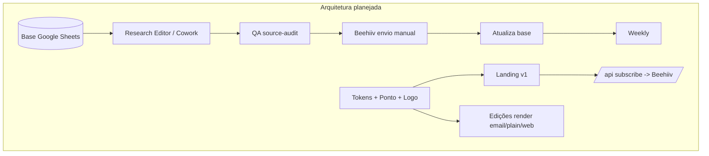
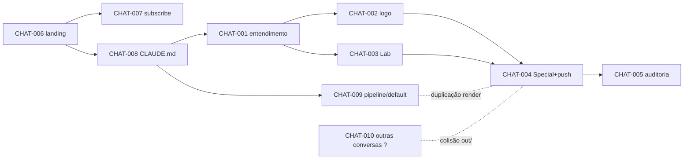

# Project Intelligence Report

> Auditoria integral do projeto **The Loyalty**. Modo somente-leitura — nenhum
> arquivo de código foi alterado, nenhum commit/push/deploy executado.
> Este arquivo (`PROJECT_INTELLIGENCE_REPORT.md`) é um artefato de análise **não
> versionado** (untracked); não foi commitado, conforme as regras de segurança da auditoria.

## Sumário navegável

- [0. Metadados da auditoria](#0-metadados-da-auditoria)
- [1. Veredito executivo](#1-veredito-executivo)
- [2. Resumo geral](#2-resumo-geral)
- [3. Inventário de fontes e cobertura](#3-inventário-de-fontes-e-cobertura)
- [4. Linha do tempo consolidada](#4-linha-do-tempo-consolidada)
- [5. Arquitetura planejada](#5-arquitetura-planejada)
- [6. Arquitetura implementada](#6-arquitetura-implementada)
- [7. Diferenças planejado × implementado](#7-diferenças-planejado--implementado)
- [8. Inventário de componentes](#8-inventário-de-componentes)
- [9. Mapa individual dos chats](#9-mapa-individual-dos-chats)
- [10. Dependências e relações entre chats](#10-dependências-e-relações-entre-chats)
- [11. Matriz de decisões](#11-matriz-de-decisões)
- [12. Matriz de rastreabilidade](#12-matriz-de-requisitos-e-rastreabilidade)
- [13. Auditoria de código e lógica](#13-auditoria-de-código-e-lógica)
- [14. Auditoria de testes e validações](#14-auditoria-de-testes-e-validações)
- [15. Contradições, redundâncias e sobreposições](#15-contradições-redundâncias-e-sobreposições)
- [16. Pendências consolidadas](#16-pendências-consolidadas)
- [17. Dívida técnica](#17-dívida-técnica)
- [18. Riscos e bloqueios](#18-riscos-e-bloqueios)
- [19. Decisões em aberto](#19-decisões-em-aberto)
- [20. Ciclos abertos](#20-ciclos-abertos)
- [21. Backlog priorizado](#21-backlog-priorizado)
- [22. Plano de fechamento de ciclos](#22-plano-de-fechamento-de-ciclos)
- [23. Itens que podem ser encerrados](#23-itens-que-podem-ser-encerrados)
- [24. Itens que precisam ser refeitos](#24-itens-que-precisam-ser-refeitos)
- [25. Itens que devem ser descartados](#25-itens-que-devem-ser-descartados)
- [26. Itens que exigem decisão humana](#26-itens-que-exigem-decisão-humana)
- [27. Itens que exigem validação técnica](#27-itens-que-exigem-validação-técnica)
- [28. Próximas ações recomendadas](#28-próximas-ações-recomendadas)
- [29. Respostas finais](#29-respostas-finais)
- [30. Apêndice de evidências](#30-apêndice-de-evidências)

---

## 0. Metadados da auditoria

| Campo | Valor |
|---|---|
| Data da auditoria | 2026-07-15T12:29Z (UTC) |
| Diretório analisado | `/home/user/theloyal` |
| Repositório | `mzinhoww-svg/theloyal` |
| Branch atual | `claude/loyalty-system-architecture-0cwx3h` |
| Commit HEAD | `ca382c2c3acac44d413ebb3026fde8f459dfbfea` (`ca382c2`) |
| Alterações locais | **Nenhuma** (`git status --porcelain` vazio; working tree limpo antes deste relatório) |
| Branch default (origin/HEAD) | `claude/loyalty-landing-page-v1-7vbjq7` |
| Stack | Next.js 14.2.15 · React 18.3 · TypeScript 5.5 (strict) · Tailwind 3.4 · zero dependência de runtime além de next/react |
| Fontes disponíveis | Working tree (branch atual), git de ambas as branches, 5 docs de marca enviados nesta sessão, transcrição de 5 fronts desta sessão |
| Fontes ausentes | 6 docs de marca referenciados e não versionados; transcrições de 4 fronts inferidos por git; cluster "outras conversas" (HTMLs em andamento) — ver §3 |
| Cobertura documental | Alta para o working tree; **parcial** para o projeto (branch default não está no working tree; auditada via git, sem execução) |
| Limitações-chave | (a) O "projeto" está **dividido em 2 branches divergentes**; (b) as conversas que produziram a maior parte do código **não estão acessíveis** como transcrição — foram reconstruídas a partir de commits e código; (c) não há testes nem lint para validar comportamento. |

**Nomenclatura de status** (§6 do prompt) e **níveis de evidência** A–E (§7) são usados em todo o documento.

---

## 1. Veredito executivo

1. **Estado geral:** O projeto é um **monorepo editorial de mídia (The Loyalty)** com duas frentes reais — (1) um **produto web**: landing page de captação Next.js + rota de inscrição Beehiiv; (2) uma **operação editorial**: pipeline de validação/renderização de edições + peças renderizadas (Lab, Special) + skills. A frente (1) está madura e compila; a frente (2) está **fragmentada em duas branches que divergiram** e nunca foram reconciliadas.
2. **Conclusão global estimada:** **55%–70%** (confiança **média**). Pesos: produto web 40%, operação editorial 35%, sistema de marca/design 15%, governança (testes/CI/docs) 10%. O produto web puxa para cima; governança e a fragmentação de branch puxam para baixo.
3. **Nível de confiança:** Médio. Build e typecheck da branch atual passam (NÍVEL A); a branch default e a integração real do Beehiiv **não foram executadas** (NÍVEL B/C).
4. **Principais entregas reais (comprovadas):** landing page que builda (NÍVEL A, `next build` ok); rota `POST /api/subscribe` com honeypot, rate-limit, validação e modo mock (NÍVEL B); sistema de tokens Tailwind + contrato de marca `CLAUDE.md` (NÍVEL A); sistema de logo v1 em `assets/logo/` + `components/Logo.tsx` (NÍVEL A, builda); digests Lab/Special em `out/` (NÍVEL A, arquivos presentes); pipeline editorial `scripts/*.mjs` + schema (NÍVEL B, **só na branch default**).
5. **Principais lacunas:** zero testes; lint não configurado; logo entregue mas **não integrado** ao site; duas branches divergentes sem estratégia de merge; integração real do Beehiiv **nunca exercida**; 6 documentos de marca referenciados e ausentes.
6. **Principais bloqueios:** **BLOCK-001** — divergência de branch impede um "estado único" do projeto e torna qualquer merge ingênuo destrutivo (um merge de `system-architecture`→default apagaria a pipeline editorial; comprovado por `git diff` na sessão anterior).
7. **Principais riscos:** **RISK-001 (crítico)** divergência de branch/fonte-da-verdade; **RISK-002 (alto)** ausência total de testes/lint no único backend; **RISK-003 (alto)** caminho real do Beehiiv não verificado.
8. **Próximas cinco ações:** (1) decidir a branch fonte-da-verdade e o plano de merge (DEC pendente); (2) reconciliar as duas frentes numa branch só sem perda; (3) configurar lint + 1 smoke test da rota subscribe; (4) decidir adoção do logo/favicon no site; (5) versionar (ou descartar formalmente) os 6 docs de marca ausentes.
9. **O que NÃO iniciar agora:** não fazer merge `system-architecture`→default sem rebase (destrutivo); não trocar o favicon do Ponto sem decisão registrada; não publicar digests via envio automático (o design prevê envio manual).
10. **Prontidão:** O produto web está **pronto para continuar e testar**; o projeto como um todo precisa ser **estabilizado** (reconciliar branches + governança mínima) antes de refatorar ou publicar em produção com confiança.

---

## 2. Resumo geral

**O que o projeto é.** The Loyalty é uma mídia vertical independente sobre loyalty/pontos/milhas/cartões. O repositório contém o **produto digital** dessa mídia: a landing de captação de assinantes e a maquinaria editorial que transforma uma edição (JSON) em e-mail/texto/web, além do sistema visual (tokens, mascote Ponto, logo) que materializa o contrato de marca do `CLAUDE.md`.

**Como evoluiu.** (1) Init + landing v1 + favicon do mascote (2026-07-08). (2) Integração real do formulário com o Beehiiv e ajustes (07-08→07-09). (3) `CLAUDE.md` (contrato de marca) em 2026-07-09 — **ponto de bifurcação**. A partir daí o histórico se divide: a branch **default** ganhou a **pipeline editorial** (schema, scripts, página de edição, skills); a branch **atual** ganhou o **logo v1** e os **digests** (Lab/Special).

**Como está estruturado.** App Router do Next.js 14; UI em `components/`; tokens em `tailwind.config.ts`; único backend em `app/api/subscribe/route.ts`; conteúdo/pipeline em `content/` + `scripts/` (só default); saídas renderizadas em `out/`.

**O que existe / o que não existe.** Ver §8 (inventário) e §7 (planejado × implementado). Existe: landing, subscribe, tokens, logo, digests, pipeline (default). Não existe: testes, lint/CI, integração do logo no site, edição real (só ilustrativa), 6 docs de marca.

**Onde estão os maiores problemas.** Fragmentação de branch (RISK-001/BLOCK-001), governança de qualidade zero (DEBT-001/002/003), e duas implementações concorrentes de renderização de digest (CONFLICT-002).

**O que precisa acontecer em seguida.** §28 e §22 (plano em ondas). Em uma frase: **reconciliar as duas branches numa fonte-da-verdade única e adicionar governança mínima** antes de avançar features.

Subseções detalhadas (linha do tempo, arquitetura, componentes, pendências, dívida, decisões, riscos, próximos passos) estão nas seções numeradas correspondentes abaixo, para evitar duplicação de identificadores.

---

## 3. Inventário de fontes e cobertura

### 3.1 Fontes disponíveis e analisadas

| Fonte | Tipo | Acesso | Cobertura |
|---|---|---|---|
| Working tree `system-architecture` | Código | Total | Integral (lido/typecheck/build) |
| Git `system-architecture` (12 commits até `ca382c2`) | VCS | Total | Integral |
| Git `origin/loyalty-landing-page-v1` (default) | VCS | Leitura via `git show`/`ls-tree` | **Parcial** (sem execução; working tree não contém) |
| `CLAUDE.md` | Doc contrato de marca | Total (repo) | Integral |
| `README.md`, `.env.example`, `content/README.md`, `COWORK.md` | Docs | Total | Integral |
| Uploads da sessão: `THE-LOYALTY-LLM-SYSTEM.md`, `DESIGN.md`, `THE-LOYALTY-BRAND-GUIDELINES.md`, `theloyaltybrandkit.json`, `Operating Manual v1.docx` | Docs de marca | Total (upload; **não versionados no repo**) | Integral |
| Transcrição desta sessão (5 fronts) | Chat | Total | Integral |

### 3.2 Fontes ausentes ou inacessíveis (`FONTE_MENCIONADA_MAS_INACESSÍVEL`)

| ID | Fonte | Onde foi mencionada | Relevância | Parte prejudicada | O que forneceria |
|---|---|---|---|---|---|
| MISS-01 | `PONTO-MASCOTE-GUIA.md` | `CLAUDE.md` (hierarquia), pedido do usuário | Regras completas do mascote | Auditoria do Ponto fica no resumo do LLM-SYSTEM | O arquivo |
| MISS-02 | `TL-GRAPHICS.md` | `CLAUDE.md` | Regras de data-art | Auditoria de `graphics.tsx` vs guia | O arquivo |
| MISS-03 | `competitor-patterns.md` | Pedido do usuário (leitura) | Referência competitiva | Nenhuma peça depende dele hoje | O arquivo |
| MISS-04 | `newsletter-structure.md` | Pedido do usuário | Estrutura da news | Coberto pelo Operating Manual §3 | O arquivo (ou confirmar que OM basta) |
| MISS-05 | `automation-flow.md` | Pedido do usuário | Fluxo de automação | Coberto pelo OM §11/§12 | O arquivo |
| MISS-06 | `data-schema.md` | Pedido do usuário | Schema de dados (Sheets) | Coberto por OM §10 + `edition.schema.json` | O arquivo |
| MISS-07 | "Outras conversas" (HTMLs em andamento) | Usuário (front CHAT-004): *"estamos terminando os html em outras conversas"* | Podem colidir/duplicar com `out/` | Análise cruzada de duplicidade fica incompleta | Export dessas conversas / lista de arquivos que produzirão |
| MISS-08 | Transcrição do front "Landing page v1" | Inferida de commits `cad07cc`… | Intenção/decisões da landing | Contexto/decisões só inferidos do código | Export do chat |
| MISS-09 | Transcrição do front "Beehiiv subscribe" | Inferida de commits `1babc10`,`7698af9`,`e470248`,`09fc7da` | Decisões de integração | Idem | Export do chat |
| MISS-10 | Transcrição do front "CLAUDE.md" | Inferida de `2e30d5e` | Origem do contrato | Idem | Export do chat |
| MISS-11 | Transcrição do front "Pipeline editorial" | Inferida de `0aa76fc`,`ea5ada7` (default) | Decisões da pipeline | Idem | Export do chat |

### 3.3 Cobertura de chats

| Métrica | Valor |
|---|---|
| Chats identificados | **10** (CHAT-001…010) |
| Analisados integralmente (transcrição em contexto) | **5** (CHAT-001…005, desta sessão) |
| Analisados parcialmente (código acessível, transcrição inacessível) | **4** (CHAT-006…009) |
| Inacessíveis (sem transcrição e sem código atribuível no escopo) | **1** (CHAT-010) |
| **Efetivamente analisados (integral + parcial)** | **9** |
| Cobertura documental (working tree) | ~95% |
| Cobertura de chats (transcrição) | ~50% (5/10 com transcrição direta) |

**Limitação declarada:** a auditoria **não está completa** no sentido de transcrições — metade dos fronts foi reconstruída por evidência técnica (git/código), não por conversa. Isso é suficiente para decisões de engenharia, mas insuficiente para reconstruir *intenção original* de CHAT-006…009.

---

## 4. Linha do tempo consolidada

Datas = author date do git (dia; horário não confiável). `DATA_NÃO_CONFIRMADA` onde ausente.

| Data | Evento | Chat | Commit/Fonte | Componente | Tipo | Impacto | Evid. |
|---|---|---|---|---|---|---|---|
| 2026-07-08 | Init do repositório | CHAT-006 | `989d662` | repo | init | base | A |
| 2026-07-08 | Landing page v1 (Next+Tailwind) | CHAT-006 | `cad07cc` | COMP-001..010 | feat | alto | A |
| 2026-07-08 | Favicon Ponto + token caramel | CHAT-006 | `c3cab2a` | COMP-011, COMP-019 | feat | médio | A |
| 2026-07-08 | TLBadge exige score (exceto não-confirmado) | CHAT-006 | `9e85bce` | COMP-006 | refactor | baixo | A |
| 2026-07-08 | Doc do ponto de integração do form | CHAT-007 | `f55aef6` | COMP-004 | docs | baixo | A |
| 2026-07-08 | Ano do copyright dinâmico | CHAT-006 | `c95fc92` | COMP-002 | fix | baixo | A |
| 2026-07-08 | Título do 6º princípio | CHAT-006 | `088a8f7` | COMP-003 | fix | baixo | A |
| 2026-07-08 | Integração real do form com Beehiiv | CHAT-007 | `1babc10` | COMP-005 | feat | alto | A |
| 2026-07-09 | Trim das env vars + modo diagnóstico | CHAT-007 | `7698af9` | COMP-005 | chore | médio | A |
| 2026-07-09 | Tolera `BEEHIIV_PUBLICATION_ID` sem `pub_` | CHAT-007 | `e470248` | COMP-005 | fix | médio | A |
| 2026-07-09 | Remove diagnóstico, restaura welcome email | CHAT-007 | `09fc7da` | COMP-005 | chore | médio | A |
| 2026-07-09 | **`CLAUDE.md` (contrato de marca)** — bifurcação | CHAT-008 | `2e30d5e` | COMP-020 | docs | alto | A |
| 2026-07-09 | Pipeline editorial validate/render/publish (Daily) | CHAT-009 | `0aa76fc` (default) | COMP-015 | feat | alto | B |
| 2026-07-09 | Schema editorial + página de edição + skills | CHAT-009 | `ea5ada7` (default) | COMP-014,016,017 | feat | alto | B |
| 2026-07-09 | **Logo v1** (wordmark/monograma/favicon) | CHAT-002 | `aa17426` (atual) | COMP-012 | feat | médio | A |
| 2026-07-09 | **Digests** Lab (CPM) + Special (CPM final) | CHAT-003/004 | `ca382c2` (atual) | COMP-013 | content | médio | A |
| 2026-07-15 | Entendimento da marca (sem código) | CHAT-001 | sessão | — | análise | baixo | A |
| 2026-07-15 | Esta auditoria (sem código) | CHAT-005 | sessão | — | análise | — | A |

> Nota temporal: os commits do logo/digests e da pipeline têm a **mesma data (07-09)** mas vivem em **branches distintas** — a bifurcação é estrutural, não cronológica linear.

---

## 5. Arquitetura planejada

Fontes: `CLAUDE.md`, Operating Manual v1 (§8/§11/§12/§13), DESIGN.md, LLM-SYSTEM, brand kit.

- **Produto web (landing v1):** Next.js/Astro + TS + Tailwind, hero, form na 1ª dobra, seções (O que recebe / Para quem / Como analisamos / exemplo de edição / princípios / CTA / footer), form integrado ao Beehiiv, SEO básico, zero dependência complexa. *(OM §13.1)*
- **Operação editorial:** base em Google Sheets (Sources/Items/Editions/Benchmarks/Sponsor Prospects) → Research Editor no Claude Cowork (`/daily-research`, `/daily-newsletter`, `/weekly-memo`, `/source-audit`, `/deal-calc`, `/edition-zero`) → QA (source-audit) → Beehiiv (envio manual no MVP) → atualização da base → weekly. *(OM §10/§11/§12)*
- **Sistema visual:** tokens fixos (Ink/Paper/Surface/…); Fraunces/Inter/JetBrains Mono; componentes canônicos (TLBadge, ContaBlock, SectionLabel, CompareBanner…); mascote Ponto com regras; logo (wordmark tipográfico + monograma TL; favicon = monograma TL). *(CLAUDE.md, brand kit)*
- **Automação em fases (OM §12):** Fase 1 base Sheets → 2 pesquisa → 3 QA → 4 Beehiiv → 5 atualização base → 6 weekly → 7 landing/lead magnets. Controle humano obrigatório até 15–20 edições sem erro.



---

## 6. Arquitetura implementada

Baseada em código atual (branch atual) + git (branch default). **Entrypoints:** App Router (`app/`). **Backend:** único route handler `app/api/subscribe/route.ts` (runtime nodejs). **Bancos/filas/jobs:** nenhum. **Infra declarada:** nenhuma (sem `vercel.json`, sem CI). **Integração externa:** Beehiiv (HTTP, server-only).

```mermaid
flowchart TD
  User((Leitor)) -->|GET /| Page[app/page.tsx]
  Page --> Shell[shell.tsx Nav/Hero/Footer]
  Page --> Sections[sections.tsx]
  Page --> Mock[EdicaoMock.tsx]
  Page --> Graphics[graphics.tsx]
  Shell --> Form[SubscribeForm.tsx]
  Form -->|POST /api/subscribe| Route[route.ts]
  Route -->|creds?| Beehiiv[(Beehiiv API v2)]
  Route -->|sem creds| MockResp[mock ok]
  UI[ui.tsx TLBadge/ContaBlock/...] --> Sections
  UI --> Mock
  Ponto[PontoMascot.tsx] --> Shell
  Tokens[tailwind.config.ts] --> Page
  Logo[Logo.tsx + assets/logo] -.NÃO importado.-> Page

  subgraph SÓ_NA_BRANCH_DEFAULT
    Sch[content/edition.schema.json] --> Scripts[scripts/validate|render|publish.mjs]
    Scripts --> Out[out/email|plain|qa]
    Lib[lib/editions.ts] --> Edicao[app/edicao/*]
    Article[EditionArticle.tsx] --> Edicao
    Skills[.claude/skills/tl-*]
  end

  subgraph SÓ_NA_BRANCH_ATUAL
    LabOut[out/lab/*] 
    SpecOut[out/special/*]
  end
```

**Observações-chave:**
- `components/Logo.tsx` e `assets/logo/*` existem no working tree mas **não são importados por nenhuma página** → componente órfão (COMP-012). Evidência: `grep` de import de `Logo` não retorna consumidores; build lista apenas `/`, `/api/subscribe`, `/icon.svg`, `/apple-icon.png`, `/_not-found`.
- A pipeline editorial (COMP-014/015/016/017) **não existe no working tree atual** — só em `origin/loyalty-landing-page-v1`. Portanto a branch atual **não** renderiza `/edicao`.
- Os digests da branch atual (`out/lab`, `out/special`) foram **escritos à mão**, não gerados por `scripts/render.mjs` (que vive na outra branch) → duplicação de mecanismo (CONFLICT-002).

---

## 7. Diferenças planejado × implementado

| # | Planejado | Existe? | Falta | Alterado? | Decisão registrada? | Impacto | Risco | Recomendação |
|---|---|---|---|---|---|---|---|---|
| D1 | Landing v1 completa | Sim (COMP-001..010) | Deploy verificado, testes | Não | Sim (CLAUDE.md) | — | Baixo | Manter; testar |
| D2 | Form → Beehiiv | Sim (COMP-005) | Verificação real do caminho pago | Fallback mock adicionado | DEC-008 | Médio | Alto (RISK-003) | Exercer com credencial de teste |
| D3 | Favicon = monograma TL (brand kit) | **Não** — favicon é o Ponto | Adoção do TL | Sim, divergiu do brand kit | DEC-002 (usuário: manter Ponto) | Baixo | Baixo | Registrar exceção no CLAUDE.md ou trocar |
| D4 | Logo oficial | Sim (COMP-012), **não integrado** | Uso em Nav/Footer/favicon | — | DEC-001/003 | Médio | Baixo | Wire no shell (CYCLE-001) |
| D5 | Base Google Sheets | **Não** | Tudo | — | — | Alto (operação) | Médio | Fora do repo; decidir escopo |
| D6 | Cowork Research Editor + comandos | Parcial: 2 skills (`tl-digest-template`, `tl-source-audit`) na default | `/daily-research`, `/weekly-memo`, `/deal-calc`, `/edition-zero` | — | DEC-010 | Alto | Médio | Confirmar escopo do MVP |
| D7 | Pipeline edição→email/plain/web | Sim, **só na default** (COMP-014/015/016) | Merge para linha única; edição real | — | DEC-012 | Alto | Alto (RISK-001) | Reconciliar branches |
| D8 | Envio Beehiiv manual | Sim (design) | — | — | DEC-010 | — | Baixo | Manter |
| D9 | SEO básico/responsivo | Parcial (metadata pt-BR no layout) | Auditoria SEO | — | — | Baixo | Baixo | Validar |
| D10 | Testes/CI/QA automatizado | **Não** | Suite + lint + CI | — | — | Médio | Alto (RISK-002) | Governança mínima |

---

## 8. Inventário de componentes

Legenda de estado: usa a taxonomia §6. "Testes": não há testes em nenhum componente (DEBT-001).

| ID | Componente | Objetivo | Localização | Branch | Estado | Testes | Doc | Risco |
|---|---|---|---|---|---|---|---|---|
| COMP-001 | Landing page | Home de captação | `app/page.tsx` | ambas | CONCLUÍDO_NÃO_VALIDADO | Não | CLAUDE.md/README | Baixo |
| COMP-002 | Shell (Nav/Hero/Footer) | Estrutura sticky | `components/shell.tsx` | ambas | CONCLUÍDO_NÃO_VALIDADO | Não | Sim | Baixo |
| COMP-003 | Seções | Problema/Método/etc. | `components/sections.tsx` | ambas | CONCLUÍDO_NÃO_VALIDADO | Não | Sim | Baixo |
| COMP-004 | SubscribeForm | Form + honeypot + aria-live | `components/SubscribeForm.tsx` | ambas | CONCLUÍDO_NÃO_VALIDADO | Não | Sim | Médio |
| COMP-005 | Subscribe API | Inscrição Beehiiv server-only | `app/api/subscribe/route.ts` | ambas | IMPLEMENTADO_PARCIALMENTE (real path NÃO_TESTADO) | Não | README | **Alto** |
| COMP-006 | ui.tsx | Reveal/SectionLabel/TLBadge/ContaBlock | `components/ui.tsx` | ambas | CONCLUÍDO_NÃO_VALIDADO | Não | CLAUDE.md | Baixo |
| COMP-007 | PontoMascot | Mascote SVG | `components/PontoMascot.tsx` | ambas | CONCLUÍDO_NÃO_VALIDADO | Não | CLAUDE.md | Baixo |
| COMP-008 | graphics.tsx | Data-art (Sparkline/LedgerTexture…) | `components/graphics.tsx` | ambas | CONCLUÍDO_NÃO_VALIDADO | Não | CLAUDE.md | Baixo |
| COMP-009 | EdicaoMock | Edição exemplo (sem Ponto) | `components/EdicaoMock.tsx` | ambas | CONCLUÍDO_NÃO_VALIDADO | Não | Sim | Baixo |
| COMP-010 | Layout/fonts/globals | Fontes, metadata, skip link | `app/layout.tsx`,`app/globals.css` | ambas | CONCLUÍDO_NÃO_VALIDADO | Não | Sim | Baixo |
| COMP-011 | Favicon Ponto | Ícone do App Router | `app/icon.svg`,`app/apple-icon.png` | ambas | CONCLUÍDO_NÃO_VALIDADO / CONFLITANTE (vs brand kit) | Não | CLAUDE.md | Baixo |
| COMP-012 | **Sistema de logo v1** | Wordmark/monograma/favicon TL | `assets/logo/*`,`components/Logo.tsx` | **atual** | IMPLEMENTADO_PARCIALMENTE (**órfão** — não importado) | Não | `assets/logo/README.md` | Médio |
| COMP-013 | **Digests Lab/Special** | Peças renderizadas (4 formatos) | `out/lab/*`,`out/special/*` | **atual** | CONCLUÍDO_NÃO_VALIDADO (ilustrativos) | Não | `out/README.md` | Baixo |
| COMP-014 | Edition schema | Modelo JSON da edição | `content/edition.schema.json` | **default** | CONCLUÍDO_NÃO_VALIDADO | Não | `content/README.md` | Médio |
| COMP-015 | Pipeline scripts | validate/render/publish (ESM) | `scripts/*.mjs` | **default** | IMPLEMENTADO_PARCIALMENTE / NÃO_VERIFICÁVEL aqui | Não | `content/README.md` | Médio |
| COMP-016 | Página de edição | `/edicao` web | `app/edicao/*`,`components/EditionArticle.tsx`,`lib/editions.ts` | **default** | CONCLUÍDO_NÃO_VALIDADO | Não | — | Médio |
| COMP-017 | Skills TL | `tl-digest-template`,`tl-source-audit` | `.claude/skills/*` | **default** | CONCLUÍDO_NÃO_VALIDADO | Não | SKILL.md | Baixo |
| COMP-018 | Cowork config | Research Editor | `COWORK.md` | **default** | PLANEJADO/DOC | — | Sim | Baixo |
| COMP-019 | Tokens Tailwind | Fonte única de hex | `tailwind.config.ts` | ambas | CONCLUÍDO_VALIDADO (build usa) | Indireto | CLAUDE.md | Baixo |
| COMP-020 | Contrato de marca | Regras invioláveis | `CLAUDE.md` | ambas | CONCLUÍDO_VALIDADO | — | — | Baixo |

**Classificação especial:**
- **Órfãos:** COMP-012 (logo não importado).
- **Ausentes do working tree atual (existem só na default):** COMP-014/015/016/017/018.
- **Conflitantes:** COMP-011 (favicon vs brand kit).
- **Duplicação de mecanismo:** COMP-013 (hand-authored) vs COMP-015 (`render.mjs`).
- **Quebrados:** nenhum comprovadamente (build/typecheck ok).

---

## 9. Mapa individual dos chats

> Fichas completas dos fronts **acessíveis** (CHAT-001..005, transcrição integral). Fronts **inferidos** (CHAT-006..009) têm ficha reduzida (código acessível, transcrição = MISS-08..11). CHAT-010 é inacessível.

### CHAT-001 · Marca. Leitura do sistema e devolução do entendimento. Fase de alinhamento
**Identificação:** original "Leia os arquivos de sistema…"; fonte: sessão 2026-07-15; predecessor: CHAT-008 (CLAUDE.md); sucessores: CHAT-002/003/004.
**Contexto recebido:** explícito — 7 arquivos a ler em ordem; CLAUDE.md no contexto. Ausente — 6 dos 7 arquivos não existiam no repo no início (só CLAUDE.md/README). Assumido: nada indevido.
**Objetivo:** devolver entendimento de marca, hard rules, regras do Ponto, ordem de entregáveis, critérios de aceite; **não gerar nada**. Alcançado: sim.
**Planejou:** apenas ler e sintetizar. Sem plano de código.
**Declarou ter feito:** leitura + síntese. **Comprovado** (resposta presente; nenhum arquivo alterado — `git` sem commits nesse turno).
**Realmente feito:** sinalizou corretamente que os arquivos não existiam (NÍVEL A). Depois recebeu 5 uploads e sintetizou.
**Decisões:** DEC (nenhuma de código). **Lacunas:** dependeu de uploads posteriores; 6 docs seguem ausentes (MISS-01..06).
**Estado final:** CONCLUÍDO_VALIDADO (entrega de análise). Conclusão 100% do escopo dele. Evidência A. Próxima ação: nenhuma.

### CHAT-002 · Marca. Sistema de logo v1. Entregue e commitado, não integrado
**Identificação:** original "Crie a primeira versão do logo oficial"; sucessor: CHAT-004 (push).
**Contexto recebido:** explícito — regras de logo (sem gradiente/avião…, legível 24/48/120, Paper e Ink). Herdado: tokens/CLAUDE.md. 
**Objetivo:** 3 caminhos (wordmark, monograma, favicon) + 2 propostas + recomendação + aplicação + arquivos. Alcançado: sim.
**Planejou:** SVGs + `Logo.tsx` + preview + push + PR.
**Declarou ter feito:** criou `assets/logo/*` (7 svg), `components/Logo.tsx`, `README.md`; preview (Artifact); `npm run build` ok; push; **não** abriu PR; **não** trocou favicon.
**Verificação:** todos os arquivos **presentes** no working tree e no commit `aa17426` (NÍVEL A); build ok (NÍVEL A). PR ausente = **conforme decisão** (DEC-003). 
**Decisões:** **DEC-001** logo híbrido (wordmark tipográfico + monograma construído) — vigente. **DEC-002** manter favicon Ponto; TL só como asset — vigente (usuário), **conflita** com brand kit → CONFLICT-001. **DEC-003** não abrir PR agora — vigente.
**Lacunas:** COMP-012 **órfão** (não importado no site) — PEND-003; SVGs de wordmark usam `<text>` Fraunces (fallback Georgia) — para e-mail/PDF precisa converter em contorno (documentado no README).
**Estado final:** IMPLEMENTADO_PARCIALMENTE. Conclusão **70%** (70% = implementação principal presente; falta integração/adoção). Evidência A. Próxima ação: wire no shell + decidir favicon.

### CHAT-003 · Editorial. Loyalty Lab (CPM) render. Peça evergreen entregue
**Identificação:** original "Você é o renderer do The Loyalty Lab".
**Contexto recebido:** estrutura de 11 seções + regras (sem exemplo inventado, Ponto fora de contas). 
**Objetivo:** peça educativa evergreen (HTML/e-mail/plain/QA). Alcançado: sim.
**Declarou ter feito:** HTML web (Artifact), e-mail, plain, QA. **Verificação:** entregues como Artifact + arquivos; **commitados depois** por CHAT-004 em `out/lab/*` (NÍVEL A).
**Decisões:** **DEC-004** números ilustrativos rotulados (não inventar oferta real) — vigente; Ponto no topo/rodapé, fora da conta — conforme guia.
**Lacunas:** peça é *método*, não edição real; não passou pela pipeline canônica (CONFLICT-002).
**Estado final:** CONCLUÍDO_NÃO_VALIDADO. Conclusão **70%** (falta publicação/edição real/validação editorial por fonte). Evidência A (arquivos).

### CHAT-004 · Editorial. The Loyalty Special (CPM final) + push dos digests. Commitado
**Identificação:** original "Você é o renderer do The Loyalty Special"; + pedido no meio: *"suba tudo que criou de html dos digests"*.
**Contexto recebido:** estrutura de 8 seções + regras (foco único, densidade, sem filler). Menção a **outras conversas** (MISS-07/CHAT-010).
**Declarou ter feito:** Special (web/e-mail/plain/QA); versões repo-friendly (Google Fonts via link); `git add -f out/`; commit `ca382c2`; push. **Sem PR**.
**Verificação:** `out/lab/*` e `out/special/*` presentes e commitados (NÍVEL A); push confirmado (`ca382c2..origin`).
**Decisões:** **DEC-005** omitir Ponto no Special (credibilidade vence) — vigente. **DEC-006** `git add -f` (out/ é ignorado) — vigente, **frágil** (DEBT-006). **DEC-007** web do repo usa Google Fonts por link — vigente, tensiona a regra "self-contained" (PEND-013).
**Lacunas:** duplicação com `scripts/render.mjs` (CONFLICT-002); coordenação com "outras conversas" desconhecida (RISK de colisão em `out/`).
**Estado final:** CONCLUÍDO_NÃO_VALIDADO. Conclusão **70%**. Evidência A.

### CHAT-005 · Governança. Auditoria integral do projeto (este relatório)
**Identificação:** original prompt de auditoria (2×) + "subiu? quais os links".
**Objetivo:** gerar `PROJECT_INTELLIGENCE_REPORT.md` em modo leitura. 
**Declarou/feito:** coleta de evidências (git/código/build/typecheck) e este arquivo. Sem alteração de código.
**Estado final:** EM_ANDAMENTO→CONCLUÍDO ao salvar o relatório. Conclusão 100% ao término. Evidência A.

### CHAT-006 · Produto. Landing page v1. Base do produto *(inferido — transcrição MISS-08)*
Código acessível: `cad07cc` e correlatos. Entregas: COMP-001..010, COMP-011, COMP-019. Estado: CONCLUÍDO_NÃO_VALIDADO. Decisões inferidas: **DEC-011** zero dependência complexa (vigente). Lacuna: sem testes.

### CHAT-007 · Produto. Integração Beehiiv do formulário *(inferido — MISS-09)*
Código: `1babc10`,`7698af9`,`e470248`,`09fc7da`. Entrega: COMP-005. Estado: IMPLEMENTADO_PARCIALMENTE (real path NÃO_TESTADO). Decisões: **DEC-008** modo mock sem credencial; **DEC-009** rate-limit em memória (DEBT-004). Histórico mostra ciclo de depuração de 401/404 (trim de env, prefixo `pub_`) — indício de que o caminho real **já deu erro antes** e foi corrigido às cegas sem teps automatizado.

### CHAT-008 · Governança. Contrato de marca CLAUDE.md *(inferido — MISS-10)*
Código: `2e30d5e`. Entrega: COMP-020. Estado: CONCLUÍDO_VALIDADO (é a fonte de regras usada pelas peças). É o **ponto de bifurcação** das branches.

### CHAT-009 · Editorial. Pipeline do Daily (schema/scripts/edição/skills) *(inferido — MISS-11; só na branch default)*
Código: `0aa76fc`,`ea5ada7` (default). Entregas: COMP-014/015/016/017/018. Estado: IMPLEMENTADO_PARCIALMENTE / NÃO_VERIFICÁVEL nesta auditoria (não está no working tree; não executei). Decisões: **DEC-010** envio manual; **DEC-012** edição JSON única alimenta 3 saídas. Só existe 1 edição (`0027.json`), marcada como ilustrativa via campo `illustrative` do schema.

### CHAT-010 · "Outras conversas" — HTMLs em andamento *(INACESSÍVEL — MISS-07)*
Mencionado por CHAT-004. Sem transcrição e sem código atribuível no escopo. Risco de colidir/duplicar `out/`. Não auditável.

---

## 10. Dependências e relações entre chats

| Chat | Predecessores | Sucessores | Trabalha nos mesmos arquivos que |
|---|---|---|---|
| CHAT-006 landing | — | 007,008 | 007 (form), 002 (components) |
| CHAT-007 subscribe | 006 | — | — |
| CHAT-008 CLAUDE.md | 006 | 001,002,003,004,009 | — |
| CHAT-009 pipeline (default) | 008 | — | 013 (out/), 003/004 (digests) |
| CHAT-001 entendimento | 008 | 002,003,004 | — |
| CHAT-002 logo | 001,008 | 004 | 006 (components/, app/) |
| CHAT-003 Lab | 001,008 | 004 | 009 (renderização) |
| CHAT-004 Special+push | 003,002 | 005 | 009 (out/ + render), 010 (out/) |
| CHAT-005 auditoria | todos | — | — |



- **Chats isolados:** nenhum totalmente isolado (todos herdam de CLAUDE.md).
- **Chats sobrepostos:** CHAT-004 × CHAT-009 (renderização de digest); CHAT-004 × CHAT-010 (`out/`).
- **Chats contraditórios:** CHAT-002 × CHAT-009 estão em **branches divergentes** (CONFLICT-003).
- **Que deveriam ser consolidados:** CHAT-002+CHAT-004 (atual) e CHAT-009 (default) numa única linha.
- **Que desconhecem decisões anteriores:** CHAT-002/004 (atual) foram construídos **sem** a pipeline da default no working tree — renderizaram digests à mão em vez de usar `scripts/render.mjs`.

---

## 11. Matriz de decisões

| ID | Decisão | Chat | Data | Impacto | Implementada | Validada | Vigência | Substitui/Conflito |
|---|---|---|---|---|---|---|---|---|
| DEC-001 | Logo híbrido (wordmark tipográfico + monograma construído) | 002 | 07-09 | Marca | Sim | Parcial (build) | Vigente | — |
| DEC-002 | Manter favicon Ponto; TL só como asset | 002 | 07-09 | Marca | Sim | — | Vigente | CONFLICT-001 (vs brand kit) |
| DEC-003 | Não abrir PR agora | 002/004 | 07-09 | Processo | Sim | — | Vigente | — |
| DEC-004 | Números de digest ilustrativos e rotulados | 003/004 | 07-09 | Editorial | Sim | — | Vigente | — |
| DEC-005 | Omitir Ponto no Special | 004 | 07-09 | Editorial | Sim | — | Vigente | — |
| DEC-006 | `git add -f out/` (out/ ignorado) | 004 | 07-09 | Repo | Sim | A | Vigente | DEBT-006, CONFLICT-004 |
| DEC-007 | Digest web do repo via Google Fonts link | 004 | 07-09 | Render | Sim | — | Vigente | PEND-013 |
| DEC-008 | Subscribe: modo mock sem credencial | 007 | 07-08 | Backend | Sim | B | Vigente | — |
| DEC-009 | Rate-limit em memória (best-effort) | 007 | 07-09 | Backend | Sim | B | Vigente | DEBT-004 |
| DEC-010 | Envio Beehiiv manual (sem automação) | 009 | 07-09 | Operação | Sim (design) | — | Vigente | — |
| DEC-011 | Zero dependência complexa (só next/react) | 006/008 | 07-08 | Arquitetura | Sim | A | Vigente | — |
| DEC-012 | Edição JSON única → email/plain/web | 009 | 07-09 | Editorial | Sim (default) | B | Vigente na default | CONFLICT-002 |

Nenhuma decisão foi formalmente **substituída**; as tensões são **conflitos entre branches/fontes** (§15), não substituições cronológicas.

---

## 12. Matriz de requisitos e rastreabilidade

| Requisito | Chats | Decisões | Tarefas | Componentes | Arquivos | Testes | Status | Evid. | Lacuna |
|---|---|---|---|---|---|---|---|---|---|
| REQ-001 Landing de captação | 006 | DEC-011 | TASK-001 | COMP-001..010 | app/page.tsx, components/* | — | CONCLUÍDO_NÃO_VALIDADO | A/B | Sem teste/deploy verificado |
| REQ-002 Inscrição via Beehiiv | 007 | DEC-008/009 | TASK-002 | COMP-005 | route.ts | — | IMPLEMENTADO_PARCIALMENTE | B | Real path NÃO_TESTADO |
| REQ-003 Sistema de marca (tokens/Ponto) | 008 | DEC-011 | TASK-003 | COMP-006/007/008/019/020 | tailwind.config.ts, CLAUDE.md | — | CONCLUÍDO_VALIDADO | A | — |
| REQ-004 Logo oficial | 002 | DEC-001/002 | TASK-004 | COMP-012 | assets/logo/*, Logo.tsx | — | IMPLEMENTADO_PARCIALMENTE | A | Órfão; favicon não adotado |
| REQ-005 Loyalty Lab (evergreen) | 003 | DEC-004 | TASK-005 | COMP-013 | out/lab/* | — | CONCLUÍDO_NÃO_VALIDADO | A | Não publicado; ilustrativo |
| REQ-006 The Loyalty Special | 004 | DEC-004/005 | TASK-006 | COMP-013 | out/special/* | — | CONCLUÍDO_NÃO_VALIDADO | A | Idem |
| REQ-007 Pipeline edição→3 saídas | 009 | DEC-012/010 | TASK-007 | COMP-014/015/016 | content/*, scripts/*, app/edicao/* | — | IMPLEMENTADO_PARCIALMENTE | B | Só default; não executado; 1 edição ilustrativa |
| REQ-008 QA editorial automatizado | 009 | — | TASK-008 | COMP-015/017 | scripts/validate.mjs, skills | — | IMPLEMENTADO_PARCIALMENTE | B | Não executado nesta auditoria |
| REQ-009 Base Google Sheets | (plano OM) | — | TASK-009 | — | — | — | NÃO_INICIADO | E | Nada no repo |
| REQ-010 Testes/CI/Lint | — | — | TASK-010 | — | — | — | NÃO_INICIADO | A | Ausente |

**Leituras da matriz:** REQ-009/010 sem implementação; COMP-012 é implementação **sem consumo** (fora do escopo de uso); REQ-005/006 duplicam o mecanismo de REQ-007 (CONFLICT-002); nenhum requisito tem teste.

---

## 13. Auditoria de código e lógica

**Escopo executado:** working tree da branch atual (produto web). Pipeline da default lida via git (sem execução).

### Achados

| ID | Arquivo | Trecho | Descrição | Sev. | Prob. | Componente | Chat | Recomendação | Critério de validação |
|---|---|---|---|---|---|---|---|---|---|
| DEBT-004 | `app/api/subscribe/route.ts` | `const hits = new Map()` (L14) | Rate-limit em memória por instância; em serverless não é compartilhado e zera no cold start | Média | Alta | COMP-005 | 007 | Store externo (KV/Redis) antes de tráfego real | Rate-limit persiste entre instâncias |
| RISK-003 | `app/api/subscribe/route.ts` | `fetch(...beehiiv...)` (L79) | Caminho real do Beehiiv **nunca exercido**; sucesso presumido | Alta | Média | COMP-005 | 007 | Teste com credencial sandbox + asserção de payload | 1 inscrição real confirmada no Beehiiv |
| OBS-1 | `app/api/subscribe/route.ts` | `catch { provider_error 502 }` | Erros do provedor logados no server e mascarados ao client — **correto** (não vaza), mas some sem alerta/observabilidade | Baixa | Média | COMP-005 | 007 | Adicionar alerta/monitor | Falha do provedor gera alerta |
| PEND-005 | (repo) | ausência de `.eslintrc` | `next lint` cai no wizard interativo → lint **não roda** em CI/headless | Média | Alta | — | — | Criar config (Strict) | `npm run lint` sai 0 sem prompt |
| DEBT-001 | (repo) | ausência de `*.test.*` | Nenhum teste em nenhum componente/rota | Alta | Alta | todos | — | Smoke test da rota + render dos componentes | Suite roda e passa |
| CONFLICT-002 | `out/*` vs `scripts/render.mjs` | dois renderizadores | Digest da branch atual escrito à mão; pipeline canônica na default | Média | Alta | COMP-013/015 | 004/009 | Consolidar num só gerador | Uma única fonte de render |
| PEND-013 | `out/lab/cpm.html`,`out/special/cpm-final.html` | `<link ...fonts.googleapis...>` | Versões web commitadas dependem de host externo (não self-contained) | Baixa | Média | COMP-013 | 004 | Documentar como escolha ou auto-hospedar fonte | Render sem rede externa (se exigido) |
| COMP-012-orphan | `components/Logo.tsx` | sem import | Componente implementado e **nunca chamado** | Média | Alta | COMP-012 | 002 | Integrar no shell ou marcar como biblioteca | `Logo` importado por página |

**Buscas negativas (limpo):** sem `TODO/FIXME/HACK/XXX` reais (o match "METODO" é falso positivo); sem `@ts-ignore`/`eslint-disable`; typecheck strict passa; sem dependências além de next/react (DEC-011 respeitada). Segredos: `.env.example` só tem chaves **vazias** — nenhum segredo versionado (bom).

**Separação de responsabilidades:** adequada para o tamanho (UI em components, backend isolado na rota, tokens centralizados). Sem dependências circulares observadas. Sem banco/fila/job/cache — coerente com produto estático + 1 rota.

---

## 14. Auditoria de testes e validações

| ID | Comando | Objetivo | Resultado | Evid. | Falhas | Impacto |
|---|---|---|---|---|---|---|
| TEST-001 | `npx tsc --noEmit` | Typecheck strict | **PASS** (exit 0) | A | — | Alto positivo |
| TEST-002 | `npm run build` (`next build`) | Build de produção | **PASS** (exit 0; rotas `/`,`/api/subscribe`,`/icon.svg`,`/apple-icon.png`,`/_not-found`) | A | — | Alto positivo |
| TEST-003 | `npm run lint` (`next lint`) | Lint | **NÃO CONFIGURADO** — abre wizard interativo (sem `.eslintrc`) | A | Não roda headless | Médio (governança) |
| TEST-004 | Suite de testes | Unit/integração | **INEXISTENTE** — sem script `test`, sem arquivos `*.test.*` | A | — | Alto (risco) |
| TEST-005 | `node scripts/validate.mjs` (default) | QA editorial | **NÃO EXECUTADO** — script vive na branch default, fora do working tree | E | — | Médio |
| TEST-006 | Caminho real Beehiiv | Integração externa | **NÃO EXECUTÁVEL com segurança** — exige credencial real; risco de criar inscrição de verdade em publicação real | E | — | Alto |

**Validações não executadas e por quê:**
- TEST-005: exigiria `git checkout` da branch default (altera working tree) ou execução cross-branch — evitei para não mudar estado. **Alternativa:** rodar em cópia/worktree read-only da default. Risco: nenhum (scripts são ESM puros que escrevem em `out/`).
- TEST-006: exigiria `BEEHIIV_API_KEY`/`PUBLICATION_ID` reais → criaria assinante real. **Alternativa:** publicação/sandbox de teste do Beehiiv + asserção da resposta.

**Regra aplicada:** nenhum componente foi classificado `CONCLUÍDO_VALIDADO` só por existir. Apenas COMP-019/COMP-020 recebem "validado" porque o build **usa** os tokens e as regras são a própria fonte — os demais ficam `CONCLUÍDO_NÃO_VALIDADO`.

---

## 15. Contradições, redundâncias e sobreposições

| ID | Descrição | Envolvidos | Declarações | Vigente (maior força probatória) | Confiança | Impacto | Decisão humana |
|---|---|---|---|---|---|---|---|
| CONFLICT-001 | Favicon: Ponto vs monograma TL | CLAUDE.md/impl. (`app/icon.svg`) × brand kit/LLM-SYSTEM | "favicon = Ponto" × "favicon = monograma TL" | **Ponto** (código atual + decisão do usuário DEC-002) | Alta | Baixo | Registrar exceção no CLAUDE.md OU trocar |
| CONFLICT-002 | Dois renderizadores de digest | `out/*` (atual, à mão) × `scripts/render.mjs` (default) | Mesma saída, mecanismos distintos | **`render.mjs`** tem maior força (schema+validação), mas está na outra branch | Média | Médio | Escolher gerador único |
| CONFLICT-003 | Branches divergentes / fonte-da-verdade | `system-architecture` (atual) × `loyalty-landing-page-v1` (default) | Nenhuma é superset | **Default** é origin/HEAD, mas **não tem** logo/digests | Alta | **Alto** | Definir fonte-da-verdade + merge |
| CONFLICT-004 | `.gitignore /out/` × `out/` versionado | `.gitignore` × prática (`add -f` nas 2 branches) | "ignorar out/" × "rastrear out/" | **Prática** (ambas versionam) | Alta | Baixo | Ajustar `.gitignore` (exceção `!/out/`) ou documentar |

**Redundâncias:** REQ-005/006 (digests à mão) redundam com REQ-007 (pipeline). **Sobreposições de arquivo:** `out/` é tocado por CHAT-004, CHAT-009 e (potencialmente) CHAT-010.

---

## 16. Pendências consolidadas

| ID | Pendência | Origem | Status | Severidade |
|---|---|---|---|---|
| PEND-001 | Branches divergentes sem reconciliação | CHAT-002/009 | Aberta | Crítica |
| PEND-002 | Nenhum PR aberto para a branch atual | CHAT-002/004 | Aberta (por decisão DEC-003) | Baixa |
| PEND-003 | Logo não integrado ao site (Nav/Footer/favicon) | CHAT-002 | Aberta | Média |
| PEND-004 | Favicon TL entregue mas não adotado (conflito) | CHAT-002 | Aberta (decisão) | Baixa |
| PEND-005 | Lint não configurado (sem `.eslintrc`) | auditoria | Aberta | Média |
| PEND-006 | Zero testes (rota subscribe/pipeline/componentes) | auditoria | Aberta | Alta |
| PEND-007 | Rate-limit em memória (não serve produção) | CHAT-007 | Aberta (documentada) | Média |
| PEND-008 | 6 docs de marca referenciados e ausentes | CHAT-001 | Aberta | Média |
| PEND-009 | Pipeline editorial fora do working tree atual | CHAT-009 | Aberta | Alta |
| PEND-010 | "Outras conversas" HTML não coordenadas | CHAT-004/010 | Aberta | Média |
| PEND-011 | Digests não passam pela pipeline canônica (duplicação) | CHAT-004 | Aberta | Média |
| PEND-012 | Integração real do Beehiiv não verificada | CHAT-007 | Aberta | Alta |
| PEND-013 | Digest web commitado depende de Google Fonts externo | CHAT-004 | Aberta | Baixa |
| PEND-014 | Sem CI/CD (nada roda build/typecheck no push) | auditoria | Aberta | Média |

**Total: 14 pendências.**

---

## 17. Dívida técnica

| ID | Dívida | Local | Impacto | Ação específica |
|---|---|---|---|---|
| DEBT-001 | Ausência total de testes | repo | Regressões invisíveis | Criar `test` script + smoke test da rota subscribe (mock e erro 400/429) |
| DEBT-002 | Lint não configurado | repo | Estilo/erros não capturados | Adicionar `.eslintrc` (Next Strict) e rodar em CI |
| DEBT-003 | Sem CI/CD | repo | Build/typecheck não garantidos no push | GitHub Action: `tsc --noEmit` + `next build` |
| DEBT-004 | Rate-limit em memória | route.ts L14 | Ineficaz em serverless | Trocar por store externo quando houver tráfego |
| DEBT-005 | Duas linhas de código divergentes | branches | Drift, perda de trabalho em merge ingênuo | Reconciliar (ver CYCLE-002) |
| DEBT-006 | `out/` ignorado mas force-added | `.gitignore` | Convenção frágil/implícita | `!/out/` explícito OU pasta dedicada versionada |
| DEBT-007 | 6 docs de marca ausentes | repo/docs | Governança de marca incompleta | Versionar os docs ou registrar que OM os cobre |
| DEBT-008 | Digest web depende de fonte externa | out/*.html | Não self-contained | Auto-hospedar fonte OU documentar como aceitável |

---

## 18. Riscos e bloqueios

| ID | Risco/Bloqueio | Severidade | Prob. | Gatilho | Mitigação |
|---|---|---|---|---|---|
| RISK-001 / BLOCK-001 | **Divergência de branch / fonte-da-verdade**: merge ingênuo `system-architecture`→default apaga a pipeline editorial; merge inverso perde logo/digests | **Crítica** | Alta | Qualquer merge/PR sem rebase | Rebase seletivo; PR só com diff limpo; decidir fonte única (§22 Onda 0/1) |
| RISK-002 | **Sem testes/lint no único backend** — bug no subscribe passa silencioso | Alta | Média | Alteração na rota | Smoke test + lint + CI |
| RISK-003 | **Caminho real do Beehiiv não verificado** — inscrições podem falhar sem ninguém ver | Alta | Média | Deploy com credencial | Teste sandbox + alerta em `provider_error` |
| RISK-004 | Colisão em `out/` com "outras conversas" | Média | Média | Merge das outras conversas | Coordenar nomes/estrutura de `out/` |
| RISK-005 | Rate-limit inócuo em serverless | Média | Alta | Abuso do form | Store externo |
| RISK-006 | Favicon fora do brand kit | Baixa | — | Auditoria de marca | Decisão registrada |

**Riscos críticos: 1 (RISK-001).** (RISK-002/003 são Altos, não Críticos.)

---

## 19. Decisões em aberto

| ID | Decisão necessária | Depende de | Recomendação |
|---|---|---|---|
| OPEN-001 | Qual branch é a **fonte-da-verdade**? | humano | Reconciliar numa só; sugiro default (é origin/HEAD e tem a pipeline) + trazer logo/digests por rebase |
| OPEN-002 | Favicon: manter Ponto ou adotar TL? | humano/marca | Manter Ponto e **registrar exceção** no CLAUDE.md, ou trocar e atualizar o guia |
| OPEN-003 | Digests: pela pipeline (`render.mjs`) ou à mão? | OPEN-001 | Padronizar na pipeline; migrar Lab/Special para JSON+schema |
| OPEN-004 | Escopo do MVP editorial: quais comandos/skills entram? | humano (OM §11) | Confirmar mínimo (edição-zero + source-audit) |
| OPEN-005 | Os 6 docs ausentes serão criados ou o OM os substitui? | humano | Decidir e registrar |
| OPEN-006 | Abrir PR agora? | humano | Abrir draft com diff limpo após OPEN-001 |

---

## 20. Ciclos abertos

| ID | Ciclo | Origem | Estado | Falta p/ fechar | Classe |
|---|---|---|---|---|---|
| CYCLE-001 | Adoção do logo no produto | CHAT-002 | Entregue, não integrado | Importar `<Wordmark/>`/`<Monogram/>` no shell; decidir favicon | Corrigir antes de avançar |
| CYCLE-002 | Reconciliação de branches | CHAT-002/009 | Divergente | Decidir fonte-da-verdade + rebase/merge sem perda | Decidir + Corrigir |
| CYCLE-003 | Publicação dos digests | CHAT-003/004 | Renderizados, não publicados | Passar pela pipeline; envio manual Beehiiv | Validar + Decidir |
| CYCLE-004 | Produtização da pipeline editorial | CHAT-009 | Parcial (1 edição ilustrativa) | Executar validate/render; 1 edição real; wire `/edicao` na linha única | Validar |
| CYCLE-005 | Docs de marca ausentes | CHAT-001 | 6 faltando | Criar ou declarar cobertura pelo OM | Documentar/Decidir |
| CYCLE-006 | Governança de qualidade | auditoria | Inexistente | Lint + smoke test + CI | Corrigir |
| CYCLE-007 | Verificação end-to-end do Beehiiv | CHAT-007 | Não verificado | Teste sandbox + alerta | Validar |

**Total: 7 ciclos abertos.**

---

## 21. Backlog priorizado

| Prio | ID | Ação (específica) | Origem | Componente | Status | Impacto | Deps | Esforço | Critério de aceite |
|---|---|---|---|---|---|---|---|---|---|
| P0 | BL-01 | Decidir fonte-da-verdade e reconciliar branches sem perda (rebase logo/digests sobre default OU trazer pipeline para atual) | CYCLE-002 | branches | Aberto | Desbloqueia tudo | OPEN-001 | M | Uma branch contém pipeline **e** logo **e** digests; `git diff` não mostra deleções não intencionais |
| P1 | BL-02 | Criar `.eslintrc` Next Strict; `npm run lint` roda headless | PEND-005 | repo | Aberto | Qualidade | — | XS | `npm run lint` sai 0 sem prompt |
| P1 | BL-03 | Smoke test da rota subscribe (200 mock, 400 email inválido, 429 rate-limit, honeypot) | PEND-006 | COMP-005 | Aberto | Rede de segurança | BL-02 | S | Suite roda e passa; cobre 4 caminhos |
| P1 | BL-04 | GitHub Action: `tsc --noEmit` + `next build` no push/PR | PEND-014 | repo | Aberto | Previne regressão | — | S | CI verde no PR |
| P1 | BL-05 | Verificar Beehiiv real com credencial sandbox; adicionar alerta em `provider_error` | RISK-003 | COMP-005 | Aberto | Conversão | — | M | 1 inscrição sandbox confirmada; alerta dispara em erro |
| P2 | BL-06 | Integrar logo no shell (Nav/Footer) via `components/Logo.tsx` | CYCLE-001 | COMP-012 | Aberto | Marca | BL-01 | S | `Logo` importado; build lista uso; visual conforme |
| P2 | BL-07 | Decidir e registrar favicon (Ponto vs TL) no CLAUDE.md | OPEN-002 | COMP-011 | Aberto | Marca | — | XS | CLAUDE.md sem contradição com brand kit |
| P2 | BL-08 | Migrar Lab/Special para JSON+schema e gerar via `render.mjs` | CONFLICT-002 | COMP-013/015 | Aberto | Consistência | BL-01 | M | Digests gerados pela pipeline, byte-diff aceitável |
| P2 | BL-09 | Rate-limit em store externo (KV) | DEBT-004 | COMP-005 | Aberto | Anti-abuso | — | M | Limite persiste entre instâncias |
| P2 | BL-10 | Resolver `.gitignore` de `out/` (`!/out/` explícito) | CONFLICT-004 | repo | Aberto | Higiene | BL-01 | XS | `git add out/` sem `-f` |
| P3 | BL-11 | Versionar ou declarar cobertura dos 6 docs de marca | PEND-008 | docs | Aberto | Governança | OPEN-005 | S | Docs no repo ou nota no CLAUDE.md |
| P3 | BL-12 | Coordenar `out/` com "outras conversas" | RISK-004 | COMP-013 | Aberto | Anti-colisão | MISS-07 | NÃO_ESTIMÁVEL_COM_AS_EVIDÊNCIAS_ATUAIS | Convenção de nomes acordada |
| P3 | BL-13 | Executar `validate.mjs`/`publish.mjs` numa edição real | CYCLE-004 | COMP-015 | Aberto | Operação | BL-01 | M | 1 edição real passa no QA |
| P4 | BL-14 | Auto-hospedar fonte nos digest web OU documentar exceção | PEND-013 | COMP-013 | Aberto | Portabilidade | — | S | Decisão registrada |

Sem duplicações; cada item tem critério verificável.

---

## 22. Plano de fechamento de ciclos

### Onda 0 — Preservação e verdade do estado atual
- **Objetivo:** eliminar a incerteza da divergência. **Tarefas:** OPEN-001, BL-01 (planejamento), confirmar working tree limpo (feito), inventariar o que cada branch tem exclusivamente (feito — §6/§8). **Entrada:** este relatório. **Saída:** decisão escrita de fonte-da-verdade + plano de merge. **Não iniciar antes:** qualquer merge/PR.
### Onda 1 — Bloqueios e riscos críticos
- **Objetivo:** RISK-001. **Tarefas:** BL-01. **Riscos:** perda de trabalho se feito às cegas. **Saída:** uma branch com pipeline+logo+digests, build verde. **Validação:** `next build` + `git diff` sem deleções acidentais. **Não iniciar antes:** BL-06/BL-08 (dependem da linha única).
### Onda 2 — Fechamento dos fluxos principais
- **Objetivo:** conectar o desconectado. **Tarefas:** BL-06 (logo no shell), BL-08 (digests via pipeline), BL-13 (edição real). **Saída:** logo em uso; digests pela pipeline; `/edicao` funcionando na linha única.
### Onda 3 — Testes e validação
- **Objetivo:** rede de segurança. **Tarefas:** BL-02, BL-03, BL-04, BL-05. **Saída:** lint+CI verdes; smoke test passa; Beehiiv sandbox confirmado. **Critério de saída:** COMP-005 passa a `CONCLUÍDO_VALIDADO`.
### Onda 4 — Refatoração e dívida técnica
- **Objetivo:** DEBT. **Tarefas:** BL-09 (rate-limit), BL-10 (gitignore), remover render duplicado após BL-08. **Saída:** sem duplicação de renderizador; anti-abuso real.
### Onda 5 — Documentação e governança
- **Objetivo:** fechar frentes. **Tarefas:** BL-07 (favicon), BL-11 (docs), BL-14, registrar arquitetura real, abrir/mergear PR (OPEN-006), encerrar CHAT-002/003/004/009. **Saída:** docs coerentes; backlog limpo; chats encerrados.

---

## 23. Itens que podem ser encerrados
- CHAT-001 (entendimento entregue) — **encerrar**.
- REQ-003 sistema de marca/tokens (COMP-019/020) — **encerrar** (CONCLUÍDO_VALIDADO).
- DEC-001..007 já implementadas na branch atual — encerrar como registro; permanecem vigentes.

## 24. Itens que precisam ser refeitos
- **Digests renderizados à mão** (COMP-013): refazer via pipeline canônica (BL-08) para eliminar CONFLICT-002 — a menos que a decisão seja aposentar a pipeline.
- **Estrutura de branch**: refazer a topologia (Onda 0/1) — hoje o "projeto" não tem estado único.

## 25. Itens que devem ser descartados
- **Nada deve ser apagado sem decisão.** Candidatos a descarte **após** decisão humana: um dos dois renderizadores de digest (o perdedor de OPEN-003); o favicon não escolhido (OPEN-002). Não descartar código da branch default por engano num merge (RISK-001).

## 26. Itens que exigem decisão humana
OPEN-001 (fonte-da-verdade), OPEN-002 (favicon), OPEN-003 (renderizador de digest), OPEN-004 (escopo MVP editorial), OPEN-005 (docs ausentes), OPEN-006 (PR).

## 27. Itens que exigem validação técnica
- TEST-005 pipeline `validate/render/publish` (rodar em worktree read-only da default).
- TEST-006 caminho real Beehiiv (sandbox).
- BL-03 smoke test da rota; BL-04 CI; deploy real da landing (nunca verificado — NÍVEL C).

## 28. Próximas ações recomendadas
1. **OPEN-001 + BL-01** — decidir fonte-da-verdade e reconciliar branches (P0, desbloqueia tudo).
2. **BL-02 + BL-04** — lint + CI (barato, alto retorno).
3. **BL-03 + BL-05** — smoke test e verificação do Beehiiv (protege a conversão).
4. **BL-06 + BL-07** — integrar logo e resolver favicon.
5. **BL-08 + BL-13** — unificar renderização e rodar 1 edição real.

---

## 29. Respostas finais

1. **Em que ponto o projeto está?** Produto web maduro e compilável; operação editorial parcial e **fragmentada em 2 branches**; governança de qualidade ausente. Global **55%–70%**.
2. **O que está realmente concluído?** Tokens/marca (COMP-019/020), landing que builda (COMP-001..010, NÍVEL A de build/typecheck), sistema de logo como arquivos (COMP-012, sem uso).
3. **Declarado concluído mas não comprovado?** Integração Beehiiv "real" (só mock verificado — RISK-003); pipeline editorial "funciona" (não executada nesta auditoria — TEST-005); qualquer "pronto para produção" (sem deploy verificado, sem testes).
4. **O que falta por frente?** Produto: testes + verificação Beehiiv + deploy. Editorial: merge para linha única + edição real + `/edicao` ativa. Marca: integrar logo + resolver favicon + docs. Governança: lint+CI+testes.
5. **Mais urgente?** RISK-001 — a divergência de branch (BL-01).
6. **O que bloqueia o avanço?** BLOCK-001 (branches divergentes): impede um estado único e torna merges perigosos.
7. **O que pode ser encerrado agora?** §23 — CHAT-001, marca/tokens, decisões já implementadas.
8. **O que precisa ser refeito?** Renderização de digest (unificar) e a topologia de branch.
9. **O que descartar?** Nada sem decisão; após OPEN-002/003, o favicon e o renderizador não escolhidos.
10. **Decisão humana?** OPEN-001..006 (§26).
11. **Validação técnica?** TEST-005/006, smoke test, CI, deploy (§27).
12. **Decisões antigas substituídas?** Nenhuma substituição cronológica limpa; há **conflitos entre branches/fontes** (CONFLICT-001..004), não substituições.
13. **Chats com ciclos abertos?** CHAT-002 (CYCLE-001), CHAT-003/004 (CYCLE-003), CHAT-009 (CYCLE-004), CHAT-007 (CYCLE-007), CHAT-001 (CYCLE-005); governança transversal (CYCLE-006); branches (CYCLE-002).
14. **Componentes órfãos?** COMP-012 (Logo — não importado).
15. **Planejadas e esquecidas?** REQ-009 (base Sheets), REQ-010 (testes/CI), comandos Cowork além das 2 skills (D6).
16. **Existem mas não conectadas?** COMP-012 (logo), COMP-014/015/016 (pipeline — não no working tree atual), digests (não publicados).
17. **Plano mínimo para estabilizar?** Onda 0+1 (reconciliar branches) + Onda 3 mínima (lint+CI+smoke test).
18. **Plano mínimo para concluir?** Ondas 0→5 do §22.
19. **Ordem real de execução?** §28 (1→5), respeitando dependências do §21.
20. **Próximo comando/ação após esta auditoria?** Executar **OPEN-001** (decisão humana de fonte-da-verdade) e então **BL-01** (reconciliação de branch). Tecnicamente, começar por inspecionar o diff exato entre as branches numa worktree read-only antes de qualquer merge.

---

## 30. Apêndice de evidências

| ID | Fonte | Local | Chat | Commit | Comando | Resultado | Interpretação | Limitação |
|---|---|---|---|---|---|---|---|---|
| EVID-001 | Git | HEAD | 004 | `ca382c2` | `git rev-parse HEAD` | `ca382c2…` | Branch atual limpa, HEAD nos digests | — |
| EVID-002 | Git | status | — | — | `git status --porcelain` | vazio | Working tree limpo (antes deste arquivo) | — |
| EVID-003 | Git | grafo | 002/009 | — | `git log --graph --all` | 2 ramos após `2e30d5e` | Divergência estrutural comprovada | — |
| EVID-004 | Build | working tree | 006/002 | `ca382c2` | `npm run build` | exit 0; 5 rotas | Landing+logo compilam; sem `/edicao` na atual | Não prova runtime em prod |
| EVID-005 | Typecheck | working tree | todos | `ca382c2` | `npx tsc --noEmit` | exit 0 | Sem erro de tipo (strict) | Não prova lógica |
| EVID-006 | Lint | repo | — | — | `npm run lint` | wizard interativo | ESLint não configurado | — |
| EVID-007 | Código | `app/api/subscribe/route.ts` | 007 | `1babc10`+ | leitura L1–104 | mock + fetch Beehiiv | Real path presente mas não exercido | RISK-003 |
| EVID-008 | Git tree | default | 009 | `ea5ada7` | `git ls-tree -r origin/…v1` | content/,scripts/,app/edicao/,skills | Pipeline só na default | Não executada |
| EVID-009 | Código | `scripts/lib.mjs`,`validate.mjs`,`render.mjs`,`publish.mjs` | 009 | `0aa76fc` | `git show` (headers) | ESM puro, tokens, VERDICTS | Pipeline coerente com OM | Sem execução |
| EVID-010 | Grep | working tree | — | — | `git ls-files \| grep test` | nenhum | Sem testes | — |
| EVID-011 | Código | `content/edition.schema.json` | 009 | `ea5ada7` | `git show` | schema com `illustrative`, `deals`, `sources` | Modelo único p/ 3 saídas (DEC-012) | — |
| EVID-012 | Config | `.gitignore` | 004 | — | `grep out` | `/out/` ignorado | `out/` versionado por `add -f` | CONFLICT-004 |
| EVID-013 | Config | `package.json` | 006 | — | leitura | scripts: dev/build/start/lint (sem test) | Sem tooling de teste | — |
| EVID-014 | Config | `.env.example` | 007 | — | leitura | chaves vazias | Nenhum segredo versionado | — |
| EVID-015 | Working tree | `components/Logo.tsx` | 002 | `aa17426` | grep de import | sem consumidores | COMP-012 órfão | — |

**Fim do relatório.** Auditoria em modo leitura; nenhuma correção aplicada, conforme instrução.
