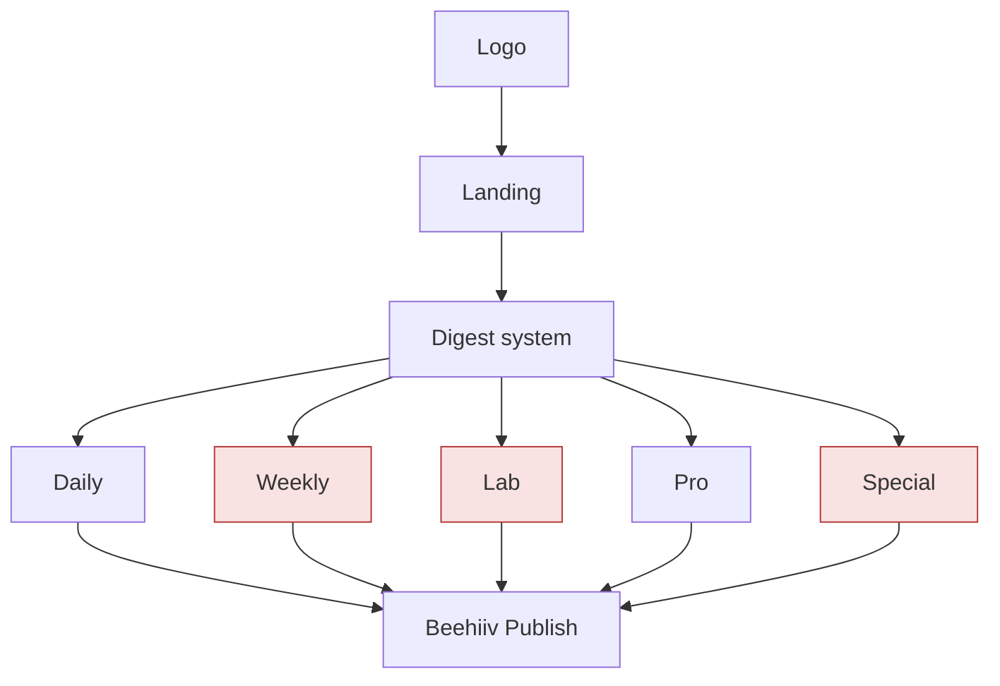
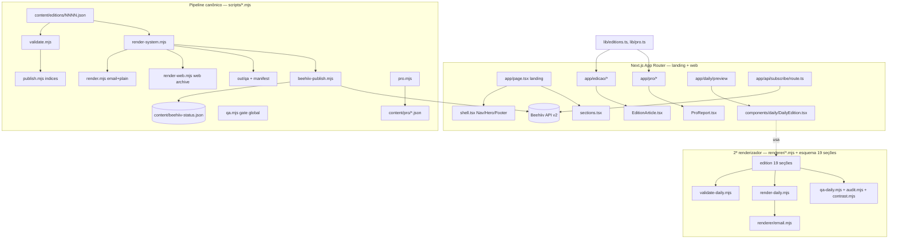
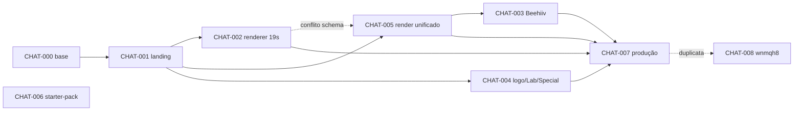

# Project Intelligence Report

> Auditoria forense integral do repositório `mzinhoww-svg/theloyal` (produto editorial **The Loyalty / The Loyal**).
> Documento único, somente-leitura. Nenhum código foi alterado, nenhum commit/push/deploy foi feito durante a auditoria.
> Diferencia sempre: **Declarado ≠ Planejado ≠ Implementado ≠ Validado ≠ Publicado**.

---

## Sumário navegável

- [0. Metadados da auditoria](#0-metadados-da-auditoria)
- [1. Veredito executivo](#1-veredito-executivo)
- [2. Resumo geral](#2-resumo-geral)
- [3. Inventário de fontes e cobertura](#3-inventário-de-fontes-e-cobertura)
- [4. Linha do tempo consolidada](#4-linha-do-tempo-consolidada)
- [5. Arquitetura planejada](#5-arquitetura-planejada)
- [6. Arquitetura implementada](#6-arquitetura-implementada)
- [7. Diferenças planejado × implementado](#7-diferenças-planejado--implementado)
- [8. Inventário de componentes](#8-inventário-de-componentes)
- [9. Mapa individual dos chats](#9-mapa-individual-dos-chats)
- [10. Dependências e relações entre chats](#10-dependências-e-relações-entre-chats)
- [11. Matriz de decisões](#11-matriz-de-decisões)
- [12. Matriz de requisitos e rastreabilidade](#12-matriz-de-requisitos-e-rastreabilidade)
- [13. Auditoria de código e lógica](#13-auditoria-de-código-e-lógica)
- [14. Auditoria de testes e validações](#14-auditoria-de-testes-e-validações)
- [15. Contradições, redundâncias e sobreposições](#15-contradições-redundâncias-e-sobreposições)
- [16. Pendências consolidadas](#16-pendências-consolidadas)
- [17. Dívida técnica](#17-dívida-técnica)
- [18. Riscos e bloqueios](#18-riscos-e-bloqueios)
- [19. Decisões em aberto](#19-decisões-em-aberto)
- [20. Ciclos abertos](#20-ciclos-abertos)
- [21. Backlog priorizado](#21-backlog-priorizado)
- [22. Plano de fechamento de ciclos](#22-plano-de-fechamento-de-ciclos)
- [23. Itens que podem ser encerrados](#23-itens-que-podem-ser-encerrados)
- [24. Itens que precisam ser refeitos](#24-itens-que-precisam-ser-refeitos)
- [25. Itens que devem ser descartados](#25-itens-que-devem-ser-descartados)
- [26. Itens que exigem decisão humana](#26-itens-que-exigem-decisão-humana)
- [27. Itens que exigem validação técnica](#27-itens-que-exigem-validação-técnica)
- [28. Próximas ações recomendadas](#28-próximas-ações-recomendadas)
- [29. Respostas finais](#29-respostas-finais)
- [30. Apêndice de evidências](#30-apêndice-de-evidências)

---

## Nota de validade temporal (IMPORTANTE)

> **Este relatório é um retrato pontual.** Foi produzido auditando o **produto editorial** no estado
> `origin/main = 07dcf75` + a branch `claude/loyalty-production-readiness-c8jrqy` (`8365ce8`).
> **Durante/logo após a auditoria, `origin/main` avançou para `a0eda8c`** (PRs #23, #28 e merges
> `reconcile-main-features`, `admin/predict/retail`), incorporando frentes que este relatório havia
> classificado como *inacessíveis / fora de escopo* (MISS-009). No main atual **já existem**, entre outros:
> `/admin` (Central de Controle + Supabase + auth), Radar/coletor de SKUs, e os scripts
> `scripts/forecast.mjs`, `render-weekly.mjs`, `pro-vpm.mjs`, `collect-skus.mjs`.
>
> Consequências para a leitura:
> - Achados sobre **Weekly/Lab/Special "não existem"** (REQ-008/009/010) refletem o snapshot antigo;
>   no main atual **Weekly/forecast/vpm passaram a existir** — reauditar.
> - A conclusão de que as ~32 branches eram "fora do produto" está **parcialmente revista**: várias
>   foram mergeadas em `main` — o repositório é, de fato, um projeto único e maior (motor editorial +
>   painel operacional + Radar de preços), confirmando DEC-ABERTA-05.
> - **Bug observado no main atual (NÍVEL A, não corrigido — modo auditoria):** `components/daily/DailyEdition.tsx`
>   tem um `Eyebrow` "Fecha logo" **duplicado** (resíduo de merge) — candidato a novo item de dívida.
>
> As seções abaixo permanecem válidas para o **núcleo editorial** (Daily/Pro/landing/Publisher/CI), que
> não foi alterado por esses merges. Para uma auditoria do escopo completo (incluindo `/admin`, Supabase e
> Radar), é necessária uma **segunda passagem** sobre `a0eda8c`.

---

## 0. Metadados da auditoria

| Campo | Valor |
|---|---|
| Data da auditoria | 2026-07-15 (data do sistema) |
| Diretório analisado | `/home/user/theloyal` |
| Branch atual | `claude/loyalty-production-readiness-c8jrqy` |
| Commit HEAD | `8365ce8` (merge de `origin/main` na branch de production-readiness) |
| `origin/main` | `07dcf75` |
| Alterações locais | Nenhuma (`git status --porcelain` vazio) — **NÍVEL A** |
| Stack | Next.js 14.2.15 (App Router) · React 18.3.1 · TypeScript 5.5.4 strict · Tailwind 3.4.10 · scripts Node ESM (`.mjs`) sem deps |
| Fontes disponíveis | Código-fonte, histórico Git (41 heads remotos), docs Markdown, schemas JSON, skills, workflows CI, artefatos `out/`, ledger Beehiiv, **histórico desta sessão (CHAT-007)** |
| Fontes ausentes | Transcrições originais dos chats (não versionadas); 6 documentos de governança citados em `CLAUDE.md`; conteúdo de ~32 branches de outras frentes; branch-irmã `...-wnmqh8` (só metadados) |
| Limitações | **Não há acesso às transcrições dos chats originais.** A reconstrução de "cada chat" usa **branches/PRs do Git como proxy** (NÍVEL D para intenção; NÍVEL A para artefato entregue). Apenas `main` + a branch atual estão no working tree; demais branches não foram inspecionadas em conteúdo. |
| Cobertura | Projeto editorial (main): **alta**. Demais frentes do repo (predict/vpm/admin): **não auditadas**. |

**Aviso de cobertura:** este repositório contém **41 heads remotos**, dos quais a maioria pertence a frentes que **não fazem parte do produto editorial mergeado em `main`** (ver [§3](#3-inventário-de-fontes-e-cobertura)). Esta auditoria cobre o produto editorial The Loyalty (o que está em `main` + a branch atual). As demais frentes são **enumeradas e registradas como inacessíveis**, não auditadas.

---

## 1. Veredito executivo

1. **Estado geral:** o produto editorial The Loyalty é um **monólito editorial Next.js + pipeline de scripts Node**, funcional e disciplinado. Após CHAT-007 (esta sessão, PR #10 mergeado), o pipeline saiu do estado inoperante (`package.json` inválido) e **todas as validações passam** (build, lint, typecheck, validate, render, qa, pro — NÍVEL A). Não é um SaaS; é uma máquina de gerar/validar/publicar newsletters.
2. **Conclusão global estimada (produto editorial):** **72% a 82%** (confiança média-alta). Núcleo Daily+Pro implementado, integrado e validado; faltam testes automatizados, consolidação de esquema duplicado, endurecimento do publisher e produtos declarados (Weekly/Lab/Special) inexistentes em código.
3. **Nível de confiança:** médio-alto para o que está em `main`; baixo para intenção original (sem transcrições).
4. **Principais entregas reais (NÍVEL A):** landing Next.js (build estático OK); pipeline Daily (`validate→render→qa→publish`); renderizador e-mail-safe + plain + web archive + QA + manifest; The Loyalty Pro (rota `/pro`, e-mail, QA); Publisher Beehiiv com idempotência/ledger/draft-default; integração real de inscrição (`/api/subscribe`); CI e workflow de publicação; 3 skills (`tl-qa`, `tl-digest-template`, `tl-source-audit`).
5. **Principais lacunas:** zero testes automatizados; **dois esquemas editoriais divergentes** com vocabulários de veredito incompatíveis; **6 documentos de governança citados em `CLAUDE.md` não existem no repo**; Weekly/Lab/Special declarados mas **sem código**; validação editorial não usa o JSON Schema.
6. **Principais bloqueios:** nenhum bloqueio técnico impede operar hoje. Bloqueio **operacional**: envio real Beehiiv depende de secrets externos (não confirmável aqui) → **BLOCK-001**.
7. **Principais riscos:** **RISK-001** 5 vulnerabilidades npm (1 crítica); **RISK-002** drift de marca por esquema/vocabulário duplicado; **RISK-003** governança sem os documentos-fonte declarados; **RISK-004** idempotência do publisher só local.
8. **Próximas cinco ações:** (1) decidir esquema canônico único (DEC em aberto); (2) aplicar JSON Schema no validador; (3) adicionar testes unitários de `scripts/lib.mjs`; (4) cobrir `pro`+`daily:*` no CI; (5) revisar `npm audit`/subir patch do Next.
9. **O que NÃO iniciar agora:** implementar Weekly/Lab/Special; refatoração ampla; qualquer disparo real de e-mail antes de teste controlado com secrets.
10. **Recomendação de fase:** **pode continuar e testar**; **estabilizar** antes de escalar (consolidar esquema + testes). **Não** está pronto para "produção total" de envio automático sem os itens P0/P1.

---

## 2. Resumo geral

**O que o projeto é.** The Loyalty (marca também grafada "The Loyal") é uma **mídia editorial independente** brasileira sobre loyalty, pontos, milhas, cartões, bancos, varejo e cashback. Tecnicamente, é: (a) uma **landing page** de conversão em Next.js; (b) um **pipeline editorial** que transforma UM JSON por edição em e-mail HTML email-safe, texto puro, página web (web archive) e relatório de QA; (c) um **Publisher** que publica no Beehiiv o conteúdo já renderizado; (d) um produto premium **Pro** (relatório executivo mensal). A regra-mãe de marca é *"a imagem é dado"* e há um contrato de marca rígido em `CLAUDE.md` com 10 regras invioláveis.

**Como evoluiu.** Bootstrap da landing + integração de inscrição Beehiiv (07-08) → rebrand "The Loyal" + copy acessível → sistema de renderização do Daily + assets de marca → schema editorial + página web + skills → skill de QA global → Pro → Publisher Beehiiv → sistema de renderização unificado → starter-pack de prompts → sistema de QA do Daily (segunda linha de renderizador) → **production-readiness (esta sessão)**, que consertou o `package.json` inválido, criou CI/workflows e mergeou tudo. Ver [§4](#4-linha-do-tempo-consolidada).

**Como está estruturado.** `app/` (rotas Next), `components/` (UI React + duas famílias de "edição"), `scripts/*.mjs` (pipeline canônico), `renderer/*.mjs` (segundo renderizador, esquema alternativo de 19 seções), `content/` (edições + schemas + ledger), `lib/` (loaders TS), `.claude/skills/` (3 skills), `.github/workflows/` (CI + publish), `starter-pack/` (prompts de recriação). Ver [§6](#6-arquitetura-implementada).

**O que existe / não existe.** Existe: Daily, Pro, Publisher, landing, CI. Não existe em código: **Weekly, Lab, Special** (apenas prompts em `starter-pack/` e artefatos residuais em `out/lab`, `out/special`). Ver [§7](#7-diferenças-planejado--implementado).

**Onde estão os maiores problemas.** (1) Duplicidade estrutural: dois esquemas e dois renderizadores com vocabulários de veredito divergentes; (2) ausência de testes; (3) documentos de governança inexistentes; (4) segurança de dependências.

**O que precisa acontecer em seguida.** Consolidar esquema, aplicar schema no validador, adicionar testes, cobrir CI, tratar `npm audit`. Ver [§28](#28-próximas-ações-recomendadas).

Sub-resumos exigidos:

- **Linha do tempo** → [§4](#4-linha-do-tempo-consolidada).
- **Arquitetura do projeto** → [§6](#6-arquitetura-implementada).
- **Componentes existentes** → [§8](#8-inventário-de-componentes) (COMP-001..COMP-024).
- **Componentes planejados** → Weekly (COMP-020), Lab (COMP-021), Special (COMP-022) — NÃO_INICIADO em código.
- **Pendências** → [§16](#16-pendências-consolidadas) (PEND-001..).
- **Dívida técnica** → [§17](#17-dívida-técnica) (DEBT-001..).
- **Decisões tomadas** → [§11](#11-matriz-de-decisões) (DEC-001..).
- **Decisões em aberto** → [§19](#19-decisões-em-aberto).
- **Riscos** → [§18](#18-riscos-e-bloqueios) (RISK-001..).
- **Próximos passos** → [§28](#28-próximas-ações-recomendadas).

---

## 3. Inventário de fontes e cobertura

### 3.1 Fontes analisadas (disponíveis)

| DOC-ID | Fonte | Tipo | Cobertura |
|---|---|---|---|
| DOC-001 | `CLAUDE.md` | Contrato de marca / instruções | Integral |
| DOC-002 | `README.md`, `content/README.md`, `renderer/README.md`, `docs/RENDER-SYSTEM.md`, `out/README.md`, `assets/logo/README.md` | Documentação técnica | Integral |
| DOC-003 | `COPY-LANDING.md`, `COWORK.md` | Copy/produto | Parcial |
| DOC-004 | `content/edition.schema.json` | Schema canônico | Integral |
| DOC-005 | `renderer/edition.schema.json`, `content/pro-report.schema.json` | Schemas alternativo/Pro | Integral |
| DOC-006 | `.claude/skills/{tl-qa,tl-digest-template,tl-source-audit}/SKILL.md` | Skills | Integral |
| DOC-007 | `.github/workflows/{ci,publish}.yml` | CI/CD | Integral |
| DOC-008 | `starter-pack/prompts/01..09_*.md` | Especificação de produtos (planejado) | Integral |
| DOC-009 | Histórico Git (41 heads, log completo) | VCS | Integral (metadados) |
| DOC-010 | `content/beehiiv-status.json` | Ledger de publicação | Integral |
| DOC-011 | Artefatos `out/**` | Saídas geradas | Integral |
| DOC-012 | Histórico desta sessão (CHAT-007) | Chat vivo | Integral |

### 3.2 Fontes ausentes / inacessíveis — `FONTE_MENCIONADA_MAS_INACESSÍVEL`

| ID | Fonte | Onde mencionada | Relevância | Auditoria prejudicada | O que é preciso |
|---|---|---|---|---|---|
| MISS-001 | `THE-LOYALTY-LLM-SYSTEM.md` | `CLAUDE.md` (hierarquia de verdade, topo) | É a **fonte nº1** da hierarquia de marca | Não dá para validar se o código respeita a regra-suprema declarada | Fornecer o arquivo |
| MISS-002 | `DESIGN.md` | `CLAUDE.md`, `components/ui.tsx:72` | Fonte nº2; citada em comentário de código | Regras de design não verificáveis contra a fonte | Fornecer o arquivo |
| MISS-003 | `THE-LOYALTY-BRAND-GUIDELINES.md` | `CLAUDE.md` | Fonte nº3 | idem | Fornecer |
| MISS-004 | `PONTO-MASCOTE-GUIA.md` | `CLAUDE.md` | Regras do mascote Ponto | Regras do Ponto não verificáveis | Fornecer |
| MISS-005 | `TL-GRAPHICS.md` | `CLAUDE.md` | Regras de data-art | idem | Fornecer |
| MISS-006 | `Operating Manual v1` | `CLAUDE.md`, `scripts/lib.mjs` (pesos TL Score 5.2/5.3/5.4) | **Fórmula do TL Score e overrules derivam dele** | Não dá para confirmar se pesos/overrules no código batem com a fonte | Fornecer |
| MISS-007 | Transcrições originais dos chats | Prompt do usuário | Reconstrução de intenção/decisão por chat | Fichas de chat inferem do Git, não das conversas | Exportar os chats |
| MISS-008 | Branch `claude/loyalty-production-readiness-wnmqh8` (tip `136e51c`) | `git ls-remote`; runs de CI | **Duplicata da frente de production-readiness** (CONFLICT-001) | Não sei o que essa branch-irmã contém vs. a minha | Diff `origin/main...wnmqh8` |
| MISS-009 | ~30 branches de outras frentes (predict/vpm/admin/gtm/forecast/radar/security/cowork/…) | `git ls-remote` | Possível projeto maior compartilhando o repo | Escopo real do repo desconhecido | Confirmar se pertencem a este produto |

### 3.3 Chats identificados (proxy = branch/PR)

> **Método:** sem transcrições, cada "chat" é reconstruído a partir do branch + PR + commits. Intenção/decisão = NÍVEL D; artefato = NÍVEL A/B.

| ID | Nome original (branch/PR) | Nome canônico | Fonte | Período | Disponibilidade | Cobertura | Temas | Dependências |
|---|---|---|---|---|---|---|---|---|
| CHAT-000 | (pré-branches; commits base em `main`) | Landing+Inscrição. Bootstrap Beehiiv. Base | Git `088a8f7,1babc10,7698af9,e470248,09fc7da,2e30d5e` | 2026-07-08/09 | Git only | Alta (artefato) | landing, `/api/subscribe`, CLAUDE.md | — |
| CHAT-001 | `claude/loyalty-landing-page-v1-7vbjq7` (PR #1/#8) | Landing. Página v1 + rebrand The Loyal. Merge | Git | 2026-07-08 | Git only | Alta | landing, rebrand, copy v2 | CHAT-000 |
| CHAT-002 | `claude/landing-page-copy-review-ssj4y9` (PR #4 e #9) | Daily. Renderizador + QA do Daily (19 seções). Merge | Git `c43bb9e,8cc33ee,a23bdf5` | 2026-07-08/09 | Git only | Alta | renderer/, daily:*, copy | CHAT-001 |
| CHAT-003 | `claude/loyalty-beehiiv-publish-fv8t65` (PR #5) | Beehiiv. Publisher de edição renderizada. Merge | Git `0548454` | 2026-07-09 | Git only | Alta | `scripts/beehiiv-publish.mjs`, ledger | CHAT-005 |
| CHAT-004 | `claude/loyalty-system-architecture-0cwx3h` (PR #7) | Marca. Logo v1 + digests Lab/Special. Merge | Git `aa17426,ca382c2` | 2026-07-09 | Git only | Média | `components/Logo.tsx`, out/lab, out/special | CHAT-001 |
| CHAT-005 | `claude/loyalty-rendering-system-kugnf6` (PR #6) | Render. Sistema unificado (email/plain/web/QA/manifest). Merge | Git `5960938` (+ `0aa76fc,ea5ada7,5970f24,55f7c7b`?) | 2026-07-09 | Git only | Alta | `scripts/render-system.mjs`, schema canônico, Pro, skills | CHAT-001 |
| CHAT-006 | `claude/zip-files-repo-m1b0pn` (PR #3) | Docs. Starter-pack de prompts. Merge | Git `1cf78f5` | 2026-07-09 | Git only | Alta | `starter-pack/**` | — |
| CHAT-007 | `claude/loyalty-production-readiness-c8jrqy` (PR #10) | Produção. Pipeline operacional + CI + merge. **Esta sessão** | Chat vivo + Git `4f4781d,8365ce8` | 2026-07-09 | **Integral** | Integral | package.json, CI, workflows, .env, correções QA, merge | CHAT-002..006 |
| CHAT-008 | `claude/loyalty-production-readiness-wnmqh8` | Produção (duplicata). Fase paralela | Git head + CI runs | 2026-07 | **Inacessível (conteúdo)** | Baixa | production-readiness paralelo | CONFLITA com CHAT-007 |
| CHAT-EXT-* | ~30 branches predict/vpm/admin/gtm/forecast/radar/security/cowork | Frentes externas ao produto editorial | `git ls-remote` | ? | Inacessível | Nula | fora de escopo editorial | ? |

### 3.4 Métricas de cobertura

- Total de heads remotos: **41** (NÍVEL A).
- Chats (frentes) com ficha individual: **9** (CHAT-000..008).
- Analisados integralmente: **8** (CHAT-000..007 via Git; CHAT-007 via chat vivo).
- Analisados parcialmente: **1** (CHAT-008, só metadados).
- Frentes identificadas mas não analisadas: **~32** branches (não-editoriais + inacessíveis).
- Cobertura documental (produto editorial em `main`): **~90%**.
- Cobertura de chats (intenção original): **~15%** (só CHAT-007 tem transcrição; resto é proxy Git).
- **Limitação central:** a auditoria NÃO cobre as ~32 frentes não-editoriais nem as transcrições originais. Não deve ser tratada como auditoria de todo o conteúdo do repositório GitHub.

---

## 4. Linha do tempo consolidada

> Nota de data: os merges têm data de committer **2026-07-08** (mzinhoww-svg), enquanto vários commits de autor são **2026-07-09**. Há **skew de data** (autor > merge) — provável fuso/rebase. Marcado quando relevante.

| Data | Evento | Chat | Commit | Componente | Tipo | Impacto | Evidência |
|---|---|---|---|---|---|---|---|
| 2026-07-08 | Integração real de inscrição Beehiiv (route handler) | CHAT-000 | `1babc10` | `/api/subscribe` | Implementação | Alto | NÍVEL A (código presente) |
| 2026-07-08 | Trim de env + tolerância a `pub_` ausente | CHAT-000 | `7698af9,e470248` | subscribe | Correção | Médio | NÍVEL A |
| 2026-07-08 | Rebrand "The Loyal" + copy v2 acessível | CHAT-001 | `06e1bb0` | landing | Refatoração/marca | Alto | NÍVEL A |
| 2026-07-09 | CLAUDE.md (contrato de marca) | CHAT-000 | `2e30d5e` | governança | Doc | Alto | NÍVEL A |
| 2026-07-09 | Pipeline editorial validate/render/publish do Daily | CHAT-005 | `0aa76fc` | scripts/ | Implementação | Alto | NÍVEL A |
| 2026-07-09 | Schema editorial + página web + skills tl-digest/tl-source-audit | CHAT-005 | `ea5ada7` | schema, /edicao, skills | Implementação | Alto | NÍVEL A |
| 2026-07-09 | Skill tl-qa (gate global) + edição fictícia Nº 28 | CHAT-005 | `5970f24` | skill, content/0028 | Implementação | Alto | NÍVEL A |
| 2026-07-09 | The Loyalty Pro (web/e-mail/PDF/QA) | CHAT-005 | `55f7c7b` | /pro, scripts/pro | Implementação | Alto | NÍVEL A |
| 2026-07-09 | Renderizador Daily (19 seções) + assets de marca | CHAT-002 | `c43bb9e` | renderer/ | Implementação | Alto | NÍVEL A |
| 2026-07-09 | Publica entregáveis Daily em `/daily` | CHAT-002 | `8cc33ee` | public/daily | Implementação | Médio | NÍVEL A |
| 2026-07-09 | Logo system v1 (wordmark/monograma/favicon) | CHAT-004 | `aa17426` | Logo.tsx, assets | Implementação | Médio | NÍVEL A |
| 2026-07-09 | Digests Lab (CPM) e Special (CPM final) renderizados | CHAT-004 | `ca382c2` | out/lab, out/special | Conteúdo | Médio | NÍVEL A (só artefatos `out/`) |
| 2026-07-09 | Publisher Beehiiv (edição renderizada) | CHAT-003 | `0548454` | beehiiv-publish.mjs | Implementação | Alto | NÍVEL A |
| 2026-07-09 | Sistema de renderização unificado | CHAT-005 | `5960938` | render-system.mjs | Implementação | Alto | NÍVEL A |
| 2026-07-09 | Starter-pack de prompts (01..09) | CHAT-006 | `1cf78f5` | starter-pack/ | Doc/spec | Médio | NÍVEL A |
| 2026-07-09 | Sistema de QA do Daily (2ª linha) | CHAT-002 | `a23bdf5` | qa-daily, audit, contrast | Implementação | Médio | NÍVEL A |
| 2026-07-08/09 | Merges PR #1..#9 em `main` | vários | vários | — | Integração | Alto | NÍVEL A |
| 2026-07-09 | **`package.json` inválido corrigido; pipeline operacional; CI + workflows; correções QA** | CHAT-007 | `4f4781d` | package.json, .github, componentes | Correção/Impl. | **Crítico** | NÍVEL A (validações verdes) |
| 2026-07-09 | Merge de `main` (resolve conflito de `package.json`; união de scripts) | CHAT-007 | `8365ce8` | package.json, renderer/README | Integração | Alto | NÍVEL A (CI run #11 success) |
| 2026-07-09 | PR #10 mergeado em `main` | CHAT-007 | (webhook) | — | Release | Alto | NÍVEL A (webhook "merged") |

---

## 5. Arquitetura planejada

Fonte: `starter-pack/prompts/*` (DOC-008) + `CLAUDE.md` (DOC-001). NÍVEL C (declarado, não é a fonte-mãe, que está ausente — MISS-001..006).

Sequência planejada de produtos editoriais:
1. **Logo** (01) → identidade.
2. **Landing** (02) → conversão.
3. **Digest system** (03) → renderizador comum.
4. **Daily** (04) → newsletter diária (produto principal).
5. **Weekly** (05) → digest semanal.
6. **Lab** (06) → análises tipo CPM.
7. **Pro** (07) → relatório executivo mensal premium.
8. **Special** (08) → edições especiais (ex: CPM final).
9. **Beehiiv publish** (09) → publicação.

(Vermelho = planejado sem código de produção.)

---

## 6. Arquitetura implementada

Fonte: código atual (NÍVEL A/B).

**Entrypoints:** landing `/`; `/edicao`, `/edicao/[numero]`; `/pro`, `/pro/[periodo]`; `/daily/preview`; `/api/subscribe`. Comandos: `dev/build/start/lint/typecheck/validate/render/render:email/render:web/qa/publish/beehiiv/pro/edition/daily:validate/daily:render/daily:qa`.

**Integrações externas:** Beehiiv API v2 (inscrição + Create Post). Sem banco, filas, cache, auth. **Estado persistido:** ledger JSON versionado.

**Pontos únicos de falha:** `scripts/lib.mjs` (tokens+veredito+regex compartilhados por todo o pipeline canônico); ledger local como única fonte de idempotência.

**Fronteiras mal definidas:** duas famílias de "edição" (canônica `signal/deals` vs. legado `sinal_do_dia/deal_desk`) coexistem sem camada de tradução (ver DEBT-001).

---

## 7. Diferenças planejado × implementado

| Planejado | Existe? | O que falta | Alteração intencional? | Decisão registrada? | Impacto | Risco | Recomendação |
|---|---|---|---|---|---|---|---|
| Logo | Sim (`Logo.tsx`, assets) | — | — | Não formal | Baixo | Baixo | Encerrar |
| Landing | Sim | — | — | — | — | Baixo | Encerrar |
| Digest system | Sim (**dois**: `scripts/render-system` + `renderer/`) | Consolidação | Não (duplicação acidental) | Não | Alto | Médio | **Consolidar (DEC aberta)** |
| Daily | Sim (canônico + legado) | Unificar esquema/vocabulário | Parcial | Não | Alto | Médio | Consolidar |
| Weekly | **NÃO** (só prompt 05) | Renderer, schema, rota, conteúdo | — | Não | Médio | Baixo | Backlog P3/P4 |
| Lab | **NÃO** em código (só prompt 06 + `out/lab/*` residual) | Renderer, schema, rota | — | Não | Médio | Baixo | Backlog / descartar artefatos órfãos |
| Pro | Sim (`/pro`, `pro.mjs`, `content/pro`) | Testes; PDF é "salvar como PDF" manual | Sim (PDF manual) | Parcial (README) | Médio | Baixo | Validar aceite |
| Special | **NÃO** em código (só prompt 08 + `out/special/*` residual) | Tudo | — | Não | Baixo | Baixo | Backlog / descartar artefatos órfãos |
| Beehiiv publish | Sim | Verificação real via API; retry | Não | Parcial | Alto | Médio | Endurecer |

---

## 8. Inventário de componentes

| ID | Componente | Objetivo | Localização | Chat origem | Estado | Testes | Doc | Deps | Risco |
|---|---|---|---|---|---|---|---|---|---|
| COMP-001 | Landing page | Conversão | `app/page.tsx`,`components/shell.tsx`,`sections.tsx` | CHAT-001 | CONCLUÍDO_VALIDADO | Nenhum | README | Tailwind | Baixo |
| COMP-002 | `/api/subscribe` | Inscrição Beehiiv (real+mock) | `app/api/subscribe/route.ts` | CHAT-000 | CONCLUÍDO_NÃO_VALIDADO (caminho real não exercido) | Nenhum | README | Beehiiv | Médio |
| COMP-003 | SubscribeForm | Form + honeypot + aria-live | `components/SubscribeForm.tsx` | CHAT-000/001 | CONCLUÍDO_VALIDADO (build) | Nenhum | CLAUDE.md | — | Baixo |
| COMP-004 | PontoMascot | Mascote SVG | `components/PontoMascot.tsx` | CHAT-001 | CONCLUÍDO_NÃO_VALIDADO | Nenhum | MISS-004 ausente | — | Baixo |
| COMP-005 | graphics (data-art) | CompareBanner/Sparkline/etc. | `components/graphics.tsx` | CHAT-001 | CONCLUÍDO_NÃO_VALIDADO | Nenhum | MISS-005 ausente | — | Baixo |
| COMP-006 | ui (TLBadge/ContaBlock/SectionLabel) | Blocos canônicos | `components/ui.tsx` | CHAT-001/005 | CONCLUÍDO_VALIDADO | Nenhum | CLAUDE.md | — | Baixo |
| COMP-007 | EdicaoMock | Edição exemplo na landing | `components/EdicaoMock.tsx` | CHAT-001 | CONCLUÍDO_NÃO_VALIDADO | Nenhum | — | — | Baixo |
| COMP-008 | EditionArticle (web /edicao) | Página web da edição canônica | `components/EditionArticle.tsx`,`app/edicao/*`,`lib/editions.ts` | CHAT-005 | CONCLUÍDO_VALIDADO (build SSG) | Nenhum | — | schema canônico | Baixo |
| COMP-009 | Pipeline validate | QA editorial (gate) | `scripts/validate.mjs`,`scripts/lib.mjs` | CHAT-005 | CONCLUÍDO_VALIDADO | Nenhum unit | README | lib.mjs | Médio (sem unit) |
| COMP-010 | render (email+plain) | E-mail-safe + texto | `scripts/render.mjs` | CHAT-005 | CONCLUÍDO_VALIDADO | Nenhum | README | lib.mjs | Baixo |
| COMP-011 | render-web (web archive) | HTML autocontido React SSR | `scripts/render-web.mjs` | CHAT-005 | CONCLUÍDO_VALIDADO | Nenhum | docs/RENDER-SYSTEM | react-dom/server | Baixo |
| COMP-012 | render-system (orquestrador+auditoria) | Gera 5 saídas + audita | `scripts/render-system.mjs` | CHAT-005 | CONCLUÍDO_VALIDADO | Nenhum | docs/RENDER-SYSTEM | COMP-010/011 | Médio |
| COMP-013 | qa (gate global) | Audita landing+JSON+email+web | `scripts/qa.mjs` | CHAT-005 | CONCLUÍDO_VALIDADO | Nenhum | skill tl-qa | lib.mjs | Baixo |
| COMP-014 | publish (índices) | latest.json/index.json (não envia) | `scripts/publish.mjs` | CHAT-005 | CONCLUÍDO_VALIDADO | Nenhum | README | validate | Baixo |
| COMP-015 | Beehiiv Publisher | Publica renderizado (draft/idempotente) | `scripts/beehiiv-publish.mjs` | CHAT-003 | CONCLUÍDO_NÃO_VALIDADO (só mock exercido) | Nenhum | content/README | Beehiiv, ledger | Médio |
| COMP-016 | Ledger Beehiiv | Estado de publicação | `content/beehiiv-status.json` | CHAT-003 | CONCLUÍDO_VALIDADO (mock) | — | content/README | — | Médio |
| COMP-017 | Pro (script+web+email) | Relatório executivo | `scripts/pro.mjs`,`app/pro/*`,`components/ProReport.tsx`,`lib/pro.ts` | CHAT-005 | CONCLUÍDO_VALIDADO (build+pro OK) | Nenhum | — | schema pro | Baixo |
| COMP-018 | Schema canônico | Contrato da edição | `content/edition.schema.json` | CHAT-005 | CONCLUÍDO_NÃO_VALIDADO (não aplicado por validador) | — | content/README | — | Médio |
| COMP-019 | Skills (tl-qa/tl-digest/tl-source-audit) | Automação de QA/render/auditoria | `.claude/skills/*` | CHAT-005 | CONCLUÍDO_NÃO_VALIDADO | Nenhum | SKILL.md | — | Baixo |
| COMP-020 | Weekly | Digest semanal | (inexistente) | — | NÃO_INICIADO | — | prompt 05 | — | Baixo |
| COMP-021 | Lab | Análises CPM | (só `out/lab/*`) | CHAT-004 | NÃO_INICIADO (código) / artefato órfão | — | prompt 06 | — | Baixo |
| COMP-022 | Special | Edições especiais | (só `out/special/*`) | CHAT-004 | NÃO_INICIADO (código) / artefato órfão | — | prompt 08 | — | Baixo |
| COMP-023 | 2º renderizador (19 seções) | Daily formato longo | `renderer/*.mjs`,`scripts/*-daily.mjs`,`components/daily/DailyEdition.tsx` | CHAT-002 | IMPLEMENTADO_PARCIALMENTE / **DUPLICADO** | Nenhum | renderer/README | esquema alt | **Alto (drift)** |
| COMP-024 | CI + Workflow publish | Automação | `.github/workflows/*` | CHAT-007 | CONCLUÍDO_VALIDADO (run #11 success) | — | README | — | Baixo |

**Órfãos/duplicados:** COMP-021, COMP-022 (artefatos `out/` sem renderizador de produção); COMP-023 (renderizador duplicado). **Quebrados:** nenhum no estado atual (tudo compila/roda).

---

## 9. Mapa individual dos chats

> Fichas resumidas ao essencial auditável. Intenção = NÍVEL D (proxy Git) salvo CHAT-007 (NÍVEL A, chat vivo).

### CHAT-000 — Landing+Inscrição. Bootstrap Beehiiv. Base
1. **Identificação:** commits base de `main` (`1babc10`,`7698af9`,`e470248`,`09fc7da`,`088a8f7`,`2e30d5e`); sucessores: todos. 
2. **Contexto:** inferido — inexistia contrato de marca até `2e30d5e`. Contexto ausente: docs de governança (MISS-001..006). 
3. **Objetivo:** integrar inscrição real ao Beehiiv e fixar o contrato de marca. Alcançado (parcial). 
4. **Planejou:** route handler server-only, honeypot, rate limit, tolerância a `pub_`. 
5. **Declarou/Fez:** `/api/subscribe` real com fallback mock — **comprovado** (NÍVEL A, código presente). 
6. **Realmente feito:** COMP-002/003 + `CLAUDE.md`. 
7. **Decisões:** DEC-001, DEC-010. 
8. **Tarefas:** ver [§12]. 
9. **Arquivos:** `app/api/subscribe/route.ts` (implementado), `CLAUDE.md` (implementado). 
10. **Lacunas:** caminho real do Beehiiv **nunca exercido** (sem secrets) → CYCLE-002. 
11. **Estado:** CONCLUÍDO_NÃO_VALIDADO; ~85%±10; próxima ação: teste real com secrets.

### CHAT-001 — Landing. Página v1 + rebrand. Merge
Objetivo: landing premium + rebrand "The Loyal" + copy acessível v2. Feito: COMP-001,003,004,005,006,007 (`06e1bb0`, PR #1/#2/#8). Decisão DEC-002 (rebrand "The Loyalty"→"The Loyal"?) — **ver CONFLICT-002** (marca grafada de duas formas). Estado: CONCLUÍDO_VALIDADO (build); ~90%. Lacuna: nomenclatura de marca inconsistente no código (`The Loyal` vs `The Loyalty`).

### CHAT-002 — Daily. Renderizador 19 seções + QA. Merge
Objetivo: renderizador do Daily (formato longo, 19 seções) + assets + QA próprio. Feito: COMP-023 (`renderer/*`, `components/daily/DailyEdition.tsx`, `scripts/*-daily.mjs`, `qa-daily.mjs`, `audit.mjs`, `contrast.mjs`) via PR #4 e #9. Decisão DEC-003 (esquema de 19 seções `sinal_do_dia/...`). **Contradiz CHAT-005** (esquema `signal/deals`) → CONFLICT-003. Estado: IMPLEMENTADO_PARCIALMENTE / duplicado; ~70%. Lacuna: vocabulário de veredito `depende/nao-vale` diverge do canônico.

### CHAT-003 — Beehiiv. Publisher. Merge
Objetivo: publicar no Beehiiv o conteúdo **já renderizado**, idempotente, draft por padrão. Feito: COMP-015/016 (`0548454`). Decisões DEC-004 (draft default), DEC-005 (idempotência por `contentHash`), DEC-006 (normalização `pub_`). Estado: CONCLUÍDO_NÃO_VALIDADO (só mock); ~80%. Lacuna: idempotência só local (RISK-004).

### CHAT-004 — Marca. Logo + digests Lab/Special. Merge
Objetivo: logo v1 + renderizar Lab/Special. Feito: `Logo.tsx`, assets, **e apenas artefatos** `out/lab/*`, `out/special/*` (`aa17426`,`ca382c2`). **Não há renderizador de produção Lab/Special.** Estado: logo CONCLUÍDO_NÃO_VALIDADO; Lab/Special = artefato órfão (COMP-021/022). ~50%. Lacuna: entregou saída sem pipeline (PEND-009).

### CHAT-005 — Render. Sistema unificado + Pro + skills. Merge
Objetivo: um JSON → email/plain/web/QA/manifest; schema canônico; Pro; skills. Feito: COMP-008..019 (`0aa76fc`,`ea5ada7`,`5970f24`,`55f7c7b`,`5960938`). Decisões DEC-007 (esquema canônico `content/edition.schema.json`), DEC-008 (tokens/veredito em `lib.mjs`), DEC-009 (QA como gate). Estado: CONCLUÍDO_VALIDADO; ~85%. Núcleo do produto. Lacuna: schema não é aplicado pelo validador (PEND-004).

### CHAT-006 — Docs. Starter-pack. Merge
Objetivo: prompts de recriação de cada produto. Feito: `starter-pack/prompts/01..09` (`1cf78f5`). Estado: CONCLUÍDO_VALIDADO (é doc); ~100% do escopo dele. Efeito colateral: **declara Weekly/Lab/Special que não existem** → alimenta expectativa (PEND-008).

### CHAT-007 — Produção. Pipeline operacional + CI + merge. **Esta sessão**
1. **Contexto (NÍVEL A):** objetivo do usuário = "sair do modo mock, ficar operacional, ledger, scripts, Beehiiv, fluxo validado". Recebeu `CLAUDE.md` e o repo pós-CHAT-002..006. 
2. **Planejou:** corrigir package.json; declarar scripts; CI; workflow publish; .env; ledger; consolidar schema (parcial); validar tudo. 
3. **Declarou/Fez (todos NÍVEL A):** corrigiu `package.json` inválido; adicionou `beehiiv`,`typecheck` + eslint; criou `.eslintrc.json`, `ci.yml`, `publish.yml`; atualizou `.env.example`/README/renderer README; corrigiu 2 quebras de regra inviolável (disclaimer em `sections.tsx`; hex hardcoded em `DailyEdition.tsx`); mergeou `main` resolvendo conflito de `package.json` (união de scripts). PR #10 **mergeado**. 
4. **Realmente feito:** confirmado por CI run #11 `success` e validações locais verdes. 
5. **Decisões:** DEC-011 (render=render-system), DEC-012 (marcar renderer/ como esquema alternativo, não "legado", após main adicionar `daily:*`), DEC-013 (union de scripts no merge). 
6. **Lacunas:** consolidação de schema **não** feita (fora do escopo aceito); testes não adicionados; secrets não configurados. 
7. **Estado:** CONCLUÍDO_VALIDADO para o objetivo declarado; ~90%. Ciclos abertos herdados: CYCLE-001..010.

### CHAT-008 — Produção (duplicata). Fase paralela — INACESSÍVEL
Branch `...-wnmqh8` (tip `136e51c`) fez production-readiness **em paralelo** a CHAT-007 (CI própria verde, observada). Conteúdo não inspecionado (MISS-008). **CONFLICT-001**: duas frentes resolveram o mesmo problema; só CHAT-007 foi mergeado. Estado: STATUS_DESCONHECIDO. Ação: diff e descartar a branch redundante.

---

## 10. Dependências e relações entre chats

| Relação | Chats | Observação |
|---|---|---|
| Sobrepostos | CHAT-002 × CHAT-005 | Dois renderizadores/esquemas do "Daily" (CONFLICT-003) |
| Duplicados | CHAT-007 × CHAT-008 | Mesma frente production-readiness (CONFLICT-001) |
| Isolado | CHAT-006 | Só docs; não consumido pelo código |
| Contraditórios (marca) | CHAT-001 × CHAT-000 | "The Loyal" × "The Loyalty" (CONFLICT-002) |
| Devem consolidar | CHAT-002+CHAT-005 | Unificar esquema/vocabulário |

---

## 11. Matriz de decisões

| DEC | Decisão | Chat | Motivação | Implementada | Validada | Vigente | Substituída por | Evidência |
|---|---|---|---|---|---|---|---|---|
| DEC-001 | Inscrição server-only com fallback mock | CHAT-000 | Chave nunca no client | Sim | Mock | Sim | — | `route.ts` (A) |
| DEC-002 | Grafia de marca | CHAT-001 | Rebrand | Parcial | — | **CONFLITANTE** | — | "The Loyal"/"The Loyalty" coexistem (A) |
| DEC-003 | Esquema editorial de 19 seções | CHAT-002 | Formato longo do Daily | Sim | — | **CONFLITANTE** | Concorre com DEC-007 | `renderer/edition.schema.json` (A) |
| DEC-004 | Publisher cria só rascunho por padrão | CHAT-003 | Segurança anti-envio | Sim | Mock | Sim | — | `beehiiv-publish.mjs` (A) |
| DEC-005 | Idempotência por `contentHash` local | CHAT-003 | Não disparar 2x | Sim | Mock | Sim (parcial) | — | ledger (A) |
| DEC-006 | Normalizar `publication_id` (`pub_`) | CHAT-003/000 | 401/404 comuns | Sim | — | Sim | — | `route.ts`,`beehiiv-publish.mjs` (A) |
| DEC-007 | Esquema canônico `content/edition.schema.json` (`signal/deals`) | CHAT-005 | Fonte única email/web | Sim | Não aplicado | Sim (produção) | — | schema (A) |
| DEC-008 | Tokens+veredito+regex em `scripts/lib.mjs` | CHAT-005 | Exceção de hex documentada | Sim | Sim | Sim | — | `lib.mjs` (A) |
| DEC-009 | QA como gate bloqueante (exit 1) | CHAT-005/007 | Regra inviolável | Sim | Sim | Sim | — | `qa.mjs`,CI (A) |
| DEC-010 | CLAUDE.md como contrato de marca | CHAT-000 | Governança | Sim | — | Sim | — | `CLAUDE.md` (A) |
| DEC-011 | `npm run render` = render-system | CHAT-007 | Caminho principal completo | Sim | Sim | Sim | Substitui render.mjs como `render` | package.json (A) |
| DEC-012 | `renderer/` = "esquema alternativo", não legado | CHAT-007 | main adicionou `daily:*` | Sim | — | Sim | Revê banner anterior | renderer/README (A) |
| DEC-013 | Merge com união de scripts | CHAT-007 | Preservar ambas as frentes | Sim | Sim | Sim | — | `8365ce8` (A) |

**Decisão não tomada (crítica):** qual esquema é o único canônico (DEC-007 vs DEC-003) → **decisão humana** [§19].

---

## 12. Matriz de requisitos e rastreabilidade

| REQ | Descrição | Chats | Decisões | Componentes | Arquivos | Testes | Status | Evidência | Lacuna |
|---|---|---|---|---|---|---|---|---|---|
| REQ-001 | Landing de conversão premium | C001 | DEC-002 | COMP-001,003 | app/page,shell,sections | — | CONCLUÍDO_VALIDADO | build A | sem teste |
| REQ-002 | Inscrição real Beehiiv | C000 | DEC-001,006 | COMP-002 | route.ts | — | CONCLUÍDO_NÃO_VALIDADO | A | caminho real não exercido |
| REQ-003 | Edição = 1 JSON → email/plain/web/QA | C005 | DEC-007,011 | COMP-008..013,018 | scripts/render* | — | CONCLUÍDO_VALIDADO | A | schema não aplicado |
| REQ-004 | QA bloqueante (regras invioláveis) | C005,C007 | DEC-009 | COMP-013 | qa.mjs | — | CONCLUÍDO_VALIDADO | A run#11 | regex frágil |
| REQ-005 | Publicar no Beehiiv (draft/idempotente) | C003 | DEC-004,005 | COMP-015,016 | beehiiv-publish.mjs | — | CONCLUÍDO_NÃO_VALIDADO | A(mock) | sem verificação via API |
| REQ-006 | Pro (relatório executivo) | C005 | — | COMP-017 | scripts/pro,app/pro | — | CONCLUÍDO_VALIDADO | A | PDF manual |
| REQ-007 | Produto Daily formato longo | C002 | DEC-003 | COMP-023 | renderer/* | — | IMPLEMENTADO_PARCIALMENTE | A | duplica REQ-003 |
| REQ-008 | Weekly | C006 | — | COMP-020 | (nenhum) | — | NÃO_INICIADO | E | sem código |
| REQ-009 | Lab | C004,C006 | — | COMP-021 | out/lab | — | NÃO_INICIADO | C | só artefato |
| REQ-010 | Special | C004,C006 | — | COMP-022 | out/special | — | NÃO_INICIADO | C | só artefato |
| REQ-011 | CI/CD | C007 | DEC-009 | COMP-024 | .github/workflows | — | CONCLUÍDO_VALIDADO | A run#11 | não cobre pro/daily |
| REQ-012 | Governança de marca (docs-fonte) | C000 | DEC-010 | — | CLAUDE.md | — | IMPLEMENTADO_PARCIALMENTE | E | MISS-001..006 ausentes |

Sinais: **REQ sem implementação** = REQ-008/009/010; **implementação sem REQ claro** = COMP-021/022 (artefatos); **decisão sem execução** = consolidação de schema; **execução sem teste** = todos (nenhum teste).

---

## 13. Auditoria de código e lógica

| ID | Arquivo | Trecho | Descrição | Impacto | Sev. | Componente | Chat | Recomendação | Critério de validação |
|---|---|---|---|---|---|---|---|---|---|
| DEBT-001 | `content/edition.schema.json` × `renderer/edition.schema.json` | enums de veredito | **Dois esquemas + dois vocabulários**: canônico `casos-especificos`; legado `depende/nao-vale` | Drift de marca; confusão editorial | Alta | COMP-018/023 | C002/C005 | Escolher 1 canônico; migrar `/daily/preview`; unificar enum em módulo único | 1 só enum importado por ambos; `/daily/preview` usa schema canônico |
| DEBT-002 | `scripts/validate.mjs` | checagem manual | Validador **não aplica** o JSON Schema; schema e validador podem divergir | Bugs silenciosos de contrato | Média | COMP-009/018 | C005 | Validar com ajv contra `edition.schema.json` | `additionalProperties:false` rejeitado no validador |
| DEBT-003 | `scripts/render-system.mjs:*`, `publish.mjs`, `beehiiv-publish.mjs` | `new Date().toISOString()` | Timestamp não-determinístico em artefatos versionados → diffs de ruído/conflitos | Merge conflicts (já ocorreu) | Média | COMP-012/014/015 | C005/C007 | Aceitar `--now`/`SOURCE_DATE_EPOCH`; ou parar de versionar `out/` gerado | Render 2x → diff vazio |
| DEBT-004 | `scripts/beehiiv-publish.mjs` `callBeehiiv` | fetch único | Sem retry/backoff; 5xx transitório = falha dura; idempotência não consulta a API | Duplicação/entrega falha | Média | COMP-015 | C003 | Retry idempotente + `get_post/list_posts` (MCP Beehiiv disponível) | Reenvio pós-ledger perdido não duplica |
| DEBT-005 | `app/api/subscribe/route.ts` `hits` Map | rate limit em memória | Best-effort; zera em cold start serverless | Abuso trivial possível | Baixa | COMP-002 | C000 | Store externo (KV/Redis) OU documentar como best-effort | rate limit compartilhado entre instâncias |
| DEBT-006 | `.github/workflows/*` | `@v4/@v6` | Actions por tag, não SHA (supply-chain) | Risco de cadeia | Baixa | COMP-024 | C007 | Pin por commit SHA | SHAs fixos |
| DEBT-007 | `package.json` | sem `engines`/`.nvmrc` | Node local 22 × CI 20 × types 20 | Drift de runtime | Baixa | — | C007 | `engines.node` + `.nvmrc` | CI e local no mesmo major |
| DEBT-008 | `out/lab/*`,`out/special/*` | artefatos sem pipeline | Saída sem renderizador de produção (código morto de conteúdo) | Confusão de escopo | Baixa | COMP-021/022 | C004 | Descartar ou criar renderizador | Sem artefato órfão em `main` |
| DEBT-009 | marca "The Loyal"/"The Loyalty" | strings | Nomenclatura inconsistente | Marca | Baixa | COMP-001 | C001 | Padronizar grafia | Grep único consistente |

**Fallbacks silenciosos (intencionais, documentados):** modo mock em `route.ts` e `beehiiv-publish.mjs` quando faltam secrets — **não** é bug; é design (NÍVEL A). **Honeypot** descarta bots simulando sucesso — intencional. **Exceção de hex** em `PontoMascot.tsx`/`graphics.tsx` — permitida por CLAUDE.md. Nenhuma função retornando placeholder, nenhuma dependência circular detectada, nenhum `TODO/FIXME/HACK` real em código de produção (ocorrências de "todo" são a palavra portuguesa em copy). NÍVEL A/B.

---

## 14. Auditoria de testes e validações

| TEST | Comando | Objetivo | Resultado | Evidência | Falhas | Impacto |
|---|---|---|---|---|---|---|
| TEST-001 | `npm run typecheck` | Tipos TS strict | **OK** | execução A | 0 | — |
| TEST-002 | `npm run lint` | ESLint next | **OK** | A | 0 | — |
| TEST-003 | `npm run validate` | QA editorial (0027/0028) | **OK** | A | 0 | — |
| TEST-004 | `npm run render` | 5 saídas + auditoria | **OK** (APROVADA) | A | 0 | — |
| TEST-005 | `npm run qa` | Gate global | **OK** (10 ok, 0 bloqueio) | A | 0 | — |
| TEST-006 | `npm run pro` | Valida+gera Pro | **OK** | A | 0 | — |
| TEST-007 | `npm run build` | Build estático Next | **OK** (13 rotas) | A | 0 | — |
| TEST-008 | `npm run daily:qa` (sem arg) | QA do renderizador legado | Uso impresso (exige `<edition.json>`) — não é falha | A | — | Sem cobertura CI |
| TEST-009 | `npm audit` | Vulnerabilidades | **5 (1 crítica, 3 altas, 1 moderada)** | A | 5 | RISK-001 |
| TEST-010 | CI GitHub Actions run #11 | Pipeline PR #10 | **success** | A (webhook/API) | 0 | — |

**Testes unitários/integração automatizados: NENHUM** (`git ls-files` sem `*.test.*`/`*.spec.*`/`tests/`). Consequência: um componente só pode ser **CONCLUÍDO_VALIDADO** via gates de QA + build; a **lógica de negócio** (mapa TL Score↔veredito, soma ponderada do `scoreBreakdown`, `isExpired`, `contentHash`) **não tem teste** — regressão passaria despercebida. NÍVEL A.

**Validação NÃO executável com segurança:** disparo real ao Beehiiv (`--publish` com secrets). Motivo: exigiria credenciais e enviaria e-mail real. Risco: envio indevido. Alternativa: teste `--test <email>` em rascunho num ambiente controlado, com secrets do usuário.

---

## 15. Contradições, redundâncias e sobreposições

| CONFLICT | Chats | Declarações conflitantes | Evidência | Vigente (provável) | Confiança | Impacto | Decisão humana? |
|---|---|---|---|---|---|---|---|
| CONFLICT-001 | CHAT-007 × CHAT-008 | Duas branches "production-readiness" resolvendo o mesmo problema | `c8jrqy` (mergeado) vs `wnmqh8` (não mergeado, CI verde) | CHAT-007 (mergeado em main) | Alta | Branch redundante | Sim — descartar/fechar `wnmqh8` |
| CONFLICT-002 | CHAT-000/005 × CHAT-001 | Marca "The Loyalty" (CLAUDE.md, schema, Pro) vs "The Loyal" (landing, DailyEdition, README) | strings no código | Ambas em uso; "The Loyalty" é o nome do contrato | Média | Identidade | Sim — padronizar |
| CONFLICT-003 | CHAT-002 × CHAT-005 | Esquema `sinal_do_dia/deal_desk` (19 seções) vs `signal/deals/conta` (canônico); vocabulários de veredito divergentes | dois schemas; `render-daily` vs `render-system` | Canônico (`content/`) é o de produção email/web; legado alimenta `/daily/preview` | Média-alta | Drift de marca/produto | Sim — eleger 1 |

**Redundâncias:** dois renderizadores de e-mail (`scripts/render.mjs` vs `renderer/email.mjs`); duas funções de veredito (`scripts/lib.mjs` VERDICTS vs `renderer/tokens.mjs`). **Chats que parecem desconhecer decisões anteriores:** CHAT-002 (esquema próprio) vs CHAT-005 (canônico) — provável falta de contexto compartilhado entre sessões.

---

## 16. Pendências consolidadas

| PEND | Descrição | Origem | Componente | Status | Ligada a |
|---|---|---|---|---|---|
| PEND-001 | Consolidar esquema/vocabulário único | C002/C005 | COMP-018/023 | Aberta | DEBT-001, CONFLICT-003 |
| PEND-002 | Aplicar JSON Schema no validador | C005 | COMP-009 | Aberta | DEBT-002 |
| PEND-003 | Adicionar testes unitários de `lib.mjs` | C005/C007 | COMP-009/010 | Aberta | §14 |
| PEND-004 | Cobrir `pro` e `daily:*` no CI | C007 | COMP-024 | Aberta | REQ-011 |
| PEND-005 | Tratar `npm audit` (1 crítica) | C007 | deps | Aberta | RISK-001 |
| PEND-006 | Verificação real de idempotência via API Beehiiv + retry | C003 | COMP-015 | Aberta | DEBT-004 |
| PEND-007 | Configurar secrets Beehiiv + teste real | usuário | COMP-002/015 | Aberta (externa) | BLOCK-001 |
| PEND-008 | Decidir sobre Weekly/Lab/Special (implementar ou remover promessa) | C006 | COMP-020/021/022 | Aberta | REQ-008/009/010 |
| PEND-009 | Resolver artefatos órfãos `out/lab`,`out/special` | C004 | COMP-021/022 | Aberta | DEBT-008 |
| PEND-010 | Fornecer/versionar docs de governança (MISS-001..006) | C000 | governança | Aberta | RISK-003 |
| PEND-011 | Padronizar grafia de marca | C001 | COMP-001 | Aberta | CONFLICT-002 |
| PEND-012 | Determinismo de render (timestamp) / política de `out/` versionado | C005/C007 | COMP-012 | Aberta | DEBT-003 |
| PEND-013 | Fechar/descartar branch duplicada `wnmqh8` | C008 | — | Aberta | CONFLICT-001 |
| PEND-014 | Pin de actions por SHA + `engines`/`.nvmrc` | C007 | COMP-024 | Aberta | DEBT-006/007 |
| PEND-015 | Rate limit de inscrição em store externo (ou documentar) | C000 | COMP-002 | Aberta | DEBT-005 |

---

## 17. Dívida técnica

Ver tabela detalhada em [§13](#13-auditoria-de-código-e-lógica): **DEBT-001..DEBT-009**. Ranking por impacto: **DEBT-001** (esquema duplicado) > **DEBT-002** (schema não aplicado) > **DEBT-004** (idempotência frágil) ≈ **DEBT-003** (determinismo) > DEBT-005..009. Nenhuma dívida quebra o build hoje; DEBT-001 é a de maior custo composto (afeta marca, produto e manutenção).

---

## 18. Riscos e bloqueios

| RISK | Descrição | Prob. | Sev. | Nível | Mitigação |
|---|---|---|---|---|---|
| RISK-001 | 5 vulnerabilidades npm (1 crítica, 3 altas) na cadeia Next/postcss | Alta | **Crítica** | A | Revisar `npm audit`; avaliar patch/major do Next; não rodar `--force` cego |
| RISK-002 | Drift de marca por esquema/vocabulário duplicado | Média | **Alta** | A | Consolidar (PEND-001) |
| RISK-003 | Governança sem os 6 documentos-fonte declarados em CLAUDE.md | Alta | **Alta** | A/E | Fornecer docs (PEND-010) |
| RISK-004 | Idempotência do Publisher só local (ledger) | Média | Média | A | Verificação via API (PEND-006) |
| RISK-005 | Ausência total de testes automatizados | Alta | Média | A | PEND-003 |
| RISK-006 | Escopo do repo indefinido (~32 branches de outras frentes) | Média | Média | A | Confirmar propriedade (MISS-009) |
| RISK-007 | Caminho real de inscrição/publish nunca exercido | Média | Média | A | Teste controlado (PEND-007) |

| BLOCK | Descrição | Bloqueia | Depende de |
|---|---|---|---|
| BLOCK-001 | Envio real Beehiiv sem secrets configurados | Operação de produção | Ação humana (secrets) — confirmação externa |
| BLOCK-002 | Consolidação de schema sem decisão do dono | PEND-001/DEBT-001 | Decisão humana [§19] |

---

## 19. Decisões em aberto

1. **DEC-ABERTA-01 — Esquema canônico único.** Manter `content/edition.schema.json` (`signal/deals`) como único e migrar `/daily/preview` para ele, **ou** promover o de 19 seções? Impacto alto. Bloqueia PEND-001. *Recomendação:* manter o canônico; aposentar o legado após migrar o preview.
2. **DEC-ABERTA-02 — Weekly/Lab/Special.** Implementar, adiar ou remover das promessas (starter-pack/README)? *Recomendação:* remover promessa agora; reintroduzir com pipeline real depois.
3. **DEC-ABERTA-03 — Grafia de marca.** "The Loyalty" (contrato) vs "The Loyal" (landing). *Recomendação:* padronizar em "The Loyalty".
4. **DEC-ABERTA-04 — Política de `out/`.** Versionar artefatos gerados ou não? *Recomendação:* não versionar saída volátil; ou torná-la determinística.
5. **DEC-ABERTA-05 — Escopo do repositório.** As ~32 branches predict/vpm/admin pertencem a este produto? Se não, isolar em outro repo.

---

## 20. Ciclos abertos

| CYCLE | Nome | Origem | Estado | Falta | Classe | Critério de encerramento |
|---|---|---|---|---|---|---|
| CYCLE-001 | Consolidação de esquema/renderizador | C002/C005 | Duplicado vivo | Decidir + migrar preview + unificar enum | Decidir→Corrigir | 1 schema, 1 enum, `/daily/preview` no canônico, QA verde |
| CYCLE-002 | Validação do fluxo real Beehiiv | C000/C003 | Só mock exercido | Secrets + teste de rascunho/inscrição | Validar | 1 post rascunho criado + 1 inscrição de teste OK |
| CYCLE-003 | Testes automatizados | C005/C007 | Inexistentes | Suite unit de `lib.mjs` + CI | Validar | `node --test` verde no CI |
| CYCLE-004 | Cobertura de CI (pro/daily) | C007 | Parcial | Adicionar steps | Corrigir | CI roda pro + daily:qa |
| CYCLE-005 | Segurança de dependências | C007 | 5 vulns | Revisar/atualizar | Corrigir | `npm audit` sem crítica/alta |
| CYCLE-006 | Endurecer Publisher | C003 | Idempotência local | Verif. API + retry | Corrigir | Reenvio sem duplicar (teste) |
| CYCLE-007 | Produtos Weekly/Lab/Special | C004/C006 | Não iniciados | Decidir escopo | Decidir/Replanejar | Decisão registrada + backlog |
| CYCLE-008 | Governança (docs-fonte) | C000 | Docs ausentes | Fornecer arquivos | Investigar/Documentar | 6 docs no repo ou referência corrigida |
| CYCLE-009 | Branch duplicada wnmqh8 | C008 | Não mergeada | Diff + fechar | Descartar | Branch deletada/fechada |
| CYCLE-010 | Determinismo/`out/` | C005/C007 | Timestamp volátil | `--now`/política | Corrigir | Render 2x diff vazio |

---

## 21. Backlog priorizado

| Prio | ID | Ação (específica e verificável) | Origem | Componente | Status | Impacto | Deps | Esforço | Responsável | Critério de aceite |
|---|---|---|---|---|---|---|---|---|---|---|
| P0 | PEND-005 | Rodar `npm audit`, identificar a vuln **crítica** e aplicar patch mínimo (sem `--force` cego); documentar decisão se aceitar risco | C007 | deps | Aberta | Segurança | — | S | Dev | `npm audit` sem "critical" ou risco documentado |
| P0 | PEND-013 | Diff `origin/main...wnmqh8`; se redundante, fechar/deletar a branch | C008 | — | Aberta | Confusão | git | XS | Dev | Branch removida; nota no relatório |
| P1 | PEND-001 | Eleger schema canônico, migrar `app/daily/preview` para `content/edition.schema.json`, unificar enum de veredito num módulo único | C002/C005 | COMP-018/023 | Aberta | Marca/produto | DEC-ABERTA-01 | L | Dev+Dono | 1 schema/1 enum; `/daily/preview` renderiza via canônico; `qa` verde |
| P1 | PEND-002 | Validar edições com ajv contra `content/edition.schema.json` dentro de `validate.mjs` (dev-dep ajv) | C005 | COMP-009 | Aberta | Contrato | autorizar dep | M | Dev | Edição com campo extra é rejeitada |
| P1 | PEND-007 | Configurar secrets Beehiiv em ambiente controlado e executar `--test`/inscrição de teste | usuário | COMP-002/015 | Aberta (externa) | Operação | secrets | S | Dono | 1 rascunho + 1 inscrição de teste comprovados |
| P2 | PEND-003 | Suite `node --test` cobrindo `verdictForScore`, soma do `scoreBreakdown`, `isExpired`, `contentHash` | C005 | COMP-009 | Aberta | Regressão | — | M | Dev | Testes verdes no CI |
| P2 | PEND-004 | Adicionar `npm run pro` e `daily:qa` (com fixture) ao `ci.yml` | C007 | COMP-024 | Aberta | Cobertura | — | S | Dev | CI executa ambos |
| P2 | PEND-006 | No Publisher, consultar `list_posts/get_post` antes de criar e adicionar retry/backoff | C003 | COMP-015 | Aberta | Duplicação | API | M | Dev | Reenvio pós-perda de ledger não duplica |
| P2 | PEND-012 | Suportar `--now`/`SOURCE_DATE_EPOCH` no render canônico OU remover `out/` gerado do versionamento | C005 | COMP-012 | Aberta | Ruído/merge | — | M | Dev | Render 2x → diff vazio |
| P3 | PEND-010 | Adicionar os 6 docs de governança ao repo ou corrigir referências em CLAUDE.md | C000 | governança | Aberta | Governança | docs | S | Dono | Sem referência quebrada |
| P3 | PEND-008 | Decidir e registrar escopo de Weekly/Lab/Special | C006 | COMP-020/022 | Aberta | Expectativa | DEC-ABERTA-02 | S | Dono | Decisão em ADR/README |
| P3 | PEND-011 | Padronizar grafia de marca | C001 | COMP-001 | Aberta | Marca | DEC-ABERTA-03 | S | Dev | Grep consistente |
| P3 | PEND-009 | Remover `out/lab`,`out/special` órfãos ou criar renderizador | C004 | COMP-021/022 | Aberta | Escopo | PEND-008 | XS | Dev | Sem artefato órfão |
| P4 | PEND-014 | Pin de actions por SHA; `engines.node`+`.nvmrc` | C007 | COMP-024 | Aberta | Hardening | — | XS | Dev | SHAs fixos; versões alinhadas |
| P4 | PEND-015 | Store externo p/ rate limit OU documentar como best-effort | C000 | COMP-002 | Aberta | Abuso | infra | M | Dev | Rate limit compartilhado ou doc |

---

## 22. Plano de fechamento de ciclos

**Onda 0 — Preservação e verdade.** Confirmar HEAD/branch (feito: `8365ce8`, limpo); diff `wnmqh8` (PEND-013); decidir escopo do repo (DEC-ABERTA-05). *Entrada:* auditoria pronta. *Saída:* escopo e duplicata resolvidos. *Não iniciar antes:* qualquer refatoração.

**Onda 1 — Bloqueios e riscos críticos.** PEND-005 (P0 audit), PEND-007 (secrets/teste real controlado). *Saída:* sem vuln crítica; fluxo real comprovado uma vez. *Não iniciar antes:* envio em produção.

**Onda 2 — Fechamento dos fluxos principais.** PEND-001 (consolidar schema) + PEND-002 (ajv). *Entrada:* DEC-ABERTA-01 decidida. *Saída:* 1 esquema, `/daily/preview` no canônico. *Não iniciar antes:* novos produtos.

**Onda 3 — Testes e validação.** PEND-003 (unit), PEND-004 (CI pro/daily), PEND-006 (publisher robusto). *Saída:* CI cobrindo lógica de negócio.

**Onda 4 — Refatoração e dívida.** PEND-012 (determinismo/`out`), PEND-009 (órfãos), PEND-011 (grafia). *Saída:* diffs limpos, sem código morto.

**Onda 5 — Documentação e governança.** PEND-010 (docs-fonte), PEND-008 (decisão produtos), PEND-014 (hardening). *Saída:* governança consistente; backlog registrado; frentes antigas encerradas.

Cada onda: **critério de saída = validações verdes + item comprovado por evidência**. Não iniciar a onda N+1 sem fechar os P0/P1 da onda N.

---

## 23. Itens que podem ser encerrados

- REQ-001 landing (COMP-001) — CONCLUÍDO_VALIDADO.
- REQ-003 pipeline canônico email/plain/web/QA (COMP-008..013) — CONCLUÍDO_VALIDADO.
- REQ-006 Pro (COMP-017) — CONCLUÍDO_VALIDADO (com ressalva PDF manual).
- REQ-011 CI (COMP-024) — CONCLUÍDO_VALIDADO (com PEND-004 pendente).
- CHAT-006 starter-pack — escopo do chat encerrado.
- CHAT-007 (objetivo declarado) — encerrado com PR #10 mergeado.

---

## 24. Itens que precisam ser refeitos

- **Estratégia de esquema** (DEBT-001): unificar os dois renderizadores/esquemas — não é ajuste, é consolidação.
- **Validador editorial** (DEBT-002): refazer para aplicar o JSON Schema.
- **Idempotência do Publisher** (DEBT-004): refazer para verificar contra a API, não só o ledger.

---

## 25. Itens que devem ser descartados

- **Branch `wnmqh8`** (CONFLICT-001), após diff — redundante com PR #10.
- **Artefatos órfãos** `out/lab/*`, `out/special/*` (DEBT-008) se Weekly/Lab/Special não forem implementados.
- **Uma das duas grafias de marca** (CONFLICT-002).
- **Possivelmente:** as ~32 branches de outras frentes, se não pertencerem a este produto (DEC-ABERTA-05) — decisão do dono.

---

## 26. Itens que exigem decisão humana

DEC-ABERTA-01 (schema canônico), DEC-ABERTA-02 (Weekly/Lab/Special), DEC-ABERTA-03 (grafia), DEC-ABERTA-04 (política `out/`), DEC-ABERTA-05 (escopo do repo), PEND-007 (secrets/autorização de envio), PEND-010 (fornecer docs-fonte).

---

## 27. Itens que exigem validação técnica

- Fluxo real Beehiiv (inscrição + Create Post) — CYCLE-002 (precisa secrets).
- Lógica TL Score↔veredito e soma ponderada — CYCLE-003 (precisa testes).
- Robustez de idempotência sob perda de ledger — PEND-006.
- Determinismo de render — PEND-012.
- Renderizador legado `daily:*` sob CI — PEND-004.

---

## 28. Próximas ações recomendadas

1. **P0:** `npm audit` → tratar a vuln crítica (PEND-005) e fechar/deletar `wnmqh8` (PEND-013).
2. **P1:** decidir DEC-ABERTA-01 e consolidar esquema (PEND-001) + aplicar ajv (PEND-002).
3. **P1:** configurar secrets e validar o fluxo real Beehiiv uma vez, em rascunho (PEND-007).
4. **P2:** testes unitários de `lib.mjs` (PEND-003) + CI cobrindo pro/daily (PEND-004).
5. **P2/P3:** endurecer Publisher (PEND-006), determinismo (PEND-012), governança/docs (PEND-010).

---

## 29. Respostas finais

1. **Em que ponto o projeto está?** Produto editorial funcional (Daily+Pro+landing+Publisher), integrado em `main`, todas as validações verdes. **72–82%** do produto editorial. Não é "produção total": faltam testes, consolidação e envio real comprovado.
2. **O que está realmente concluído?** Landing, pipeline canônico (email/plain/web/QA/manifest), Pro, CI, skills, ledger — todos NÍVEL A por build/gates.
3. **Declarado mas não comprovado?** Envio real Beehiiv e inscrição real (só mock exercido); "produção total" sem secrets; "legado aposentado" (na verdade coexiste).
4. **O que falta por frente?** Daily: unificar esquema. Beehiiv: verificação via API + teste real. Qualidade: testes+CI. Produtos: Weekly/Lab/Special (inexistentes).
5. **Mais urgente?** Vuln crítica (RISK-001) e decisão de esquema (DEBT-001).
6. **O que bloqueia?** BLOCK-001 (secrets, externo) e BLOCK-002 (decisão de schema).
7. **Encerrar agora?** Landing, pipeline canônico, Pro, CI, CHAT-006/007.
8. **Refazer?** Validador (aplicar schema), idempotência do Publisher, estratégia de esquema.
9. **Descartar?** Branch `wnmqh8`, artefatos órfãos, uma grafia de marca.
10. **Decisão humana?** Ver [§26].
11. **Validação técnica?** Ver [§27].
12. **Decisões substituídas?** DEC-011 (render→render-system substitui render.mjs como `render`); DEC-012 (revê o rótulo "legado" de renderer/). Nenhuma decisão de negócio foi formalmente revertida.
13. **Chats com ciclos abertos?** CHAT-000 (CYCLE-002), CHAT-002/005 (CYCLE-001), CHAT-003 (CYCLE-002/006), CHAT-004 (CYCLE-007), CHAT-007 (herdeiro de todos), CHAT-008 (CYCLE-009).
14. **Componentes órfãos?** COMP-021 (Lab), COMP-022 (Special) — artefatos sem pipeline.
15. **Planejado e esquecido?** Weekly (COMP-020); Lab/Special como produto (COMP-021/022).
16. **Existe mas não conectado?** Renderizador legado `renderer/` só serve `/daily/preview`, isolado do fluxo de publicação; `out/lab`/`out/special` sem origem viva.
17. **Plano mínimo para estabilizar?** Onda 0+1: audit, fechar duplicata, validar fluxo real uma vez.
18. **Plano mínimo para concluir?** Ondas 2+3: consolidar esquema, aplicar ajv, testes, CI completo, Publisher robusto.
19. **Ordem real de execução?** Onda 0 → 1 → 2 → 3 → 4 → 5 (ver [§22]).
20. **Próximo comando/ação após a auditoria?** `npm audit` (diagnóstico da vuln crítica) e `git range-diff origin/main...origin/claude/loyalty-production-readiness-wnmqh8` (avaliar a duplicata). Nenhuma correção deve ser aplicada sem decisão de [§26].

---

## 30. Apêndice de evidências

| EVID | Fonte | Local | Chat | Commit | Comando | Resultado | Interpretação | Limitação |
|---|---|---|---|---|---|---|---|---|
| EVID-001 | Git | HEAD | C007 | `8365ce8` | `git rev-parse HEAD; git status` | branch limpa | Estado estável | — |
| EVID-002 | Validações | terminal | C007 | HEAD | typecheck/lint/validate/render/qa/pro/build | **todos OK** | Pipeline operacional | Não prova regra de negócio |
| EVID-003 | Segurança | terminal | — | HEAD | `npm audit` | 5 vulns (1 crítica) | RISK-001 | Correção pode exigir major |
| EVID-004 | Schemas | `content/edition.schema.json` / `renderer/edition.schema.json` | C005/C002 | HEAD | `jq .enum` | vocabulários divergentes | DEBT-001/CONFLICT-003 | — |
| EVID-005 | Governança | `CLAUDE.md` + `ls` | C000 | HEAD | checar 6 docs | **todos ausentes** | RISK-003/MISS-001..006 | Podem existir fora do repo |
| EVID-006 | Produtos | `git ls-files` | C004/C006 | HEAD | grep weekly/lab/special | 0 código de produção | REQ-008/009/010 NÃO_INICIADO | Artefatos `out/` existem |
| EVID-007 | Branches | remoto | C008/EXT | HEAD | `git ls-remote --heads` | 41 heads; `wnmqh8` presente | CONFLICT-001/MISS-008/009 | Conteúdo não inspecionado |
| EVID-008 | CI | GitHub Actions | C007 | `8365ce8` | run #11 | **success** | REQ-011 validado | — |
| EVID-009 | Ledger | `content/beehiiv-status.json` | C003 | HEAD | leitura | daily-0028 draft/mock | Idempotência local (mock) | Fluxo real não exercido |
| EVID-010 | Testes | `git ls-files` | — | HEAD | grep test/spec | **nenhum** | RISK-005 | — |

---

_Fim do relatório. Auditoria somente-leitura; nenhuma correção aplicada, conforme instrução. Cobertura limitada às fontes acessíveis (produto editorial em `main` + sessão CHAT-007); frentes não-editoriais e transcrições originais permanecem fora de escopo por indisponibilidade._
