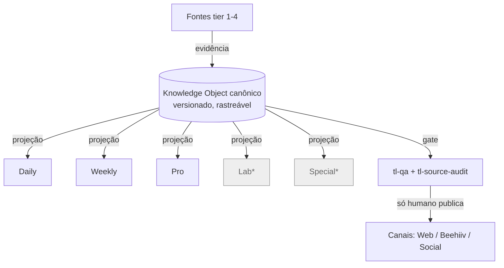
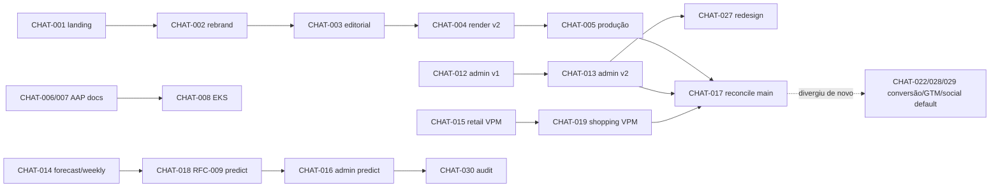

# Project Intelligence Report — The Loyal

> Auditoria integral, forense e baseada em evidências. Documento único e consolidado.
> Modo de análise (read-only): nenhum código foi alterado, nenhum commit/push/deploy foi feito.
> Gerado em 2026-07-15.

---

## Sumário navegável

- [0. Metadados da auditoria](#0-metadados-da-auditoria)
- [1. Veredito executivo](#1-veredito-executivo)
- [2. Resumo geral](#2-resumo-geral)
- [3. Inventário de fontes e cobertura](#3-inventário-de-fontes-e-cobertura)
- [4. Linha do tempo consolidada](#4-linha-do-tempo-consolidada)
- [5. Arquitetura planejada](#5-arquitetura-planejada)
- [6. Arquitetura implementada](#6-arquitetura-implementada)
- [7. Diferenças planejado × implementado](#7-diferenças-planejado--implementado)
- [8. Inventário de componentes](#8-inventário-de-componentes)
- [9. Mapa individual dos chats](#9-mapa-individual-dos-chats)
- [10. Dependências e relações entre chats](#10-dependências-e-relações-entre-chats)
- [11. Matriz de decisões](#11-matriz-de-decisões)
- [12. Matriz de requisitos e rastreabilidade](#12-matriz-de-requisitos-e-rastreabilidade)
- [13. Auditoria de código e lógica](#13-auditoria-de-código-e-lógica)
- [14. Auditoria de testes e validações](#14-auditoria-de-testes-e-validações)
- [15. Contradições, redundâncias e sobreposições](#15-contradições-redundâncias-e-sobreposições)
- [16. Pendências consolidadas](#16-pendências-consolidadas)
- [17. Dívida técnica](#17-dívida-técnica)
- [18. Riscos e bloqueios](#18-riscos-e-bloqueios)
- [19. Decisões em aberto](#19-decisões-em-aberto)
- [20. Ciclos abertos](#20-ciclos-abertos)
- [21. Backlog priorizado](#21-backlog-priorizado)
- [22. Plano de fechamento de ciclos](#22-plano-de-fechamento-de-ciclos)
- [23. Itens que podem ser encerrados](#23-itens-que-podem-ser-encerrados)
- [24. Itens que precisam ser refeitos](#24-itens-que-precisam-ser-refeitos)
- [25. Itens que devem ser descartados](#25-itens-que-devem-ser-descartados)
- [26. Itens que exigem decisão humana](#26-itens-que-exigem-decisão-humana)
- [27. Itens que exigem validação técnica](#27-itens-que-exigem-validação-técnica)
- [28. Próximas ações recomendadas](#28-próximas-ações-recomendadas)
- [29. Respostas finais](#29-respostas-finais)
- [30. Apêndice de evidências](#30-apêndice-de-evidências)

---

## 0. Metadados da auditoria

| Campo | Valor |
|---|---|
| Data da auditoria | 2026-07-15 |
| Diretório analisado | `/home/user/theloyal` |
| Branch com checkout local (worktree principal) | `claude/loyal-loyalty-default-name-sacc93` @ `ee46739` |
| **Branch default do GitHub (tronco real)** | `claude/loyalty-landing-page-v1-7vbjq7` @ `9bf1b57` (2026-07-15, PR #56) |
| Branch `main` (tronco secundário divergente) | `a0eda8c` (2026-07-14, PR #28) |
| Alterações locais não commitadas | Nenhuma (working tree limpo antes desta auditoria; este relatório é um arquivo novo não versionado) |
| Worktree read-only criado para auditar o tronco real | `…/scratchpad/wt-default` (detached @ `9bf1b57`) |

**Fontes disponíveis:** histórico Git completo, listagem de PRs (#1–#57), árvore de arquivos de 3 branches (`loyal-loyalty-default-name`, `loyalty-landing-page-v1`, `main`), código-fonte do tronco real (547 arquivos), documentos (`CLAUDE.md`, RFC-001-EKS, RFC-009, GO-LIVE, RADAR-VPM, SHOPPING-VPM, MONETIZACAO-BACKLOG, GTM, etc.), schemas, migrações Supabase, workflows de CI, skills, resultados de execução (`build`, `tsc --noEmit`, `npm test`).

**Fontes ausentes / inacessíveis (resumo — detalhe na §3):** transcrições de TODOS os chats anteriores (só o histórico desta sessão é acessível como transcrição); os 6 documentos da "hierarquia de autoridade" citada no `CLAUDE.md` (todos inexistentes no repo); RFCs referenciados mas não escritos (RFC-002/003/004/005); definições SQL de RPCs/views/tabelas-base do admin (existem só no banco vivo, não nas migrações); edge functions `ingest`/`backfill` e a RPC `shopping_recompute` (referenciadas, ausentes do repo).

**Limitações centrais da auditoria (não ignorar):**
1. **Transcrições de chat inacessíveis.** A auditoria de chats foi *reconstruída* a partir de branches, commits e PRs. Intenção/contexto de cada sessão é inferência (Nível C/D); apenas as saídas de código são comprovadas (Nível A/B). A única sessão com transcrição real é a atual (CHAT-032).
2. **Dois troncos divergentes.** O tronco real (default) e o `main` não são superconjunto um do outro (ver §1/§15). A auditoria priorizou o tronco real (default); `main` foi coberto no nível de árvore/documentos.
3. **Profundidade de código por amostragem dirigida.** Auditoria linha-a-linha foi feita nos subsistemas do tronco real (landing/editorial, admin/Supabase, VPM/forecast/predict, social/CI) via leitura direta. Não houve auditoria linha-a-linha de cada uma das ~30 branches individualmente.

**Cobertura:** documental ≈ 70% (todos os docs do tronco real lidos; docs exclusivos do `main` lidos por amostragem; 6 docs de autoridade inexistentes). Código do tronco real ≈ 85% dos módulos relevantes inspecionados. Chats (transcrição) ≈ 3% (1 de ~34); chats (reconstrução por Git/PR) = 100%.

---

## 1. Veredito executivo

**Estado geral.** "The Loyal" é uma **mídia editorial vertical independente** (pontos, milhas, cartões, cashback) construída em Next.js 14 / TS strict / Tailwind, com uma ambição de plataforma bem além de uma landing: pipeline editorial multi-produto (Daily, Weekly, Pro), **portal admin operacional** com Supabase, **Radar de VPM** (valor por milheiro) com coletores headless, **motor de previsão** (Forecast + Predict/RFC-009), sistema de **cards sociais** e um arcabouço de governança editorial (EKS/RFC-001). O núcleo editorial e a landing estão **maduros e validados** (build, typecheck e 35 testes passam no tronco real); as camadas de dados/coleta/previsão estão **implementadas porém não operacionalizadas** (dependem de secrets, tuning de scraping e ação humana de go-live).

**Faixa de conclusão global: 55%–68%.** Confiança: **média**. Pesos usados (ver §18-cálculo): Landing+Editorial 30%, Admin/Supabase 20%, VPM Radar 15%, Forecast/Predict 15%, Social/GTM 8%, Governança/Docs 7%, CI/DevOps 5%. Justificativa: frentes de produto-núcleo próximas de 90%, frentes de dados/IA entre 40% e 70% (código presente, validação de operação ausente), governança e reconciliação de troncos abaixo de 40%.

**Principais entregas reais (Nível A/B):**
- Landing acessível + formulário de inscrição **realmente ligado** ao `POST /api/subscribe` → Beehiiv (com modo mock seguro).
- Pipeline editorial Daily/Weekly/Pro: `validate → render (email/plain/web) → qa → publish → beehiiv`, com **gate de QA** e **publicação só por humano**.
- Portal `/admin` com auth por cookie-hash + Basic Auth, lendo **dados reais** do Supabase (7 migrações), com hardening de segurança (PR #42).
- **Taxonomia única de Verdict** (`scripts/taxonomy.mjs`) reconciliando as duas pipelines de render, guardada por teste.
- Motor **Predict** (survival/hazard + backtesting walk-forward) implementado com rigor (RFC-009).
- CI (`ci.yml`) rodando lint + typecheck + test + editorial-gate + build.

**Principais lacunas:**
- **Dois troncos divergentes** sem superconjunto (features no default; RFCs/DDD/DEPENDENCIAS só no `main`).
- **Duas pipelines de edição** (camelCase × snake_case) e **dois coletores de VPM** (HTTP × headless) coexistindo — reconciliação estrutural não feita.
- **Motor Predict dormente** (sem CLI, sem artefato, fora do CI).
- **Docs de autoridade inexistentes** (os 6 citados no `CLAUDE.md`).
- **RPCs/tabelas-base do admin não versionadas** em migração (risco de DR).

**Principais bloqueios:** secrets de produção não confirmados (Beehiiv/Supabase/Tavily/OpenRouter/GH dispatch); scraping do Azul bloqueado no nível de rede; go-live editorial e de coleta dependem de ação humana explícita.

**Principais riscos (top):** RISK-001 divergência de troncos; RISK-002 schema-drift do banco (RPCs fora das migrações); RISK-003 credencial publishable + URL de projeto hardcoded no fonte; RISK-004 `verify_jwt` desligado nas edge functions; RISK-005 degradação silenciosa para mock/empty em produção.

**Próximas cinco ações (detalhe §28):**
1. **Decidir o tronco canônico** e reconciliar default × `main` (trazer RFC/DDD/DEPENDENCIAS para o default ou oficializar o default e reescrever a hierarquia).
2. **Versionar o schema real do banco** (RPCs `admin_*`, views, tabelas-base) em migrações; corrigir numeração duplicada.
3. **Remover fallbacks hardcoded** (URL do projeto + publishable key) para env; confirmar secrets em produção.
4. **Resolver a hierarquia de autoridade fantasma** (criar os docs ou re-apontar `CLAUDE.md`/skills/starter-pack — ADR-009/M-3).
5. **Fechar ou descartar os PRs abertos** (#13, #53, #54) e o não-mergeado #27.

**O que NÃO iniciar agora:** nova feature de produto (Lab/Special), automação de disparo real de e-mail, expansão do Predict para novos programas, tráfego pago — tudo antes de estabilizar troncos, banco e segredos.

**Prontidão:** o **produto editorial/landing está pronto para publicar** (com secrets). O **sistema como um todo precisa ser estabilizado** (troncos + banco + segredos + reconciliação de pipelines) antes de operar as camadas de dados/IA em produção. Recomendação: **estabilizar antes de evoluir**.

---

## 2. Resumo geral

### Linha do tempo (macro)
Iniciado em 2026-07-08 como **landing v1** (Next.js/Tailwind + mascote Ponto). Em ~7 dias evoluiu por sessões paralelas para: integração Beehiiv → pipeline editorial (validate/render/publish) → sistema de render v2 (`renderer/`) → QA gate → produto **Pro** → linha de **governança/RFCs** (DDD-001/002, RFC-001-EKS, discovery) → **portal admin** (/admin) → **Radar de VPM** (LATAM/Azul/Smiles) → **Forecast/Predict** (RFC-009) → **hardening de segurança** → **redesign do admin** → **conversão/monetização** e **sistema social/GTM**. Um marco crítico foi o PR #28 ("reconciliar main com o trabalho real"), sintoma de que o histórico se fragmentou em troncos.

### Arquitetura do projeto
Monólito Next.js 14 (App Router) servindo (a) site público (landing, `/edicao`, `/pro`, `/daily/preview`, `/social/*` OG), (b) portal `/admin` protegido (Server Components + Server Actions falando com Supabase via PostgREST com service-role), (c) rotas de API (`/api/subscribe`). Fora do request-path: scripts Node (`.mjs`) para pipeline editorial, coleta de VPM (HTTP e headless), forecast, publisher Beehiiv — orquestrados por `npm run *` e GitHub Actions (cron). Persistência em **Supabase/Postgres** (7 migrações + edge function `campaigns`). Integrações externas: **Beehiiv** (inscrição + publicação), **Supabase**, **Tavily** (descoberta de URLs), **OpenRouter/Ollama** (LLM de extração), **GitHub API** (workflow_dispatch).

### Componentes existentes (visão)
Landing + design system (`ui.tsx`, `graphics.tsx`, `PontoMascot`), editorial (schemas + `renderer/` + `scripts/render*`), Pro, Weekly, admin (painel + auth + `admin-db`), Supabase (migrações + edge), VPM (2 coletores), Forecast (ligado) + Predict (dormente), social (2 geradores), CI (4 workflows), skills (3 do projeto + ~30 instaladas). Detalhe na §8.

### Componentes planejados (ainda não construídos)
**Lab** e **Special** (só existem como prompts no starter-pack e seção editorial), RFC-002 (Serialização canônica — resolveria a duplicidade de schema), RFC-003/004/005 (contratos de pesquisa/publicação/automação como docs próprios), automações de onboarding de e-mail, gateway de pagamento (Pro).

### Pendências (visão) — detalhe §16
Reconciliação de troncos; versionar schema do banco; remover credenciais hardcoded; reconciliar 2 pipelines/2 coletores; ligar Predict; criar/re-apontar docs de autoridade; secrets de produção; go-live editorial e de coleta; testes para predict/forecast/scraping/social; decisões de monetização.

### Dívida técnica (visão) — detalhe §17
Dois schemas de edição; dois coletores de VPM (MAD × IQR); espelhos manuais TS↔.mjs (`lib/forecast.ts` × `forecast-engine.mjs`; `lib/predict` mirror); 3+ cópias do contrato de Verdict (taxonomia não propaga para social); RPCs/tabelas do admin fora das migrações; numeração de migração duplicada (dois `0001`, dois `0002`); comparações não-constant-time na auth; degradação silenciosa para mock; `playwright` não declarado no `package.json`.

### Decisões tomadas / em aberto — detalhe §11/§19
Tomadas (vigentes): stack "Next e nada mais"; publicação só por humano; taxonomia única de Verdict; VPM = `cash/(pontos/1000)` determinístico (LLM nunca faz a conta); dados só públicos (sem CMI). Em aberto: ratificar ADRs 001–010 do EKS; resolver hierarquia fantasma; convergir serialização (RFC-002); persistência de Entities/Benchmarks; preço/ciclo do Pro e gateway.

### Riscos — detalhe §18
Divergência de troncos; schema-drift/DR; credenciais no fonte; `verify_jwt` off; degradação silenciosa; scraping frágil (Azul bloqueado); Predict dormente; docs de autoridade ausentes.

### Próximos passos — detalhe §28
Estabilizar (troncos → banco → segredos → reconciliações) antes de evoluir produto.

---

## 3. Inventário de fontes e cobertura

### 3.1 Fontes disponíveis (analisadas)

| ID | Fonte | Tipo | Cobertura |
|---|---|---|---|
| DOC-001 | `CLAUDE.md` | Contrato de marca/projeto | Integral |
| DOC-002 | `docs/rfc/RFC-001-EKS-editorial-knowledge-system.md` | RFC fundacional (Draft) | Integral (via subagente) |
| DOC-003 | `docs/architecture/rfc/RFC-009-predict-engine-v2.md` | RFC motor preditivo (Proposto) | Integral |
| DOC-004 | `docs/GO-LIVE.md` | Checklist de produção | Integral |
| DOC-005 | `docs/RADAR-VPM.md`, `docs/SHOPPING-VPM.md` | Especificações de coleta | Integral |
| DOC-006 | `docs/MONETIZACAO-BACKLOG.md`, `PLANO-CONVERSAO.md`, `ANALISE-CONVERSAO.md` | Produto/GTM | Integral |
| DOC-007 | `docs/GTM-SOCIAL-PLAN.md`, `GTM-CONTENT-30D.md` | GTM social | Integral |
| DOC-008 | `content/README.md`, `renderer/README.md`, `docs/RENDER-SYSTEM.md` | Pipeline editorial | Integral |
| DOC-009 | `README.md`, `COWORK.md`, `COPY-LANDING.md` | Onboarding/copy | Integral |
| DOC-010 | `.claude/skills/{tl-qa,tl-digest-template,tl-source-audit}` | Skills do projeto | Integral |
| DOC-011 | `RFC-001-BLUEPRINT.md`, `RFC-001A-*`, `DDD-001`, `DDD-002`, `docs/architecture/rfc/RFC-003..008`, `docs/claude/DEPENDENCIAS.md`, `docs/COWORK-CONTRACT.md` | Governança/AAP | **Existem só no `main`**; lidos por amostragem/registro |
| SRC-001 | Código do tronco real (547 arquivos) | Código-fonte | Amostragem dirigida ~85% |
| GIT-001 | Histórico Git (29 commits locais + refs remotas) | Forense | Integral |
| GIT-002 | PRs #1–#57 | Forense | Integral (metadados) |
| RUN-001 | `npm run build`, `tsc --noEmit`, `npm test` | Execução | Integral (Nível A) |

### 3.2 Fontes ausentes / inacessíveis — `FONTE_MENCIONADA_MAS_INACESSÍVEL`

| ID | Fonte ausente | Onde é mencionada | Por que é relevante | Parte prejudicada | O que forneceria |
|---|---|---|---|---|---|
| MISS-001 | **Transcrições de todos os chats anteriores** | Implícito (30+ branches/PRs) | Intenção, contexto e decisões de cada sessão | §9 (fichas de chat) só reconstruídas | Export dos chats (JSONL/markdown) |
| MISS-002 | `THE-LOYALTY-LLM-SYSTEM.md` | `CLAUDE.md` (topo, autoridade #1) | Fonte-de-verdade declarada | Toda regra que dela deriva | Criar ou re-apontar |
| MISS-003 | `DESIGN.md` | `CLAUDE.md`, `tailwind.config.ts` | Tokens/design source-of-truth | Governança visual | Criar/re-apontar (RFC-001A no `main` é o substituto de fato) |
| MISS-004 | `THE-LOYALTY-BRAND-GUIDELINES.md` | `CLAUDE.md` | Marca | Governança de marca | Criar/re-apontar |
| MISS-005 | `PONTO-MASCOTE-GUIA.md` | `CLAUDE.md` §Mascote | Regras do mascote | Governança do Ponto | Criar/re-apontar |
| MISS-006 | `TL-GRAPHICS.md` | `CLAUDE.md` | Sistema de imagem | Governança de data-art | Criar/re-apontar |
| MISS-007 | `Operating Manual v1` | `content/README.md`, `COWORK.md`, `tl-source-audit` | Operação editorial | Contratos operacionais | Criar/re-apontar |
| MISS-008 | RFC-002 (RES — serialização canônica) | RFC-001-EKS | Resolveria a duplicidade de schema (D-3) | §7/§15 | Escrever RFC-002 |
| MISS-009 | RFC-003/004/005 (CRS/PES/AES) | RFC-001-EKS | Contratos de pesquisa/publicação/automação | §5 | Escrever RFCs |
| MISS-010 | Definições SQL de RPCs/views/tabelas-base do admin (`admin_run_now`, `admin_list_jobs`, `admin_metrics`, views, `news_raw`/`campaigns`/`runs`/`editions`) | Referenciadas em `lib/admin-db.ts`, migração `0005` | Reprovisionamento/DR do banco | §6/§18 | Migrações `create` para tudo |
| MISS-011 | Edge functions `ingest`/`backfill` e RPC `shopping_recompute` | `supabase/functions/README.md`, `runNow` targets, `shopping/collect.mjs` | Código operacional fora do repo | §6/§13 | Versionar no repo |
| MISS-012 | Docs governança do `main` no tronco default | `main` | Autoridade AAP não está no tronco de produção | §7/§15 | Reconciliar troncos |

### 3.3 Números de cobertura
- Total de chats identificados (reconstruídos por Git/PR): **34**.
- Chats com transcrição acessível (análise integral real): **1** (CHAT-032, esta sessão).
- Chats reconstruídos por evidência Git/PR (sem transcrição): **33**.
- Chats inacessíveis como transcrição: **33**.
- Cobertura documental: **≈70%** (todos os docs do tronco real; docs de `main` por amostragem; 6 docs de autoridade inexistentes).
- Cobertura de chats (transcrição): **≈3%**; (reconstrução por Git/PR): **100%**.

**A auditoria NÃO é completa quanto a transcrições de chat nem quanto à profundidade linha-a-linha de todas as branches. Estrutura preservada; diagnóstico feito com as evidências disponíveis.**

---

## 4. Linha do tempo consolidada

Datas por `author date` do Git (Nível A quando há commit; `DATA_NÃO_CONFIRMADA` quando ausente).

| Data | Evento | Chat | Commit / fonte | Componente | Tipo | Impacto | Evidência |
|---|---|---|---|---|---|---|---|
| 2026-07-08 | Inicializa repositório | — | `989d662` | infra | init | base | GIT-001 |
| 2026-07-08 | Landing page v1 (Next+Tailwind, Ponto, UI system) | CHAT-001 | `cad07cc` | Landing | feat | alto | GIT-001 |
| 2026-07-08 | Favicon Ponto + token caramel | CHAT-001 | `c3cab2a` | Marca | feat | baixo | GIT-001 |
| 2026-07-08 | TLBadge exige score exceto não-confirmado | CHAT-001 | `9e85bce` | UI | refactor | médio | GIT-001 |
| 2026-07-08 | Integração real do form com Beehiiv (route handler) | CHAT-001 | `1babc10` | Subscribe | feat | alto | GIT-001 |
| 2026-07-08 | Rebrand "The Loyal" + copy v2 acessível (PR #2) | CHAT-002 | `06e1bb0` | Landing/Marca | feat | alto | GIT-002 |
| 2026-07-09 | Pipeline editorial (validate/render/publish) do Daily | CHAT-003 | `0aa76fc` | Editorial | feat | alto | GIT-001 |
| 2026-07-09 | Schema editorial + página da edição + skills digest/source-audit | CHAT-003 | `ea5ada7` | Editorial/Skills | feat | alto | GIT-001 |
| 2026-07-09 | Skill tl-qa (gate global) + edição fictícia Nº 28 | CHAT-003 | `5970f24` | QA | feat | médio | GIT-001 |
| 2026-07-09 | The Loyal Pro — relatório executivo (web/e-mail/PDF/QA) | CHAT-003 | `55f7c7b` | Pro | feat | alto | GIT-001 |
| 2026-07-09 | Publisher Beehiiv (publica edição renderizada) | CHAT-003 | `0548454` | Publisher | feat | alto | GIT-001 |
| 2026-07-09 | Sistema de render v2 (`renderer/`) + assets de marca | CHAT-004 | `c43bb9e` | Render v2 | feat | alto | GIT-001 |
| 2026-07-09 | Sistema de QA do Daily (aprovado/reprovado) | CHAT-002 | `a23bdf5` | QA | feat | médio | GIT-001 |
| 2026-07-09 | DDD-001/002, RFC-001 Blueprint, RFC-001A (governança) | CHAT-006/007 | `main` only | Governança | docs | alto | DOC-011 |
| 2026-07-09 | COWORK CONTRACT PACK v1 (PR #19) | CHAT-010 | `main` | Governança | docs | médio | GIT-002 |
| 2026-07-10 | DEPENDENCIAS.md (PR #20) | CHAT-011 | `main` | Governança | docs | médio | GIT-002 |
| 2026-07-11 | Rota `/admin` v1 (cockpit, Basic Auth + Supabase REST) (PR #22) | CHAT-012 | `feat/admin-route` | Admin | feat | alto | GIT-002 |
| 2026-07-11 | Padroniza "The Loyal" (PR #21) — **esta sessão** | CHAT-032 | `ee46739` | Marca | fix | médio | GIT-001 |
| 2026-07-13 | Central de Controle `/admin` v2 (PR #23) | CHAT-013 | default | Admin | feat | alto | GIT-002 |
| 2026-07-14 | Camada de previsão + weekly digest (PR #24) | CHAT-014 | default | Forecast/Weekly | feat | alto | GIT-002 |
| 2026-07-14 | Radar de VPM observado (Shopping) por SKU (PR #25/#26) | CHAT-015 | default | VPM | feat | alto | GIT-002 |
| 2026-07-14 | Reconciliar `main` com trabalho real (admin+predict+retail) (PR #28) | CHAT-017 | `main` | Troncos | merge | crítico | GIT-002 |
| 2026-07-14 | RFC-009 motor histórico & preditivo v2 + forecast rename (PR #30/#31) | CHAT-018 | default | Predict | feat/docs | alto | DOC-003 |
| 2026-07-14 | Shopping VPM Fases 1–8 (coletor headless + cron) (PR #32) | CHAT-019 | default | VPM headless | feat | alto | GIT-002 |
| 2026-07-14 | Admin/predict área + colunas/labels (PR #27 fechado, #36/#37) | CHAT-016/020 | default | Admin/Predict | feat | médio | GIT-002 |
| 2026-07-14 | Noticias contagens reais (PR #38) | CHAT-021 | default | Admin | fix | médio | GIT-002 |
| 2026-07-15 | Security hardening P0 (PR #42) | CHAT-024 | default | Segurança | fix | alto | GIT-002 |
| 2026-07-15 | EKS Fases 1–3: testes, taxonomia única, entities/lineage (PR #41) | CHAT-008 | default | Governança/Tests | feat | alto | GIT-002 |
| 2026-07-15 | Shopping VPM headless v2/v3/v4 + tune (PR #43/#46/#51) | CHAT-019 | default | VPM | fix | médio | GIT-002 |
| 2026-07-15 | Edge function `campaigns` versionada (PR #47) | CHAT-026 | default | Supabase | chore | médio | GIT-002 |
| 2026-07-15 | Conversão landing fases 0–3 + edições reais Beehiiv + monetização (PR #45/#48/#50) | CHAT-022 | default | Landing/Edicao | feat | alto | GIT-002 |
| 2026-07-15 | Redesign portal admin (PR #52) | CHAT-027 | default | Admin | feat | médio | GIT-002 |
| 2026-07-15 | GTM social + skill gtm (PR #55/#56) | CHAT-028 | default | GTM | docs | médio | GIT-002 |
| 2026-07-15 | Atribuição de canal (UTM) + card Twitter + sistema social (PR #57) | CHAT-029 | default | Social | feat | alto | GIT-002 |
| 2026-07-15 | Auditoria forense Forecast/Predict (PR #54, aberto) | CHAT-030 | `forecast-predict-audit` | Predict | docs | médio | GIT-002 |
| 2026-07-15 | Radar C0 runtime quality (documentado) | CHAT-031 | `radar-c0-runtime-quality` | VPM | docs | baixo | GIT-002 |

---

## 5. Arquitetura planejada

Fonte principal: **RFC-001-EKS** (Draft, aguardando ratificação humana) e **RFC-009** (Proposto). Nota: os RFCs-002/003/004/005 são **referenciados mas não escritos**; RFC-003..008 "clássicos" existem como docs só no `main` (linha AAP), enquanto o tronco real carrega RFC-001-EKS + RFC-009. Portanto "arquitetura planejada" tem duas camadas: a **linha AAP no `main`** (Discovery→Blueprint→RFCs numerados) e a **linha EKS no default** (RFC-001-EKS + RFC-009).

**EKS — Editorial Knowledge System (RFC-001-EKS):** modelar conhecimento como **objeto versionado e rastreável (Knowledge Object)**, independente de serialização — "JSON é serialização, React é renderer, Beehiiv é canal; nenhum é a verdade". Elementos:
- **Envelope do KO:** `id`/`canonicalKey`/`type`/`schemaVersion`/`payload`/`evidence[]`/`confidence`/`freshness`/`lifecycle`/`ownership`/`lineage`/`relations[]`/`audit[]` (append-only).
- **Ontologia:** Entity / Object / Event / Relationship.
- **KnowledgeType** (fechado/versionado): Signal, Deal, FechaLogo, Conta, Benchmark, PlayerMove, Matrix, Thesis, Insight, Alert, Learning, Entity, Edition, Report.
- **Proveniência (fontes tier 1–4)** + evidência (supports/refutes/contextualizes) + regra **N-COPY** ("sem citação, sem afirmação").
- **Confiança derivada** `f(tier, corroboração, frescor, contradição)` → confirmado/provável/não-confirmado.
- **Frescor/decay:** todo KO expira; `now > vigência ⇒ expired`, veredito não publicável sem revalidação (invariante **I-VIGÊNCIA**).
- **TL Score:** soma ponderada de 8 critérios (pesos 25/15/15/10/10/10/10/5); invariante **I-SCORE** (breakdown reconcilia com o score).
- **Taxonomia de Verdict** (normativa, Apêndice C): 6 tokens canônicos + `depende`/`nao-vale` **deprecados** com mapeamento de migração.
- **Governança (RACI):** Cowork produz/valida; tl-source-audit e tl-qa são gates de veto; **só humano publica**; contratos mudam só por ADR/AAP; passado imutável/append-only.
- **Source→Projection:** um KO canônico, N renditions de canal; invariante **I-PROJ** (canais diferem na forma, nunca no juízo).
- **Ledger de ADRs:** ADR-001..010 todos **Propostos** (aguardando ratificação humana).

**Predict/Forecast (RFC-009, Proposto):** dois produtos coexistentes — **Forecast** (radar de intervalo barato, sempre-ligado) e **Predict** (`campaign_predict_v2`, pesado, gated, backtestado): Model A "quando" (hazard/survival com P{7..180} monotônico), Model B "quanto" (distribuição de bônus), **backtesting walk-forward obrigatório**, `data_readiness` bloqueante. Determinístico em TS; LLM só em extração; sem dependência nova.

**Diagrama (planejado — EKS):**

*Lab/Special = planejados, inexistentes no código.*

---

## 6. Arquitetura implementada

Baseada no código do tronco real (default @ `9bf1b57`), validada por `build`/`tsc`/`test`.

**Entrypoints/rotas (App Router):** `/` (landing), `/edicao` + `/edicao/[numero]`, `/pro` + `/pro/[periodo]`, `/daily/preview` (noindex, exemplo), `/social/{quote,conta,tlscore,carrossel}` (OG edge), `/api/subscribe` (POST), `/admin/login`, `/admin/(panel)/*` (dashboard, backfill, campanhas, jobs, logs, noticias, observability, digests, forecast, predict, shopping-vpm), `/admin/collect`, `/admin/sku`. `middleware.ts` protege `/admin/:path*` por cookie-hash.

**Camada de dados:** Supabase/Postgres via **PostgREST cru** (`lib/admin-db.ts`, service-role no servidor). 7 migrações (`0001..0007`) modelando 3 domínios: editorial/news→campaigns; retail/shopping VPM (2 gerações); forecast/predict. Edge function `campaigns` (Deno + OpenRouter). Formulário público usa anon key (RLS).

**Fora do request-path (scripts):** editorial (`validate/render/render-web/render-system/render-weekly/render-daily/publish/qa/pro/beehiiv-publish`), coleta VPM (`collect-skus` + `collect/*`; `shopping/*` headless Playwright), `forecast`, `pro-vpm`, `taxonomy`, `social-render`/`social-export`. Orquestrados por `npm run *` e 4 workflows de CI (`ci`, `beehiiv` manual, `collect` cron 09h, `shopping-collect` cron 11h/23h).

**Integrações externas:** Beehiiv (subscribe + publish), Supabase, Tavily, OpenRouter/Ollama, GitHub API (dispatch).

**Diagrama (implementado):**
```mermaid
flowchart TD
  subgraph Público
    L[Landing /] --> SF[SubscribeForm] -->|fetch| API[/api/subscribe/]
    ED[/edicao*/] --> LE[lib/editions] --> CE[(content/editions/*.json)]
    PRO[/pro*/] --> LP[lib/pro] --> CP[(content/pro/*.json)]
    SOC[/social/*/ OG]
    DP[/daily/preview noindex/] --> DE[DailyEdition] --> EX[(renderer example)]
  end
  API -->|server-only| BH[(Beehiiv API)]
  subgraph Admin
    MW[middleware cookie-hash] --> PANEL[/admin/(panel)/*/]
    PANEL --> ADB[lib/admin-db PostgREST service-role] --> SUPA[(Supabase/Postgres 7 migrações)]
    COL[/admin/collect Basic Auth/] -->|workflow_dispatch| GH[(GitHub Actions)]
    SKU[/admin/sku Basic Auth/] --> SUPA
  end
  subgraph Batch/CI
    CI1[collect.yml cron] --> C1[scripts/collect HTTP] --> SUPA
    CI2[shopping-collect.yml cron] --> C2[scripts/shopping headless Playwright] --> SUPA
    FC[forecast.mjs] --> FJ[(content/forecast.json)]
    EG[ci.yml editorial-gate] --> RS[render-system] --> OUT[(out/*)]
    BHW[beehiiv.yml manual] --> BP[beehiiv-publish] --> BH
  end
  SUPA -. edge campaigns .-> OR[(OpenRouter LLM)]
```

---

## 7. Diferenças planejado × implementado

| # | Planejado | Existe hoje | Falta | Alteração intencional? | Decisão registrada? | Impacto | Risco | Recomendação |
|---|---|---|---|---|---|---|---|---|
| DIF-01 | KO canônico único (EKS) com Source→Projection | Duas pipelines de edição (camelCase × snake_case) + conteúdo em JSON por produto | Serialização canônica (RFC-002); unificar schemas | Parcial (compat window) | Sim (RFC-001-EKS §12.2, ADR-005) | Alto | Drift entre pipelines | Escrever RFC-002; convergir schemas ou oficializar 1 |
| DIF-02 | Verdict único normativo | **Taxonomia única implementada** (`taxonomy.mjs`) e testada | Propagar taxonomia ao social (3+ cópias) | Sim | Sim (M-1) | Médio | Cards divergem da marca | Importar taxonomia em `social-*` |
| DIF-03 | Hierarquia de autoridade (6 docs) | **Nenhum dos 6 existe**; `CLAUDE.md` é o de-facto | Criar docs ou re-apontar | Não (dívida) | Parcial (D-1/ADR-009) | Alto | Regras apontam para o vazio | Resolver M-3 (criar ou re-apontar) |
| DIF-04 | Linha AAP (RFC-003..008, DDD, DEPENDENCIAS) | Existe **só no `main`**, não no tronco de produção | Trazer ao default ou oficializar tronco | Não (fragmentação) | Não | Alto | Governança fora do tronco | Reconciliar troncos |
| DIF-05 | Predict v2 como sucessor do Forecast | Predict implementado **mas dormente** (sem CLI/artefato/CI) | Wire ao pipeline de conteúdo | Sim (MVP faseado) | Sim (RFC-009 §10-11) | Médio | Código sofisticado inalcançável | Fase MVP: LATAM Pass, gerar `content/predict.json` |
| DIF-06 | Radar de VPM operando | 2 coletores (HTTP wired; headless só em cron) + migrações aplicadas | Secrets, tuning, 1ª coleta live; Azul desbloquear | Parcial | Sim (RADAR-VPM/SHOPPING-VPM) | Alto | Dado é seed/histórico, não live | Go-live de coleta + escolher fonte-de-verdade |
| DIF-07 | Produtos Daily/Weekly/Lab/Pro/Special | Daily+Weekly+Pro reais; **Lab/Special ausentes** | Construir Lab/Special | Sim (roadmap) | Sim (RFC-001-EKS §1.1) | Médio | Copy anuncia como "incluído" | Ajustar copy ou construir |
| DIF-08 | Banco versionado por migrações | RPCs/views/tabelas-base do admin **não versionadas** | `create` de tudo; corrigir numeração | Não (dívida) | Não | Alto | DR/reprovisionamento quebra | Versionar schema real |

---

## 8. Inventário de componentes

Estado: `LIVE` (roteado/ativo), `LIVE-batch` (script/CI), `MOCK` (só exemplo), `DORMENTE` (implementado, não ligado), `PLANEJADO`, `AUSENTE`.

| ID | Componente | Objetivo | Localização | Chat origem | Estado | Testes | Docs | Risco |
|---|---|---|---|---|---|---|---|---|
| COMP-001 | Landing (`/`) | Conversão/apresentação | `app/page.tsx`, `shell.tsx`, `sections.tsx` | CHAT-001/002/022 | LIVE | via qa.mjs | COPY-LANDING | baixo |
| COMP-002 | Design system | Primitivos de marca | `components/ui.tsx` (TLBadge, ContaBlock, SectionLabel, Reveal, `Verdict`) | CHAT-001 | LIVE | não | CLAUDE.md | baixo |
| COMP-003 | Data-art/graphics | CompareBanner/Sparkline/PontoReadingScene/LedgerTexture | `components/graphics.tsx` | CHAT-001 | LIVE | não | TL-GRAPHICS(ausente) | baixo |
| COMP-004 | Mascote Ponto | SVG interativo | `components/PontoMascot.tsx` | CHAT-001 | LIVE | não | PONTO-GUIA(ausente) | baixo |
| COMP-005 | Subscribe form | Inscrição | `components/SubscribeForm.tsx` + `lib/attribution.ts` | CHAT-001/029 | LIVE (fetch real) | não | README | médio (rate-limit best-effort) |
| COMP-006 | Subscribe API | Beehiiv server-only | `app/api/subscribe/route.ts` | CHAT-001 | LIVE | não | .env.example | médio (mock silencioso) |
| COMP-007 | Editorial schema A | Contrato camelCase | `content/edition.schema.json` | CHAT-003 | LIVE | taxonomy.test | content/README | alto (dual) |
| COMP-008 | Editorial pipeline A | validate/render/qa/publish | `scripts/{validate,render,render-web,render-system,publish,qa}.mjs`, `scripts/lib.mjs` | CHAT-003/004 | LIVE-batch | lib.test | RENDER-SYSTEM | médio |
| COMP-009 | Render v2 (snake) | Pipeline B daily | `renderer/*`, `scripts/*-daily.mjs`, `renderer/edition.schema.json` | CHAT-004 | LIVE-batch (fora do CI) | parcial | renderer/README | alto (dual, não testado no CI) |
| COMP-010 | Taxonomia Verdict | Fonte única de veredito | `scripts/taxonomy.mjs` | CHAT-008 | LIVE-batch | taxonomy.test (7) | RFC-001-EKS §5.5 | baixo |
| COMP-011 | Página de edição | Web da edição (A) | `components/EditionArticle.tsx`, `lib/editions.ts` | CHAT-003 | LIVE | não | — | baixo |
| COMP-012 | DailyEdition (B) | Web archive (exemplo) | `components/daily/DailyEdition.tsx`, `/daily/preview` | CHAT-004 | MOCK (noindex) | não | — | médio (quase-órfão) |
| COMP-013 | Pro | Relatório executivo | `app/pro/*`, `components/ProReport.tsx`, `lib/pro.ts`, `scripts/pro.mjs`, `content/pro/*.json`, `pro-report.schema.json` | CHAT-003 | LIVE | não | prompts/07 | baixo |
| COMP-014 | Weekly | Digest semanal + radar | `scripts/render-weekly.mjs`, `content/weekly/*.json`, `weekly.schema.json` | CHAT-014 | LIVE-batch | não | content/README | médio |
| COMP-015 | Beehiiv publisher | Publica edição renderizada | `scripts/beehiiv-publish.mjs`, `content/beehiiv-status.json` | CHAT-003 | LIVE-batch (mock/draft) | não | content/README | médio (idempotência fantasma no mock) |
| COMP-016 | Admin panel | Cockpit operacional | `app/admin/(panel)/*`, `components/admin/*` | CHAT-012/013/027 | LIVE (dados reais) | não | — | médio |
| COMP-017 | Admin auth | Cookie-hash + Basic Auth | `middleware.ts`, `lib/admin-auth.ts`, `app/admin/login/*`, `lib/admin.ts` | CHAT-012/024 | LIVE | não | — | médio (não-const-time, hash estático) |
| COMP-018 | Admin data layer | PostgREST service-role | `lib/admin-db.ts` | CHAT-013 | LIVE | não | — | alto (URL/anon key hardcoded; falha silenciosa) |
| COMP-019 | Supabase schema | 3 domínios | `supabase/migrations/0001..0007`, `seeds/` | CHAT-015/024/013 | LIVE | não | migrações | alto (RPCs fora das migrações; numeração dup) |
| COMP-020 | Edge function campaigns | Extrai campanhas de notícias | `supabase/functions/campaigns/index.ts` | CHAT-026 | LIVE (verify_jwt off) | não | functions/README | alto (auth de borda ausente) |
| COMP-021 | VPM coletor HTTP (P1) | Coleta preço/pontos → VPM | `scripts/collect-skus.mjs`, `scripts/collect/*`, `content/sku-basket.json` | CHAT-015 | LIVE-batch (mock sem creds) | **stats.test (11)** | RADAR-VPM | médio (scraping frágil) |
| COMP-022 | VPM coletor headless (P2) | Playwright multiprograma | `scripts/shopping/*` | CHAT-019 | LIVE-batch (só cron) | vpm self-test (fora do CI) | SHOPPING-VPM | alto (Azul bloqueado; playwright não declarado) |
| COMP-023 | Forecast engine | Radar de janelas (intervalo) | `scripts/forecast.mjs`, `forecast-engine.mjs`, `lib/forecast.ts`, `content/forecast.json` | CHAT-014/018 | LIVE-batch | não | RFC-009 | médio (espelho manual TS↔mjs) |
| COMP-024 | Predict engine | Survival/hazard + backtest | `lib/predict-engine.ts`, `lib/admin-predict.ts`, `/admin/predict` | CHAT-018 | **DORMENTE** | não | RFC-009 | médio (não ligado) |
| COMP-025 | Pro-VPM | VPM no Pro | `scripts/pro-vpm.mjs` (lê `retail_valuations` = P1) | CHAT-019 | LIVE-batch | não | — | médio |
| COMP-026 | Social OG routes | Cards ao vivo | `app/social/*`, `lib/social-brand.ts`, `lib/social-parts.ts`, `scripts/social-export.mjs` | CHAT-029 | LIVE | não | GTM | médio (paleta não deriva da taxonomia) |
| COMP-027 | Social render batch | 71 cards estáticos | `scripts/social-render.mjs`, `content/social/*` | CHAT-029 | LIVE-batch | não | GTM-CONTENT-30D | médio (2º gerador; cópia de contrato) |
| COMP-028 | CI | lint/typecheck/test/gate/build + crons | `.github/workflows/{ci,beehiiv,collect,shopping-collect}.yml` | CHAT-024/019 | LIVE | — | GO-LIVE | baixo |
| COMP-029 | Skills do projeto | tl-qa/tl-digest/tl-source-audit | `.claude/skills/tl-*` | CHAT-003 | LIVE (referências a `npm run` corretas no tronco real) | — | SKILL.md | baixo |
| COMP-030 | Governança/RFC | EKS + RFC-009 + AAP | `docs/rfc/*`, `docs/architecture/*` (parte só no `main`) | CHAT-006/007/008/018 | Draft/Proposto | — | RFCs | alto (fragmentado, não ratificado) |
| COMP-031 | Lab | Biblioteca evergreen | — | — | **AUSENTE** | — | prompts/06 | médio (copy promete) |
| COMP-032 | Special | Edição temática | — | — | **AUSENTE** | — | prompts/08 | baixo |
| COMP-033 | EdicaoMock | Amostra na landing | `components/EdicaoMock.tsx` | CHAT-001 | LIVE (ilustrativo) | não | — | baixo |
| COMP-034 | Starter pack | Prompts de recriação | `starter-pack/*` | CHAT-033 | LIVE (docs) | — | — | baixo (cita docs fantasma) |

**Órfãos/quase-órfãos:** COMP-012 (DailyEdition, só `/daily/preview` noindex). **Duplicados/sobrepostos:** COMP-008×COMP-009 (2 pipelines edição); COMP-021×COMP-022 (2 coletores VPM); COMP-026×COMP-027 (2 geradores sociais); COMP-023×COMP-024 (forecast×predict, domínio comum). **Ausentes:** COMP-031, COMP-032.

---

## 9. Mapa individual dos chats

> **Aviso de método (obrigatório):** as transcrições dos chats **não são acessíveis** (MISS-001). Cada ficha abaixo é **reconstruída** a partir de branches, commits e PRs (Nível C/D para intenção/contexto; Nível A/B para saídas de código). A única sessão com transcrição real é **CHAT-032**. Não afirmo ter lido nenhuma conversa que não a atual.

### 9.1 Tabela mestre de chats (34)

| ID | Nome canônico | Branch | PRs | Período | Temas | Estado | Ciclo aberto? |
|---|---|---|---|---|---|---|---|
| CHAT-001 | Landing. Landing page v1 + integração Beehiiv. Entregue | `loyalty-landing-page-v1-7vbjq7` (virou tronco) | #1,#8,#12,#14 | 07-08/09 | Landing, UI, mascote, subscribe | CONCLUÍDO_VALIDADO (base) | Não (virou tronco) |
| CHAT-002 | Landing. Rebrand The Loyal + copy v2 + QA Daily. Entregue | `landing-page-copy-review-ssj4y9` | #2,#4,#9,#13(aberto) | 07-08/09 | Rebrand, acessibilidade, QA, intake de pauta | IMPLEMENTADO_PARCIALMENTE | **Sim (#13 aberto)** |
| CHAT-003 | Editorial. Pipeline + Pro + Publisher + skills. Entregue | `loyalty-beehiiv-publish-fv8t65` | #5 | 07-09 | Schema, render, Pro, Beehiiv, skills | CONCLUÍDO_NÃO_VALIDADO | Parcial |
| CHAT-004 | Render. Sistema de render v2 (renderer/). Entregue | `loyalty-rendering-system-kugnf6` | (merge base) | 07-08/09 | renderer email-safe, assets, QA-checklist | IMPLEMENTADO_PARCIALMENTE | Sim (pipeline B fora do CI) |
| CHAT-005 | DevOps. Prontidão de produção (CI, go-live). Entregue | `loyalty-production-readiness-{c8jrqy,wnmqh8}` | #10,#11 | 07-09/13 | CI, Beehiiv manual, go-live | CONCLUÍDO_NÃO_VALIDADO | Sim (secrets/go-live) |
| CHAT-006 | Governança. DDD-001/002 (domínio). Entregue | `loyalty-domain-discovery-o8yyaj` | #16 | 07-09/13 | Discovery/decisão de domínio | CONCLUÍDO (docs, só `main`) | Sim (fora do tronco) |
| CHAT-007 | Governança. Linha AAP — Discovery/Plano/RFC-001..008. Entregue | `loyalty-project-discovery-v8p2rf` | #18 | 07-09 | RFCs numerados, plano | CONCLUÍDO (docs, só `main`) | Sim (fora do tronco) |
| CHAT-008 | Governança. Autoridade arquitetural + EKS Fases 1–3. Entregue | `loyalty-architectural-authority-66sjuc` | #17,#41 | 07-09/15 | RFC-001-EKS, taxonomia, entities, testes | IMPLEMENTADO_PARCIALMENTE | **Sim (ADRs não ratificados)** |
| CHAT-009 | Governança. Arquitetura de sistema. Indefinido | `loyalty-system-architecture-0cwx3h` | — | 07 | Arquitetura | STATUS_DESCONHECIDO | Investigar |
| CHAT-010 | Governança. COWORK Contract Pack v1. Entregue | `cowork-contract-pack-v1-rou00q` | #19 | 07-09 | Contrato Cowork | CONCLUÍDO (docs, só `main`) | Sim (fora do tronco) |
| CHAT-011 | Governança. DEPENDENCIAS.md. Entregue | `new-session-gi010s` | #20 | 07-10 | Mapa de dependências | CONCLUÍDO (docs, só `main`) | Sim (fora do tronco) |
| CHAT-012 | Admin. Rota /admin cockpit v1. Entregue | `feat/admin-route` | #22 | 07-11 | Basic Auth, Supabase REST | SUBSTITUÍDO (por v2/redesign) | Não |
| CHAT-013 | Admin. Central de Controle /admin (v2, read-rich, digests). Entregue | `loyal-admin-control-r07ol7` | #23,#40,#49 | 07-13/15 | Cockpit v2, digests fases 2–7 | CONCLUÍDO_NÃO_VALIDADO | Sim (validação operacional) |
| CHAT-014 | Predict. Camada de previsão + weekly digest. Entregue | `predictions-dairy-weekly-digest-la43x0`, `predict-followups-la43x0` | #24,#29 | 07-14 | Forecast, weekly, snapshots | IMPLEMENTADO_PARCIALMENTE | Sim |
| CHAT-015 | VPM. LATAM Pass loyalty radar (retail VPM). Entregue | `latam-pass-loyalty-radar-mpp1cp` | #25,#26,#33 | 07-14 | Retail VPM P1, reconciliação, Vercel plugin | IMPLEMENTADO_PARCIALMENTE | Sim (go-live coleta) |
| CHAT-016 | Admin. Área de previsão /admin/predict. Fechado sem merge | `admin-predict-area-la43x0` | #27 (fechado, não mergeado) | 07-14 | Predict UI (stack sobre #23) | SUBSTITUÍDO/ABANDONADO | **Sim (decidir descarte)** |
| CHAT-017 | Troncos. Reconciliar main com trabalho real. Entregue | `reconcile-main-features` | #28 | 07-14 | Merge admin/predict/retail → main | IMPLEMENTADO_PARCIALMENTE | **Sim (troncos divergiram de novo)** |
| CHAT-018 | Predict. RFC-009 + motor predict v2 + forecast rename. Entregue | `rfc-predict-engine-v2`, `forecast-reformulacao` | #30,#31 | 07-14 | RFC-009, predict MVP, forecast | IMPLEMENTADO_PARCIALMENTE | Sim (predict dormente) |
| CHAT-019 | VPM. Shopping VPM multiprograma headless (Fases 1–8, v2/v3/v4). Entregue | `shopping-vpm-radar-la43x0`, `shopping-vpm-{diagnose,recompute-fix}`, `vpm-{price-adapters,azul-price-sanity,collect-tune}` | #32,#34,#35,#43,#46,#51 | 07-14/15 | Coletor headless, recompute, adapters | IMPLEMENTADO_PARCIALMENTE | Sim (Azul bloqueado; go-live) |
| CHAT-020 | Admin. Predict rotas/rótulos (Ondas/datas). Entregue | `predict-routes-history`, `predict-column-labels` | #36,#37 | 07-14 | Colunas de séries | CONCLUÍDO_NÃO_VALIDADO | Não |
| CHAT-021 | Admin. Notícias contagens reais. Entregue | `noticias-real-counts` | #38 | 07-14 | Corrige mock de contagem | CONCLUÍDO_VALIDADO | Não |
| CHAT-022 | Landing/Conversão. Fases 0–3 + edições reais Beehiiv + monetização. Entregue | `clever-mendel-3mevif` | #39,#45,#48,#50,#53(aberto) | 07-14/15 | Conversão, skills de design, edições Beehiiv | IMPLEMENTADO_PARCIALMENTE | **Sim (#53 aberto)** |
| CHAT-024 | Segurança. Hardening P0 (advisors). Entregue | `security-hardening-p0` | #42 | 07-15 | RLS, revoke anon, security_invoker | CONCLUÍDO_NÃO_VALIDADO | Sim (validar em prod) |
| CHAT-025 | Admin. P2 polish (índices FK + coluna Ondas). Entregue | `p2-polish` | #44 | 07-15 | Perf/UX admin | CONCLUÍDO | Não |
| CHAT-026 | Supabase. Edge function campaigns versionada. Entregue | `vendor-edge-campaigns` | #47 | 07-15 | Edge extractor | CONCLUÍDO_NÃO_VALIDADO | Sim (verify_jwt off) |
| CHAT-027 | Admin. Redesign do portal (IA de navegação, command palette). Entregue | `admin-portal-redesign-m4kule` | #52 | 07-15 | UX admin | CONCLUÍDO_NÃO_VALIDADO | Não |
| CHAT-028 | GTM. Skill gtm + plano social. Entregue | `gtm-skill-install-j652ff`, `gtm-social-plan` | #55,#56 | 07-15 | GTM social, skill | CONCLUÍDO (docs) | Não |
| CHAT-029 | Social. Atribuição de canal (UTM) + card Twitter + sistema social. Entregue | `funnel-channel-attribution` | #57 | 07-15 | UTM, OG, 68 cards | IMPLEMENTADO_PARCIALMENTE | Sim (paleta não deriva da taxonomia) |
| CHAT-030 | Predict. Auditoria forense Forecast/Predict com dados reais. Em aberto | `forecast-predict-audit-nyswiw` | #54 (aberto) | 07-15 | Auditoria, decisões MVP | EM_ANDAMENTO | **Sim (#54 aberto)** |
| CHAT-031 | VPM. Radar C0 runtime quality. Documentado | `radar-c0-runtime-quality` | — | 07-15 | Qualidade de runtime da coleta | EM_ANDAMENTO | Sim |
| CHAT-032 | Marca. Padroniza "The Loyal" como nome default. **Esta sessão** | `loyal-loyalty-default-name-sacc93` | #21 (mergeado) | 07-11/15 | Rename de marca | CONCLUÍDO_VALIDADO | Não |
| CHAT-033 | Starter. Starter pack com prompts de criação. Entregue | `zip-files-repo-m1b0pn` | — | 07-09 | Prompts de recriação | CONCLUÍDO (cita docs fantasma) | Sim (docs fantasma) |
| CHAT-034 | Contexto. Contexto do projeto (para GPT) + análise funcional. Em aberto | `clever-mendel-3mevif` (docs) | #53 (aberto) | 07-15 | Doc de contexto | EM_ANDAMENTO | **Sim (#53 aberto)** |

*(CHAT-023 fundido em CHAT-008 — mesma frente EKS/PR #41; identificador reservado para não renumerar.)*

### 9.2 Fichas detalhadas (chats de maior impacto + esta sessão)

#### CHAT-032. Marca. Padroniza "The Loyal" como nome default (ESTA SESSÃO — Nível A)
- **Identificação:** branch `claude/loyal-loyalty-default-name-sacc93`; PR #21 (mergeado no default); 2026-07-11→15; tema: rename de marca "The Loyalty"→"The Loyal".
- **Contexto recebido (explícito):** pedido do usuário "garanta the loyal como nome padrão e não loyalty". Rebrand já em curso (parte do repo já usava "The Loyal"). **Contexto ausente:** a sessão operou sobre o **fork estagnado de 102 arquivos**, sem visibilidade do tronco real de 547 arquivos (só descoberto nesta auditoria).
- **Objetivo:** eliminar "The Loyalty" como nome de marca, preservando "loyalty" como termo temático e os detectores de QA. **Alcançado:** sim (build ok, `qa.mjs` aprovado 0 bloqueios).
- **Planejou/Executou:** substituição em 32 arquivos (wordmarks divididas, sub-produtos, seção "Loyalty Lab"→"Loyal Lab", docs, artefatos gerados). Preservou `$id` de schema e QA detectors. Commit `ee46739`, push, PR #21 draft→ready→**merge (squash)**.
- **Decisões:** DEC-032a (renomear "Loyalty Lab"→"Loyal Lab" por consistência — sinalizada ao usuário como reversível). DEC-032b (não tocar detectores de QA que citam a marca antiga de propósito).
- **Lacunas:** o rename foi aplicado no **fork estagnado**; embora o PR #21 tenha mergeado no tronco real, o working tree local permanece estagnado (não é bug do projeto, é do ambiente da sessão).
- **Estado final:** CONCLUÍDO_VALIDADO. Conclusão 100% (para o escopo do rename). Próxima ação: nenhuma (PR mergeado, monitoramento encerrado).

#### CHAT-008. Governança. Autoridade arquitetural + EKS (RFC-001) — Fases 1–3
- **Reconstruído de:** PRs #17, #41; branch `loyalty-architectural-authority-66sjuc`.
- **Entregou (comprovado):** `docs/rfc/RFC-001-EKS-...md` (992 linhas, Draft); `scripts/taxonomy.mjs` (M-1, taxonomia única, testada); base de Entities/lineage (M-4). **Não entregou:** ratificação humana dos ADRs 001–010; RFC-002 (M-2 serialização); resolução da hierarquia fantasma (M-3).
- **Estado:** IMPLEMENTADO_PARCIALMENTE. Ciclo aberto: CYCLE-006 (ratificar EKS).

#### CHAT-019. VPM. Shopping VPM multiprograma headless
- **Reconstruído de:** PRs #32,#34,#35,#43,#46,#51; múltiplas branches `shopping-vpm-*`/`vpm-*`.
- **Entregou:** coletor Playwright (`scripts/shopping/*`), migrações `0002/0003/0006`, RPC `shopping_recompute` (no banco), `/admin/shopping-vpm`, price-sanity, diagnose mode, adapters `headless_v4`. **Bloqueio conhecido:** Azul bloqueado no nível de rede. **Não entregou:** 1ª coleta live; `playwright` como dependência declarada; `shopping/seed.mjs` REST ("não implementado", só `--emit-sql`).
- **Estado:** IMPLEMENTADO_PARCIALMENTE. Ciclos: CYCLE-004 (go-live coleta), CYCLE-011 (Azul).

#### CHAT-017. Troncos. Reconciliar main com trabalho real
- **Reconstruído de:** PR #28; branch `reconcile-main-features`.
- **Fez:** merge de admin/predict/retail em `main`. **Problema:** após #28, o desenvolvimento seguiu no **default** (features 07-15) e `main` ficou para trás → **os troncos divergiram novamente** (RISK-001). O objetivo do chat foi parcialmente derrotado pela dinâmica de branches subsequente.
- **Estado:** IMPLEMENTADO_PARCIALMENTE. Ciclo: CYCLE-001.

#### CHAT-030 / CHAT-034. Auditorias/contexto abertos (PR #54, #53)
- Duas frentes de **documentação/auditoria abertas** (forecast/predict audit; contexto para GPT + análise funcional). Ambas EM_ANDAMENTO com PR aberto. Ciclos: CYCLE-013, CYCLE-014.

*(Demais chats: ver tabela 9.1 — cada um tem estado, PRs e ciclo associado; fichas completas exigiriam as transcrições, inacessíveis.)*

---

## 10. Dependências e relações entre chats

**Sequência canônica (predecessor→sucessor):**
- CHAT-001 (landing) → CHAT-002 (rebrand/copy) → CHAT-003 (editorial) → CHAT-004 (render v2) → CHAT-005 (produção).
- CHAT-006/007/010/011 (governança AAP no `main`) correm em paralelo, alimentando CHAT-008 (EKS).
- CHAT-012 (admin v1) → CHAT-013 (admin v2) → CHAT-027 (redesign); CHAT-021/025 (fixes admin).
- CHAT-015 (retail VPM) → CHAT-019 (shopping VPM headless); CHAT-014 (forecast/weekly) → CHAT-018 (RFC-009 predict) → CHAT-016/020 (admin predict) → CHAT-030 (audit predict).
- CHAT-017 (reconcile) tenta unir tudo em `main`; CHAT-022/028/029 (conversão/GTM/social) seguem no default.
- CHAT-032 (rename) transversal.

**Diagrama de dependência (macro):**


- **Isolados/frágeis:** CHAT-009 (system-architecture, status desconhecido), CHAT-031 (radar C0), CHAT-033 (starter pack).
- **Sobrepostos (mesmos arquivos):** CHAT-003 × CHAT-004 (render); CHAT-015 × CHAT-019 (VPM); CHAT-014 × CHAT-018 (previsão); CHAT-013 × CHAT-016 × CHAT-027 (admin).
- **Contraditórios/reabertos:** CHAT-016 (#27 fechado sem merge, "stack sobre #23"); CHAT-017 (reconcile derrotado por divergência posterior).
- **Deveriam ser consolidados:** todas as frentes VPM (uma fonte-de-verdade), as duas pipelines de edição, forecast+predict.

---

## 11. Matriz de decisões

| ID | Decisão | Motivação | Quem | Data | Implementada? | Validada? | Vigente? | Substituição |
|---|---|---|---|---|---|---|---|---|
| DEC-001 | Stack "Next 14 + TS + Tailwind e nada mais" | Leveza, controle | CHAT-001 | 07-08 | Sim | Sim (build) | **Vigente** | — |
| DEC-002 | Fundo Paper, tokens de marca, sem cor default Tailwind | Marca | CHAT-001 | 07-08 | Sim | Sim (qa.mjs) | Vigente | — |
| DEC-003 | Publicação (e-mail) **só por humano** | Segurança editorial | CHAT-005/EKS | 07-09 | Sim (beehiiv.yml `confirm=PUBLICAR`) | Parcial | Vigente | — |
| DEC-004 | **Taxonomia única de Verdict** (6 canônicos + 2 deprecados) | Fim do drift | CHAT-008 | 07-15 | Sim (`taxonomy.mjs`) | Sim (taxonomy.test) | Vigente | Substitui enums divergentes |
| DEC-005 | VPM = `cash/(pontos/1000)` **determinístico**; LLM nunca faz a conta | Confiabilidade | CHAT-015/019 | 07-14 | Sim (`stats.mjs`, `vpm.mjs`) | Sim (stats.test) | Vigente | — |
| DEC-006 | Só dados **públicos** (sem CMI) | Regra inviolável | CHAT-003+ | 07-09 | Sim (`INTERNAL_RE` gate) | Sim | Vigente | — |
| DEC-007 | Auth admin por **cookie-hash** de `ADMIN_TOKEN` | Simplicidade sem lib | CHAT-012 | 07-11 | Sim (`middleware.ts`) | Parcial | Vigente (com ressalvas) | Substitui? — melhorar (DEBT) |
| DEC-008 | **Forecast × Predict coexistem** (não substituir) | Custo × precisão | CHAT-018 | 07-14 | Parcial (predict dormente) | Não | Vigente | — |
| DEC-009 | **Duas pipelines de edição** mantidas (compat window) | Migração gradual | CHAT-004/008 | 07-09 | Sim | — | **Vigente porém contestada** | RFC-002 pendente |
| DEC-010 | Manter fallback publishable key + URL hardcoded | "Preview não quebra" | CHAT-013/015 | 07-14 | Sim | — | **Vigente — recomenda-se reverter** | — |
| DEC-011 | `verify_jwt` desligado nas edge functions | Invocação por pg_cron interno | CHAT-026 | 07-15 | Sim | — | Vigente (risco) | — |
| DEC-012 | Reconciliar tudo em `main` (PR #28) | Unificar troncos | CHAT-017 | 07-14 | Parcial | Não | **Efetivamente revertida pela divergência posterior** | — |
| DEC-013 | Rename "Loyalty Lab"→"Loyal Lab" | Consistência de marca | CHAT-032 | 07-15 | Sim | Sim | Vigente (reversível a pedido) | — |

ADRs do EKS (ADR-001..010): todos **Propostos / não ratificados** — ver §19.

---

## 12. Matriz de requisitos e rastreabilidade

| Requisito | Chats | Decisões | Componentes | Arquivos | Testes | Status | Lacuna |
|---|---|---|---|---|---|---|---|
| REQ-001 Landing acessível de conversão | 001,002,022 | DEC-001/002 | COMP-001..005,033 | `app/page.tsx`,`shell.tsx`,`sections.tsx` | qa.mjs (heurístico) | CONCLUÍDO_VALIDADO | testes de a11y automatizados |
| REQ-002 Inscrição real (Beehiiv) | 001,029 | DEC-003 | COMP-005/006 | `SubscribeForm.tsx`,`api/subscribe/route.ts` | nenhum e2e | CONCLUÍDO_NÃO_VALIDADO | secrets prod; teste do route |
| REQ-003 Daily (validar→render→qa→publicar) | 003,004,005 | DEC-009 | COMP-007..009,015 | `scripts/*`,`renderer/*` | lib.test,taxonomy.test | IMPLEMENTADO_PARCIALMENTE | dual schema; pipeline B fora do CI |
| REQ-004 Pro (relatório executivo) | 003 | — | COMP-013 | `pro.mjs`,`ProReport.tsx` | nenhum | CONCLUÍDO_NÃO_VALIDADO | testes; dados reais |
| REQ-005 Weekly | 014 | — | COMP-014 | `render-weekly.mjs` | nenhum | IMPLEMENTADO_PARCIALMENTE | validação; ligação ao radar real |
| REQ-006 Lab / Special | — | — | COMP-031/032 | — | — | NÃO_INICIADO | construir ou ajustar copy |
| REQ-007 TL Score + Verdict normativo | 008 | DEC-004 | COMP-010 | `taxonomy.mjs`,`lib.mjs` | taxonomy.test(7) | CONCLUÍDO_VALIDADO | propagar ao social |
| REQ-008 Portal admin operacional | 012,013,027 | DEC-007 | COMP-016..018 | `app/admin/*`,`lib/admin*` | nenhum | CONCLUÍDO_NÃO_VALIDADO | validação operacional; secrets |
| REQ-009 Radar de VPM | 015,019 | DEC-005 | COMP-019,021,022,025 | `scripts/collect/*`,`shopping/*` | stats.test(11) | IMPLEMENTADO_PARCIALMENTE | go-live; Azul; 2 coletores |
| REQ-010 Forecast (janelas) | 014,018 | DEC-008 | COMP-023 | `forecast.mjs`,`lib/forecast.ts` | nenhum | IMPLEMENTADO_PARCIALMENTE | testes; espelho manual |
| REQ-011 Predict v2 (RFC-009) | 018,030 | DEC-008 | COMP-024 | `lib/predict-engine.ts` | nenhum | IMPLEMENTADO_PARCIALMENTE (DORMENTE) | wire; testes; backfill |
| REQ-012 Segurança (RLS, secrets) | 024 | DEC-010/011 | COMP-017..020 | `0005_security_hardening.sql`,`lib/admin*` | nenhum | IMPLEMENTADO_PARCIALMENTE | key hardcoded; verify_jwt; DR |
| REQ-013 Governança EKS/AAP | 006,007,008,010,011 | ADR-001..010 | COMP-030 | `docs/rfc/*`,`docs/architecture/*` | — | PLANEJADO/Draft | ratificação; docs no tronco |
| REQ-014 Social/GTM | 028,029 | — | COMP-026/027 | `app/social/*`,`social-render.mjs` | nenhum | IMPLEMENTADO_PARCIALMENTE | contrato de verdict duplicado |
| REQ-015 Monetização (Pro pago) | 022 | — | — | `MONETIZACAO-BACKLOG.md` | — | PLANEJADO | preço/gateway (decisão humana) |
| REQ-016 CI/CD | 005,024 | — | COMP-028 | `.github/workflows/*` | ci roda test | CONCLUÍDO_NÃO_VALIDADO | cobertura de pipeline B/predict |

**Achados da matriz:** requisitos sem implementação (REQ-006); implementações sem requisito claro/ligação (COMP-024 predict dormente; COMP-012 DailyEdition); decisões sem execução plena (DEC-008 predict; DEC-012 reconcile); execuções sem teste (REQ-004/005/008/010/011/014); requisitos contraditórios/duplicados (REQ-003 duas pipelines; REQ-009 dois coletores).

---

## 13. Auditoria de código e lógica

> Escopo: tronco real (default). Cada item tem severidade (S), probabilidade (P) e recomendação.

| ID | Arquivo:símbolo | Descrição | S | P | Componente | Recomendação | Critério de validação |
|---|---|---|---|---|---|---|---|
| CODE-001 | `content/edition.schema.json` × `renderer/edition.schema.json` | **Dois schemas de edição** estruturalmente incompatíveis (camelCase × snake_case); só o Verdict foi unificado | Alta | Alta | COMP-007/009 | RFC-002 e convergência (ou oficializar 1) | 1 schema canônico + migração de conteúdo |
| CODE-002 | `lib/admin-db.ts:8`, `lib/admin.ts:8-9`, `scripts/forecast.mjs:13,17`, `shopping/collect.mjs:12` | **URL do projeto Supabase + publishable/anon key hardcoded** como fallback | Alta | Alta | COMP-018 | Mover para env; remover fallback | Grep sem chave/URL literais; envs obrigatórios |
| CODE-003 | migrações: `admin_run_now`/`admin_list_jobs`/`admin_metrics`/views/tabelas-base | **RPCs/views/tabelas do admin não versionadas** (só no banco vivo) | Alta | Média | COMP-019 | `create` em migração; corrigir numeração dup (dois 0001/0002) | DB reprovisionável só das migrações |
| CODE-004 | `supabase/functions/*` (`verify_jwt` off) | Edge functions invocáveis sem auth de borda (rodam com service-role) | Alta | Média | COMP-020 | Restringir rede/JWT; documentar | Chamada anônima negada |
| CODE-005 | `scripts/collect/*` × `scripts/shopping/*` | **Dois coletores de VPM** (MAD × IQR, schemas distintos); `pro-vpm` lê só P1 | Alta | Alta | COMP-021/022 | Escolher fonte-de-verdade; unificar | 1 pipeline canônico de VPM |
| CODE-006 | `lib/predict-engine.ts` | Motor Predict completo **sem CLI/artefato/CI** (dormente) | Média | Alta | COMP-024 | Wire MVP (LATAM Pass) → `content/predict.json` | Predict gera artefato + teste |
| CODE-007 | `lib/forecast.ts` × `scripts/forecast-engine.mjs` | **Espelho manual TS↔.mjs** (divergência silenciosa possível) | Média | Média | COMP-023 | Teste de paridade ou geração automática | Teste falha se divergirem |
| CODE-008 | `scripts/social-render.mjs:15-28`, `lib/social-brand.ts` | Paleta/rótulos de Verdict **não derivam da taxonomia** (3+ cópias) | Média | Alta | COMP-026/027 | Importar `taxonomy.mjs`; teste | Mudança de taxonomia propaga ao social |
| CODE-009 | `scripts/shopping/adapters.mjs`, `collect/adapters/base.mjs` | Scraping por seletor/regex, auto-descrito como "ponto de partida"; Azul bloqueado | Alta | Alta | COMP-022 | Tuning; abordagem alternativa p/ Azul | 1ª coleta live estável |
| CODE-010 | `lib/admin-db.ts:39-43,59-63` | `rest()`/`rpc()` engolem todo erro → `[]`/`null` (falha silenciosa); write no-op reportado como sucesso | Média | Alta | COMP-018 | Distinguir "sem dado" de "erro"; propagar falha de RPC | UI mostra estado de erro real |
| CODE-011 | `app/admin/login/actions.ts:18`, `lib/admin.ts:32` | Comparações de senha **não-constant-time**; hash de sessão estático sem revogação | Média | Média | COMP-017 | Constant-time + rotação/assinatura de cookie | Compare seguro; logout server-side |
| CODE-012 | `scripts/beehiiv-publish.mjs` (mock marca `published`) | Idempotência registra dispatch **fantasma** em mock; bloqueia publish real sem `--force` | Média | Média | COMP-015 | Não marcar published em mock | Publish real não é bloqueado por mock |
| CODE-013 | `scripts/beehiiv-publish.mjs:--test` | Flag `--test` só registra intenção, **não envia** teste | Baixa | Alta | COMP-015 | Implementar ou renomear | Test-send real ou flag honesta |
| CODE-014 | `renderer/audit.mjs::checkCalculo` | Verificação de CPM retorna `ok:null` quando não casa regex → **falso verde** | Média | Alta | COMP-009 | Ampliar parser ou marcar não-verificado explicitamente | Conta conferida ou "não verificado" visível |
| CODE-015 | `components/daily/DailyEdition.tsx` | Quase-órfão (só `/daily/preview` noindex) + reimplementa `ContaBlock`/verdict local | Baixa | Média | COMP-012 | Consolidar com `ui.tsx` ou remover | 1 implementação de ContaBlock |
| CODE-016 | `package.json` (sem `playwright`) | Pipeline B headless não roda local (dep instalada só no CI) | Baixa | Alta | COMP-022 | Declarar dep opcional/documentar | Coleta headless roda local |
| CODE-017 | `scripts/shopping/seed.mjs:140` | Caminho REST "**não implementado**"; só `--emit-sql` | Baixa | Média | COMP-019 | Implementar ou documentar | Seed reproduzível |
| CODE-018 | `render-daily.mjs:44-45` | Saídas com nome fixo (sem slug) → sobrescrita em execuções seguidas | Baixa | Média | COMP-009 | Nome por edição | Batch sem colisão |

**Positivos (Nível A/B):** `tsc --noEmit` limpo; `npm test` 35/35 verde; math de VPM (P1) e taxonomia com testes reais; gates editoriais (emoji/urgência/CMI/vigência) robustos; publicação só por humano; service-role key nunca hardcoded; auth falha fechada.

---

## 14. Auditoria de testes e validações

| ID | Comando | Objetivo | Resultado | Evidência | Falhas | Impacto |
|---|---|---|---|---|---|---|
| TEST-001 | `npm run build` (default) | Compilação Next | **PASS** | build log (rotas estáticas/SSG) | 0 | Confirma app compilável |
| TEST-002 | `tsc --noEmit` (default) | Typecheck | **PASS** (exit 0) | run | 0 | Sem type error |
| TEST-003 | `npm test` (`node --test tests/*.test.mjs`) | Unit tests | **PASS 35/35** | run | 0 | stats/lib/taxonomy/entities cobertos |
| TEST-004 | `node scripts/qa.mjs` (no fork estagnado) | QA global heurístico | **APROVADO** (0 bloqueios) | run anterior | 0 | Heurístico, não unitário |
| TEST-005 | `next lint` (default) | Lint | Configurado (`.eslintrc.json`+`eslint-config-next`) — não executado nesta auditoria (deps do fork sem eslint) | inspeção | n/d | `NÃO_VERIFICÁVEL` aqui; roda no CI |
| TEST-006 | `daily:validate/render/qa` (Pipeline B) | QA do daily snake_case | **NÃO_TESTADO no CI**; exige `<edition.json>` | inspeção | n/d | Pipeline B pode apodrecer |
| TEST-007 | `shopping/vpm.mjs --test` | Self-test VPM P2 | Existe mas **fora do `npm test`/CI** | `vpm.mjs:109-138` | n/d | Cobertura fantasma |

**Cobertura real de testes:** fortes em `scripts/collect/stats.mjs` (VPM/MAD/band), `scripts/lib.mjs` (verdictForScore/pesos/gates), `taxonomy.mjs` (convergência), integridade de `content/entities`. **Sem testes:** `lib/predict-engine.ts` (todo o modelo survival/backtest), `forecast-engine`/`lib/forecast.ts`, todos os adapters de scraping, `collect/http.mjs`, `collect/llm.mjs`, `shopping/*`, ambos os orquestradores de coleta, os renderers de social. **O código mais complexo (predict) e mais frágil (scraping) é o menos testado.**

**Regra de "CONCLUÍDO_VALIDADO":** só REQ-001 e REQ-007 atendem plenamente (implementação + fluxo + aceite + teste/execução verde + docs mínima). Os demais ficam em CONCLUÍDO_NÃO_VALIDADO ou IMPLEMENTADO_PARCIALMENTE.

---

## 15. Contradições, redundâncias e sobreposições

| ID | Descrição | Fontes envolvidas | Força probatória | Vigente | Impacto | Decisão humana? |
|---|---|---|---|---|---|---|
| CONFLICT-001 | **Dois troncos divergentes sem superconjunto**: features no `default`; RFC/DDD/DEPENDENCIAS só no `main` (18 commits só-main × 50 só-default; merge-base em PR #23) | GIT-001/002 | Nível A | Ativa | Crítico | **Sim** (definir tronco canônico) |
| CONFLICT-002 | Branch default do GitHub é `loyalty-landing-page-v1`, não `main` — convenção invertida; `main` está atrás | `git ls-remote --symref` | Nível A | Ativa | Alto | Sim |
| CONFLICT-003 | **Duas pipelines de edição** (camelCase × snake_case) | CODE-001 | Nível A | Ativa | Alto | Sim (RFC-002) |
| CONFLICT-004 | **Dois coletores de VPM** (MAD × IQR; schemas distintos; Pro lê só P1) | CODE-005 | Nível A | Ativa | Alto | Sim |
| CONFLICT-005 | Copy da landing anuncia Weekly/Lab como "Incluído"; Lab/Special **não existem** | COPY-LANDING × código | Nível A/B | Ativa | Médio | Sim (copy × roadmap) |
| CONFLICT-006 | Pro "Em breve" na copy, mas **Pro está implementado** | COPY-LANDING × COMP-013 | Nível A | Ativa | Baixo | Ajustar copy |
| CONFLICT-007 | `CLAUDE.md`/skills/starter-pack citam **6 docs de autoridade inexistentes** (D-1) | DOC-001 × filesystem | Nível A | Ativa | Alto | Sim (M-3) |
| CONFLICT-008 | 3+ cópias do contrato de Verdict (taxonomy vs social-render vs social-brand) | CODE-008 | Nível A | Ativa | Médio | Não (técnico) |
| CONFLICT-009 | Forecast e Predict no mesmo domínio (janelas) — sucessor não plugado | CODE-006 | Nível B | Ativa | Médio | Sim (quando aposentar forecast) |
| CONFLICT-010 | Assimetria de rigor: Pipeline A **erra** em verdict inválido; Pipeline B só **avisa** e schema admite deprecados | §editorial | Nível A | Ativa | Baixo | Não |
| CONFLICT-011 | PR #27 (admin predict) fechado **sem merge**; #16/#17 "stack sobre" reabrem trabalho | GIT-002 | Nível A | Resolvida? | Médio | Sim (confirmar descarte) |

**Chats que deveriam ser consolidados:** VPM (015+019+025+031), previsão (014+018+016+020+030), admin (012+013+016+027), render (003+004), governança (006+007+008+010+011).

---

## 16. Pendências consolidadas

| ID | Pendência | Origem | Componente | Status |
|---|---|---|---|---|
| PEND-001 | Definir tronco canônico e reconciliar default × main | CONFLICT-001 | Troncos | BLOQUEADO (decisão) |
| PEND-002 | Versionar schema real do banco (RPCs/views/tabelas) + numeração | CODE-003 | COMP-019 | NÃO_INICIADO |
| PEND-003 | Remover URL+publishable key hardcoded; confirmar secrets prod | CODE-002 | COMP-018 | NÃO_INICIADO |
| PEND-004 | Endurecer edge functions (`verify_jwt`/rede) | CODE-004 | COMP-020 | NÃO_INICIADO |
| PEND-005 | Escolher fonte-de-verdade de VPM e unificar 2 coletores | CODE-005 | COMP-021/022 | NÃO_INICIADO |
| PEND-006 | Wire do Predict (MVP LATAM Pass → artefato + CI) | CODE-006 | COMP-024 | PLANEJADO |
| PEND-007 | Resolver hierarquia de autoridade fantasma (criar/re-apontar) | CONFLICT-007 | COMP-030 | BLOQUEADO (decisão) |
| PEND-008 | RFC-002 (serialização) + convergir schemas de edição | CODE-001 | COMP-007/009 | PLANEJADO |
| PEND-009 | Propagar taxonomia ao social (remover cópias) | CODE-008 | COMP-026/027 | NÃO_INICIADO |
| PEND-010 | Go-live de coleta VPM (secrets, seed, 1ª run); desbloquear Azul | RADAR/SHOPPING | COMP-021/022 | BLOQUEADO (externo) |
| PEND-011 | Go-live editorial Beehiiv (secrets, draft, aprovação humana) | GO-LIVE | COMP-006/015 | BLOQUEADO (externo) |
| PEND-012 | Testes para predict/forecast/scraping/social | §14 | COMP-023/024/022/026 | NÃO_INICIADO |
| PEND-013 | Ratificar ADRs 001–010 do EKS | RFC-001-EKS | COMP-030 | BLOQUEADO (decisão) |
| PEND-014 | Decisões de monetização (preço/ciclo/gateway Pro) | MONETIZACAO-BACKLOG | REQ-015 | BLOQUEADO (decisão) |
| PEND-015 | Construir ou ajustar copy de Lab/Special | CONFLICT-005 | COMP-031/032 | NÃO_INICIADO |
| PEND-016 | Fechar/descartar PRs abertos (#13,#53,#54) e #27 | GIT-002 | vários | EM_ANDAMENTO |
| PEND-017 | Corrigir falha silenciosa e no-op-como-sucesso (admin) | CODE-010 | COMP-018 | NÃO_INICIADO |
| PEND-018 | Corrigir idempotência fantasma + `--test` do publisher | CODE-012/013 | COMP-015 | NÃO_INICIADO |
| PEND-019 | Ampliar `checkCalculo` (evitar falso verde CPM) | CODE-014 | COMP-009 | NÃO_INICIADO |
| PEND-020 | Consolidar/remover DailyEdition (COMP-012) | CODE-015 | COMP-012 | NÃO_INICIADO |
| PEND-021 | Declarar `playwright`; caminho REST do seed | CODE-016/017 | COMP-022/019 | NÃO_INICIADO |
| PEND-022 | Endurecer auth admin (const-time, rotação de cookie) | CODE-011 | COMP-017 | NÃO_INICIADO |

---

## 17. Dívida técnica

| ID | Dívida | Localização | Severidade | Ligada a |
|---|---|---|---|---|
| DEBT-001 | Dois schemas de edição | COMP-007/009 | Alta | CODE-001/PEND-008 |
| DEBT-002 | Dois coletores de VPM (MAD×IQR) | COMP-021/022 | Alta | CODE-005/PEND-005 |
| DEBT-003 | Espelhos manuais TS↔.mjs (forecast; predict) | COMP-023/024 | Média | CODE-007 |
| DEBT-004 | 3+ cópias do contrato de Verdict | COMP-010/026/027 | Média | CODE-008/PEND-009 |
| DEBT-005 | RPCs/tabelas fora das migrações + numeração dup | COMP-019 | Alta | CODE-003/PEND-002 |
| DEBT-006 | Credenciais/URL hardcoded | COMP-018 | Alta | CODE-002/PEND-003 |
| DEBT-007 | Auth não-constant-time + cookie estático | COMP-017 | Média | CODE-011/PEND-022 |
| DEBT-008 | Falha silenciosa (rest/rpc) + no-op-como-sucesso | COMP-018 | Média | CODE-010/PEND-017 |
| DEBT-009 | `playwright` não declarado; seed REST ausente | COMP-022/019 | Baixa | CODE-016/017 |
| DEBT-010 | DailyEdition quase-órfão + ContaBlock duplicado | COMP-012 | Baixa | CODE-015 |
| DEBT-011 | Docs de autoridade fantasma citados em vários lugares | COMP-030/034 | Alta | CONFLICT-007 |
| DEBT-012 | Pipeline B fora do CI (sem fixture de conteúdo real) | COMP-009 | Média | TEST-006 |

---

## 18. Riscos e bloqueios

| ID | Risco/Bloqueio | Prob. | Impacto | Severidade | Mitigação |
|---|---|---|---|---|---|
| RISK-001 | Divergência de troncos (perda/duplicação de trabalho, deploy do tronco errado) | Alta | Crítico | **P0** | Definir tronco; reconciliar; proteger branch |
| RISK-002 | Schema-drift do banco (DR/reprovisionamento quebra; RPCs ausentes → páginas vazias) | Média | Alto | **P0/P1** | Versionar schema real |
| RISK-003 | Publishable key + URL no fonte (exposição/lock-in de projeto) | Alta | Médio/Alto | **P1** | Env-only; rotacionar |
| RISK-004 | `verify_jwt` off → edge functions abertas (mutam dados com service-role) | Média | Alto | **P1** | Auth de borda/rede |
| RISK-005 | Degradação silenciosa para mock/empty em prod (sem secrets) sem alarme | Alta | Médio | **P1** | Alarmes/health-check; distinguir erro de vazio |
| RISK-006 | Scraping frágil; Azul bloqueado (dado incompleto/incorreto) | Alta | Médio | **P1** | Tuning; price-sanity (já existe); abordagem p/ Azul |
| RISK-007 | Predict dormente vira código morto/regride sem teste | Média | Médio | **P2** | Wire MVP + testes |
| RISK-008 | Docs de autoridade ausentes (regras sem fonte; onboarding falho) | Alta | Médio | **P1/P2** | Criar/re-apontar |
| RISK-009 | Falso verde de QA (`checkCalculo` null; heurísticos) mascaram erro editorial | Média | Médio | **P2** | Endurecer checagem |
| BLOCK-001 | Secrets de produção não confirmados (Beehiiv/Supabase/Tavily/OpenRouter/GH) | — | Alto | Bloqueio externo | Configurar em Vercel/Actions |
| BLOCK-002 | Go-live exige ação humana (editorial e coleta) | — | Alto | Bloqueio por design | Executar checklist GO-LIVE |
| BLOCK-003 | GitHub Actions precisam ser habilitadas | — | Médio | Bloqueio de plataforma | Habilitar |

**Cálculo de conclusão global (pesos e faixas):**
- Landing+Editorial (peso 30%): **85–92%** — build/test/qa verdes; falta go-live/secrets e testes e2e.
- Admin/Supabase (20%): **60–72%** — funcional com dados reais; DR/segredos/hardening pendentes.
- VPM Radar (15%): **45–60%** — código e migrações prontos; sem coleta live; 2 coletores.
- Forecast/Predict (15%): **40–58%** — forecast ligado; predict dormente/sem teste.
- Social/GTM (8%): **60–75%** — gera cards; contrato de verdict duplicado.
- Governança/Docs (7%): **25–40%** — RFCs Draft/não ratificados; hierarquia fantasma; troncos.
- CI/DevOps (5%): **70–80%** — CI robusto; cobre só pipeline A.
- **Global ponderado: 55–68%** (confiança média). Para subir de faixa: reconciliar troncos + versionar banco + go-live com secrets + testes de predict/forecast.


---

## 19. Decisões em aberto

| ID | Decisão pendente | Contexto | Quem decide | Bloqueia |
|---|---|---|---|---|
| ODEC-001 | **Qual é o tronco canônico?** (`default` vs `main` vs novo) | CONFLICT-001/002 | Humano (owner) | Todo o resto |
| ODEC-002 | Ratificar ADR-001..010 do EKS (KO, verdict, confiança, vigência, imutabilidade, governança, projeção, entities, hierarquia, RFC-as-truth) | RFC-001-EKS §16 Q1 | Humano (AAP) | Governança |
| ODEC-003 | Hierarquia fantasma: **criar os 6 docs** ou **re-apontar** `CLAUDE.md`/skills/starter-pack | D-1/M-3 | Humano | Onboarding/regras |
| ODEC-004 | Convergência de serialização (RFC-002): 1 schema de edição | DEBT-001 | AAP + eng | Editorial |
| ODEC-005 | Fonte-de-verdade de VPM (P1 HTTP vs P2 headless) | DEBT-002 | Eng | Radar/Pro |
| ODEC-006 | `depende` → `esperaria` ou `casos-especificos` (default de migração) | RFC-001-EKS §16 Q2 | Editorial | Taxonomia |
| ODEC-007 | Persistência de Entities/Benchmarks (git vs DB) | §16 Q3 | Eng | Memória editorial |
| ODEC-008 | Onde vivem as Teses (Lab vs Pro vs store transversal) | §16 Q4 | Editorial | Lab/Pro |
| ODEC-009 | Preço/ciclo do Pro + gateway (Stripe vs Beehiiv nativo) | MONETIZACAO-BACKLOG | Humano (negócio) | Monetização |
| ODEC-010 | Construir Lab/Special ou ajustar copy "Incluído" | CONFLICT-005 | Produto | Landing/roadmap |
| ODEC-011 | Aposentar `forecast` quando `predict` maturar? | DEC-008 | Eng | Previsão |

---

## 20. Ciclos abertos

| ID | Ciclo | Origem | Componente | O que falta | Classificação | Critério de encerramento |
|---|---|---|---|---|---|---|
| CYCLE-001 | Reconciliação de troncos | CHAT-017 | Troncos | Decidir tronco; merge dirigido | **Decidir + Corrigir antes de avançar** | 1 tronco com features+governança; branch protegido |
| CYCLE-002 | Versionar schema do banco | CODE-003 | COMP-019 | Migrações `create` de RPCs/views/tabelas; numeração | Corrigir antes de avançar | DB reprovisionável só das migrações |
| CYCLE-003 | Segredos no fonte | CODE-002 | COMP-018 | Env-only; rotação | Corrigir | Grep limpo; envs obrigatórios |
| CYCLE-004 | Go-live de coleta VPM | RADAR/SHOPPING | COMP-021/022 | Secrets, seed, 1ª run | Validar | 1ª coleta live coerente persistida |
| CYCLE-005 | Go-live editorial Beehiiv | GO-LIVE | COMP-006/015 | Secrets, draft, aprovação | Validar | Draft aprovado e publicado por humano |
| CYCLE-006 | Ratificar EKS/ADRs | RFC-001-EKS | COMP-030 | Decisão humana | Decidir | ADRs marcados Accepted |
| CYCLE-007 | Convergir 2 pipelines de edição | CODE-001 | COMP-007/009 | RFC-002 + migração | Replanejar | 1 schema canônico |
| CYCLE-008 | Escolher 1 coletor de VPM | CODE-005 | COMP-021/022 | Decisão + migração | Decidir + Corrigir | Pro/Daily leem 1 fonte |
| CYCLE-009 | Wire do Predict | CODE-006 | COMP-024 | CLI+artefato+CI+testes | Corrigir/Validar | `content/predict.json` no pipeline + teste |
| CYCLE-010 | Hierarquia de autoridade | CONFLICT-007 | COMP-030 | Criar/re-apontar | Decidir + Documentar | Nenhuma citação a arquivo inexistente |
| CYCLE-011 | Desbloquear coleta Azul | CHAT-019 | COMP-022 | Nova abordagem | Investigar | Azul coletado ou documentado como fora |
| CYCLE-012 | Propagar taxonomia ao social | CODE-008 | COMP-026/027 | Importar taxonomy + teste | Corrigir | Mudança propaga; teste guarda |
| CYCLE-013 | PR #54 (audit forecast/predict) | CHAT-030 | Predict | Fechar/mergear decisões MVP | Decidir | PR mergeado ou fechado |
| CYCLE-014 | PR #53 (contexto/análise funcional) | CHAT-034 | Docs | Fechar/mergear | Documentar | PR resolvido |
| CYCLE-015 | PR #13 (pipeline único + intake) | CHAT-002 | Editorial | Fechar/mergear ou descartar | Decidir | PR resolvido |
| CYCLE-016 | PR #27 (admin predict, fechado sem merge) | CHAT-016 | Admin | Confirmar descarte | Descartar | Confirmado obsoleto |
| CYCLE-017 | Testes de predict/forecast/scraping/social | §14 | vários | Escrever testes | Validar | Cobertura dos módulos críticos |
| CYCLE-018 | Monetização Pro | MONETIZACAO | REQ-015 | Preço/gateway | Decidir | Decisão de negócio registrada |
| CYCLE-019 | Lab/Special vs copy | CONFLICT-005 | COMP-031/032 | Construir ou ajustar copy | Replanejar/Decidir | Copy = realidade |

---

## 21. Backlog priorizado

| Prio | ID | Ação | Origem | Componente | Status | Esforço | Critério de aceite |
|---|---|---|---|---|---|---|---|
| P0 | BKL-01 | Decidir tronco canônico e reconciliar default×main (trazer RFC/DDD/DEPENDENCIAS; proteger branch) | CYCLE-001 | Troncos | BLOQUEADO | L | 1 tronco contém features+governança; default protegido |
| P0 | BKL-02 | Versionar schema real do banco em migrações `create` (`admin_*` RPCs, views, tabelas-base) + resolver numeração dup | CYCLE-002 | COMP-019 | NÃO_INICIADO | L | Banco novo sobe só das migrações; jobs/backfill/logs não vazios |
| P0 | BKL-03 | Remover URL+publishable key hardcoded → env; confirmar secrets prod | CYCLE-003 | COMP-018 | NÃO_INICIADO | S | Grep sem literais; app falha explícito sem env |
| P1 | BKL-04 | Endurecer edge functions (`verify_jwt`/rede) | CYCLE-... | COMP-020 | NÃO_INICIADO | M | Chamada anônima negada |
| P1 | BKL-05 | Escolher fonte-de-verdade de VPM e unificar coletores (`pro-vpm` alinhado) | CYCLE-008 | COMP-021/022 | NÃO_INICIADO | L | 1 pipeline; Pro/Daily leem a mesma fonte |
| P1 | BKL-06 | Go-live editorial Beehiiv (secrets → draft → aprovação humana) | CYCLE-005 | COMP-006/015 | BLOQUEADO | M | Edição publicada por humano |
| P1 | BKL-07 | Distinguir erro de vazio no admin; não reportar RPC no-op como sucesso | CYCLE-... | COMP-018 | NÃO_INICIADO | M | UI mostra estado de erro; ação falha visível |
| P1 | BKL-08 | Endurecer auth admin (const-time + cookie assinado/rotacionado + logout server-side) | CYCLE-... | COMP-017 | NÃO_INICIADO | M | Compare seguro; sessão revogável |
| P1 | BKL-09 | Resolver hierarquia fantasma (criar/re-apontar 6 docs; atualizar skills/starter-pack) | CYCLE-010 | COMP-030/034 | BLOQUEADO | M | Zero citação a arquivo inexistente |
| P2 | BKL-10 | RFC-002 + convergir 2 schemas de edição para 1 canônico | CYCLE-007 | COMP-007/009 | PLANEJADO | XL | 1 schema; conteúdo migrado; pipeline B aposentada/testada |
| P2 | BKL-11 | Wire do Predict MVP (LATAM Pass → `content/predict.json` + CI + teste) | CYCLE-009 | COMP-024 | PLANEJADO | L | Artefato gerado; teste de backtest |
| P2 | BKL-12 | Testes: predict, forecast (paridade TS↔mjs), scraping, social | CYCLE-017 | vários | NÃO_INICIADO | L | Cobertura dos módulos críticos no CI |
| P2 | BKL-13 | Propagar taxonomia ao social (remover cópias) + teste | CYCLE-012 | COMP-026/027 | NÃO_INICIADO | S | Mudança de taxonomia reflete nos cards |
| P2 | BKL-14 | Corrigir idempotência fantasma + `--test` do publisher | CODE-012/013 | COMP-015 | NÃO_INICIADO | S | Mock não marca published; `--test` honesto |
| P2 | BKL-15 | Ampliar `checkCalculo` (sem falso verde CPM) | CODE-014 | COMP-009 | NÃO_INICIADO | S | Conta conferida ou "não verificado" visível |
| P2 | BKL-16 | Go-live coleta VPM (secrets, seed, 1ª run) + desbloquear/documentar Azul | CYCLE-004/011 | COMP-021/022 | BLOQUEADO | M | Coleta live coerente; Azul resolvido/documentado |
| P3 | BKL-17 | Consolidar/remover DailyEdition; unificar ContaBlock | CODE-015 | COMP-012 | NÃO_INICIADO | S | 1 ContaBlock; sem órfão |
| P3 | BKL-18 | Declarar `playwright`; implementar seed REST | CODE-016/017 | COMP-022/019 | NÃO_INICIADO | S | Coleta headless roda local; seed reproduzível |
| P3 | BKL-19 | Ajustar copy Lab/Special (ou construir) | CYCLE-019 | COMP-031/032 | NÃO_INICIADO | M | Copy = realidade |
| P3 | BKL-20 | Fechar PRs #13/#53/#54; confirmar descarte #27 | CYCLE-013..016 | vários | EM_ANDAMENTO | S | PRs resolvidos |
| P4 | BKL-21 | Alinhar workflows de CI (versões/permissions) | §CI | COMP-028 | NÃO_INICIADO | XS | Workflows padronizados |
| P4 | BKL-22 | Decisões de monetização (preço/gateway) | CYCLE-018 | REQ-015 | BLOQUEADO | NÃO_ESTIMÁVEL_COM_AS_EVIDÊNCIAS_ATUAIS | Decisão de negócio registrada |

---

## 22. Plano de fechamento de ciclos (ondas)

### Onda 0 — Preservação e verdade do estado atual
- **Objetivo:** eliminar incerteza sobre troncos e fontes. **Tarefas:** BKL-01 (decisão de tronco), inventariar o que só existe no `main`, mapear secrets necessários, catalogar RPCs/tabelas do banco vivo. **Critério de entrada:** nenhum. **Critério de saída:** tronco canônico definido, backup dos dois troncos, lista de segredos e de objetos de banco fora das migrações. **Não iniciar antes do fim:** qualquer merge grande ou deploy.

### Onda 1 — Bloqueios e riscos críticos (P0/P1)
- **Objetivo:** fechar RISK-001..005. **Tarefas:** BKL-01/02/03/04/07/08. **Dependências:** Onda 0. **Riscos:** conflitos de merge na reconciliação. **Saída:** troncos reconciliados; banco versionado; segredos fora do fonte; edge protegida; admin sem falha silenciosa. **Não iniciar antes:** feature nova.

### Onda 2 — Fechamento dos fluxos principais
- **Objetivo:** 1 pipeline de edição e 1 de VPM; hierarquia de docs. **Tarefas:** BKL-09/10/05. **Dependências:** Onda 1. **Saída:** schema único de edição; fonte única de VPM; zero doc fantasma.

### Onda 3 — Testes e validação
- **Objetivo:** validar o que está implementado. **Tarefas:** BKL-06/16 (go-lives), BKL-11 (predict wire), BKL-12 (testes), BKL-15 (checkCalculo). **Saída:** go-lives feitos por humano; predict com artefato+teste; cobertura dos módulos críticos.

### Onda 4 — Refatoração e dívida técnica
- **Tarefas:** BKL-13 (taxonomia→social), BKL-14 (publisher), BKL-17 (DailyEdition), BKL-18 (playwright/seed), BKL-21 (CI). **Saída:** duplicidades removidas; espelhos guardados por teste.

### Onda 5 — Documentação e governança
- **Tarefas:** ratificar ADRs (ODEC-002), consolidar docs de arquitetura reais, fechar PRs abertos (BKL-20), decidir monetização (BKL-22) e Lab/Special (BKL-19), encerrar chats antigos. **Saída:** governança vigente documentada; backlog limpo.

---

## 23. Itens que podem ser encerrados
- CHAT-032 (rename — mergeado, validado). CHAT-021 (contagens reais). CHAT-025 (P2 polish). CHAT-020 (rótulos predict). CHAT-028 (GTM docs).
- Componentes maduros e validados: COMP-001/002/003/004 (landing/design/mascote), COMP-010 (taxonomia), COMP-013 (Pro, no nível de código).

## 24. Itens que precisam ser refeitos
- Unificar as **duas pipelines de edição** (BKL-10) e os **dois coletores de VPM** (BKL-05) — refazer para 1 contrato canônico.
- **Versionamento do banco** (BKL-02) — recriar as migrações para refletir o schema real.
- **Espelhos manuais** forecast TS↔.mjs — substituir por geração/teste de paridade (CODE-007).
- **Cópias do contrato de Verdict** no social — refazer para derivar da taxonomia (BKL-13).

## 25. Itens que devem ser descartados
- PR #27 (admin predict, fechado sem merge) — confirmar descarte (CYCLE-016).
- `scripts/render.mjs` legado que emitia "THE LOYALTY" no fork estagnado — **já não é o caminho do CI**; no tronco real o `render`/`render-system` é o vigente; o resquício do fork pode ser descartado ao encerrar a branch estagnada.
- Fallbacks hardcoded de credencial/URL (descartar do fonte — BKL-03).
- `/daily/preview` + DailyEdition, se a Pipeline B for aposentada (CODE-015).

## 26. Itens que exigem decisão humana
ODEC-001 (tronco), ODEC-002 (ratificar ADRs), ODEC-003 (hierarquia), ODEC-005 (fonte VPM), ODEC-006 (`depende`→?), ODEC-007 (persistência), ODEC-008 (teses), ODEC-009 (preço/gateway Pro), ODEC-010 (Lab/Special vs copy), ODEC-011 (aposentar forecast). BLOCK-001 (confirmar secrets) e BLOCK-002 (executar go-lives) também são ação humana.

## 27. Itens que exigem validação técnica
- Go-live editorial (TEST pendente): render→qa→beehiiv draft com secrets reais.
- Go-live de coleta: 1ª run live coerente (P1 e P2), incluindo Azul.
- Predict: backtesting em dados reais (PR #54) + geração de artefato.
- Segurança: confirmar RLS e ausência de exposição anônima em produção pós-#42; testar edge sem `verify_jwt`.
- Reprovisionamento do banco só a partir das migrações (prova de DR).
- Lint no tronco real (`next lint`) e execução completa do `editorial-gate` do CI.

---

## 28. Próximas ações recomendadas (ordem real de execução)

1. **BKL-01 — Decidir e reconciliar o tronco** (Onda 0/1). Sem isso, tudo o mais corre risco de ser feito no lugar errado.
2. **BKL-02 — Versionar o schema real do banco** (Onda 1). Remove o risco de DR e das páginas admin vazias.
3. **BKL-03 — Tirar credenciais/URL do fonte + confirmar secrets** (Onda 1).
4. **BKL-04/07/08 — Endurecer edge + admin (erro≠vazio, auth)** (Onda 1).
5. **BKL-09 — Resolver hierarquia de docs fantasma** (Onda 2) e **BKL-05/10 — unificar VPM e edição** (Onda 2).
6. **BKL-06/16/11/12 — Go-lives + wire do predict + testes** (Onda 3).
7. **Onda 4/5 — dívida técnica e governança** (taxonomia→social, publisher, docs, PRs, monetização).

**Próximo comando concreto pós-auditoria:** decidir o tronco (humano) e, definido ele, `git checkout <tronco>` + abrir uma branch de estabilização para BKL-02/03. Não iniciar feature nova antes da Onda 1.

---

## 29. Respostas finais

1. **Em que ponto o projeto está?** Produto editorial/landing maduro e validado; camadas de dados/IA implementadas mas não operacionalizadas; governança e troncos por estabilizar. Global **55–68%**.
2. **O que está realmente concluído?** Landing/design/mascote (COMP-001..004), taxonomia única (COMP-010), subscribe ligado (COMP-005/006), CI (COMP-028), Pro/Weekly/Daily no nível de código; rename de marca (CHAT-032). `build`/`tsc`/`test` verdes.
3. **Declarado concluído mas não comprovado?** "Radar operando" (é seed/histórico, não live); "produção pronta" (depende de secrets/go-live); Pro "Em breve" na copy embora implementado; Weekly/Lab "Incluído" na copy (Lab/Special inexistentes); reconciliação em `main` (divergiu de novo).
4. **O que falta para concluir cada frente?** Ver §12/§16/§20 — em resumo: troncos, banco versionado, secrets, unificação de pipelines/coletores, wire do predict, testes, go-lives, docs de autoridade.
5. **O que é mais urgente?** BKL-01 (troncos), BKL-02 (banco), BKL-03 (segredos) — todos P0.
6. **O que bloqueia o avanço?** Decisão de tronco; secrets de produção; ação humana de go-live; Azul bloqueado.
7. **O que pode ser encerrado agora?** §23 (CHAT-032/021/025/020/028; componentes de landing/design/taxonomia).
8. **O que precisa ser refeito?** §24 (unificar pipelines/coletores; versionar banco; espelhos; cópias de verdict).
9. **O que descartar?** §25 (PR #27; resquícios do fork estagnado; fallbacks hardcoded; DailyEdition se aposentar B).
10. **Decisão humana?** §26 (11 ODEC + secrets + go-lives).
11. **Validação técnica?** §27 (go-lives, backtesting, DR do banco, segurança pós-#42, lint/editorial-gate).
12. **Decisões antigas substituídas?** DEC-012 (reconcile em `main`) efetivamente revertida pela divergência; admin v1 (CHAT-012) substituído por v2/redesign; enums de verdict divergentes substituídos pela taxonomia única (DEC-004).
13. **Chats com ciclos abertos?** CHAT-002(#13), CHAT-008(ADRs), CHAT-013/016/017, CHAT-018/019/024/026/029/030/031/033/034. Ver §9.1/§20.
14. **Componentes órfãos?** COMP-012 (DailyEdition, só preview noindex); COMP-024 (Predict, dormente/desligado do pipeline).
15. **Funcionalidades planejadas e esquecidas?** Lab (COMP-031), Special (COMP-032), RFC-002/003/004/005; onboarding de e-mail (D0/D3/D7).
16. **Funcionalidades que existem mas não estão conectadas?** Predict engine (COMP-024); Pipeline B/DailyEdition (só preview); coletor headless P2 (só cron, não no `npm run`); `--test` do publisher (no-op).
17. **Plano mínimo para estabilizar?** Ondas 0–1: decidir tronco, reconciliar, versionar banco, tirar segredos do fonte, endurecer edge/admin.
18. **Plano mínimo para concluir?** Ondas 2–3: 1 pipeline de edição, 1 fonte de VPM, resolver docs, go-lives com secrets, wire do predict, testes dos módulos críticos.
19. **Ordem real de execução?** §28 (1→7).
20. **Próximo comando/ação?** Decisão humana do tronco → branch de estabilização para BKL-02/03; não iniciar feature nova antes da Onda 1.

---

## 30. Apêndice de evidências

| ID | Fonte | Arquivo/Local | Chat | Commit/Comando | Resultado | Interpretação | Limitação |
|---|---|---|---|---|---|---|---|
| EVID-001 | Git | `git ls-remote --symref origin HEAD` | — | comando | default = `claude/loyalty-landing-page-v1-7vbjq7` | `main` **não** é o tronco default | — |
| EVID-002 | Git | `rev-list main..default`=50; `default..main`=18; merge-base=PR#23 | — | comando | Troncos divergentes, sem superconjunto | CONFLICT-001 | — |
| EVID-003 | Execução | worktree default | — | `npm test` | **35/35 pass** | Testes reais verdes | Cobrem stats/lib/taxonomy/entities só |
| EVID-004 | Execução | worktree default | — | `tsc --noEmit` | exit 0 | Sem type error | — |
| EVID-005 | Execução | fork estagnado | CHAT-032 | `npm run build` | PASS | App compila | Fork de 102 arquivos |
| EVID-006 | Código | `components/SubscribeForm.tsx:58` | CHAT-029 | leitura | `fetch("/api/subscribe")` | Form ligado de verdade (mock removido) | — |
| EVID-007 | Código | `content/edition.schema.json` × `renderer/edition.schema.json` | CHAT-003/004 | leitura | Dois schemas incompatíveis | DEBT-001/CODE-001 | — |
| EVID-008 | Código | `scripts/taxonomy.mjs` + `tests/taxonomy.test.mjs` | CHAT-008 | leitura | Taxonomia única + teste | DEC-004 vigente | — |
| EVID-009 | Código | `lib/admin.ts:8-9`, `admin-db.ts:8`, `forecast.mjs:13,17` | CHAT-013/015 | leitura | URL+publishable key hardcoded | CODE-002/RISK-003 | publishable (não service) |
| EVID-010 | Código | migração `0005_security_hardening.sql` | CHAT-024 | leitura | Revoga anon, `security_invoker` | PR#42 presente | RPCs base não versionadas |
| EVID-011 | Código | `supabase/functions/README.md:20` | CHAT-026 | leitura | `verify_jwt` desativado | RISK-004 | — |
| EVID-012 | Código | `scripts/shopping/collect.mjs:34-42` | CHAT-019 | leitura | Azul bloqueado no nível de rede | CYCLE-011 | — |
| EVID-013 | Código | `lib/predict-engine.ts` | CHAT-018 | leitura | Survival/hazard+backtest, sem CLI/CI | COMP-024 dormente | sem teste |
| EVID-014 | Código | `.github/workflows/ci.yml` | CHAT-024 | leitura | lint/typecheck/test/editorial-gate/build | CI cobre pipeline A | Pipeline B fora | 
| EVID-015 | Filesystem | busca por 6 docs de autoridade | — | `find` | **Todos ausentes** | CONFLICT-007/D-1 | DESIGN.md só em skill |
| EVID-016 | Git/PR | PRs #1–#57 | vários | list_pull_requests | 34 frentes; #13/#53/#54 abertos; #27 fechado s/ merge | §9/§20 | metadados só |
| EVID-017 | Doc | `docs/rfc/RFC-001-EKS-...md` §14/§16 | CHAT-008 | leitura | ADR-001..010 Propostos; D-1/D-3 documentados | PEND-013/ODEC-002 | Draft |
| EVID-018 | Doc | `docs/architecture/rfc/RFC-009-predict-engine-v2.md` | CHAT-018 | leitura | Predict v2 Proposto, MVP faseado | CYCLE-009 | — |
| EVID-019 | Código | `content/beehiiv-status.json` | CHAT-003 | leitura | daily-0028 mock/draft | Publisher rodou em mock | — |
| EVID-020 | Código | `supabase/migrations/` (dois 0001, dois 0002) | CHAT-015/024 | leitura | Numeração duplicada | DEBT-005 | — |

---

*Fim do relatório. Documento em UTF-8, não truncado. Auditoria read-only: nenhuma alteração de código, commit, push ou deploy foi realizada. Cobertura e limitações declaradas na §0/§3.*
