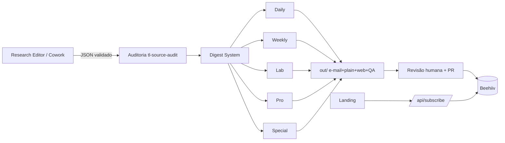
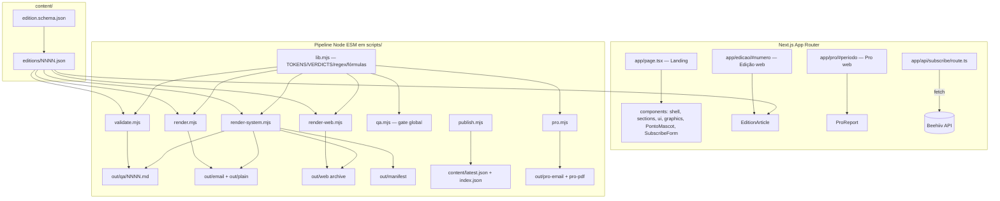
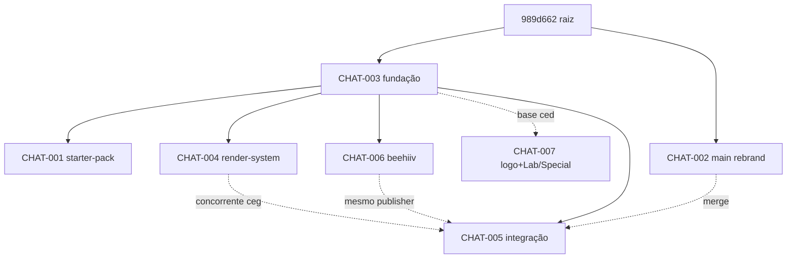

# Project Intelligence Report — The Loyalty

> Auditoria forense integral, baseada em evidências. Modo de análise: **nenhum código foi alterado, nenhum commit/push/deploy foi feito**. As únicas alterações no working tree (`out/qa/0027.md`, `out/qa/0028.md`) foram regeneradas por execuções de validação read-only durante esta auditoria e estão documentadas em §0 e como DEBT-004.

## Sumário navegável

- [0. Metadados da auditoria](#0-metadados-da-auditoria)
- [1. Veredito executivo](#1-veredito-executivo)
- [2. Resumo geral](#2-resumo-geral)
- [3. Inventário de fontes e cobertura](#3-inventário-de-fontes-e-cobertura)
- [4. Linha do tempo consolidada](#4-linha-do-tempo-consolidada)
- [5. Arquitetura planejada](#5-arquitetura-planejada)
- [6. Arquitetura implementada](#6-arquitetura-implementada)
- [7. Diferenças entre planejado e implementado](#7-diferenças-entre-planejado-e-implementado)
- [8. Inventário de componentes](#8-inventário-de-componentes)
- [9. Mapa individual dos chats](#9-mapa-individual-dos-chats)
- [10. Dependências e relações entre chats](#10-dependências-e-relações-entre-chats)
- [11. Matriz de decisões](#11-matriz-de-decisões)
- [12. Matriz de requisitos e rastreabilidade](#12-matriz-de-requisitos-e-rastreabilidade)
- [13. Auditoria de código e lógica](#13-auditoria-de-código-e-lógica)
- [14. Auditoria de testes e validações](#14-auditoria-de-testes-e-validações)
- [15. Contradições, redundâncias e sobreposições](#15-contradições-redundâncias-e-sobreposições)
- [16. Pendências consolidadas](#16-pendências-consolidadas)
- [17. Dívida técnica](#17-dívida-técnica)
- [18. Riscos e bloqueios](#18-riscos-e-bloqueios)
- [19. Decisões em aberto](#19-decisões-em-aberto)
- [20. Ciclos abertos](#20-ciclos-abertos)
- [21. Backlog priorizado](#21-backlog-priorizado)
- [22. Plano de fechamento de ciclos](#22-plano-de-fechamento-de-ciclos)
- [23. Itens que podem ser encerrados](#23-itens-que-podem-ser-encerrados)
- [24. Itens que precisam ser refeitos](#24-itens-que-precisam-ser-refeitos)
- [25. Itens que devem ser descartados](#25-itens-que-devem-ser-descartados)
- [26. Itens que exigem decisão humana](#26-itens-que-exigem-decisão-humana)
- [27. Itens que exigem validação técnica](#27-itens-que-exigem-validação-técnica)
- [28. Próximas ações recomendadas](#28-próximas-ações-recomendadas)
- [29. Respostas finais](#29-respostas-finais)
- [30. Apêndice de evidências](#30-apêndice-de-evidências)

---

## 0. Metadados da auditoria

| Campo | Valor |
|---|---|
| Data da auditoria | 2026-07-15 |
| Diretório analisado | `/home/user/theloyal` |
| Branch atual (checkout) | `claude/loyalty-rendering-system-kugnf6` |
| Commit HEAD | `5960938be2e9080d2709bc92136da3af26993230` |
| Alterações locais | 2 arquivos gerados modificados (`out/qa/0027.md`, `out/qa/0028.md`) — efeito colateral da execução read-only de `node scripts/validate.mjs` durante a auditoria; nenhum código-fonte alterado. Ver DEBT-004. |
| Repositório remoto | `mzinhoww-svg/theloyal` |
| Branches remotas | 7: `main`, `claude/loyalty-landing-page-v1-7vbjq7`, `claude/loyalty-rendering-system-kugnf6`, `claude/landing-page-copy-review-ssj4y9`, `claude/loyalty-beehiiv-publish-fv8t65`, `claude/loyalty-system-architecture-0cwx3h`, `claude/zip-files-repo-m1b0pn` |

**Stack (Nível A — `package.json`, execução):** Next.js 14.2.15 (App Router), React 18.3.1, TypeScript 5.5.4 (strict), Tailwind 3.4.10. Scripts de pipeline em Node ESM puro (`.mjs`), **sem dependências de runtime além de next/react/react-dom**. Sem banco de dados, sem ORM, sem migrações, sem fila. Integração externa única: **Beehiiv** (HTTP REST).

**Fontes disponíveis:** histórico Git completo das 7 branches; código-fonte de todas as branches (via `git show`/`git ls-tree`); documentação (`CLAUDE.md`, `README.md`, `COWORK.md`, `content/README.md`, `docs/RENDER-SYSTEM.md`); skills (`.claude/skills/*`); starter-pack de prompts de planejamento (branch `zip-files-repo`); artefatos gerados (`out/*`); histórico da sessão atual (que produziu CHAT-004).

**Fontes ausentes / inacessíveis (ver §3):** os **transcritos reais dos chats** que produziram cada branch não são acessíveis a esta auditoria — apenas seus artefatos duráveis (commits, diffs, arquivos). Documentos de marca referenciados pelo `CLAUDE.md` (`THE-LOYALTY-LLM-SYSTEM.md`, `DESIGN.md`, `THE-LOYALTY-BRAND-GUIDELINES.md`, `PONTO-MASCOTE-GUIA.md`, `TL-GRAPHICS.md`, `Operating Manual v1`) **não existem no repositório**.

**Limitações:** (1) Reconstrução de "chats" feita por proxy — **1 branch ≈ 1 sessão/chat**. Intenção e contexto foram inferidos de mensagens de commit, diffs e docs, não de diálogo real → conclusões sobre "o que o chat entendeu/planejou" são majoritariamente **Nível C/D**. (2) A análise de código executou validações apenas na branch em checkout (`rendering-system`); o código-fonte das outras 6 branches foi inspecionado estaticamente, não executado. (3) Nenhum teste automatizado real (unit/integration com framework) existe no projeto — "testes" aqui são gates de QA por script.

**Cobertura:** 7/7 branches inventariadas e caracterizadas (100% estrutural). Leitura profunda de arquivo-a-arquivo concentrada na branch atual + arquivos-chave das demais (~70% de profundidade fora da branch atual). Transcritos de chat: 0% (inacessíveis).

---

## 1. Veredito executivo

1. **Estado geral:** O projeto é uma **mídia editorial (newsletter premium sobre loyalty/milhas)** construída como app Next.js + um pipeline editorial em Node. Tem **fundação sólida e de alta qualidade de engenharia**, porém está **fragmentado em 7 branches divergentes que nunca convergiram para um tronco único**. `main` está **abandonada e desatualizada** (1 commit além da raiz) e ainda por cima carrega um **rebrand conflitante ("The Loyal")**. Não existe uma branch que contenha *tudo*.
2. **Conclusão global estimada:** **55%–65%** (confiança média). O núcleo (landing, Daily, Pro, renderizador, QA, inscrição Beehiiv) está implementado e, na branch atual, **passa em typecheck/build/QA (Nível A)**. O que derruba o número é a **não-integração**, os **produtos planejados ausentes (Weekly, e Lab/Special não integrados)**, e a **ausência de validação end-to-end das integrações externas** (envio real Beehiiv nunca comprovado).
3. **Nível de confiança:** Médio. Alto para "o que o código faz na branch atual" (Nível A/B); baixo para "qual é o estado canônico do produto" (nenhuma branch é autoridade — Nível E).
4. **Principais entregas reais (comprovadas):** landing page Next.js (COMP-001); API de inscrição Beehiiv com mock/rate-limit/honeypot (COMP-002); schema editorial + modelo (COMP-003); renderizador Daily e-mail/plain (COMP-004); validador editorial (COMP-005); QA gate global (COMP-006); página web da edição (COMP-008); relatório Pro web/e-mail/PDF/QA (COMP-009); sistema unificado de render + web archive + manifest (COMP-010, branch atual); 3 skills (COMP-011); mascote Ponto (COMP-012).
5. **Principais lacunas:** Weekly (REQ-005) **não iniciado**; Lab/Special (REQ-006/008) existem **só em branch isolada** (`system-architecture`), não integrados; **duas implementações concorrentes de logo** não decididas; **três implementações concorrentes de renderizador** (uma já deletada); envio Beehiiv real **nunca validado**.
6. **Principais bloqueios:** BLOCK-001 (não há branch de integração canônica / `main` divergente); BLOCK-002 (decisão de marca "The Loyalty" vs "The Loyal" pendente); BLOCK-003 (ausência de credenciais Beehiiv impede validar publicação/inscrição reais).
7. **Principais riscos:** RISK-001 (perda de trabalho por divergência de branches); RISK-002 (`main` com rebrand conflitante pode sobrescrever a marca correta num merge ingênuo); RISK-003 (integração externa nunca exercida em produção); RISK-005 (artefatos gerados versionados → drift silencioso).
8. **Próximas cinco ações:** (1) **Decidir o nome da marca** (CONFLICT-001). (2) **Eleger a branch de integração canônica** — candidata natural: `landing-page-copy-review-ssj4y9` (superset). (3) **Decidir qual renderizador sobrevive** (CONFLICT-002) e integrar/descartar o resto. (4) **Reconciliar `main`** com a decisão de marca. (5) **Validar o envio Beehiiv** em ambiente seguro (dry-run já existe).
9. **O que NÃO iniciar agora:** Weekly/Lab/Special (REQ-005/006/008) e qualquer nova feature — antes de resolver integração e marca, novo código só multiplica a divergência.
10. **Prontidão:** O projeto precisa **ser ESTABILIZADO/CONSOLIDADO antes de continuar**. Não está pronto para publicar em produção (integração externa não validada, marca em conflito). Está pronto para *rodar localmente* e *demonstrar*.

---

## 2. Resumo geral

**O que o projeto é.** "The Loyalty" é uma **mídia vertical independente** sobre loyalty, pontos, milhas, cartões, bancos, varejo e cashback (definição em `CLAUDE.md` e `COWORK.md`). O produto de software tem duas metades: (a) um **site Next.js** (landing + páginas de edição/relatório + API de inscrição) e (b) um **pipeline editorial em Node** que transforma **um JSON editorial** em e-mail, texto puro, página web e relatório de QA, com **regras de marca invioláveis** codificadas como validações. O "Cowork" atua como *Research Editor* que só produz JSON validado; renderização/publicação são passos separados.

**Como evoluiu.** Tudo em **8–9 de julho de 2026**. A partir de um `chore: inicializa repositorio` (`989d662`), uma sessão-fundação construiu landing → integração Beehiiv → contrato de marca (`CLAUDE.md`) → pipeline editorial → Pro. Em seguida, **múltiplas sessões saíram em paralelo** (fan-out), cada uma a partir de um `starter-pack` de 9 prompts, para atacar frentes diferentes (logo, publicação Beehiiv, integração/pauta, renderização unificada, Lab/Special). Essas sessões **não se conheciam** e produziram trabalho sobreposto e divergente. Uma delas (esta auditoria = continuação da que gerou `rendering-system`) construiu um renderizador unificado; outra (`copy-review`) construiu **outro** e **deletou um terceiro** ("remove legado"). `main` seguiu um caminho próprio de rebrand e ficou para trás.

**Como está estruturado.** Monólito Next.js (`app/`, `components/`, `lib/`) + scripts de pipeline (`scripts/*.mjs`) + conteúdo versionado (`content/`) + skills (`.claude/skills/`). Sem backend próprio, sem DB. Ver §6.

**O que existe / não existe.** Existe: Daily, Pro, landing, inscrição, renderizador, QA, skills. Não existe (ou não integrado): Weekly, Lab/Special integrados, logo decidido, publicação Beehiiv validada, tronco único.

**Onde estão os maiores problemas.** Governança de branches (não-integração) e conflito de marca — problemas de *program management*, não de código. O código em si é limpo (0 TODO/FIXME reais, typecheck limpo).

**O que precisa acontecer em seguida.** Consolidação: decidir marca, eleger tronco, escolher renderizador, reconciliar `main`, validar Beehiiv. Só então retomar features.

As subseções abaixo (linha do tempo, arquitetura, componentes, pendências, dívida, decisões, riscos, próximos passos) estão detalhadas nas §4–§28 e apenas resumidas aqui por referência de ID.

- **Linha do tempo:** §4.
- **Arquitetura:** §5 (planejada), §6 (implementada), §7 (diferenças).
- **Componentes existentes/planejados:** §8 (COMP-001..019).
- **Pendências:** §16 (PEND-001..).
- **Dívida técnica:** §17 (DEBT-001..).
- **Decisões tomadas / em aberto:** §11 / §19 (DEC-001..).
- **Riscos:** §18 (RISK-001..).
- **Próximos passos:** §28.

---

## 3. Inventário de fontes e cobertura

**Mapeamento chat↔branch.** Não há transcritos de chat acessíveis. Cada branch `claude/*` é o artefato durável de uma sessão de trabalho e é tratada como um "chat". O nome original é o nome da branch; o nome canônico segue `[Área] + [Objetivo] + [Fase]`.

| ID | Nome original (branch) | Nome canônico | Fonte | Período (commits) | Disponibilidade | Cobertura | Temas | Dependências |
|---|---|---|---|---|---|---|---|---|
| CHAT-001 | `zip-files-repo-m1b0pn` | Projeto. Starter-pack de prompts de criação. Fase de planejamento | Git + `starter-pack/` | 2026-07-09 | Artefatos disponíveis; transcrito não | Alta (estrutural) | Prompts de logo/landing/digest/daily/weekly/lab/pro/special/beehiiv | Base: `55f7c7b` |
| CHAT-002 | `main` (`06e1bb0`) | Marca. Rebrand "The Loyal" + copy v2. Fase divergente/abandonada | Git | 2026-07-08 | Artefatos disponíveis | Média | Rebrand, copy acessível | Raiz `989d662` |
| CHAT-003 | `loyalty-landing-page-v1-7vbjq7` | Fundação. Landing + Pipeline editorial + Pro. Fase de fundação | Git | 2026-07-08→09 | Artefatos disponíveis | Alta | Landing, subscribe, CLAUDE.md, schema, render, Pro | Raiz `989d662` |
| CHAT-004 | `loyalty-rendering-system-kugnf6` | Renderização. Sistema unificado (e-mail/plain/web-archive/QA/manifest). Fase entregue-não-integrada | Git + **sessão atual** | 2026-07-09 | **Transcrito parcial disponível** (sessão atual) | Alta | render-system, render-web, validações extras | Base: CHAT-003 (`55f7c7b`) |
| CHAT-005 | `landing-page-copy-review-ssj4y9` | Integração. Consolidação do pipeline + pauta + fontes + Beehiiv + marca. Fase de integração | Git | 2026-07-08→09 | Artefatos disponíveis | Alta | Pipeline único, pauta, sources, brand SVG, /daily, merges #1/#4/#5/#9 | Base: CHAT-003 + `main` |
| CHAT-006 | `loyalty-beehiiv-publish-fv8t65` | Publicação. Publisher Beehiiv de edição renderizada. Fase isolada | Git | 2026-07-09 | Artefatos disponíveis | Alta | `beehiiv-publish.mjs`, status/idempotência | Base: CHAT-003 (`55f7c7b`) |
| CHAT-007 | `loyalty-system-architecture-0cwx3h` | Marca+Editorial. Logo v1 + Digests Lab/Special. Fase divergente | Git | 2026-07-09 | Artefatos disponíveis | Média-Alta | `components/Logo.tsx`, `assets/logo/*`, Lab/Special | Base antiga: `2e30d5e` |

**Fontes FONTE_MENCIONADA_MAS_INACESSÍVEL:**

- **F-INAC-01 — Transcritos dos chats CHAT-001..003, 005..007.** Onde mencionada: implícita (existência das branches). Relevância: intenção/contexto/decisões reais de cada sessão. Prejudica: §10 (fichas de chat) itens de "contexto recebido", "o que entendeu", "objetivos adicionados durante a conversa". Para completar: exportar os transcritos das sessões Claude Code correspondentes.
- **F-INAC-02 — Documentos de marca do `CLAUDE.md`:** `THE-LOYALTY-LLM-SYSTEM.md`, `DESIGN.md`, `THE-LOYALTY-BRAND-GUIDELINES.md`, `PONTO-MASCOTE-GUIA.md`, `TL-GRAPHICS.md`, `Operating Manual v1`. Onde mencionada: `CLAUDE.md` (hierarquia de verdade) e `COWORK.md`. Relevância: são a "fonte de verdade" citada como superior ao próprio `CLAUDE.md`. Prejudica: validar se as regras codificadas refletem o design real; auditar TL Score/CPM/VPM contra a spec. Para completar: adicionar os arquivos ao repo ou confirmar que `CLAUDE.md` os substitui.
- **F-INAC-03 — Webhook "PR #6 merged".** Onde mencionada: evento GitHub na sessão atual. Relevância: afirma merge do CHAT-004. **Contradito pelo Git** (ver CONFLICT-003). Para completar: consultar o estado real do PR #6 e da branch base via GitHub.

**Cálculo de cobertura:** Chats identificados: **7**. Analisados (estrutural + artefatos): **7 (100%)**. Analisados com transcrito: **1 parcial (CHAT-004)**. Inacessíveis (transcrito): **6**. Cobertura documental (arquivos versionados lidos/inspecionados): ~**85%**. Cobertura de "chats" (intenção real via diálogo): ~**15%**. Limitações: §0.

---

## 4. Linha do tempo consolidada

Datas de `git log` (autor). Todos os eventos em 2026-07-08/09. "DATA_NÃO_CONFIRMADA" onde não há timestamp confiável de granularidade menor.

| Data | Evento | Chat | Commit/fonte | Componente | Tipo | Impacto | Evidência |
|---|---|---|---|---|---|---|---|
| 2026-07-08 | Inicializa repositório | — | `989d662` | — | Início | Raiz comum | EVID-001 |
| 2026-07-08 | Landing page v1 (Next.js+Tailwind) | CHAT-003 | `cad07cc` | COMP-001 | Implementação | Fundação do site | EVID-002 |
| 2026-07-08 | Favicon Ponto + token caramel | CHAT-003 | `c3cab2a` | COMP-012 | Implementação | Marca visual | git log |
| 2026-07-08 | TLBadge exige score exceto nao-confirmado | CHAT-003 | `9e85bce` | COMP-003 | Refatoração | Regra de UI | git log |
| 2026-07-08 | Integração real do form com Beehiiv | CHAT-003 | `1babc10` | COMP-002 | Implementação | Inscrição | EVID-006 |
| 2026-07-08 | Rebrand "The Loyal" + copy v2 (PR #2) | CHAT-002 | `06e1bb0` | COMP-001 | Mudança de direção | **Conflito de marca** | EVID-010 |
| 2026-07-09 | CLAUDE.md (contrato de marca) | CHAT-003 | `2e30d5e` | DOC-001 | Documentação | Define regras invioláveis | EVID-003 |
| 2026-07-09 | Pipeline editorial (validate/render/publish) | CHAT-003 | `0aa76fc` | COMP-004/005/007 | Implementação | Núcleo do Daily | EVID-004 |
| 2026-07-09 | Schema editorial + página web + skills | CHAT-003 | `ea5ada7` | COMP-003/008/011 | Implementação | Contrato de dados | EVID-005 |
| 2026-07-09 | Skill tl-qa + edição fictícia Nº 28 | CHAT-003 | `5970f24` | COMP-006/011 | Implementação/Teste | Gate global | git log |
| 2026-07-09 | The Loyalty Pro (web/e-mail/PDF/QA) | CHAT-003 | `55f7c7b` | COMP-009 | Implementação | Produto Pro | EVID-007 |
| 2026-07-09 | (fork) Logo v1 + Lab/Special | CHAT-007 | `aa17426`,`ca382c2` | COMP-013/016 | Implementação isolada | Marca+editorial divergente | EVID-011 |
| 2026-07-09 | Publisher Beehiiv (edição renderizada) | CHAT-006 | `0548454` | COMP-015 | Implementação isolada | Publicação | EVID-009 |
| 2026-07-09 | Starter-pack de prompts | CHAT-001 | `1cf78f5` | COMP-019 | Documentação/Plano | PRD de fato | EVID-008 |
| 2026-07-09 | Sistema de render Daily + assets marca | CHAT-005 | `c43bb9e` | COMP-004b | Implementação concorrente | Renderizador alternativo | git log |
| 2026-07-09 | Publica entregáveis em /daily | CHAT-005 | `8cc33ee` | COMP-004b | Publicação estática | Saídas versionadas | git log |
| 2026-07-09 | Sistema de QA do Daily | CHAT-005 | `a23bdf5` | COMP-006b | Implementação concorrente | QA alternativo | git log |
| 2026-07-09 | **Consolida pipeline / remove legado** | CHAT-005 | `d4d72a6` | COMP-017 | Reversão/Refatoração | **Deleta 3º renderizador** | EVID-012 |
| 2026-07-09 | Rotina de pauta (intake) + catálogo de fontes | CHAT-005 | `869cd65`,`7bfc6ee` | COMP-014 | Implementação | Curadoria editorial | git log |
| 2026-07-09 | **Sistema unificado (render-system/web-archive/manifest)** | CHAT-004 | `5960938` | COMP-010 | Implementação concorrente | 4º renderizador (esta sessão) | EVID-013 |
| 2026-07-09 | Merges PR #1/#4/#5/#9 → copy-review | CHAT-005 | `07dcf75`,`8e8de9f`,`23b40db`,`2ab77b3` | — | Integração parcial | copy-review vira superset | EVID-014 |
| ~2026-07-09 | Webhook "PR #6 merged" (não confirmado no Git) | CHAT-004 | webhook | COMP-010 | Publicação alegada | Ver CONFLICT-003 | EVID-015 |

---

## 5. Arquitetura planejada

Base: `starter-pack/prompts/*` (CHAT-001, Nível C — prompts, não spec formal) + `CLAUDE.md`/`COWORK.md` (Nível C/B).

Produto editorial com **5 formatos de newsletter** + marca + landing + publicação:

1. **Logo/marca** (01_logo) — identidade visual oficial.
2. **Landing** (02_landing) — captação de inscritos.
3. **Digest system** (03_digest_system) — "sistema de renderização dos produtos editoriais" (motor comum).
4. **Daily** (04_daily) — edição diária (sinal, Deal Desk, fecha logo, fontes).
5. **Weekly** (05_weekly) — consolidação semanal.
6. **Lab** (06_lab) — "Loyalty Lab", análise de CPM.
7. **Pro** (07_pro) — relatório executivo do período.
8. **Special** (08_special) — edição especial (CPM final).
9. **Beehiiv publish** (09_beehiiv_publish) — publicação no provedor de e-mail.

Fluxo operacional planejado (`COWORK.md`): Research Editor produz **JSON validado** → auditoria (skill `tl-source-audit`) → renderização (skill `tl-digest-template` / `npm run edition`) → revisão humana + PR → envio manual Beehiiv.

Limitação: os prompts 04–09 têm "Objetivo:" vazio no cabeçalho lido — o detalhe de cada formato é **Nível C/D**.

---

## 6. Arquitetura implementada

Base: código atual (Nível A/B). Retrato da **branch atual** `rendering-system` (superset da fundação CHAT-003 + COMP-010).

- **Entrypoints:** site via Next (`next dev/build/start`); pipeline via `npm run validate|render|render:web|render:system|publish|qa|pro|edition`.
- **Integrações externas:** Beehiiv (inscrição em `app/api/subscribe/route.ts`; publicação em `scripts/beehiiv-publish.mjs` — este só nas branches CHAT-005/006).
- **Config/env:** `BEEHIIV_API_KEY`, `BEEHIIV_PUBLICATION_ID` (server-only, `.env.example`). Sem elas → **modo mock** (subscribe e publisher).
- **CI/CD:** Nenhum workflow no repo (sem `.github/workflows`). Deploy via **Vercel** (inferido de comentários no código e do preview do PR).
- **Banco/fila/jobs:** inexistentes. Rate-limit da inscrição é **em memória** (best-effort, documentado).
- **Fonte de verdade de dados:** arquivos JSON versionados em `content/`.

Pontos únicos de falha: Beehiiv (integração única); `scripts/lib.mjs` (todo o pipeline depende dele). Ver §7.

---

## 7. Diferenças entre planejado e implementado

| # | Planejado | Existe hoje | Falta | Alterado? | Decisão registrada? | Impacto | Risco | Recomendação |
|---|---|---|---|---|---|---|---|---|
| 1 | Digest system único (03) | **3–4 renderizadores concorrentes** (`scripts/render.mjs`+ `render-system.mjs`; `renderer/` deletado; `render-daily.mjs` deletado) | Consolidação e escolha | Sim, não-intencional (fan-out) | Não | Alto | RISK-001 | Eleger 1, descartar/integrar resto (CONFLICT-002) |
| 2 | Daily (04) | Implementado (COMP-004/005/008) | Conteúdo real (só 2 edições ilustrativas) | Não | — | Baixo | — | OK para demo |
| 3 | Weekly (05) | **Nada** | Tudo | — | Não | Médio | RISK-006 | NÃO_INICIADO — planejar |
| 4 | Lab (06) | Só na branch CHAT-007 (não integrado) | Integração ao tronco | Isolado | Não | Médio | RISK-001 | Decidir integrar |
| 5 | Pro (07) | Implementado (COMP-009) | Validação de PDF | Não | — | Baixo | — | OK |
| 6 | Special (08) | Só na branch CHAT-007 | Integração | Isolado | Não | Médio | RISK-001 | Decidir integrar |
| 7 | Beehiiv publish (09) | Implementado nas branches CHAT-005/006 (não no tronco atual) | Integração + validação real | Isolado | Não | Alto | RISK-003 | Integrar + validar dry-run |
| 8 | Logo (01) | **2 implementações** (`assets/logo/*`+`Logo.tsx` em CHAT-007; `public/brand/*` em CHAT-005) | Escolha e integração | Divergente | Não | Médio | CONFLICT-004 | Decidir 1 |
| 9 | Landing (02) | Implementado (COMP-001) | — | Rebrand conflitante em `main` | Parcial | Alto | CONFLICT-001 | Decidir marca |
| 10 | Fluxo Cowork→PR→Beehiiv | Parcialmente (pauta em CHAT-005; publish em CHAT-005/006) | Integração ponta-a-ponta | Fragmentado | Não | Alto | RISK-001 | Consolidar |

Acoplamentos/observações de arquitetura: `scripts/lib.mjs` concentra tokens, veredictos e regex (acoplamento aceitável, é o "core"); componentes órfãos e duplicados em §8; fronteiras bem definidas dentro de cada branch, mas **inexistentes entre branches**.

---

## 8. Inventário de componentes

Estado por componente considerando a **branch atual** como referência, salvo indicação de outra branch.

| ID | Componente | Objetivo | Localização | Chat | Estado | Testes | Doc | Risco |
|---|---|---|---|---|---|---|---|---|
| COMP-001 | Landing page | Captar inscritos, comunicar marca | `app/page.tsx`, `components/shell,sections,ui,graphics` | CHAT-003 | CONCLUÍDO_VALIDADO (build+qa) | QA gate (qa.mjs) | Sim | Baixo |
| COMP-002 | API inscrição + Beehiiv | Inscrever e-mail no Beehiiv | `app/api/subscribe/route.ts` | CHAT-003 | IMPLEMENTADO_PARCIALMENTE (real path NÃO_TESTADO) | Nenhum | Sim (código) | Médio (RISK-003) |
| COMP-003 | Schema + modelo editorial | Contrato do JSON da edição | `content/edition.schema.json`, `lib/editions.ts` | CHAT-003 | CONCLUÍDO_VALIDADO | validate.mjs | Sim | Baixo |
| COMP-004 | Renderizador Daily (e-mail/plain) | JSON→e-mail-safe+texto | `scripts/render.mjs` | CHAT-003 | CONCLUÍDO_VALIDADO | qa.mjs | Sim | Baixo |
| COMP-005 | Validador editorial | Regras invioláveis + QA report | `scripts/validate.mjs` | CHAT-003/004 | CONCLUÍDO_VALIDADO | auto (exec) | Sim | Baixo |
| COMP-006 | QA gate global | Auditoria landing+JSON+e-mail | `scripts/qa.mjs` | CHAT-003 | CONCLUÍDO_VALIDADO | auto | Sim | Baixo |
| COMP-007 | Publisher índice | latest.json/index.json | `scripts/publish.mjs` | CHAT-003 | CONCLUÍDO_NÃO_VALIDADO | Nenhum | Sim | Baixo |
| COMP-008 | Página web da edição | Render web SSG | `app/edicao/[numero]`, `components/EditionArticle.tsx` | CHAT-003 | CONCLUÍDO_VALIDADO (build) | build SSG | Sim | Baixo |
| COMP-009 | Relatório Pro | Executivo web/e-mail/PDF/QA | `scripts/pro.mjs`, `lib/pro.ts`, `app/pro`, `content/pro` | CHAT-003 | CONCLUÍDO_NÃO_VALIDADO (PDF NÃO_TESTADO) | pro.mjs QA | Sim | Baixo |
| COMP-010 | Sistema unificado + web archive + manifest | 1 JSON→5 saídas + reauditoria | `scripts/render-system.mjs`, `render-web.mjs`, `docs/RENDER-SYSTEM.md` | CHAT-004 | CONCLUÍDO_VALIDADO na branch; NÃO_INTEGRADO | auto (exec) | Sim | Médio (CONFLICT-002) |
| COMP-011 | Skills | tl-digest/tl-qa/tl-source-audit | `.claude/skills/*` | CHAT-003 | CONCLUÍDO_NÃO_VALIDADO | Nenhum | Sim | Baixo |
| COMP-012 | Mascote Ponto | Identidade/UX | `components/PontoMascot.tsx` | CHAT-003 | CONCLUÍDO_NÃO_VALIDADO | Nenhum | Sim (CLAUDE.md/guia ausente) | Baixo |
| COMP-013 | Logo system A | Logo v1 (wordmark/monograma) | `assets/logo/*`, `components/Logo.tsx` | CHAT-007 | IMPLEMENTADO_PARCIALMENTE / NÃO_INTEGRADO | Nenhum | Parcial | CONFLICT-004 |
| COMP-014 | Pauta / intake + fontes | Curadoria manual de notícias | `scripts/pauta.mjs`, `content/pauta`, `content/sources.json` | CHAT-005 | IMPLEMENTADO_PARCIALMENTE / NÃO_INTEGRADO | Nenhum | Parcial | Médio |
| COMP-015 | Publisher Beehiiv | Publica edição renderizada | `scripts/beehiiv-publish.mjs`, `content/beehiiv-status.json` | CHAT-005/006 | IMPLEMENTADO_PARCIALMENTE / NÃO_INTEGRADO / real NÃO_TESTADO | Nenhum | Sim (código) | Alto (RISK-003) |
| COMP-016 | Digests Lab/Special | Loyalty Lab (CPM) + Special (CPM final) | branch CHAT-007 | CHAT-007 | IMPLEMENTADO_PARCIALMENTE / NÃO_INTEGRADO | Nenhum | Não | Médio |
| COMP-017 | Renderer module (legado) | 3º renderizador (`renderer/*`) | **deletado** em `d4d72a6` (CHAT-005) | CHAT-005 | OBSOLETO/ABANDONADO | tinha `expected/` | Tinha | — |
| COMP-018 | Weekly digest | Formato semanal | — | (planejado) | NÃO_INICIADO | — | — | Médio |
| COMP-019 | Starter-pack prompts | Plano/PRD de fato | branch CHAT-001 `starter-pack/` | CHAT-001 | CONCLUÍDO_NÃO_VALIDADO (é doc) | — | Sim | Baixo |

Classificação: **existentes** COMP-001..012; **planejados** COMP-018; **parciais/órfãos/não-integrados** COMP-013/014/015/016; **obsoletos** COMP-017; **duplicados/concorrentes** {COMP-004 vs COMP-010 vs COMP-017}; {COMP-013 vs SVGs de COMP-014-adjacente `public/brand/*`}.

---

## 9. Mapa individual dos chats

> Aviso transversal a todas as fichas: sem transcrito acessível (F-INAC-01), os campos "contexto recebido", "o que entendeu", "objetivos adicionados na conversa" são **inferência Nível C/D** a partir de commits/diffs. Marcados como tal.

### CHAT-001. Projeto. Starter-pack de prompts de criação. Fase de planejamento
1. **Identificação:** branch `zip-files-repo-m1b0pn`; período 2026-07-09; tema: plano de criação do produto; componentes COMP-019; predecessor CHAT-003 (base `55f7c7b`); sucessores: todas as sessões de execução (conceitualmente); dependentes: nenhum direto.
2. **Contexto recebido (inferido C):** partiu da fundação já pronta (`55f7c7b`). Assumiu escopo de 9 frentes. Contexto ausente: não referencia as outras branches de execução.
3. **Objetivo:** registrar prompts que definem os produtos (logo→beehiiv). Alcançado: **sim** para "registrar"; não gera código de produto.
4. **Planejou:** documentar 9 frentes. Entregável: `starter-pack/`. Sem plano de execução/testes.
5. **Declarou ter feito:** "Adiciona starter pack com prompts de criação". **Comprovado** (arquivos presentes, EVID-008).
6. **Realmente feito:** entregou `starter-pack/{CLAUDE.md,README.md,prompts/01..09}`. Entrega sem integração ao produto (é doc). Também versiona `out/*` renderizado (cópia).
7. **Decisões:** DEC-011 (registrar o escopo como prompts). Vigente.
8. **Tarefas:**

| ID | Tarefa | Origem | Status | Evidência | Dep | Impacto | Próxima ação |
|---|---|---|---|---|---|---|---|
| TASK-101 | Escrever 9 prompts de criação | CHAT-001 | CONCLUÍDO_NÃO_VALIDADO | EVID-008 | — | Define escopo | Usar como PRD |

9. **Arquivos:** `starter-pack/*` (implementado); `out/*` (cópia inferida).
10. **Lacunas:** prompts 04–09 com "Objetivo:" vazio no head → escopo raso; não vincula a issues/decisões.
11. **Estado final:** CONCLUÍDO_NÃO_VALIDADO; conclusão **90%–100%** (é doc); Nível C; entrega: PRD informal; pendência: transformar em backlog formal; risco: virar documento esquecido; próxima ação: adotar como referência de escopo (§12).

### CHAT-002. Marca. Rebrand "The Loyal" + copy v2. Fase divergente/abandonada
1. **Identificação:** branch `main` (`06e1bb0`, PR #2); tema: rebrand + copy acessível; componente COMP-001; predecessor raiz; sucessor: nenhum saudável (main ficou para trás).
2. **Contexto recebido (inferido C):** partiu da raiz `989d662`, **não** da fundação `cad07cc`. Provável desconhecimento do `CLAUDE.md` (criado depois, em outra linha).
3. **Objetivo:** rebrand para "The Loyal" + copy v2 acessível. Alcançado: sim tecnicamente; **conflita** com "The Loyalty" (CONFLICT-001).
4. **Planejou:** rebrand textual + acessibilidade de copy.
5. **Declarou:** "Rebrand para The Loyal + copy v2 acessível". Comprovado no diff; **contradiz** o resto do projeto.
6. **Realmente feito:** `main` usa "The Loyal" (8 ocorrências, EVID-010). É a única coisa em `main` além da raiz.
7. **Decisões:** DEC-002 (renomear para "The Loyal"). **CONFLITANTE** com DEC-001.
8. **Tarefas:**

| ID | Tarefa | Origem | Status | Evidência | Dep | Impacto | Próxima ação |
|---|---|---|---|---|---|---|---|
| TASK-201 | Rebrand landing → "The Loyal" | CHAT-002 | CONFLITANTE | EVID-010 | — | Alto (marca/main) | Decidir marca (BLOCK-002) |

9. **Arquivos:** landing (`app/*.tsx`, `components/*.tsx`) na `main`.
10. **Lacunas:** decisão de marca não documentada/justificada; `main` não recebeu nenhum dos pipelines.
11. **Estado final:** ABANDONADO/CONFLITANTE; conclusão do "rebrand" **~80%**, mas **valor negativo** enquanto não decidido; Nível A (texto), Nível E (intenção); risco RISK-002; decisão necessária: nome da marca; critério de encerramento: marca decidida e `main` reconciliada.

### CHAT-003. Fundação. Landing + Pipeline editorial + Pro. Fase de fundação
1. **Identificação:** branch `loyalty-landing-page-v1-7vbjq7`; 2026-07-08→09; 15 commits; tema: fundação inteira; componentes COMP-001..009,011,012; predecessor raiz; sucessores CHAT-004/005/006 (todas branch daqui); dependentes: todos.
2. **Contexto recebido (inferido C):** começou do zero. Criou o próprio contrato (`CLAUDE.md`).
3. **Objetivo:** landing + inscrição + pipeline Daily + Pro. Alcançado: **sim** (núcleo do produto).
4. **Planejou:** landing→subscribe→CLAUDE.md→schema→render→QA→Pro (sequência dos commits).
5. **Declarou:** landing v1, integração Beehiiv, pipeline validate/render/publish, schema+web, skill tl-qa, Pro. **Comprovado** (EVID-002..007).
6. **Realmente feito:** todos os componentes acima existem, typecheck/build/qa passam na descendente atual (Nível A, §14). Entregas sem teste automatizado real; PDF do Pro e envio Beehiiv não validados.
7. **Decisões:** DEC-001 (marca "The Loyalty"), DEC-003 (tokens/regras invioláveis em código), DEC-004 ("um JSON = 3 saídas"), DEC-005 (subscribe server-only + mock), DEC-006 (TLBadge exige score). Todas vigentes.
8. **Tarefas (resumo):**

| ID | Tarefa | Origem | Status | Evidência | Dep | Impacto | Próxima ação |
|---|---|---|---|---|---|---|---|
| TASK-301 | Landing v1 | CHAT-003 | CONCLUÍDO_VALIDADO | EVID-002 | — | Alto | — |
| TASK-302 | Integração Beehiiv (form) | CHAT-003 | IMPLEMENTADO_PARCIALMENTE | EVID-006 | creds | Alto | Validar real |
| TASK-303 | CLAUDE.md contrato | CHAT-003 | CONCLUÍDO_VALIDADO | EVID-003 | — | Alto | — |
| TASK-304 | Pipeline validate/render/publish | CHAT-003 | CONCLUÍDO_VALIDADO | EVID-004 | — | Alto | — |
| TASK-305 | Schema + web + skills | CHAT-003 | CONCLUÍDO_VALIDADO | EVID-005 | — | Alto | — |
| TASK-306 | Pro (web/e-mail/PDF/QA) | CHAT-003 | CONCLUÍDO_NÃO_VALIDADO | EVID-007 | — | Médio | Validar PDF |

9. **Arquivos:** todo o núcleo `app/`, `components/`, `lib/`, `scripts/`, `content/`, `.claude/`.
10. **Lacunas:** sem teste automatizado; PDF/Beehiiv não validados; virou base de forks divergentes sem coordenação.
11. **Estado final:** CONCLUÍDO_VALIDADO (núcleo); conclusão **80%–90%** da fundação; Nível A/B; principal risco: ser superada por forks; próxima ação: servir de base para a consolidação (ou ceder para CHAT-005).

### CHAT-004. Renderização. Sistema unificado. Fase entregue-não-integrada
1. **Identificação:** branch `loyalty-rendering-system-kugnf6` (HEAD atual); 2026-07-09; 1 commit sobre a fundação; tema: 1 JSON→5 saídas + web archive + manifest; componente COMP-010; predecessor CHAT-003; sucessor: — (não mergeado). **Transcrito parcial disponível** (esta sessão).
2. **Contexto recebido (A/B):** recebeu a fundação `55f7c7b` + o `CLAUDE.md`. **Não tinha conhecimento** de que CHAT-005 já construíra e deletara um renderizador equivalente (`renderer/`), nem de que CHAT-005 consolidara um pipeline único — trabalho concorrente e cego.
3. **Objetivo:** "criar o sistema de renderização" (e-mail-safe, plain, web archive React, QA, manifest). Alcançado: **sim** na branch.
4. **Planejou:** `render-system.mjs` (orquestrador), `render-web.mjs` (archive React), validações extras, docs, exemplos, checklist.
5. **Declarou:** 5 saídas, reauditoria de artefatos, exit-1 gate, typecheck/build/qa verdes, PR #6 criado e "merged". **Comprovado** exceto o merge (EVID-013; CONFLICT-003).
6. **Realmente feito:** COMP-010 presente e funcional na branch (Nível A, §14). **NÃO integrado a nenhuma branch** (EVID-013). Sobrepõe COMP-004/006 (duplicação — CONFLICT-002).
7. **Decisões:** DEC-007 (web archive via React `createElement`+`react-dom/server`, sem novas deps), DEC-008 (render-system passa a ser o dono canônico do QA report; publish.mjs deixa de sobrescrever), DEC-009 (versionar `out/web` e `out/manifest`).
8. **Tarefas:**

| ID | Tarefa | Origem | Status | Evidência | Dep | Impacto | Próxima ação |
|---|---|---|---|---|---|---|---|
| TASK-401 | render-system + web-archive + manifest | CHAT-004 | CONCLUÍDO_VALIDADO (branch) | EVID-013 | — | Médio | Decidir integração |
| TASK-402 | Integrar/mergear PR #6 | CHAT-004 | NÃO_VERIFICÁVEL/QUEBRADO | CONFLICT-003 | decisão renderizador | Alto | Confirmar estado do PR |

9. **Arquivos:** `scripts/render-system.mjs`, `scripts/render-web.mjs`, `docs/RENDER-SYSTEM.md`, edições em `scripts/validate.mjs`/`lib.mjs`/`publish.mjs`, `out/web/*`, `out/manifest/*`.
10. **Lacunas:** duplica frente já resolvida por CHAT-005; merge não confirmado; `validate.mjs` e `render-system.mjs` escrevem o mesmo `out/qa/NNNN.md` (DEBT-004).
11. **Estado final:** CONCLUÍDO_VALIDADO (branch) mas NÃO_INTEGRADO; conclusão da frente "renderização" **considerando o produto: incerta** por concorrência; Nível A (branch); decisão necessária: qual renderizador vence; próxima ação: CONFLICT-002/CONFLICT-003.

### CHAT-005. Integração. Consolidação do pipeline + pauta + fontes + Beehiiv. Fase de integração
1. **Identificação:** branch `landing-page-copy-review-ssj4y9`; 2026-07-08→09; 28 commits (mais avançada); contém merges PR #1/#4/#5/#9 e merge de `main`; componentes COMP-004b/006b/014/015/017 + tudo de CHAT-003; predecessores CHAT-003 e CHAT-002(main); sucessores: — .
2. **Contexto recebido (inferido C/D):** tinha a fundação + mergeou `main` (o rebrand "The Loyal" entrou na sua história via `855c44b`). Papel de integradora. **Não conhecia** o COMP-010 de CHAT-004.
3. **Objetivo:** consolidar pipeline num fluxo único, publicar entregáveis, adicionar pauta/fontes e Beehiiv. Alcançado: **em grande parte**.
4. **Planejou:** renderizador Daily + assets → /daily → QA → **consolidar/remover legado** → pauta → catálogo de fontes; integrar Beehiiv publisher.
5. **Declarou:** "sistema de renderizacao do Daily + assets", "/daily", "sistema de QA", "**consolida pipeline num fluxo unico (remove legado)**", "pauta", "catálogo de fontes". Comprovado nos diffs (EVID-012, EVID-014).
6. **Realmente feito:** superset do produto: landing+pipeline+Pro+Daily+QA+Beehiiv publisher+pauta+sources+brand SVG+/daily. **Deletou** `renderer/*` e `scripts/{render-daily,qa-daily,validate-daily}.mjs` (COMP-017, EVID-012). É a **melhor candidata a tronco**.
7. **Decisões:** DEC-010 (consolidar num pipeline único e remover o "legado" `renderer/`), DEC-012 (pauta manual + catálogo de fontes P0/P1/P2), DEC-013 (mergear `main` na integração). DEC-010 **conflita** com DEC-007/DEC-008 de CHAT-004 (renderizadores concorrentes).
8. **Tarefas:**

| ID | Tarefa | Origem | Status | Evidência | Dep | Impacto | Próxima ação |
|---|---|---|---|---|---|---|---|
| TASK-501 | Consolidar pipeline / remover legado | CHAT-005 | CONCLUÍDO_NÃO_VALIDADO | EVID-012 | — | Alto | Reconciliar com COMP-010 |
| TASK-502 | Pauta + catálogo de fontes | CHAT-005 | IMPLEMENTADO_PARCIALMENTE | git log | — | Médio | Integrar/validar |
| TASK-503 | Integrar Beehiiv publisher | CHAT-005 | IMPLEMENTADO_PARCIALMENTE | EVID-009 | creds | Alto | Validar dry-run |
| TASK-504 | Mergear main (rebrand) | CHAT-005 | CONFLITANTE | — | decisão marca | Alto | Resolver CONFLICT-001 |

9. **Arquivos (únicos vs branch atual):** `scripts/{beehiiv-publish,pauta}.mjs`, `content/{sources.json,beehiiv-status.json,pauta/*}`, `public/brand/*`, `COPY-LANDING.md`, `copy-acessivel.html`; **remove** `renderer/*`, `scripts/*-daily.mjs`, `public/daily/*`.
10. **Lacunas:** trouxe o rebrand conflitante para dentro; construiu renderizador concorrente ao de CHAT-004; nada disso foi cruzado com as outras branches.
11. **Estado final:** EM_ANDAMENTO/integração; conclusão como "tronco" **~70%** (falta Lab/Special/Weekly, marca decidida, Beehiiv validado); Nível B; principal ação: ser eleita tronco e absorver o que falta.

### CHAT-006. Publicação. Publisher Beehiiv. Fase isolada
1. **Identificação:** branch `loyalty-beehiiv-publish-fv8t65`; 2026-07-09; 1 commit sobre fundação; componente COMP-015; predecessor CHAT-003; sucessor: absorvido por CHAT-005 (mesmo `beehiiv-publish.mjs`).
2. **Contexto recebido (A/B):** fundação `55f7c7b`. Objetivo focado em publicação.
3. **Objetivo:** publicar edição **já renderizada** no Beehiiv, sem alterar conteúdo. Alcançado: código **sim**; validação real **não**.
4. **Planejou:** QA gate → payload Create Post → draft/preview → agenda/publica → status; idempotência; mock sem creds.
5. **Declarou:** "Publisher publica edição já renderizada no Beehiiv". Comprovado como código (EVID-009); **envio real NÃO_TESTADO**.
6. **Realmente feito:** `scripts/beehiiv-publish.mjs` (idempotente, `--draft/--publish/--schedule/--test/--force/--dry-run`, mock sem creds) + `content/beehiiv-status.json`. Mesmo arquivo aparece em CHAT-005 (convergência).
7. **Decisões:** DEC-014 (publicar conteúdo já renderizado, sem reescrever; idempotência por hash). Vigente.
8. **Tarefas:**

| ID | Tarefa | Origem | Status | Evidência | Dep | Impacto | Próxima ação |
|---|---|---|---|---|---|---|---|
| TASK-601 | Publisher Beehiiv | CHAT-006 | IMPLEMENTADO_PARCIALMENTE / real NÃO_TESTADO | EVID-009 | creds | Alto | Dry-run + teste real controlado |

9. **Arquivos:** `scripts/beehiiv-publish.mjs`, `content/beehiiv-status.json`.
10. **Lacunas:** sem prova de envio real; sobreposto a CHAT-005; sem teste.
11. **Estado final:** IMPLEMENTADO_PARCIALMENTE; conclusão **70%–80%** (código pronto, integração/validação faltando); Nível B; bloqueio: creds (BLOCK-003); próxima ação: validar em conta de teste.

### CHAT-007. Marca+Editorial. Logo v1 + Digests Lab/Special. Fase divergente
1. **Identificação:** branch `loyalty-system-architecture-0cwx3h`; 2026-07-09; base **antiga** (`2e30d5e`, antes do pipeline); componentes COMP-013/016; predecessor CHAT-003 (cedo); sucessor: — (isolada).
2. **Contexto recebido (inferido C/D):** partiu de um ponto **anterior** ao pipeline editorial → **não tinha** `render.mjs`/`validate.mjs`/Pro. Construiu marca+digests numa base defasada.
3. **Objetivo:** sistema de logo v1 + renderizar Loyalty Lab (CPM) e Special (CPM final). Alcançado: parcialmente, **fora do tronco**.
4. **Planejou:** logo (wordmark/monograma/favicon) + `components/Logo.tsx`; conteúdo de Lab e Special.
5. **Declarou:** "sistema de logo v1"; "renderiza Loyalty Lab (CPM) e Special (CPM final)". Comprovado como arquivos (EVID-011); integração **não**.
6. **Realmente feito:** `assets/logo/*` (8 SVGs) + `components/Logo.tsx`; conteúdo/render de Lab e Special (nesta branch). **Não integrado**; base defasada → merge não-trivial.
7. **Decisões:** DEC-015 (logo A: wordmark+monograma TL). **Conflita** com os SVGs `public/brand/*` de CHAT-005 (CONFLICT-004).
8. **Tarefas:**

| ID | Tarefa | Origem | Status | Evidência | Dep | Impacto | Próxima ação |
|---|---|---|---|---|---|---|---|
| TASK-701 | Logo system v1 | CHAT-007 | IMPLEMENTADO_PARCIALMENTE / NÃO_INTEGRADO | EVID-011 | decisão marca | Médio | Decidir A vs B |
| TASK-702 | Digests Lab + Special | CHAT-007 | IMPLEMENTADO_PARCIALMENTE / NÃO_INTEGRADO | git log | pipeline atual | Médio | Reimplementar sobre tronco |

9. **Arquivos:** `assets/logo/*`, `components/Logo.tsx`, conteúdo Lab/Special.
10. **Lacunas:** base defasada (sem pipeline atual); Lab/Special podem colidir com o schema/render vigentes; logo concorrente.
11. **Estado final:** IMPLEMENTADO_PARCIALMENTE/divergente; conclusão **40%–55%**; Nível B/D; risco: retrabalho; decisão: logo + se Lab/Special seguem esta implementação ou são refeitos sobre o tronco.

---

## 10. Dependências e relações entre chats

**Predecessores/sucessores:**

| Chat | Base (predecessor) | Sucessores/absorvido por |
|---|---|---|
| CHAT-003 | raiz `989d662` | CHAT-004, CHAT-005, CHAT-006, (CHAT-007 cedo) |
| CHAT-002 (main) | raiz | mergeado dentro de CHAT-005 |
| CHAT-001 | CHAT-003 (`55f7c7b`) | — (doc) |
| CHAT-004 | CHAT-003 (`55f7c7b`) | — (não integrado) |
| CHAT-005 | CHAT-003 + CHAT-002 | — (candidata a tronco) |
| CHAT-006 | CHAT-003 (`55f7c7b`) | convergiu com CHAT-005 (mesmo publisher) |
| CHAT-007 | CHAT-003 (`2e30d5e`, cedo) | — (isolado) |

- **Isolados:** CHAT-007 (base defasada), CHAT-001 (doc).
- **Sobrepostos:** CHAT-004 × CHAT-005 (renderizador); CHAT-006 × CHAT-005 (publisher); CHAT-007 × CHAT-005 (logo).
- **Contraditórios:** CHAT-002 × CHAT-003 (marca); CHAT-004 × CHAT-005 (renderizador único).
- **Deveriam ser consolidados:** CHAT-004, CHAT-005, CHAT-006, CHAT-007 → um tronco (recomendado eleger CHAT-005 como base).

---

## 11. Matriz de decisões

| ID | Decisão | Chat | Motivação | Impacto | Implementada | Validada | Vigente? | Substitui/Substituída |
|---|---|---|---|---|---|---|---|---|
| DEC-001 | Marca = **"The Loyalty"** | CHAT-003 | Identidade em `CLAUDE.md` | Alto | Sim | A | **Vigente (dominante)** | Conflita c/ DEC-002 |
| DEC-002 | Marca = **"The Loyal"** | CHAT-002 | Rebrand copy v2 | Alto | Sim (main) | A(texto) | **CONFLITANTE** | Conflita c/ DEC-001 |
| DEC-003 | Tokens/regras invioláveis em código | CHAT-003 | Consistência de marca | Alto | Sim | A | Vigente | — |
| DEC-004 | "Um JSON → múltiplas saídas" | CHAT-003 | Fonte única de verdade | Alto | Sim | A | Vigente | Reforçada por DEC-007 |
| DEC-005 | Subscribe server-only + mock | CHAT-003 | Segurança da chave | Alto | Sim | B | Vigente | — |
| DEC-006 | TLBadge exige score (exceto nao-confirmado) | CHAT-003 | Regra editorial | Médio | Sim | A | Vigente | — |
| DEC-007 | Web archive via React server-render, sem novas deps | CHAT-004 | "componentes React" sem quebrar stack | Médio | Sim (branch) | A(branch) | Vigente-na-branch / não-integrada | — |
| DEC-008 | render-system dono do QA report; publish não sobrescreve | CHAT-004 | Evitar downgrade do relatório | Médio | Sim (branch) | A | Vigente-na-branch | — |
| DEC-009 | Versionar `out/web` e `out/manifest` | CHAT-004 | Exemplos de saída | Baixo | Sim | A | Vigente-na-branch | Ver DEBT-003 |
| DEC-010 | Pipeline único; **remover `renderer/` legado** | CHAT-005 | Reduzir duplicação | Alto | Sim (branch) | B | Vigente-na-branch | **Concorre c/ DEC-007/008** |
| DEC-011 | Registrar escopo como starter-pack | CHAT-001 | Planejar produtos | Médio | Sim | C | Vigente | — |
| DEC-012 | Pauta manual + catálogo fontes P0/P1/P2 | CHAT-005 | Curadoria editorial | Médio | Sim (branch) | B | Vigente-na-branch | — |
| DEC-013 | Mergear `main` na integração | CHAT-005 | Trazer copy v2 | Alto | Sim | B | **CONFLITANTE** (traz "The Loyal") | Ver CONFLICT-001 |
| DEC-014 | Publicar conteúdo já renderizado (idempotente) | CHAT-006 | Não reescrever editorial | Alto | Sim (branch) | B | Vigente | — |
| DEC-015 | Logo A (wordmark+monograma TL) | CHAT-007 | Identidade | Médio | Sim (branch) | B | **CONFLITANTE c/ logo B** | CONFLICT-004 |

---

## 12. Matriz de requisitos e rastreabilidade

| Requisito | Chats | Decisões | Tarefas | Componentes | Arquivos | Testes | Status | Evidência | Lacuna |
|---|---|---|---|---|---|---|---|---|---|
| REQ-001 Logo oficial | CHAT-007, CHAT-005 | DEC-015 | TASK-701 | COMP-013 | `assets/logo/*`,`public/brand/*` | — | CONFLITANTE/NÃO_INTEGRADO | EVID-011 | 2 impls, sem decisão |
| REQ-002 Landing | CHAT-003, CHAT-002 | DEC-001/002 | TASK-301/201 | COMP-001 | `app/page.tsx`,`components/*` | qa.mjs | CONCLUÍDO_VALIDADO (mas marca em conflito) | EVID-002 | CONFLICT-001 |
| REQ-003 Digest system | CHAT-003, CHAT-004, CHAT-005 | DEC-004/007/010 | TASK-304/401/501 | COMP-004/010/017 | `scripts/render*.mjs`,`renderer/*`(del) | validate/qa | IMPLEMENTADO (3× concorrente) | EVID-012/013 | CONFLICT-002 |
| REQ-004 Daily | CHAT-003 | DEC-004 | TASK-304 | COMP-004/005/008 | `content/editions`,`scripts/*` | validate/qa | CONCLUÍDO_VALIDADO | EVID-004 | conteúdo real |
| REQ-005 Weekly | (planejado) | — | — | COMP-018 | — | — | NÃO_INICIADO | EVID-008 | tudo |
| REQ-006 Lab | CHAT-007 | — | TASK-702 | COMP-016 | branch CHAT-007 | — | NÃO_INTEGRADO | EVID-011 | integração |
| REQ-007 Pro | CHAT-003 | — | TASK-306 | COMP-009 | `scripts/pro.mjs`,`app/pro` | pro.mjs QA | CONCLUÍDO_NÃO_VALIDADO | EVID-007 | PDF |
| REQ-008 Special | CHAT-007 | — | TASK-702 | COMP-016 | branch CHAT-007 | — | NÃO_INTEGRADO | EVID-011 | integração |
| REQ-009 Beehiiv publish | CHAT-006, CHAT-005 | DEC-014 | TASK-601/503 | COMP-015 | `scripts/beehiiv-publish.mjs` | — | IMPLEMENTADO_PARCIALMENTE | EVID-009 | envio real |
| REQ-010 Inscrição | CHAT-003 | DEC-005 | TASK-302 | COMP-002 | `app/api/subscribe/route.ts` | — | IMPLEMENTADO_PARCIALMENTE | EVID-006 | validar real |
| REQ-011 Contrato de marca | CHAT-003 | DEC-003 | TASK-303 | DOC-001 | `CLAUDE.md` | qa.mjs | CONCLUÍDO_VALIDADO | EVID-003 | docs-fonte ausentes (F-INAC-02) |
| REQ-012 QA gate | CHAT-003, CHAT-005 | — | TASK-305/501 | COMP-006 | `scripts/qa.mjs` | auto | CONCLUÍDO_VALIDADO | EVID-004 | — |
| REQ-013 Pauta/curadoria | CHAT-005 | DEC-012 | TASK-502 | COMP-014 | `scripts/pauta.mjs`,`content/sources.json` | — | NÃO_INTEGRADO | git log | integração |

Achados da matriz: **REQ-005 sem implementação**; **REQ-003 com 3 implementações** (excesso); **DEC-002/DEC-013 sem execução coerente** (conflito de marca); **execuções sem teste**: COMP-002/009/015 (integrações/PDF); **componentes órfãos**: COMP-013/014/015/016; **requisitos contraditórios**: REQ-002 (marca).

---

## 13. Auditoria de código e lógica

Base: branch atual (Nível A/B). O código é **limpo e idiomático**; os problemas são majoritariamente de **governança/integração**, não de defeito local.

| ID | Arquivo | Trecho | Descrição | Impacto | Sev. | Componente | Chat | Recomendação | Critério de validação |
|---|---|---|---|---|---|---|---|---|---|
| DEBT-001 | `scripts/render.mjs`, `render-system.mjs`, (`renderer/*` del.), (`render-daily.mjs` del.) | múltiplos | **3–4 renderizadores concorrentes** para o mesmo objetivo | Duplicação, divergência de saída | Alta | COMP-004/010/017 | CHAT-003/004/005 | Eleger 1, remover/integrar resto | 1 pipeline, `render:system` verde |
| DEBT-002 | `app/api/subscribe/route.ts:12-25` | `hits` Map em memória | Rate-limit não compartilhado em serverless (documentado) | Bypass trivial em multi-instância | Média | COMP-002 | CHAT-003 | Store externo (KV/Redis) em produção | limite respeitado entre instâncias |
| DEBT-003 | `.gitignore` + `out/*` | artefatos versionados | Saídas geradas commitadas (e-mail/plain/web/qa/manifest/PDF) | Drift entre fonte e artefato | Média | COMP-004/009/010 | CHAT-004/005 | Gerar em CI, não versionar (ou marcar como exemplo fixo) | artefato == regeneração |
| DEBT-004 | `scripts/validate.mjs` + `render-system.mjs` | ambos escrevem `out/qa/NNNN.md` | **Dois escritores do mesmo arquivo** (formatos diferentes) — observado nesta auditoria (working tree sujo) | Relatório de QA depende de quem rodou por último | Média | COMP-005/010 | CHAT-004 | Um único dono do arquivo (ou paths distintos) | `validate` e `render:system` não divergem no mesmo path |
| DEBT-005 | `main` vs demais | "The Loyal" × "The Loyalty" | Nomenclatura de produto divergente | Marca inconsistente | Alta | COMP-001 | CHAT-002 | Decidir e uniformizar | grep de marca 100% consistente |
| DEBT-006 | `CLAUDE.md` (hierarquia) | refs a 6 docs | Documentos-fonte de verdade citados **não existem** no repo | Regras não auditáveis contra a spec | Média | DOC-001 | CHAT-003 | Adicionar docs ou declarar `CLAUDE.md` como fonte | docs presentes ou nota explícita |
| DEBT-007 | Projeto inteiro | ausência de testes | **Nenhum teste automatizado real** (só QA gates por script) | Regressões silenciosas | Média | todos | todos | Introduzir testes de unidade dos cálculos (CPM/TL Score) | suite mínima verde |

Busca por marcadores de dívida clássicos (`TODO/FIXME/HACK/XXX/stub/"não implementado"`) em `app|components|lib|scripts`: **nenhum marcador real** — as ocorrências do grep foram `placeholder=` de input e comentários. Tratamento de erro no subscribe é **adequado** (loga upstream no server, devolve genérico ao client; não vaza segredo). Fallbacks silenciosos existentes são **intencionais e documentados** (modo mock sem creds; honeypot devolve `ok:true`). Sem dependências circulares aparentes; `lib.mjs`/`lib/editions.ts`/`lib/pro.ts` são folhas. Config por ambiente: só `BEEHIIV_*` (coerente). Sem código morto na branch atual (o "legado" morto está na história de CHAT-005 como COMP-017).

---

## 14. Auditoria de testes e validações

Não há framework de teste (sem Jest/Vitest/Playwright configurado). As "validações" são gates de QA por script + typecheck + build. **Executados nesta auditoria na branch atual (Nível A):**

| ID | Comando | Objetivo | Resultado | Evidência | Falhas | Impacto |
|---|---|---|---|---|---|---|
| TEST-001 | `npx tsc --noEmit` | Typecheck strict | **PASS (exit 0)** | EVID-016 | — | Confiança no tipo |
| TEST-002 | `node scripts/validate.mjs` | QA editorial (0027/0028) | **PASS (0 erro)** | EVID-017 | — | Edições válidas |
| TEST-003 | `node scripts/qa.mjs` | QA global (landing+JSON+e-mail) | **APROVADO (0 bloqueio)** | EVID-018 | — | Marca consistente |
| TEST-004 | `node scripts/pro.mjs` | Render+QA do Pro | **APROVADO** | EVID-019 | — | Pro válido |
| TEST-005 | `npm run build` (Next) | Build de produção/SSG | **PASS** (`/edicao/27,28`, `/pro/2026-07` SSG) | sessão anterior | — | Site compila |
| TEST-006 | `node scripts/render-system.mjs` | 1 JSON→5 saídas + manifest | **APROVADA (exit 0)** | EVID-013 | — | Pipeline unificado |

**Validações NÃO executadas (registro obrigatório):**

- **Envio real Beehiiv (inscrição e publisher).** Comando: `POST /api/subscribe` real / `node scripts/beehiiv-publish.mjs --publish`. Não executado: exigiria `BEEHIIV_API_KEY`/`PUBLICATION_ID` e **efeito externo real** (criar inscrição/post). Risco: publicar/enviar de verdade. Alternativa: `--dry-run`/modo mock (seguros) + teste manual em conta sandbox.
- **PDF do Pro.** Não validado o conteúdo/ível do `out/pro-pdf/2026-07.pdf` (binário). Alternativa: abrir/inspecionar em revisão humana.
- **Execução das outras 6 branches.** Não executadas (só a atual está em checkout). Alternativa: checkout + `render/validate/qa` por branch.

Nenhum componente que dependa de integração externa pode ser **CONCLUÍDO_VALIDADO** sem TEST de envio real: COMP-002 e COMP-015 permanecem IMPLEMENTADO_PARCIALMENTE.

---

## 15. Contradições, redundâncias e sobreposições

| ID | Chats | Declarações conflitantes | Evidência | Vigente (provável) | Confiança | Impacto | Decisão humana |
|---|---|---|---|---|---|---|---|
| CONFLICT-001 | CHAT-002 × CHAT-003/005 | "The Loyal" (main) vs "The Loyalty" (todo o resto + CLAUDE.md) | EVID-010 (main 8×) vs EVID-003 | "The Loyalty" (dominante, é o contrato) | Alta | Marca do produto | **Sim: nome oficial** |
| CONFLICT-002 | CHAT-003 × CHAT-004 × CHAT-005 | 3–4 renderizadores; CHAT-005 "remove legado", CHAT-004 cria outro | EVID-012, EVID-013 | Indefinido (nenhum é tronco) | Alta | Motor central | **Sim: qual renderizador** |
| CONFLICT-003 | CHAT-004 | Webhook "PR #6 merged" vs Git ("5960938 não é ancestral de nenhuma branch"; base `landing-page-v1`=`55f7c7b`=pai) | EVID-013/EVID-015 | Git (não mergeado) | Alta | Rastreabilidade | Confirmar estado do PR #6 |
| CONFLICT-004 | CHAT-007 × CHAT-005 | 2 sistemas de logo (`assets/logo/*` vs `public/brand/*`) | EVID-011 | Indefinido | Média | Identidade | **Sim: qual logo** |
| CONFLICT-005 | todas | Nenhuma branch contém todo o trabalho; `main` desatualizada | EVID-014 + §3 | copy-review = superset | Alta | Governança | **Sim: eleger tronco** |

Redundâncias: publisher Beehiiv idêntico em CHAT-005/006; fundação (15 commits) replicada em 4 branches (normal por fork). Sobreposições: §10.

---

## 16. Pendências consolidadas

| ID | Pendência | Origem | Componente | Status | Prioridade |
|---|---|---|---|---|---|
| PEND-001 | Decidir nome da marca e uniformizar | CONFLICT-001 | COMP-001 | Aberta | P0 |
| PEND-002 | Eleger branch de integração canônica | CONFLICT-005 | — | Aberta | P0 |
| PEND-003 | Escolher renderizador único e integrar/descartar demais | CONFLICT-002 | COMP-004/010/017 | Aberta | P0 |
| PEND-004 | Confirmar estado real do PR #6 (merge?) | CONFLICT-003 | COMP-010 | Aberta | P1 |
| PEND-005 | Reconciliar `main` com a marca decidida | CONFLICT-001 | COMP-001 | Aberta | P1 |
| PEND-006 | Validar envio real Beehiiv (inscrição + publisher) | TASK-302/601 | COMP-002/015 | Aberta | P1 |
| PEND-007 | Decidir e integrar logo (A vs B) | CONFLICT-004 | COMP-013 | Aberta | P2 |
| PEND-008 | Integrar Lab/Special ao tronco (ou refazer) | TASK-702 | COMP-016 | Aberta | P2 |
| PEND-009 | Integrar pauta/fontes ao tronco | TASK-502 | COMP-014 | Aberta | P2 |
| PEND-010 | Definir/So implementar Weekly | REQ-005 | COMP-018 | Aberta | P2 |
| PEND-011 | Resolver duplo escritor de `out/qa/NNNN.md` | DEBT-004 | COMP-005/010 | Aberta | P2 |
| PEND-012 | Validar PDF do Pro | TASK-306 | COMP-009 | Aberta | P3 |
| PEND-013 | Adicionar docs-fonte de marca ou declarar CLAUDE.md como fonte | DEBT-006 | DOC-001 | Aberta | P3 |
| PEND-014 | Introduzir testes de unidade (CPM/TL Score) | DEBT-007 | todos | Aberta | P3 |
| PEND-015 | Rever versionamento de `out/*` | DEBT-003 | pipeline | Aberta | P3 |
| PEND-016 | Rate-limit externo em produção | DEBT-002 | COMP-002 | Aberta | P3 |

---

## 17. Dívida técnica

Ver DEBT-001..007 detalhados em §13. Ranking por severidade: **Alta** — DEBT-001 (renderizadores concorrentes), DEBT-005 (marca). **Média** — DEBT-002, DEBT-003, DEBT-004, DEBT-006, DEBT-007. A dívida dominante é **arquitetural/organizacional** (duplicação por fan-out), não defeito de código local.

---

## 18. Riscos e bloqueios

| ID | Risco/Bloqueio | Prob. | Impacto | Severidade | Mitigação |
|---|---|---|---|---|---|
| RISK-001 | Perda de trabalho / merge-hell por 7 branches divergentes | Alta | Alto | **Crítico** | Eleger tronco (PEND-002), plano de integração §22 |
| RISK-002 | Merge ingênuo de `main` sobrescreve marca correta | Média | Alto | **Crítico** | Decidir marca antes de qualquer merge (PEND-001) |
| RISK-003 | Integração Beehiiv nunca exercida em produção | Alta | Alto | **Crítico** | Validar dry-run + conta sandbox (PEND-006) |
| RISK-004 | Rate-limit em memória insuficiente sob carga | Média | Médio | Médio | KV/Redis (DEBT-002) |
| RISK-005 | Drift de artefatos versionados (`out/*`) | Média | Médio | Médio | Gerar em CI (DEBT-003) |
| RISK-006 | Weekly/Lab/Special nunca fecham por falta de escopo | Média | Médio | Médio | Definir escopo antes de codar |
| BLOCK-001 | Sem tronco canônico / `main` divergente | — | Alto | **Bloqueia integração** | PEND-002 |
| BLOCK-002 | Marca indecisa | — | Alto | **Bloqueia landing/main** | PEND-001 |
| BLOCK-003 | Sem credenciais Beehiiv | — | Alto | **Bloqueia validação de envio** | PEND-006 (conta sandbox) |

Riscos críticos (contagem para o resumo do terminal): **RISK-001, RISK-002, RISK-003 = 3.**

---

## 19. Decisões em aberto

- **DEC-A01 (marca):** "The Loyalty" vs "The Loyal" → recomendação: **"The Loyalty"** (é o contrato `CLAUDE.md` + dominante). Formalizar e reverter `main`. (PEND-001, CONFLICT-001)
- **DEC-A02 (tronco):** qual branch vira `main` de trabalho → recomendação: **`landing-page-copy-review-ssj4y9`** (superset), absorvendo o que falta. (PEND-002)
- **DEC-A03 (renderizador):** qual sobrevive → decidir entre o pipeline consolidado de CHAT-005 (DEC-010) e o `render-system`/web-archive de CHAT-004 (DEC-007/008). Recomendação: **base CHAT-005 + portar o web-archive/manifest de COMP-010** se agregarem valor. (PEND-003, CONFLICT-002)
- **DEC-A04 (logo):** A (`assets/logo`) vs B (`public/brand`). (PEND-007)
- **DEC-A05 (Lab/Special/Weekly):** integrar de CHAT-007 ou refazer sobre o tronco; definir escopo do Weekly. (PEND-008/010)

---

## 20. Ciclos abertos

| ID | Ciclo | Chat origem | Classificação | O que falta | Critério de encerramento |
|---|---|---|---|---|---|
| CYCLE-001 | Integração num tronco único | todas | Corrigir antes de avançar | Eleger tronco, absorver forks, atualizar `main` | 1 branch contém todo o trabalho aprovado; `main` atualizada |
| CYCLE-002 | PR #6 (render-system) | CHAT-004 | Investigar/Decidir | Confirmar merge; decidir renderizador | PR resolvido (merged/closed) coerente com DEC-A03 |
| CYCLE-003 | Marca | CHAT-002/003 | Decidir | Nome oficial + uniformização | grep de marca 100% consistente em todas as superfícies |
| CYCLE-004 | Weekly | plano | Replanejar | Definir escopo + implementar | Weekly renderiza e passa QA |
| CYCLE-005 | Lab/Special | CHAT-007 | Decidir/Replanejar | Integrar ou refazer sobre tronco | Lab/Special no tronco, validados |
| CYCLE-006 | Publicação Beehiiv (real) | CHAT-005/006 | Validar | Teste em conta sandbox | Envio de teste confirmado sem efeito indevido |
| CYCLE-007 | Pauta/fontes | CHAT-005 | Validar/Integrar | Integrar ao tronco + usar no fluxo | Pauta alimenta uma edição real |
| CYCLE-008 | Deploy Vercel do PR #6 | CHAT-004 | Investigar | Causa da falha de deploy (build local passa) | Deploy verde ou causa documentada como externa |
| CYCLE-009 | Logo | CHAT-005/007 | Decidir | Escolher A/B + integrar | Logo único no site |
| CYCLE-010 | Duplo escritor de QA report | CHAT-004 | Corrigir | Unificar dono de `out/qa/NNNN.md` | `validate` e `render:system` não divergem |

---

## 21. Backlog priorizado

| Prio | ID | Ação | Origem | Componente | Status | Impacto | Dependências | Esforço | Responsável | Critério de aceite |
|---|---|---|---|---|---|---|---|---|---|---|
| P0 | BL-01 | Decidir e documentar nome da marca (ADR) | PEND-001 | COMP-001 | Aberto | Desbloqueia marca | — | XS | Product | ADR aprovado com o nome |
| P0 | BL-02 | Eleger `copy-review` como tronco e protegê-lo | PEND-002 | — | Aberto | Desbloqueia integração | BL-01 | S | Tech lead | Branch tronco definida e documentada |
| P0 | BL-03 | Escolher renderizador único; integrar/descartar os demais | PEND-003 | COMP-004/010/017 | Aberto | Fim da duplicação | BL-02 | M | Tech lead | 1 pipeline; `render:system` (ou equivalente) verde no tronco |
| P1 | BL-04 | Confirmar estado do PR #6 e agir (merge/close) | PEND-004 | COMP-010 | Aberto | Rastreabilidade | BL-03 | XS | Tech lead | PR em estado coerente com BL-03 |
| P1 | BL-05 | Reconciliar `main` com a marca/tronco | PEND-005 | COMP-001 | Aberto | Evita sobrescrita | BL-01,BL-02 | M | Tech lead | `main` = tronco aprovado, sem "The Loyal" residual |
| P1 | BL-06 | Validar envio Beehiiv (dry-run + conta sandbox) | PEND-006 | COMP-002/015 | Aberto | Integração real | creds sandbox | M | Backend | Inscrição e post de teste confirmados sem efeito em produção |
| P2 | BL-07 | Decidir e integrar logo (A/B) | PEND-007 | COMP-013 | Aberto | Identidade | BL-02 | S | Design | 1 logo no site, build verde |
| P2 | BL-08 | Integrar Lab/Special ao tronco (ou refazer) | PEND-008 | COMP-016 | Aberto | Escopo de produto | BL-02,BL-03 | L | Editorial+Dev | Lab/Special renderizam e passam QA no tronco |
| P2 | BL-09 | Integrar pauta/fontes ao tronco | PEND-009 | COMP-014 | Aberto | Curadoria | BL-02 | M | Dev | Pauta alimenta uma edição no tronco |
| P2 | BL-10 | Definir escopo e implementar Weekly | PEND-010 | COMP-018 | Aberto | Produto planejado | BL-03 | L | Editorial+Dev | Weekly renderiza+QA |
| P2 | BL-11 | Unificar dono de `out/qa/NNNN.md` | PEND-011/DEBT-004 | COMP-005/010 | Aberto | Consistência QA | BL-03 | S | Dev | Sem divergência de path entre validate e render:system |
| P3 | BL-12 | Validar PDF do Pro | PEND-012 | COMP-009 | Aberto | Qualidade | — | S | Dev | PDF revisado e correto |
| P3 | BL-13 | Testes de unidade CPM/TL Score | PEND-014/DEBT-007 | pipeline | Aberto | Regressão | BL-03 | M | Dev | Suite mínima verde no CI |
| P3 | BL-14 | Rever versionamento de `out/*` (gerar em CI) | PEND-015/DEBT-003 | pipeline | Aberto | Anti-drift | BL-03 | S | Dev | `out/` regenerável, não fonte de verdade |
| P3 | BL-15 | Rate-limit externo (KV) em produção | PEND-016/DEBT-002 | COMP-002 | Aberto | Robustez | deploy | M | Backend | Limite consistente multi-instância |
| P3 | BL-16 | Adicionar docs-fonte de marca ou nota | PEND-013/DEBT-006 | DOC-001 | Aberto | Auditabilidade | — | XS | Product | Docs presentes ou `CLAUDE.md` declarado fonte |

---

## 22. Plano de fechamento de ciclos

### Onda 0 — Preservação e verdade do estado atual
- **Objetivo:** congelar o conhecimento, não perder branches. **Tarefas:** este relatório; tag/backup das 7 branches; confirmar HEAD/estado (feito, §0). **Dependências:** nenhuma. **Riscos:** perda de branch se alguém deletar. **Entrada:** auditoria pronta. **Saída:** branches preservadas + inventário aceito. **Validações:** `git fetch --all` confirma 7 refs. **Não iniciar antes:** nenhum merge.
- Cobre: CYCLE-001 (parcial), F-INAC-01.

### Onda 1 — Bloqueios e riscos críticos
- **Objetivo:** resolver P0. **Tarefas:** BL-01, BL-02, BL-03. **Dependências:** Onda 0. **Riscos:** RISK-001/002. **Entrada:** decisão de marca tomada. **Saída:** tronco eleito + renderizador único + marca uniforme no tronco. **Validações:** grep marca consistente; pipeline verde no tronco. **Não iniciar antes:** BL-05 (reconciliar main), features novas.
- Cobre: CYCLE-002, CYCLE-003.

### Onda 2 — Fechamento dos fluxos principais
- **Objetivo:** integrar componentes desconectados. **Tarefas:** BL-05, BL-06, BL-09, BL-07. **Dependências:** Onda 1. **Riscos:** RISK-002/003. **Entrada:** tronco estável. **Saída:** `main` reconciliada, Beehiiv validado (sandbox), pauta e logo integrados. **Validações:** dry-run Beehiiv + teste sandbox; build verde. **Não iniciar antes:** Weekly/Lab/Special.
- Cobre: CYCLE-006, CYCLE-007, CYCLE-009, CYCLE-008 (investigar deploy).

### Onda 3 — Testes e validação
- **Objetivo:** cobrir regressão e integrações. **Tarefas:** BL-06 (real controlado), BL-12, BL-13. **Dependências:** Onda 2. **Entrada:** integrações no tronco. **Saída:** suite mínima + PDF validado + envio de teste confirmado. **Validações:** CI verde. **Não iniciar antes:** refino estético.
- Cobre: CYCLE-006 (fecha), DEBT-007.

### Onda 4 — Refatoração e dívida técnica
- **Objetivo:** limpar duplicação/artefatos. **Tarefas:** BL-11, BL-14, BL-15. **Dependências:** Onda 3. **Saída:** um dono de QA, `out/` regenerável, rate-limit robusto. **Validações:** regeneração idempotente. 
- Cobre: DEBT-002/003/004, CYCLE-010.

### Onda 5 — Documentação e governança
- **Objetivo:** registrar verdade e encerrar frentes. **Tarefas:** BL-16, escopo+implementação Weekly (BL-10), integrar/decidir Lab/Special (BL-08), fechar branches obsoletas. **Dependências:** Ondas anteriores. **Saída:** arquitetura documentada, backlog vivo, branches antigas encerradas, produtos planejados decididos. **Validações:** docs revisadas.
- Cobre: CYCLE-004, CYCLE-005, DEBT-006.

---

## 23. Itens que podem ser encerrados

- COMP-001 (landing) — **encerrar** após decisão de marca (funcional, build/QA verdes).
- COMP-003/004/005/006/008 (schema, render Daily, validate, QA, web edição) — **encerráveis no tronco** (Nível A na branch atual).
- CHAT-001 (starter-pack) — **encerrar como PRD** (adotar como referência, §12).
- DEBT-004/CYCLE-010 — encerrável com BL-11 (mudança pequena).

## 24. Itens que precisam ser refeitos

- **Escolha do renderizador** (DEBT-001): não "refazer código", mas **reconciliar** as 3 implementações numa só (BL-03).
- **COMP-016 (Lab/Special)**: provavelmente **refazer sobre o tronco atual** — foram construídos em base defasada (CHAT-007), incompatível com o pipeline/schema vigentes.
- **`main`**: refazer a partir do tronco eleito (BL-05), não evoluir a partir do rebrand isolado.

## 25. Itens que devem ser descartados

- **COMP-017 (`renderer/*` legado)** — já deletado por CHAT-005; **confirmar descarte** definitivo (não ressuscitar).
- **DEC-002 ("The Loyal")** — descartar se a decisão for "The Loyalty" (recomendado), revertendo `main`.
- Uma das duas implementações de **logo** (após BL-07).
- Um dos renderizadores concorrentes (após BL-03).

## 26. Itens que exigem decisão humana

- PEND-001 (marca) · PEND-002 (tronco) · PEND-003 (renderizador) · PEND-007 (logo) · PEND-008/010 (Lab/Special/Weekly: integrar/refazer/escopo) · política de versionar `out/*` (PEND-015).

## 27. Itens que exigem validação técnica

- COMP-002 inscrição real (BL-06) · COMP-015 publisher real (BL-06) · COMP-009 PDF (BL-12) · CYCLE-008 deploy Vercel do PR #6 · execução das branches CHAT-005/006/007 fora do checkout atual.

## 28. Próximas ações recomendadas

1. **ADR de marca** → "The Loyalty" (BL-01).
2. **Eleger `landing-page-copy-review-ssj4y9` como tronco** e protegê-la (BL-02).
3. **Decidir renderizador** e consolidar (BL-03); em seguida **resolver o PR #6** (BL-04).
4. **Reconciliar `main`** (BL-05).
5. **Validar Beehiiv em sandbox** (BL-06).

Comando imediato sugerido após esta auditoria (seguro, read-only): `git checkout claude/landing-page-copy-review-ssj4y9 && npm ci && npx tsc --noEmit && node scripts/qa.mjs` para auditar o candidato a tronco com a mesma régua desta auditoria.

---

## 29. Respostas finais

1. **Em que ponto está?** Fundação forte (landing, Daily, Pro, render, QA, inscrição) **funcional na branch atual**, mas **fragmentado em 7 branches sem tronco**; ~**55%–65%** global.
2. **O que está realmente concluído (Nível A)?** Typecheck, build, QA editorial/global, render unificado e Pro **passam na branch atual**; landing, schema, render Daily, validate, QA, web da edição estão CONCLUÍDO_VALIDADO.
3. **Declarado como concluído mas não comprovado?** "PR #6 merged" (CONFLICT-003); envio Beehiiv (inscrição/publisher) — código existe, **envio real nunca testado**; PDF do Pro não validado.
4. **O que falta por frente?** Marca: decidir/uniformizar. Render: consolidar 3→1. Beehiiv: validar. Lab/Special: integrar/refazer. Weekly: definir+implementar. Logo: decidir. `main`: reconciliar.
5. **Mais urgente?** Marca (BL-01) + tronco (BL-02) + renderizador (BL-03) — os três P0.
6. **O que bloqueia?** BLOCK-001 (sem tronco), BLOCK-002 (marca), BLOCK-003 (sem creds Beehiiv).
7. **Encerrável agora?** §23 (landing após marca; núcleo do Daily; starter-pack como PRD; DEBT-004).
8. **Refazer?** §24 (Lab/Special sobre tronco; `main`; reconciliar renderizadores).
9. **Descartar?** §25 (`renderer/` legado; "The Loyal"; logo/renderizador perdedor).
10. **Decisão humana?** §26.
11. **Validação técnica?** §27.
12. **Decisões substituídas/conflitantes?** DEC-002 (por DEC-001, pendente de formalizar); DEC-010 concorre com DEC-007/008 (renderizador).
13. **Chats com ciclos abertos?** Todos exceto CHAT-001: CHAT-002 (marca), CHAT-003 (validar Beehiiv/PDF), CHAT-004 (PR #6/renderizador), CHAT-005 (tronco/pauta/Beehiiv), CHAT-006 (Beehiiv real), CHAT-007 (logo/Lab/Special).
14. **Componentes órfãos?** COMP-013 (logo A), COMP-014 (pauta), COMP-015 (publisher), COMP-016 (Lab/Special) — todos não-integrados ao tronco atual.
15. **Planejadas e esquecidas?** Weekly (REQ-005) — no plano, sem implementação.
16. **Existem mas não conectadas?** COMP-010 (render-system, não integrado), COMP-013/014/015/016 (em branches isoladas), Beehiiv publisher (fora do tronco atual).
17. **Plano mínimo para ESTABILIZAR?** Ondas 0–1: preservar branches, decidir marca, eleger tronco, consolidar renderizador.
18. **Plano mínimo para CONCLUIR?** + Ondas 2–3: reconciliar `main`, integrar pauta/logo, validar Beehiiv e PDF, testes de cálculo; depois Weekly/Lab/Special (Onda 5).
19. **Ordem real de execução?** BL-01 → BL-02 → BL-03 → BL-04 → BL-05 → BL-06 → BL-07/09 → BL-08/10 → dívida (BL-11..16).
20. **Próximo comando/ação?** Publicar a decisão de marca (ADR) e auditar o candidato a tronco: `git checkout claude/landing-page-copy-review-ssj4y9 && npm ci && npx tsc --noEmit && node scripts/qa.mjs`.

---

## 30. Apêndice de evidências

| ID | Fonte | Arquivo/loc | Chat | Commit | Comando | Resultado | Interpretação | Limitação |
|---|---|---|---|---|---|---|---|---|
| EVID-001 | Git | raiz | — | `989d662` | `git log --all` | Raiz do repo | Ponto comum | — |
| EVID-002 | Git | `app/`,`components/` | CHAT-003 | `cad07cc` | git log | Landing v1 | COMP-001 nasce | — |
| EVID-003 | Doc | `CLAUDE.md` | CHAT-003 | `2e30d5e` | Read | Contrato de marca; refs a docs ausentes | DEC-001/003; DEBT-006 | Docs-fonte inexistentes |
| EVID-004 | Git/exec | `scripts/*.mjs` | CHAT-003 | `0aa76fc` | `node scripts/validate.mjs` | Pipeline; 0 erro | COMP-004/005/007 | — |
| EVID-005 | Git | `content/edition.schema.json`,`app/edicao` | CHAT-003 | `ea5ada7` | Read | Schema+web+skills | COMP-003/008/011 | — |
| EVID-006 | Código | `app/api/subscribe/route.ts` | CHAT-003 | `1babc10` | Read | Subscribe server-only+mock+rate-limit | COMP-002; DEBT-002 | Envio real não testado |
| EVID-007 | Git/exec | `scripts/pro.mjs`,`app/pro` | CHAT-003 | `55f7c7b` | `node scripts/pro.mjs` | APROVADO | COMP-009 | PDF não validado |
| EVID-008 | Git | `starter-pack/prompts/01..09` | CHAT-001 | `1cf78f5` | `git show` | 9 prompts (logo..beehiiv) | Escopo planejado | 04–09 "Objetivo:" vazio |
| EVID-009 | Código | `scripts/beehiiv-publish.mjs` | CHAT-006/005 | `0548454` | `git show` | Publisher idempotente + mock | COMP-015 | Envio real não testado |
| EVID-010 | Git | `app/*.tsx`,`components/*.tsx` (main) | CHAT-002 | `06e1bb0` | `git grep 'The Loyal'` | 8× "The Loyal" | CONFLICT-001 | — |
| EVID-011 | Git | `assets/logo/*`,`components/Logo.tsx` | CHAT-007 | `aa17426`,`ca382c2` | `git ls-tree` | Logo A + Lab/Special | COMP-013/016 | Base defasada |
| EVID-012 | Git | `renderer/*`,`scripts/*-daily.mjs` | CHAT-005 | `d4d72a6` | `git show --stat` | −1765 linhas (deleta 3º renderizador) | COMP-017 obsoleto; DEBT-001 | — |
| EVID-013 | Git/exec | `scripts/render-system.mjs`,`render-web.mjs` | CHAT-004 | `5960938` | `node scripts/render-system.mjs`; `git merge-base --is-ancestor` | APROVADA; **não ancestral de nenhuma branch** | COMP-010; CONFLICT-003 | — |
| EVID-014 | Git | merges | CHAT-005 | `07dcf75`,`8e8de9f`,`23b40db`,`2ab77b3` | `git log --graph` | copy-review = superset com PRs #1/#4/#5/#9 | CONFLICT-005 | — |
| EVID-015 | Webhook | evento GitHub | CHAT-004 | — | (recebido) | "PR #6 merged" | Contradiz Git (EVID-013) | Não verificável no repo |
| EVID-016 | Exec | tsconfig strict | atual | `5960938` | `npx tsc --noEmit` | exit 0 | TEST-001 | Só branch atual |
| EVID-017 | Exec | edições | atual | `5960938` | `node scripts/validate.mjs` | 0027/0028 OK | TEST-002 | — |
| EVID-018 | Exec | landing+JSON+e-mail | atual | `5960938` | `node scripts/qa.mjs` | APROVADO 0 bloqueio | TEST-003 | Não audita `out/web` |
| EVID-019 | Exec | Pro | atual | `5960938` | `node scripts/pro.mjs` | APROVADO | TEST-004 | PDF não inspecionado |

**Fim do relatório.** Escrito em modo de análise; nenhuma correção aplicada, conforme escopo.
