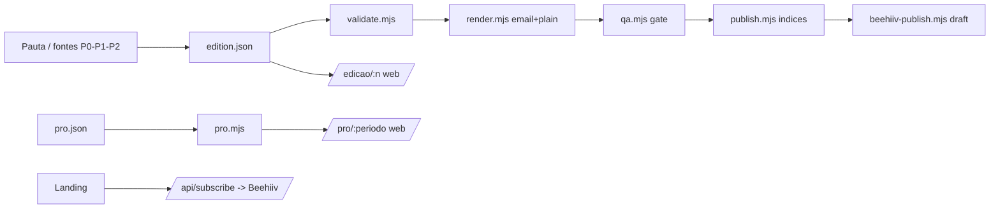
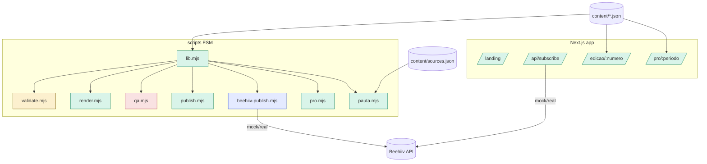
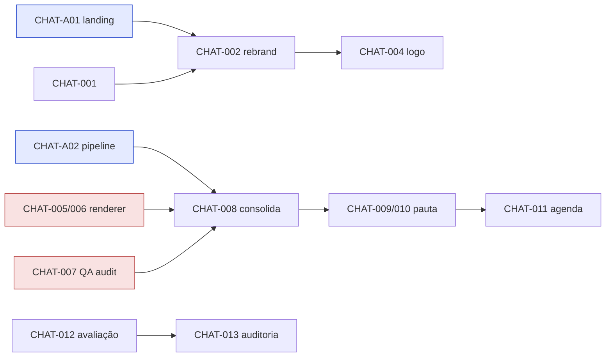

# Project Intelligence Report

> Auditoria integral do projeto **The Loyalty / The Loyal** (mídia editorial de loyalty, Brasil).
> Modo análise. Nenhum código alterado, nenhum commit/push executado durante a auditoria.

## Sumário navegável

- [0. Metadados da auditoria](#0-metadados-da-auditoria)
- [1. Veredito executivo](#1-veredito-executivo)
- [2. Resumo geral](#2-resumo-geral)
- [3. Inventário de fontes e cobertura](#3-inventário-de-fontes-e-cobertura)
- [4. Linha do tempo consolidada](#4-linha-do-tempo-consolidada)
- [5. Arquitetura planejada](#5-arquitetura-planejada)
- [6. Arquitetura implementada](#6-arquitetura-implementada)
- [7. Diferenças planejado × implementado](#7-diferenças-planejado--implementado)
- [8. Inventário de componentes](#8-inventário-de-componentes)
- [9. Mapa individual dos chats](#9-mapa-individual-dos-chats)
- [10. Dependências e relações entre chats](#10-dependências-e-relações-entre-chats)
- [11. Matriz de decisões](#11-matriz-de-decisões)
- [12. Matriz de rastreabilidade](#12-matriz-de-rastreabilidade)
- [13. Auditoria de código e lógica](#13-auditoria-de-código-e-lógica)
- [14. Auditoria de testes e validações](#14-auditoria-de-testes-e-validações)
- [15. Contradições, redundâncias e sobreposições](#15-contradições-redundâncias-e-sobreposições)
- [16. Pendências consolidadas](#16-pendências-consolidadas)
- [17. Dívida técnica](#17-dívida-técnica)
- [18. Riscos e bloqueios](#18-riscos-e-bloqueios)
- [19. Decisões em aberto](#19-decisões-em-aberto)
- [20. Ciclos abertos](#20-ciclos-abertos)
- [21. Backlog priorizado](#21-backlog-priorizado)
- [22. Plano de fechamento de ciclos](#22-plano-de-fechamento-de-ciclos)
- [23. Itens que podem ser encerrados](#23-itens-que-podem-ser-encerrados)
- [24. Itens que precisam ser refeitos](#24-itens-que-precisam-ser-refeitos)
- [25. Itens que devem ser descartados](#25-itens-que-devem-ser-descartados)
- [26. Itens que exigem decisão humana](#26-itens-que-exigem-decisão-humana)
- [27. Itens que exigem validação técnica](#27-itens-que-exigem-validação-técnica)
- [28. Próximas ações recomendadas](#28-próximas-ações-recomendadas)
- [29. Respostas finais](#29-respostas-finais)
- [30. Apêndice de evidências](#30-apêndice-de-evidências)

---

## 0. Metadados da auditoria

| Campo | Valor |
|---|---|
| Data da auditoria | 2026-07-09 (relógio do ambiente; NÍVEL A) |
| Diretório analisado | `/home/user/theloyal` |
| Branch atual | `claude/landing-page-copy-review-ssj4y9` |
| Commit HEAD | `7bfc6ee` (feat(pauta): catalogo oficial de fontes) |
| `origin/main` | `07dcf75` (Merge PR #9) — **não contém** consolidação nem pauta |
| Alterações locais | Nenhuma (working tree limpo; `git status --porcelain` = 0 linhas) |
| Stack | Next.js 14.2.15 · React 18.3 · TypeScript 5.5 (strict) · Tailwind 3.4 · scripts ESM Node puro (sem deps) |
| Fontes disponíveis | Código-fonte, git (todas as branches mergeadas), configs, docs, skills, histórico de chat **desta sessão** |
| Fontes ausentes | Histórico de chat das sessões que geraram PR #1 e PR #5 (ver §3) |
| Segredos | Nenhum segredo versionado (`.env` ignorado; `.env.example` só placeholders). Não expostos. |

**Limitações centrais desta auditoria**
1. **Chat cross-session:** só o histórico de chat desta sessão está acessível. As frentes "landing v1 + Beehiiv" (PR #1) e "pipeline editorial + Pro + publisher + skills" (PR #5) foram produzidas em **outras sessões/chats inacessíveis**; foram auditadas por **código + git (NÍVEL B)**, não por conversa.
2. **Auto-auditoria parcial:** parte dos chats auditados é desta própria sessão; declarações foram verificadas contra código/git para evitar viés de auto-relato.
3. **Contagem de mensagens:** aproximada (turnos), pois não há export estruturado de chat.
4. **Produção:** o comportamento em produção (Vercel, Beehiiv real) não foi validado por acesso direto; deploys "Ready" foram observados via webhooks (NÍVEL C).

**Cobertura:** código/git ≈ 100% do que está no repositório; chats desta sessão ≈ 100%; chats de outras sessões = 0% (conteúdo de conversa) / auditáveis por artefato.

---

## 1. Veredito executivo

1. **Estado geral:** projeto **funcional e coerente na maior parte**, com um pipeline editorial real e uma landing publicada, mas com **duas inconsistências críticas de nível A** (marca partida e gate de QA vermelho) e **ausência de rede de segurança** (sem CI, sem testes). Precisa de **estabilização antes de operar de verdade**.
2. **Conclusão global estimada:** **72% – 82%** (confiança média). Pesos: pipeline editorial 30%, landing 20%, web archive 15%, Beehiiv 10%, Pro 10%, pauta 10%, governança/CI 5%.
3. **Nível de confiança:** médio-alto para o que é código local (build/validate/render passam); baixo para operação real (Beehiiv/produção não comprovados).
4. **Principais entregas reais (NÍVEL A/B):** landing Next.js publicada; pipeline `validate/render/publish` do Daily; web archive `/edicao/[numero]` e `/pro/[periodo]`; QA global `qa.mjs`; publisher Beehiiv (modo mock comprovado); rotina de pauta com catálogo oficial P0/P1/P2 (73 itens coletados em teste).
5. **Principais lacunas:** sem CI, sem testes automatizados, ESLint não configurado, Beehiiv real não exercitado, agendamento da pauta não concluído.
6. **Principais bloqueios:** `npm run qa` **REPROVA** (BLOCK-001); PR #13 (consolidação+pauta) **não mergeado** (BLOCK-002).
7. **Principais riscos:** RISK-001 marca partida; RISK-002 gate de QA não aplicado (sem CI) e vermelho; RISK-004 zero testes.
8. **Próximas cinco ações:** (1) decidir a marca (The Loyal × The Loyalty) — DEC/CONFLICT-001; (2) resolver o bloqueio do QA (CONFLICT-002); (3) mergear PR #13; (4) adicionar CI rodando `validate + qa + build`; (5) fechar o agendamento da pauta via GitHub Action.
9. **O que NÃO iniciar agora:** Weekly/Lab/Special; refatorações amplas; a reconstrução da landing por wireframe (CHAT-003) — está **bloqueada** por falta do arquivo.
10. **Recomendação de fase:** **ESTABILIZAR** (resolver marca + QA + CI) antes de continuar features ou publicar edições reais.

---

## 2. Resumo geral

**O que o projeto é.** "The Loyalty" (a landing foi rebatizada para "The Loyal") é uma **mídia editorial independente** sobre pontos, milhas, cartões, bancos, varejo e cashback. Produz um **Daily** (newsletter diária "com a conta feita") e um relatório **Pro**. O repositório contém: (a) a **landing** de conversão (Next.js), (b) um **pipeline editorial** em scripts Node puros que transformam um JSON de edição em e-mail HTML, texto puro e página web, com **QA** que aplica regras invioláveis de marca, (c) um **publisher Beehiiv**, e (d) uma **rotina de pauta** que capta candidatos de fontes públicas para curadoria manual.

**Como evoluiu.** Landing v1 + integração Beehiiv (PR #1, sessão externa) → contrato de marca `CLAUDE.md` + pipeline editorial + schema + web + skills + Pro + publisher (PR #5, sessão externa) → nesta sessão: extração de copy → rebrand "The Loyal" + copy v2 (PR #2) → sistema de logo → renderer paralelo do Daily (PR #4) → sistema de QA paralelo (PR #9) → **consolidação** removendo o renderer paralelo (PR #13, aberto) → **rotina de pauta** + catálogo oficial (PR #13).

**Como está estruturado / o que existe / o que não existe:** ver §5–§8. Maiores problemas: §15 (marca partida, disclaimer), §17 (dívida), §18 (riscos). Próximos passos: §28.

*(As subseções Linha do tempo / Arquitetura / Componentes / Pendências / Dívida / Decisões / Riscos / Próximos passos estão detalhadas nas seções numeradas §4–§28; para evitar duplicação com identificadores, aqui fica o índice.)*

---

## 3. Inventário de fontes e cobertura

### 3.1 Chats acessíveis (esta sessão)

| ID | Nome original (turno) | Nome canônico | Fonte | Período | Disponib. | Cobertura | Temas | Dependências |
|---|---|---|---|---|---|---|---|---|
| CHAT-001 | "traga toda a copy da landing" | Landing · Extração de copy · Concluído | sessão atual | 2026-07 | Disponível | Integral | copy, auditoria de texto | — |
| CHAT-002 | "rebrand The Loyalty→The Loyal + copy v2" | Marca · Rebrand + copy v2 · Merged | sessão atual | 2026-07 | Disponível | Integral | marca, copy | CHAT-001, PR #1 |
| CHAT-003 | "PROMPT LANDING (wireframe)" | Landing · Rebuild por wireframe · Bloqueado | sessão atual | 2026-07 | Disponível | Integral | landing, wireframe | wireframe ausente |
| CHAT-004 | "crie o logo oficial" | Marca · Sistema de logo · Entregue | sessão atual | 2026-07 | Disponível | Integral | logo, brand assets | CHAT-002 |
| CHAT-005 | "crie o sistema de renderização do Daily" | Daily · Renderer paralelo (email/plain/web/QA) · Merged→Removido | sessão atual | 2026-07 | Disponível | Integral | render, email | PR #5 |
| CHAT-006 | "deixe o renderer parametrizado por JSON" | Daily · Renderer parametrizado · Merged→Removido | sessão atual | 2026-07 | Disponível | Integral | render, schema | CHAT-005 |
| CHAT-007 | "crie o sistema de QA" | QA · Sistema paralelo (audit) · Merged→Removido | sessão atual | 2026-07 | Disponível | Integral | QA, contraste, cálculo | CHAT-005/006 |
| CHAT-008 | "consolide o pipeline, remova duplicidade" | Pipeline · Consolidação (remove legado) · PR aberto | sessão atual | 2026-07 | Disponível | Integral | consolidação | CHAT-005/006/007, PR #5 |
| CHAT-009 | "crie uma rotina de pauta" | Pauta · Rotina de intake · PR aberto | sessão atual | 2026-07 | Disponível | Integral | pauta, fontes | CHAT-008 |
| CHAT-010 | "FONTES OFICIAIS DO THE LOYALTY" | Pauta · Catálogo oficial P0/P1/P2 · PR aberto | sessão atual | 2026-07 | Disponível | Integral | fontes | CHAT-009 |
| CHAT-011 | "como agendar como routine e rodar teste" | Pauta · Agendamento + teste · Parcial | sessão atual | 2026-07 | Disponível | Integral | scheduling | CHAT-009/010 |
| CHAT-012 | "avalie tudo e margem de melhora" | Projeto · Avaliação/planejamento · Concluído | sessão atual | 2026-07 | Disponível | Integral | roadmap | todos |
| CHAT-013 | "PROMPT MESTRE DE AUDITORIA" | Projeto · Auditoria integral · Em execução | sessão atual | 2026-07 | Disponível | Integral | auditoria | todos |

### 3.2 Chats inacessíveis (outras sessões — `FONTE_MENCIONADA_MAS_INACESSÍVEL`)

| ID | Descrição | Onde aparece | Relevância | Parte prejudicada | O que falta |
|---|---|---|---|---|---|
| CHAT-A01 | Landing v1 + integração Beehiiv (branch `claude/loyalty-landing-page-v1-7vbjq7`, PR #1) | git log (commits `cad07cc`, `1babc10`, `e470248`, `09fc7da`, `c3cab2a`, `9e85bce`, `f55aef6`, `c95fc92`, `088a8f7`) | Alta — origem da landing e do subscribe | "Contexto recebido / declarado × feito" do chat; motivação das decisões de subscribe | Export do chat da sessão que criou o PR #1 |
| CHAT-A02 | Pipeline editorial + schema + web + skills + Pro + Beehiiv publisher (branch `claude/loyalty-beehiiv-publish-fv8t65`, PR #5) | git log (commits `2e30d5e` CLAUDE.md, `0aa76fc` pipeline, `ea5ada7` schema+web+skills, `5970f24` tl-qa, `55f7c7b` Pro, `0548454` beehiiv) | **Crítica** — é o pipeline canônico que sobrevive à consolidação | Decisões e critérios de aceite do pipeline; por que a marca ficou "The Loyalty"; se o publisher foi testado contra a API real | Export do chat da sessão do PR #5 |

### 3.3 Outras fontes (todas disponíveis)

DOC-001 `CLAUDE.md` (contrato de marca) · DOC-002 `content/README.md` (fluxo do pipeline) · DOC-003 `README.md` (landing) · DOC-004 `content/edition.schema.json` · DOC-005 `content/pro-report.schema.json` · DOC-006 `.claude/skills/{tl-digest-template,tl-qa,tl-source-audit}/SKILL.md` · DOC-007 `.env.example` · DOC-008 `renderer/*` (removido no branch; presente na `main`).

### 3.4 Cálculo de cobertura

- Total de chats identificados: **15** (13 desta sessão + 2 inacessíveis).
- Analisados integralmente: **13** (código+chat).
- Analisados parcialmente: **2** (CHAT-A01, CHAT-A02 — só por código/git).
- Inacessíveis (conteúdo de conversa): **2**.
- Cobertura documental (arquivos do repo): ~100%.
- Cobertura de chats (conversa): 13/15 ≈ **87%**.
- Limitação: as duas frentes mais "de fundação" (landing v1, pipeline canônico) têm conversa inacessível; o julgamento sobre elas é código-first (NÍVEL B).

---

## 4. Linha do tempo consolidada

| Data | Evento | Chat | Commit/fonte | Componente | Tipo | Impacto | Evidência |
|---|---|---|---|---|---|---|---|
| 2026-07-08 | Inicializa repositório | CHAT-A01 | `989d662` | — | init | — | git (B) |
| 2026-07-08 | Landing v1 (Next+Tailwind) | CHAT-A01 | `cad07cc` | COMP-001 | feat | alto | git (B) |
| 2026-07-08 | Integração real Beehiiv (subscribe) | CHAT-A01 | `1babc10`,`e470248`,`09fc7da` | COMP-002 | feat/fix | alto | código (B) |
| 2026-07-09 | `CLAUDE.md` (contrato de marca) | CHAT-A02 | `2e30d5e` | DOC-001 | docs | alto | git (B) |
| 2026-07-09 | Pipeline editorial validate/render/publish | CHAT-A02 | `0aa76fc` | COMP-009/010/012 | feat | alto | build (A) |
| 2026-07-09 | Schema + web edição + skills | CHAT-A02 | `ea5ada7` | COMP-007/015/018 | feat | alto | build (A) |
| 2026-07-09 | Skill tl-qa + edição fictícia Nº 28 | CHAT-A02 | `5970f24` | COMP-011/018 | feat | médio | qa (A) |
| 2026-07-09 | The Loyalty Pro (web/email/PDF/QA) | CHAT-A02 | `55f7c7b` | COMP-014 | feat | médio | build (A) |
| 2026-07-09 | Beehiiv publisher | CHAT-A02 | `0548454` | COMP-013 | feat | alto | código (B) |
| 2026-07-08 | Rebrand The Loyal + copy v2 (PR #2) | CHAT-002 | `06e1bb0` | COMP-001 | feat | alto | código (A) |
| 2026-07-09 | Renderer paralelo do Daily (PR #4) | CHAT-005/006 | `c43bb9e`,`8cc33ee` | (renderer/*) | feat | médio | git (B) |
| 2026-07-09 | Sistema de QA paralelo (PR #9) | CHAT-007 | `a23bdf5` | (renderer/audit) | feat | médio | git (B) |
| 2026-07-09 | **Consolidação: remove renderer/ legado** (PR #13) | CHAT-008 | `d4d72a6` | COMP-020 | refactor | alto | diff (A) |
| 2026-07-09 | Rotina de pauta (PR #13) | CHAT-009 | `869cd65` | COMP-017 | feat | médio | run (A) |
| 2026-07-09 | Catálogo oficial de fontes (PR #13) | CHAT-010 | `7bfc6ee` | COMP-017 | feat | médio | run (A) |
| DATA_NÃO_CONFIRMADA | Merges PR #1/#4/#5/#9 na main | — | `8e8de9f`,`23b40db`,`2ab77b3`,`07dcf75` | — | merge | alto | git (A) |

Observação: as datas do git para os commits de PR #4/#5/#9 e para os "Merge" aparecem em 08–09/07; o autor "mzinhoww-svg" nos commits de CHAT-A01/A02 indica origem em outra sessão (ou rebase pelo usuário). Não foram inventadas datas.

---

## 5. Arquitetura planejada

Fonte: `CLAUDE.md` (DOC-001), `content/README.md` (DOC-002), prompts das sessões.

- **Landing** premium editorial (Next 14 App Router, TS strict, Tailwind; **sem outras deps**), tokens de marca fixos, mascote Ponto, acessibilidade AA, formulário → Beehiiv.
- **Pipeline editorial** determinístico, sem dependências: `edition.json` → `validate` (regras invioláveis) → `render` (e-mail 600px + texto) → `publish` (índices) → `beehiiv` (rascunho). QA global como gate.
- **Produtos:** Daily (Seg–Sex), e menções a Weekly/Lab/Pro/Special (CLAUDE.md/landing copy).
- **Web archive** por edição e por período (Pro).
- **Governança:** regras invioláveis (marca, sem emoji, sem urgência, disclaimer, vigência, TL Score) aplicadas por QA; skills de apoio.

---

## 6. Arquitetura implementada

Fonte: código atual (NÍVEL A/B), `npm run build` (NÍVEL A).

- **Entrypoints web (Next):** `/` (landing, static), `/api/subscribe` (dynamic route handler → Beehiiv, com fallback mock), `/edicao` e `/edicao/[numero]` (SSG, 27/28), `/pro` e `/pro/[periodo]` (SSG, 2026-07), `/icon.svg`, `/apple-icon.png`. **Build passa** (EVID-005).
- **Pipeline CLI (Node ESM, sem deps):** `scripts/lib.mjs` (tokens, VERDICTS, TL_WEIGHTS, EMOJI_RE, URGENCY_RE, loaders), `validate.mjs`, `render.mjs`, `qa.mjs`, `publish.mjs`, `beehiiv-publish.mjs`, `pro.mjs`, **`pauta.mjs`** (novo, branch).
- **Conteúdo:** `content/edition.schema.json`, `content/editions/{0027,0028}.json`, `content/index.json`, `content/latest.json`, `content/pro/2026-07.json`, `content/pro-report.schema.json`, `content/beehiiv-status.json`, **`content/sources.json`** (novo).
- **Libs TS:** `lib/editions.ts`, `lib/pro.ts` (consumidas pelas rotas web).
- **Skills:** `.claude/skills/{tl-digest-template,tl-qa,tl-source-audit}`.
- **Saídas geradas (versionadas):** `out/email`, `out/plain`, `out/qa`, `out/beehiiv`, `out/pro-email`, `out/pro-pdf`.
- **Integração externa:** Beehiiv (subscribe + publish), via env `BEEHIIV_API_KEY`/`BEEHIIV_PUBLICATION_ID`; **fallback mock** sem chaves.
- **Sem:** banco de dados, filas, jobs, cache, autenticação de usuário, CI, testes.

Legenda: verde = passa; amarelo = passa mas com acoplamento frágil; vermelho = **reprova hoje** (qa); azul = só testado em modo mock.

---

## 7. Diferenças planejado × implementado

| # | Planejado | Existe? | Falta | Alteração intencional? | Decisão registrada? | Impacto | Risco | Recomendação |
|---|---|---|---|---|---|---|---|---|
| 1 | Marca única | **Não** — landing "The Loyal", pipeline "The Loyalty" | Reconciliar 55 vs 11 ocorrências | Não (efeito colateral do rebrand só na landing) | Parcial (DEC-001 só landing) | Alto | RISK-001 | Decidir nome e alinhar (CONFLICT-001) |
| 2 | QA como gate verde | `qa.mjs` existe, **reprova** | 1 bloqueio de disclaimer | Não | Não | Alto | RISK-002 | CONFLICT-002 |
| 3 | Weekly/Lab/Special | Não | Produtos além de Daily/Pro | Sim (fora de escopo até agora) | Não | Baixo | — | Backlog P4 |
| 4 | CI/testes | Não | GitHub Actions + testes | Não | Não | Alto | RISK-004 | Onda 3 |
| 5 | Logo no app | Assets em `public/brand`, **não usados** | Wire favicon/OG/nav | Não | Não | Baixo | — | Backlog P3 |
| 6 | Agendamento da pauta | Script pronto; scheduling não | Routine/Action | Parcial (tool falhou) | DEC-004 | Médio | RISK-003 | Onda 2 |

Pontos únicos de falha: **Beehiiv** (subscribe + publish); **QA gate** (se ignorado, regras invioláveis não são aplicadas). Acoplamento excessivo: `qa.mjs` depende de **strings literais** dentro de `components/sections.tsx` (DEBT-005). Componentes órfãos: `public/brand/*` (não referenciados no app). Duplicidade: eliminada na consolidação (renderer/ removido) — **pendente de merge**.

---

## 8. Inventário de componentes

| ID | Componente | Objetivo | Localização | Origem | Estado | Testes | Doc | Risco |
|---|---|---|---|---|---|---|---|---|
| COMP-001 | Landing page | Conversão | `app/page.tsx`, `components/sections.tsx`, `shell.tsx` | CHAT-A01/002 | CONCLUÍDO_NÃO_VALIDADO (build A; a11y contraste não medido aqui) | Não | README | Médio |
| COMP-002 | Subscribe + `/api/subscribe` | Inscrição Beehiiv | `components/SubscribeForm.tsx`, `app/api/subscribe/route.ts` | CHAT-A01 | IMPLEMENTADO_PARCIALMENTE (real+mock; real não comprovado) | Não | .env.example | Alto |
| COMP-003 | PontoMascot | Mascote SVG | `components/PontoMascot.tsx` | CHAT-A01 | CONCLUÍDO_NÃO_VALIDADO | Não | CLAUDE.md | Baixo |
| COMP-004 | TL Graphics | Data-art | `components/graphics.tsx` | CHAT-A01 | CONCLUÍDO_NÃO_VALIDADO | Não | CLAUDE.md | Baixo |
| COMP-005 | UI kit | TLBadge/ContaBlock/etc | `components/ui.tsx` | CHAT-A01 | CONCLUÍDO_NÃO_VALIDADO | Não | — | Baixo |
| COMP-006 | Shell | Nav/Hero/Footer | `components/shell.tsx` | CHAT-A01/002 | CONCLUÍDO_NÃO_VALIDADO | Não | — | Baixo |
| COMP-007 | Schema de edição | Contrato do Daily | `content/edition.schema.json` | CHAT-A02 | CONCLUÍDO_NÃO_VALIDADO | Não | content/README | Médio |
| COMP-008 | lib.mjs | Tokens/VERDICTS/TL Score | `scripts/lib.mjs` | CHAT-A02 | CONCLUÍDO_NÃO_VALIDADO (usado por A) | Não | comentários | Médio |
| COMP-009 | validate.mjs | QA editorial | `scripts/validate.mjs` | CHAT-A02 | **CONCLUÍDO_VALIDADO** (run A: Nº27/28 OK) | Indireto | content/README | Baixo |
| COMP-010 | render.mjs | Email+plain | `scripts/render.mjs` | CHAT-A02 | CONCLUÍDO_NÃO_VALIDADO (gera A; sem asserts) | Não | content/README | Médio |
| COMP-011 | qa.mjs | Gate global | `scripts/qa.mjs` | CHAT-A02 | **QUEBRADO** (run A: exit 1) | Não | — | Alto |
| COMP-012 | publish.mjs | Índices locais | `scripts/publish.mjs` | CHAT-A02 | CONCLUÍDO_NÃO_VALIDADO | Não | content/README | Baixo |
| COMP-013 | beehiiv-publish.mjs | Publica no Beehiiv | `scripts/beehiiv-publish.mjs` | CHAT-A02 | IMPLEMENTADO_PARCIALMENTE (mock comprovado; real não) | Não | content/README | Alto |
| COMP-014 | Pro | Relatório executivo | `scripts/pro.mjs`, `components/ProReport.tsx`, `app/pro/*` | CHAT-A02 | CONCLUÍDO_NÃO_VALIDADO (build A; QA do Pro não rodado nesta auditoria) | Não | — | Médio |
| COMP-015 | Web archive edição | Página da edição | `components/EditionArticle.tsx`, `app/edicao/*` | CHAT-A02 | CONCLUÍDO_NÃO_VALIDADO (SSG build A) | Não | — | Baixo |
| COMP-016 | libs de dados | Leitura de content | `lib/editions.ts`, `lib/pro.ts` | CHAT-A02 | CONCLUÍDO_NÃO_VALIDADO (typecheck A) | Não | — | Baixo |
| COMP-017 | Pauta | Intake de notícias | `scripts/pauta.mjs`, `content/sources.json` | CHAT-009/010 | IMPLEMENTADO_PARCIALMENTE (run A: 73 itens; feeds parciais; scheduling não) | Não | content/README | Médio |
| COMP-018 | Skills | tl-digest/tl-qa/tl-source-audit | `.claude/skills/*` | CHAT-A02 | NÃO_VERIFICÁVEL (não executadas nesta auditoria) | Não | SKILL.md | Baixo |
| COMP-019 | Brand/logo assets | Logo SVG | `public/brand/*` | CHAT-004 | ÓRFÃO (não usados pelo app) | N/A | artifact | Baixo |
| COMP-020 | Consolidação | Fluxo único | diff `d4d72a6` | CHAT-008 | EM_ANDAMENTO (PR #13 aberto) | Indireto | PR #13 | Médio |
| COMP-021 | renderer/* (legado) | Renderer paralelo | `renderer/*` (na main) | CHAT-005/006/007 | **SUBSTITUÍDO/OBSOLETO** (removido no branch; ainda na main) | — | — | Médio |

Separação: existentes = COMP-001..020; planejados = Weekly/Lab/Special (não criados); parciais = COMP-002/013/017; obsoletos/substituídos = COMP-021; órfãos = COMP-019; quebrados = COMP-011.

---

## 9. Mapa individual dos chats

> Fichas completas dos chats desta sessão (CHAT-001..013). CHAT-A01/A02 têm ficha reduzida (só código/git).

### CHAT-001 · Landing · Extração de copy · Concluído
- **Identificação:** tema = auditoria de copy; sucessores = CHAT-002; deps = PR #1.
- **Contexto recebido (explícito):** pedido de trazer toda a copy da landing porque "linguagem muito complexa". **Assumido:** a landing existente (PR #1) como fonte.
- **Objetivo:** extrair copy para avaliação manual. Critério implícito: copy legível/anotável. **Alcançado:** sim.
- **Planejou:** extrair copy + versão acessível.
- **Declarou ter feito:** `COPY-LANDING.md`, `copy-acessivel.html`, PR #2 draft. **Verificação:** `COPY-LANDING.md` e `copy-acessivel.html` existem no repo (NÍVEL A). 
- **Realmente feito:** entregou os dois arquivos (confirmado).
- **Decisões:** DEC-002 (embrião da copy v2).
- **Tarefas:** ver §12. **Lacunas:** nenhuma relevante.
- **Estado final:** CONCLUÍDO_VALIDADO; conclusão ~100%; NÍVEL A.

### CHAT-002 · Marca · Rebrand + copy v2 · Merged (PR #2)
- **Contexto:** decisão explícita do usuário "The loyal" (resposta a pergunta direta). Restrições: pt-BR, sem travessões, não quebrar build.
- **Objetivo:** renomear "The Loyalty"→"The Loyal" nas strings visíveis + aplicar copy v2 nas 8 seções + metadados. **Alcançado:** sim (na landing).
- **Declarou:** rebrand + copy v2 + glossário + metadados; PR #2 merged. **Verificação:** `06e1bb0` na main; `app/layout.tsx`/`shell.tsx` usam "The Loyal" (NÍVEL A).
- **Realmente feito:** rebrand **apenas da landing**. **Não tocou** o pipeline editorial (que permaneceu "The Loyalty") → origem do CONFLICT-001.
- **Decisões:** DEC-001 (marca "The Loyal") — **vigente para a landing, não propagada**.
- **Estado final:** CONCLUÍDO_VALIDADO (escopo landing); conclusão ~100% do escopo declarado; NÍVEL A. **Ciclo aberto herdado:** CONFLICT-001.

### CHAT-003 · Landing · Rebuild por wireframe · Bloqueado
- **Contexto:** prompt extenso exigindo `theloyalty-wireframe.html` como "fonte de verdade". **Ausente:** o arquivo nunca foi fornecido.
- **Objetivo:** reconstruir a landing a partir do wireframe. **Alcançado:** **não** (bloqueado corretamente).
- **Declarou:** nada executado; parou e pediu o arquivo. **Verificação:** nenhum `theloyalty-wireframe.html` no repo (NÍVEL A).
- **Estado final:** BLOQUEADO; conclusão 0%; NÍVEL A. **Critério de encerramento:** fornecer o wireframe ou cancelar a frente. → CYCLE-006.

### CHAT-004 · Marca · Sistema de logo · Entregue
- **Contexto:** pedir logo oficial (wordmark, TL, favicon, claro/escuro) sob regras de marca.
- **Declarou:** artifact do sistema de logo + `public/brand/*.svg` (contornos Fraunces) + PNGs. **Verificação:** `public/brand/{wordmark,mark,favicon}-*.svg` existem (NÍVEL A).
- **Realmente feito:** assets entregues; **porém não integrados ao app** (COMP-019 órfão).
- **Estado final:** CONCLUÍDO_NÃO_VALIDADO; ~85% (falta wiring); NÍVEL B. → PEND-013.

### CHAT-005/006 · Daily · Renderer paralelo · Merged→Removido
- **Contexto:** "crie o sistema de renderização do Daily" e "parametrize por JSON". **Não possuía** (ou não priorizou) o fato de que o **pipeline canônico já existia** (PR #5) — construiu um renderer paralelo (`renderer/*`, `scripts/*-daily.mjs`, `components/daily`, `app/daily/preview`).
- **Declarou:** email/plain/web/QA + schema + exemplos (PR #4). **Verificação:** commits `c43bb9e`/`8cc33ee` (NÍVEL B).
- **Realmente feito:** entregue e **mergeado**, depois **removido** pela consolidação (CHAT-008) por duplicidade. 
- **Decisões:** vocabulário de veredito "vale-olhar/depende/nao-vale" (divergente do canônico) → CONFLICT-003.
- **Estado final:** SUBSTITUÍDO/OBSOLETO; contribuição efetiva ao produto final ≈ 0 (removido); NÍVEL A (removido no diff `d4d72a6`).

### CHAT-007 · QA · Sistema paralelo (audit) · Merged→Removido
- **Contexto:** "crie o sistema de QA" — construiu `renderer/audit.mjs` com **contraste WCAG, recomputo de CPM, mobile, urgência, tokens**. Paralelo ao `qa.mjs` canônico (que já existia).
- **Declarou:** QA com aprovado/reprovado/bloqueios/avisos/correções (PR #9). **Verificação:** `a23bdf5` (NÍVEL B).
- **Realmente feito:** entregue, **mergeado**, depois **removido** pela consolidação. As dimensões extras (contraste/CPM/mobile) **não foram portadas** para o `qa.mjs` canônico → PEND-014.
- **Estado final:** SUBSTITUÍDO; NÍVEL A. **Perda líquida de capacidade de QA** registrada.

### CHAT-008 · Pipeline · Consolidação · PR #13 aberto
- **Contexto:** mapear canônico × legado e deixar fluxo único. Correto: identificou `renderer/*` como legado e o pipeline `scripts/*.mjs` como canônico.
- **Declarou:** removeu renderer/legado; restaurou npm scripts canônicos; `typecheck/validate/render/build` verdes; `qa`/`lint` reprovam por motivo pré-existente. **Verificação (NÍVEL A, re-executado nesta auditoria):** typecheck ✅, validate ✅, render ✅, build ✅, **qa ❌ (1 bloqueio)**, lint ❌ (sem ESLint).
- **Decisões:** DEC-003 (canônico oficial), DEC-007 (não corrigir qa/ESLint por serem editorial/infra fora de escopo).
- **Estado final:** EM_ANDAMENTO (PR #13 aberto); conclusão do escopo ~90% (falta merge); NÍVEL A. → CYCLE-001.

### CHAT-009/010 · Pauta · Rotina + catálogo · PR #13
- **Contexto:** criar rotina que acessa fontes, gera arquivo para seleção manual e apuração de fontes por seção; depois o usuário forneceu o **catálogo oficial P0/P1/P2**.
- **Declarou:** `scripts/pauta.mjs` + `content/sources.json` + docs; "73 itens coletados". **Verificação (NÍVEL A):** `npm run pauta` roda; teste real coletou 73 itens de 5 feeds; vários feeds falham (Reddit 403, Acelera 404, Falando 403, Familia fetch failed).
- **Decisões:** DEC-004 (script sob demanda, MD+JSON), DEC-005 (P0 valida, P1 descobre, P2 rumor), DEC-006 (Reddit/Acelera desabilitados).
- **Estado final:** IMPLEMENTADO_PARCIALMENTE; ~70%; NÍVEL A. → CYCLE-004, PEND-007/008/009.

### CHAT-011 · Pauta · Agendamento + teste · Parcial
- **Contexto:** "como agendar como routine e rodar teste agora".
- **Declarou:** teste rodado (73 itens, arquivo enviado); tentativa de criar Routine **falhou** por erro de infra ("permission stream closed"). **Verificação:** teste NÍVEL A; criação de Routine **não concluída** (NÍVEL A do erro).
- **Estado final:** IMPLEMENTADO_PARCIALMENTE; teste 100%, agendamento 0%; NÍVEL A. → CYCLE-004. Dependência: **PR #13 merge** (pauta só existe lá).

### CHAT-012 · Projeto · Avaliação · Concluído
- Produziu avaliação e roadmap (sem alterar código). CONCLUÍDO_VALIDADO; NÍVEL A. Insumo desta auditoria.

### CHAT-013 · Projeto · Auditoria · Em execução
- Este relatório. Modo análise; sem alterações. Estado: EM_ANDAMENTO até salvar o arquivo.

### CHAT-A01 · Landing v1 + Beehiiv (inacessível — código B)
- Entregou COMP-001..006 e COMP-002. Subscribe com fallback mock e correções (`e470248`, `09fc7da`). Sem conversa disponível. Estado por código: CONCLUÍDO_NÃO_VALIDADO.

### CHAT-A02 · Pipeline editorial + Pro + Beehiiv + skills (inacessível — código B)
- Entregou COMP-007..016, COMP-018, DOC-001/002/004/005. É a **fundação canônica**. Sem conversa disponível. Estado por código: majoritariamente CONCLUÍDO_NÃO_VALIDADO; COMP-011 QUEBRADO (qa vermelho); COMP-013 parcial (mock).

---

## 10. Dependências e relações entre chats

| Chat | Predecessores | Sucessores | Trabalha nos mesmos arquivos que |
|---|---|---|---|
| CHAT-A01 | — | CHAT-002 | — |
| CHAT-A02 | — | CHAT-008 (consolida sobre ele) | — |
| CHAT-002 | CHAT-001, A01 | CHAT-004, 008 | `app/`, `components/` |
| CHAT-005/006/007 | A02 | **CHAT-008 (remove)** | pipeline (paralelo) |
| CHAT-008 | 005/006/007, A02 | CHAT-009 | `scripts/`, `package.json` |
| CHAT-009/010/011 | 008 | — | `scripts/`, `content/` |

- **Chats isolados:** CHAT-003 (bloqueado, sem continuidade).
- **Chats sobrepostos/redundantes:** CHAT-005/006/007 sobrepuseram o pipeline canônico (A02) → retrabalho depois removido (CHAT-008).
- **Chats contraditórios:** CHAT-002 (marca "The Loyal") × A02 (marca "The Loyalty") → CONFLICT-001.
- **Que deveriam ser consolidados:** já feito (CHAT-008).

---

## 11. Matriz de decisões

| ID | Decisão | Motivação | Origem | Impacto | Implementada? | Validada? | Vigente? | Substituída por |
|---|---|---|---|---|---|---|---|---|
| DEC-001 | Marca = "The Loyal" | resposta direta do usuário | CHAT-002 | alto | **só landing** | A (landing) | **Parcial** (não no pipeline) | — (conflito ativo) |
| DEC-002 | Copy v2 acessível | linguagem simples | CHAT-001/002 | médio | sim (landing) | A | sim | — |
| DEC-003 | Pipeline canônico oficial; remover renderer/ | eliminar duplicidade | CHAT-008 | alto | sim (branch) | A | sim | — |
| DEC-004 | Pauta = script sob demanda, MD+JSON | versionável, sem infra | CHAT-009 | médio | sim | A | sim | possível (Action) |
| DEC-005 | Fontes P0 validam, P1 descobrem, P2 rumor | catálogo oficial | CHAT-010 | médio | sim | A | sim | — |
| DEC-006 | Reddit/Acelera desabilitados (feed 403/404) | evitar erro recorrente | CHAT-010 | baixo | sim | A | sim | — |
| DEC-007 | Não corrigir qa(disclaimer)/ESLint na consolidação | fora de escopo (editorial/infra) | CHAT-008 | médio | sim | A | sim (mas deixa gate vermelho) | — |
| DEC-008 | Vocabulário de veredito = faixas de TL Score (vale-agir/vale-olhar/casos-especificos/esperaria/evitaria/nao-confirmado) | Operating Manual | CHAT-A02 | médio | sim | B | sim | substituiu o de CHAT-005 (depende/nao-vale) |

---

## 12. Matriz de rastreabilidade

| Requisito | Chats | Decisões | Tarefas | Componentes | Arquivos | Testes | Status | Evidência | Lacuna |
|---|---|---|---|---|---|---|---|---|---|
| REQ-001 Landing de conversão | A01,002 | DEC-002 | TASK-001 | COMP-001..006 | `app/page.tsx`,`components/*` | TEST-005 build | CONCLUÍDO_NÃO_VALIDADO | build A | a11y não medida; marca |
| REQ-002 Inscrição Beehiiv | A01 | — | TASK-002 | COMP-002 | `app/api/subscribe/route.ts` | — | IMPLEMENTADO_PARCIALMENTE | código B | real não testado |
| REQ-003 Pipeline Daily (validate/render/publish) | A02,008 | DEC-003 | TASK-003 | COMP-009/010/012 | `scripts/*.mjs` | TEST-002/003 | CONCLUÍDO_VALIDADO (validate/render) | run A | sem asserts de conteúdo |
| REQ-004 QA gate (regras invioláveis) | A02,007,008 | DEC-007 | TASK-004 | COMP-011 | `scripts/qa.mjs` | TEST-004 | **QUEBRADO** | qa exit1 A | disclaimer; sem CI |
| REQ-005 Web archive edição/Pro | A02 | — | TASK-005 | COMP-014/015/016 | `app/edicao/*`,`app/pro/*` | TEST-005 | CONCLUÍDO_NÃO_VALIDADO | build A | sem teste dedicado |
| REQ-006 Publicação Beehiiv | A02 | — | TASK-006 | COMP-013 | `scripts/beehiiv-publish.mjs` | — | IMPLEMENTADO_PARCIALMENTE | código B | real não exercitado |
| REQ-007 Marca única | 002,A02 | DEC-001 | TASK-007 | COMP-001..017 | 25 arquivos | — | CONFLITANTE | grep A (55×/11×) | decisão + alinhamento |
| REQ-008 Rotina de pauta | 009,010,011 | DEC-004/005/006 | TASK-008 | COMP-017 | `scripts/pauta.mjs`,`content/sources.json` | TEST-007 | IMPLEMENTADO_PARCIALMENTE | run A | feeds/scheduling |
| REQ-009 Sistema de logo | 004 | — | TASK-009 | COMP-019 | `public/brand/*` | — | CONCLUÍDO_NÃO_VALIDADO / ÓRFÃO | arquivos A | não integrado |
| REQ-010 Rebuild por wireframe | 003 | — | TASK-010 | — | — | — | BLOQUEADO | ausência A | wireframe |

Leituras: requisitos sem implementação → REQ-010. Implementações sem requisito claro → COMP-019 (logo não pedido pelo produto, só por chat). Decisões sem execução completa → DEC-001 (marca). Execuções sem teste → quase todas (sem testes automatizados).

---

## 13. Auditoria de código e lógica

**Estrutura:** limpa e coesa; scripts ESM sem deps (bom para determinismo/segurança). Separação: `lib.mjs` centraliza tokens/regra de negócio; renderizadores e validadores consomem. Rotas Next consomem `lib/*.ts` que leem `content/`.

Problemas registrados:

| ID | Arquivo | Trecho | Descrição | Sev. | Comp. | Chat | Recomendação | Critério de validação |
|---|---|---|---|---|---|---|---|---|
| DEBT-005 | `scripts/qa.mjs:47-51` | `metodo.includes("Promoções podem mudar sem aviso")` | QA acopla-se a **string literal** de `components/sections.tsx`; qualquer edição editorial da landing pode reprovar o gate | Alta | COMP-011 | A02/002 | Checar por presença semântica do disclaimer (regex/normalização) ou centralizar a frase | `npm run qa` verde após edição legítima de copy |
| CONFLICT-002 | `scripts/qa.mjs:50` × `components/sections.tsx` | landing usa "Promoções **mudam** sem aviso" | Divergência de wording faz o gate reprovar (exit 1) | Alta | COMP-011/001 | 002/A02 | Decidir a frase oficial e alinhar os dois lados | qa verde |
| CONFLICT-001 | 25 arquivos | "The Loyalty" (55×) × "The Loyal" (11×) | Marca partida entre pipeline/e-mail/web/skills e landing | Alta | vários | 002/A02 | Decisão + substituição em massa controlada | grep unificado |
| BUG-CANDIDATE-001 | `scripts/pauta.mjs` | `Date.parse(it.date)` filtro por data | RSS com data em formatos variados pode escapar do filtro `lookbackDays` (mantém item) — comportamento tolerante, não quebra | Baixa | COMP-017 | 009 | Normalizar datas; aceitável hoje | pauta com janela correta |
| FALLBACK-001 | `app/api/subscribe/route.ts:60-66` | modo mock sem chaves | **Fallback silencioso** retorna `{ok:true, mock:true}` — correto para dev, **risco em produção** se envs faltarem | Média | COMP-002 | A01 | Logar/alertar quando mock em produção; healthcheck de env | inscrição real confirmada |
| MOCK-001 | `scripts/beehiiv-publish.mjs` | dry-run sem chaves | Publisher só comprovado em mock | Média | COMP-013 | A02 | Teste controlado contra API real (rascunho) | post criado como draft |
| DEBT-007 | `out/*` | artefatos gerados versionados | Churn no git a cada render | Baixa | pipeline | A02 | Avaliar `.gitignore` de `out/` (decisão do time) | diffs limpos |
| DEBT-006 | `content/sources.json` | feeds `/feed/` adivinhados | Vários P1 retornam 403/404 | Média | COMP-017 | 010 | Confirmar URLs reais de RSS por fonte | ≥8 feeds P1 coletando |

Busca específica: **sem** dependências circulares detectadas; **sem** `TODO/FIXME/HACK` reais no código (apenas `_todo` documental em `sources.json`); **sem** segredos hardcoded; tratamento de erro na pauta é explícito (coleta erros por feed, não oculta). Código morto relevante: `renderer/*` na main (removido no branch). Funcionalidade aparente não conectada: `public/brand/*` (COMP-019).

---

## 14. Auditoria de testes e validações

**Não há testes automatizados** (`package.json` sem script `test`; nenhum arquivo `*.test.*`/`__tests__`). As "validações" do projeto são os próprios scripts de pipeline.

| ID | Comando | Objetivo | Resultado | Evidência | Falhas | Impacto |
|---|---|---|---|---|---|---|
| TEST-001 | `npm run typecheck` | tipos TS | **PASS** (exit 0) | log A | — | — |
| TEST-002 | `npm run validate` | QA editorial das edições | **PASS** (Nº27/28 OK) | log A | — | — |
| TEST-003 | `npm run render` | gerar email/plain | **PASS** | log A | — | — |
| TEST-004 | `npm run qa` | gate global | **FAIL (exit 1)** | log A | "Disclaimer ausente na metodologia (sections.tsx)" | Alto (bloqueia) |
| TEST-005 | `npm run build` | build Next | **PASS** (rotas /, /edicao/[n], /pro/[p], /api/subscribe) | log A | — | — |
| TEST-006 | `npm run lint` | ESLint | **FAIL (exit 1)** | log A | ESLint não configurado (prompt interativo) | Médio |
| TEST-007 | `npm run pauta` | intake | **PASS** (73 itens, 5 feeds; 4 feeds falham) | log A | Reddit 403, Acelera 404, Falando 403, Familia fetch | Médio |
| — | `npm run pro` | QA/geração Pro | **NÃO EXECUTADO** nesta auditoria | — | — | validar em Onda 3 |
| — | `npm run beehiiv` (real) | publicar | **NÃO EXECUTÁVEL com segurança** (chamaria API externa; sem chaves) | — | risco: chamada externa | rodar `--dry-run` e depois draft real controlado |
| — | testes do Pro/edge da subscribe | — | inexistentes | — | — | criar (Onda 3) |

Nenhum componente atinge **CONCLUÍDO_VALIDADO** exceto `validate.mjs` (COMP-009), por ter execução A com saída correta sobre conteúdo real. `render.mjs` gera saída mas **sem asserts** de correção → CONCLUÍDO_NÃO_VALIDADO.

---

## 15. Contradições, redundâncias e sobreposições

- **CONFLICT-001 (marca partida)** — CHAT-002 (The Loyal) × CHAT-A02 (The Loyalty). Vigente. Força probatória: NÍVEL A (grep). Decisão humana necessária. Impacto: identidade inconsistente no produto entregável (e-mails/web dizem "The Loyalty").
- **CONFLICT-002 (disclaimer)** — `qa.mjs` exige "Promoções **podem** mudar sem aviso"; landing usa "Promoções **mudam**". NÍVEL A (qa reprova). Provável causa temporal: copy v2 (posterior) mudou o wording sem atualizar o gate.
- **CONFLICT-003 (vocabulário de veredito)** — CHAT-005 (depende/nao-vale) × canônico (faixas TL Score). **Resolvido** pela remoção do renderer/ (SUBSTITUÍDO); o vocabulário do wireframe (CHAT-003) nunca foi implementado.
- **Redundância eliminada** — dois sistemas de render/QA (canônico × `renderer/*`) → consolidados em CHAT-008 (pendente de merge).
- **Sobreposição de escopo** — CHAT-005/006/007 refizeram capacidade que já existia (A02), gerando retrabalho.

---

## 16. Pendências consolidadas

| ID | Pendência | Origem | Status | Liga a |
|---|---|---|---|---|
| PEND-001 | `npm run qa` vermelho (disclaimer) | A02/002 | CONFLITANTE/QUEBRADO | CONFLICT-002, BLOCK-001 |
| PEND-002 | ESLint não configurado | A02 | NÃO_INICIADO | TEST-006 |
| PEND-003 | Marca partida | 002/A02 | CONFLITANTE | CONFLICT-001, RISK-001 |
| PEND-004 | Sem CI | — | NÃO_INICIADO | RISK-002 |
| PEND-005 | Sem testes automatizados | — | NÃO_INICIADO | RISK-004 |
| PEND-006 | PR #13 não mergeado | 008/009/010 | EM_ANDAMENTO | BLOCK-002, CYCLE-001 |
| PEND-007 | Feeds P1 falhando (Reddit/Acelera/Falando/Familia) | 010 | IMPLEMENTADO_PARCIALMENTE | DEBT-006 |
| PEND-008 | `pauta:build` (marcados→edição) não existe | 009 | NÃO_INICIADO | CYCLE-004 |
| PEND-009 | Agendamento da pauta | 011 | BLOQUEADO (tool)/NÃO_INICIADO | CYCLE-004, RISK-003 |
| PEND-010 | Beehiiv real (chaves/publicação) | A01/A02 | NÃO_TESTADO | CYCLE-005, RISK-005 |
| PEND-011 | Só 2 edições + 1 Pro | A02 | — | operação |
| PEND-012 | Weekly/Lab/Special | CLAUDE.md | NÃO_INICIADO | Backlog P4 |
| PEND-013 | Logo não integrado ao app | 004 | ÓRFÃO | CYCLE-008 |
| PEND-014 | QA perdeu contraste/CPM/mobile (removidos com renderer/) | 007/008 | SUBSTITUÍDO (não portado) | Onda 4 |
| PEND-015 | Rodar QA do Pro (`npm run pro`) | A02 | NÃO_TESTADO | Onda 3 |

---

## 17. Dívida técnica

| ID | Dívida | Local | Severidade | Ação específica |
|---|---|---|---|---|
| DEBT-001 | Zero testes | repo | Alta | Criar testes unitários para `validate.mjs` (TL Score↔veredito, breakdown), `render.mjs` (snapshot), `pauta.mjs` (parse RSS) |
| DEBT-002 | Sem CI | repo | Alta | `.github/workflows/ci.yml` rodando `typecheck+validate+qa+build` em PR |
| DEBT-003 | ESLint ausente | `package.json` | Média | Adicionar `eslint`+`eslint-config-next` e `.eslintrc` |
| DEBT-004 | Marca partida | 25 arquivos | Alta | Ver CONFLICT-001 |
| DEBT-005 | `qa.mjs` acoplado a string literal de `sections.tsx` | `scripts/qa.mjs` | Alta | Centralizar disclaimer/checagem semântica |
| DEBT-006 | Feeds de RSS adivinhados | `content/sources.json` | Média | Confirmar URLs reais por fonte |
| DEBT-007 | `out/*` versionado | repo | Baixa | Decidir ignorar `out/` |
| DEBT-008 | `CLAUDE.md` diz "The Loyalty" × landing "The Loyal" | DOC-001 | Média | Alinhar após decisão de marca |

---

## 18. Riscos e bloqueios

**Bloqueios**
- **BLOCK-001** — `npm run qa` reprova (exit 1). Impede um gate verde. Origem: CONFLICT-002.
- **BLOCK-002** — PR #13 aberto: consolidação e pauta **não estão na main**; qualquer sessão nova (ex.: rotina agendada) que clone a main **não** tem `pauta.mjs`.

**Riscos**
| ID | Risco | Prob. | Sev. | Mitigação |
|---|---|---|---|---|
| RISK-001 | Publicar com marca inconsistente (e-mail/web "The Loyalty", landing "The Loyal") | Alta | Alta | Decidir nome + alinhar (Onda 1) |
| RISK-002 | Regras invioláveis não aplicadas (sem CI + gate vermelho) | Alta | Alta | CI com `qa` bloqueante (Onda 3) após corrigir CONFLICT-002 |
| RISK-003 | Pauta nunca agenda (tool de Routine falhou; depende de #13) | Média | Média | GitHub Action cron (Onda 2) |
| RISK-004 | Regressões silenciosas no TL Score/render sem testes | Média | Alta | Testes unitários (Onda 3) |
| RISK-005 | Publicação Beehiiv falha no primeiro uso real (nunca exercitada) | Média | Alta | Teste controlado draft real (Onda 2/3) |
| RISK-006 | Ambiente efêmero: pauta não persiste se não for empurrada | Média | Baixa | Action commita em branch `pauta` |

---

## 19. Decisões em aberto

- **DEC-OPEN-001:** Nome oficial — **The Loyal** (alinhar pipeline) ou **The Loyalty** (reverter landing)? → resolve CONFLICT-001/RISK-001. **Humana.**
- **DEC-OPEN-002:** Frase oficial do disclaimer ("podem mudar" × "mudam") e onde é a fonte única. → resolve CONFLICT-002/BLOCK-001. **Humana.**
- **DEC-OPEN-003:** Versionar `out/*` ou ignorar? → DEBT-007.
- **DEC-OPEN-004:** Agendamento via GitHub Action (infra) × Routine (Cowork)? → CYCLE-004.
- **DEC-OPEN-005:** Manter/descartar a frente "rebuild por wireframe" (CHAT-003)? → CYCLE-006.

---

## 20. Ciclos abertos

| ID | Ciclo | Origem | Estado | Falta | Classe | Condição de encerramento |
|---|---|---|---|---|---|---|
| CYCLE-001 | Consolidação+pauta (PR #13) | 008/009/010 | aberto | merge na main | Encerrar imediatamente | PR #13 merged; main com fluxo único |
| CYCLE-002 | Reconciliação de marca | 002/A02 | aberto | decisão + substituição | Decidir | grep de marca unificado |
| CYCLE-003 | QA verde | A02/002 | aberto | resolver disclaimer | Corrigir antes de avançar | `npm run qa` exit 0 |
| CYCLE-004 | Agendamento da pauta | 011 | aberto | Action/Routine + `pauta:build` | Replanejar | pauta gerada automaticamente + persistida |
| CYCLE-005 | Beehiiv go-live | A01/A02 | aberto | chaves + teste real draft | Validar | inscrição e post draft reais confirmados |
| CYCLE-006 | Rebuild por wireframe | 003 | bloqueado | wireframe | Manter em espera / Decidir | wireframe fornecido ou frente cancelada |
| CYCLE-007 | CI + testes | — | não iniciado | pipeline CI + testes | Investigar/Planejar | PR verde por CI |
| CYCLE-008 | Logo integrado ao app | 004 | não iniciado | wiring favicon/OG | Documentar/Executar | app usando assets de `public/brand` |

---

## 21. Backlog priorizado

| Prio | ID | Ação | Origem | Comp. | Status | Impacto | Deps | Esforço | Resp. sug. | Critério de aceite |
|---|---|---|---|---|---|---|---|---|---|---|
| P0 | TASK-007 | Decidir nome e alinhar marca em todo o pipeline (`scripts/`, `content/`, skills, e-mail, web) | CONFLICT-001 | vários | CONFLITANTE | Alto | DEC-OPEN-001 | M | Eng+Produto | `git grep` retorna só o nome escolhido; build/qa verdes |
| P0 | TASK-004 | Corrigir CONFLICT-002: alinhar frase do disclaimer OU tornar a checagem do `qa.mjs` semântica | CONFLICT-002 | COMP-011/001 | QUEBRADO | Alto | DEC-OPEN-002 | S | Eng | `npm run qa` exit 0 |
| P0 | TASK-011 | Mergear PR #13 (consolidação+pauta) | CYCLE-001 | COMP-020/017 | EM_ANDAMENTO | Alto | qa verde | S | Humano | main = fluxo único; pauta na main |
| P1 | TASK-012 | CI GitHub Action: `typecheck+validate+qa+build` bloqueante em PR | DEBT-002 | repo | NÃO_INICIADO | Alto | TASK-004 | M | Eng | PR só mergeia com CI verde |
| P1 | TASK-013 | Teste controlado do publisher Beehiiv (dry-run → draft real) | RISK-005 | COMP-013 | NÃO_TESTADO | Alto | chaves | M | Eng | post criado como rascunho no Beehiiv |
| P1 | TASK-008b | Confirmar URLs reais dos feeds P1 e reabilitar | DEBT-006 | COMP-017 | PARCIAL | Médio | — | S | Editorial+Eng | ≥8 feeds P1 coletando sem erro |
| P1 | TASK-014 | Agendar pauta via GitHub Action cron (persistir em branch `pauta`) | CYCLE-004 | COMP-017 | NÃO_INICIADO | Médio | TASK-011 | M | Eng | pauta diária gerada e persistida |
| P2 | TASK-015 | Testes unitários: `validate` (score↔veredito/breakdown), `render` (snapshot), `pauta` (parse) | DEBT-001 | COMP-009/010/017 | NÃO_INICIADO | Alto | — | M | Eng | testes passam no CI |
| P2 | TASK-016 | Configurar ESLint (`eslint`+`eslint-config-next`) | DEBT-003 | repo | NÃO_INICIADO | Médio | — | S | Eng | `npm run lint` exit 0 |
| P2 | TASK-004b | Reduzir acoplamento do `qa.mjs` a literais de `.tsx` | DEBT-005 | COMP-011 | — | Médio | TASK-004 | S | Eng | edição de copy não quebra qa |
| P2 | TASK-017 | Rodar e validar `npm run pro` (QA do Pro) | PEND-015 | COMP-014 | NÃO_TESTADO | Médio | — | S | Eng | Pro renderiza e passa QA |
| P3 | TASK-009b | Integrar logo `public/brand` no app (favicon/OG/nav) | PEND-013 | COMP-019 | ÓRFÃO | Baixo | TASK-007 | S | Eng | favicon/OG usam os assets |
| P3 | TASK-018 | `pauta:build` (itens marcados → esqueleto `edition.json`) | PEND-008 | COMP-017 | NÃO_INICIADO | Médio | TASK-011 | M | Eng | MD curado gera JSON válido no schema |
| P3 | TASK-019 | Reintroduzir dimensões de QA removidas (contraste/CPM/mobile) no `qa.mjs` | PEND-014 | COMP-011 | SUBSTITUÍDO | Médio | TASK-012 | M | Eng | qa reporta contraste/CPM |
| P4 | TASK-010 | Rebuild por wireframe (ou descartar) | CHAT-003 | — | BLOQUEADO | Baixo | wireframe | NÃO_ESTIMÁVEL_COM_AS_EVIDÊNCIAS_ATUAIS | Humano | wireframe fornecido |
| P4 | TASK-020 | Weekly/Lab/Special | CLAUDE.md | — | NÃO_INICIADO | Baixo | pipeline estável | XL | Produto | novos produtos no schema/rotas |
| P4 | TASK-021 | Decidir `.gitignore` de `out/` | DEBT-007 | repo | — | Baixo | DEC-OPEN-003 | XS | Eng | diffs sem artefatos |

---

## 22. Plano de fechamento de ciclos

**Onda 0 — Verdade do estado (feito nesta auditoria).** Branch/HEAD confirmados; sem alterações locais; validações executadas. Critério de saída: este relatório salvo. ✔

**Onda 1 — Bloqueios/decisões críticas.** TASK-007 (marca), TASK-004 (disclaimer/qa). Entrada: decisões DEC-OPEN-001/002. Saída: `npm run qa` verde e marca unificada. **Não iniciar** CI antes disso (o gate precisa estar verde e correto).

**Onda 2 — Fechar fluxos principais.** TASK-011 (merge #13), TASK-014 (agendar pauta), TASK-008b (feeds), TASK-013 (Beehiiv real controlado). Entrada: Onda 1 concluída. Saída: pipeline único na main + pauta agendada + publisher exercitado em draft.

**Onda 3 — Testes e validação.** TASK-012 (CI bloqueante), TASK-015 (testes), TASK-017 (Pro). Entrada: qa verde. Saída: PR só mergeia com CI verde; cobertura mínima do TL Score/render/pauta.

**Onda 4 — Refatoração/dívida.** TASK-004b (desacoplar qa), TASK-019 (QA contraste/CPM), TASK-016 (ESLint), TASK-021 (out/). Saída: gate robusto e sem acoplamento frágil.

**Onda 5 — Documentação/governança.** Atualizar `CLAUDE.md`/READMEs com a marca decidida; registrar ADRs das decisões vigentes (DEC-001..008); encerrar CHAT-003 (decidir); arquivar `renderer/*` (já removido no branch). Saída: docs = realidade.

Regra transversal: **não iniciar Onda 3 (CI bloqueante) antes de Onda 1** (senão trava todo PR num gate vermelho/errado).

---

## 23. Itens que podem ser encerrados
- CHAT-001, CHAT-004 (entrega feita; logo pendente só de wiring), CHAT-012 (avaliação).
- CYCLE-001 assim que o PR #13 for mergeado.
- Redundância renderer/× canônico: **encerrada** conceitualmente (consolidação); encerra de fato no merge.

## 24. Itens que precisam ser refeitos
- **Nada precisa ser reescrito do zero.** Ajustes localizados: `qa.mjs` (checagem do disclaimer, DEBT-005), URLs de feeds (DEBT-006). O renderer/ paralelo (CHAT-005/007) já foi corretamente **descartado** — não refazer.

## 25. Itens que devem ser descartados
- `renderer/*`, `scripts/*-daily.mjs`, `components/daily`, `app/daily/preview`, `public/daily` — **já removidos no branch** (confirmar no merge). Não reintroduzir.
- Vocabulário de veredito "depende/nao-vale" (CHAT-005) — descartado em favor das faixas de TL Score.

## 26. Itens que exigem decisão humana
- DEC-OPEN-001 (marca), DEC-OPEN-002 (disclaimer), DEC-OPEN-003 (`out/`), DEC-OPEN-004 (Action×Routine), DEC-OPEN-005 (wireframe). Merge do PR #13.

## 27. Itens que exigem validação técnica
- TEST-004 (qa após correção), TEST-006 (lint após ESLint), `npm run pro` (Pro), publisher Beehiiv real (draft), feeds P1 reais, a11y/contraste da landing e do e-mail (não medidos aqui).

## 28. Próximas ações recomendadas
1. **Decidir a marca** (DEC-OPEN-001) e alinhar o pipeline (TASK-007).
2. **Resolver o disclaimer** (TASK-004) → `npm run qa` verde.
3. **Mergear o PR #13** (TASK-011).
4. **Adicionar CI** bloqueante (TASK-012).
5. **Agendar a pauta** via Action + confirmar feeds P1 (TASK-014/008b).

---

## 29. Respostas finais

1. **Em que ponto está de fato?** Estabilização. Base sólida (landing + pipeline + web) com 2 inconsistências críticas (marca, qa) e sem CI/testes. Conclusão 72–82%.
2. **O que está realmente concluído?** `validate.mjs` (validado A); landing e web archive (build A, mas não validados em a11y/marca); consolidação (feita, aguardando merge).
3. **Declarado mas não comprovado?** Publisher Beehiiv "funciona" — só comprovado em **mock** (real não exercitado). Landing "acessível AA" — contraste não medido nesta auditoria. Deploys "Ready" — via webhook (C).
4. **O que falta por frente?** Marca: decisão+alinhamento. QA: corrigir disclaimer. Pipeline: CI+testes. Beehiiv: teste real. Pauta: feeds+scheduling+build. Pro: rodar QA. Logo: wiring.
5. **Mais urgente?** CONFLICT-002 (qa vermelho) e CONFLICT-001 (marca).
6. **Bloqueando o avanço?** BLOCK-001 (qa) e BLOCK-002 (PR #13 não mergeado).
7. **Pode ser encerrado agora?** CHAT-001/004/012; CYCLE-001 no merge.
8. **Precisa ser refeito?** Nada do zero; ajustes localizados (qa, feeds).
9. **Descartar?** Legado renderer/ (já removido no branch); vocabulário depende/nao-vale.
10. **Decisão humana?** Marca, disclaimer, `out/`, Action×Routine, wireframe, merge.
11. **Validação técnica?** qa pós-fix, lint pós-ESLint, Pro, Beehiiv real, feeds, a11y.
12. **Decisões antigas substituídas?** Vocabulário de veredito do renderer paralelo (DEC-008 substituiu); duplicidade de pipeline (consolidação).
13. **Chats com ciclos abertos?** CHAT-008/009/010/011 (PR #13, pauta, scheduling); CHAT-003 (bloqueado); herança de A01/A02 (Beehiiv real, marca).
14. **Componentes órfãos?** COMP-019 (logo assets). Na main também: `renderer/*` (obsoleto).
15. **Planejadas e esquecidas?** Weekly/Lab/Special; integração do logo; dimensões de QA removidas (contraste/CPM/mobile).
16. **Existem mas não conectadas?** `public/brand/*` (não referenciado); dimensões de QA (removidas).
17. **Plano mínimo para estabilizar?** Onda 1 (marca + qa) + merge #13.
18. **Plano mínimo para concluir?** Ondas 1–3 (estabilizar + fechar fluxos + CI/testes + Beehiiv real).
19. **Ordem real de execução?** Onda 0 (feita) → 1 → 2 → 3 → 4 → 5.
20. **Próximo comando/ação?** Decisão de marca e disclaimer; em seguida `git merge` do PR #13 e criação do workflow de CI. (Nenhuma correção foi aplicada nesta auditoria, conforme instruído.)

---

## 30. Apêndice de evidências

| ID | Fonte | Arquivo/local | Chat | Commit | Comando | Resultado | Interpretação | Limitação |
|---|---|---|---|---|---|---|---|---|
| EVID-001 | git | branch/HEAD | 013 | `7bfc6ee` | `git rev-parse` | branch `claude/landing-page-copy-review-ssj4y9`, tree limpo | estado atual = branch do PR #13 | — |
| EVID-002 | execução | — | 013 | — | `npm run typecheck` | exit 0 | tipos OK | só tipos |
| EVID-003 | execução | edições | 013 | — | `npm run validate` | Nº27/28 OK | validação editorial passa | 2 edições só |
| EVID-004 | execução | `scripts/qa.mjs:50` | 013 | — | `npm run qa` | exit 1 "Disclaimer ausente na metodologia" | gate vermelho (CONFLICT-002) | — |
| EVID-005 | execução | rotas | 013 | — | `npm run build` | PASS: /, /edicao/[n], /pro/[p], /api/subscribe | web compila | não testa runtime |
| EVID-006 | execução | ESLint | 013 | — | `npm run lint` | exit 1 (prompt) | ESLint ausente | — |
| EVID-007 | execução | `content/sources.json` | 013 | — | `npm run pauta` (CHAT-011) | 73 itens/5 feeds; 4 falham | pauta funciona parcial | rede/anti-bot |
| EVID-008 | grep | 25 arquivos | 013 | — | `git grep -c "The Loyalty"` / "The Loyal" | 55× / 11× | marca partida (CONFLICT-001) | contagem textual |
| EVID-009 | fs | `.github/workflows` | 013 | — | `ls` | ausente | sem CI | — |
| EVID-010 | fs | testes | 013 | — | `git ls-files \| grep test` | nenhum | sem testes | — |
| EVID-011 | git | branches | 013 | `8e8de9f`,`2ab77b3` | `git log` | PR #1 e #5 de outras branches/sessões | CHAT-A01/A02 inacessíveis (conversa) | só código |
| EVID-012 | fs | `.env*` | 013 | — | `.gitignore` + `git ls-files` | nenhum `.env` real versionado | segredos não expostos | — |
| EVID-013 | diff | `renderer/*` | 008 | `d4d72a6` | `git show --stat` | remoção do legado | consolidação real | pendente merge |

---

*Fim do relatório. Auditoria em modo análise: nenhuma correção aplicada, nenhum commit/push executado. Limitações declaradas em §0 e §3.*
